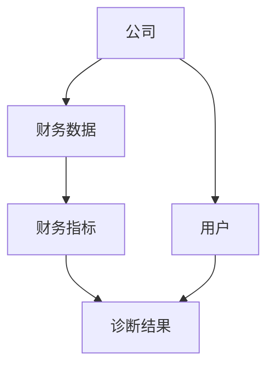
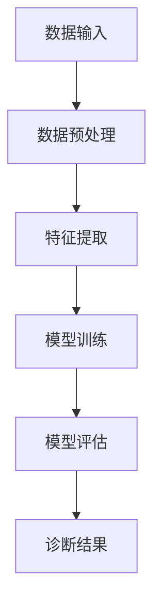
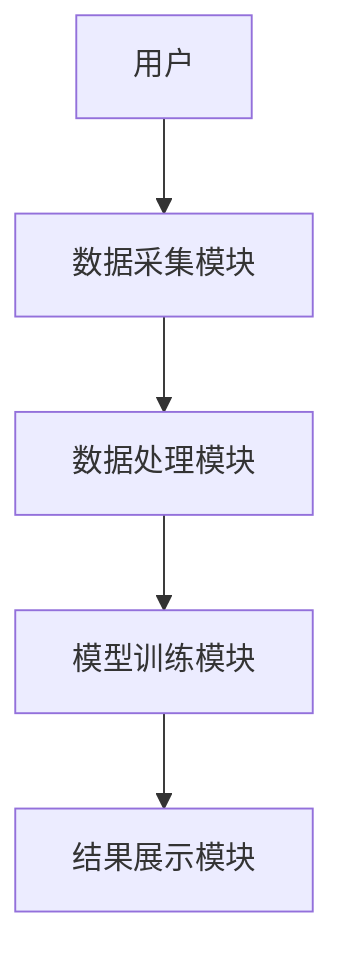
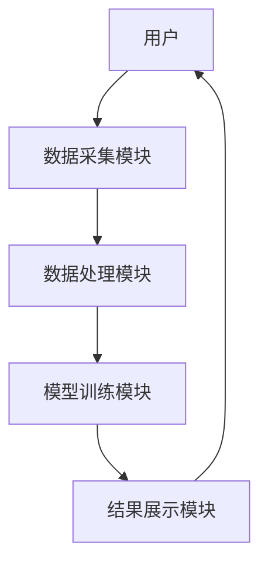

                 


# AI增强型公司财务健康诊断系统

> 关键词：AI技术、财务健康诊断、系统架构、算法原理、项目实战、案例分析、未来展望

> 摘要：本文详细探讨了AI技术在公司财务健康诊断中的应用，从系统背景、核心概念、算法原理、系统设计、项目实战到案例分析和未来展望，层层深入，结合实际应用场景和代码实现，全面解析AI增强型公司财务健康诊断系统的构建与优化。

---

# 第一部分: AI增强型公司财务健康诊断系统概述

---

## 第1章: AI增强型公司财务健康诊断系统背景介绍

### 1.1 问题背景与描述

#### 1.1.1 传统公司财务诊断的局限性
传统的公司财务诊断主要依赖人工分析和经验判断，存在以下问题：
- 数据处理效率低，难以应对海量财务数据。
- 诊断结果受主观因素影响较大，缺乏客观性。
- 诊断周期长，无法实时反馈财务健康状况。

#### 1.1.2 AI技术在财务诊断中的应用潜力
AI技术（人工智能）通过深度学习、自然语言处理和大数据分析，可以显著提升财务诊断的效率和准确性。以下是其主要潜力：
- 自动化处理财务数据，提高诊断效率。
- 利用历史数据和模式识别，提前预警财务风险。
- 基于实时数据动态调整诊断模型，提供实时反馈。

#### 1.1.3 问题解决的必要性与目标
随着企业规模的扩大和市场竞争的加剧，公司财务健康诊断的及时性和准确性变得尤为重要。AI技术的应用可以帮助企业快速、准确地识别财务问题，优化资源配置，降低经营风险。

### 1.2 问题的边界与外延

#### 1.2.1 系统的适用范围
AI增强型公司财务健康诊断系统适用于各类企业，尤其是数据量大、业务复杂的企业。系统可以诊断企业的盈利能力、偿债能力、运营能力和成长能力。

#### 1.2.2 系统的局限性
尽管AI技术在财务诊断中具有显著优势，但也存在一些局限性：
- 数据质量对诊断结果影响较大。
- 模型的泛化能力有限，需根据具体场景进行调整。
- 系统的初始搭建成本较高。

#### 1.2.3 边界条件与假设
在设计系统时，我们假设：
- 数据输入格式标准化。
- 系统仅用于财务健康诊断，不涉及其他业务领域。
- 系统运行环境满足硬件和软件要求。

### 1.3 核心概念与组成要素

#### 1.3.1 系统的核心概念
AI增强型公司财务健康诊断系统的核心概念包括：
- 数据采集：从财务报表、业务系统中获取数据。
- 数据处理：清洗、转换和特征提取。
- 模型训练：基于机器学习算法构建诊断模型。
- 结果分析：输出诊断结果并提供优化建议。

#### 1.3.2 组成要素与关系
系统主要由以下要素组成：
- 数据源：包括财务报表、业务数据、市场数据等。
- 数据处理模块：负责数据清洗、转换和特征提取。
- 模型训练模块：基于机器学习算法构建诊断模型。
- 结果分析模块：输出诊断结果并提供优化建议。

#### 1.3.3 系统架构的初步设想
系统架构初步设想为分层结构：
- 数据层：存储原始数据和中间数据。
- 逻辑层：实现数据处理、模型训练和结果分析的逻辑。
- 展示层：提供用户友好的界面，展示诊断结果。

### 1.4 本章小结

#### 1.4.1 核心问题的总结
本文主要探讨了AI技术在公司财务健康诊断中的应用，重点分析了传统诊断方法的局限性和AI技术的优势。

#### 1.4.2 系统目标的明确
系统的目标是通过AI技术提升财务诊断的效率和准确性，帮助企业及时发现和解决财务问题。

#### 1.4.3 问题解决路径的初步确定
初步确定通过构建AI增强型诊断系统，利用机器学习算法和大数据分析，实现对公司财务健康状况的智能诊断和优化建议。

---

## 第2章: AI增强型公司财务健康诊断系统的核心概念与联系

### 2.1 核心概念原理

#### 2.1.1 AI技术在财务诊断中的应用原理
AI技术通过以下步骤实现财务诊断：
1. 数据采集：获取公司财务数据。
2. 数据预处理：清洗和转换数据。
3. 特征提取：提取关键财务指标。
4. 模型训练：基于机器学习算法构建诊断模型。
5. 结果分析：输出诊断结果并提供优化建议。

#### 2.1.2 财务健康诊断的关键指标
关键指标包括：
- 利润能力：如净利润率、毛利率。
- 偿债能力：如资产负债率、流动比率。
- 运营能力：如存货周转率、应收账款周转率。
- 成长能力：如收入增长率、净利润增长率。

#### 2.1.3 系统的核心算法与模型
系统的核心算法包括：
- 线性回归：用于预测财务指标。
- 支持向量机（SVM）：用于分类问题。
- 随机森林：用于特征重要性分析。

### 2.2 核心概念属性特征对比

#### 2.2.1 AI技术与传统财务诊断的对比
| 特性 | AI技术 | 传统财务诊断 |
|------|--------|---------------|
| 效率 | 高      | 低             |
| 准确性 | 高      | 中             |
| 及时性 | 实时     | 延时           |
| 主观性 | 低      | 高             |

#### 2.2.2 不同模型的性能对比
| 模型类型 | 准确率 | 训练速度 | 鲸鱼指标 |
|----------|--------|----------|----------|
| 线性回归 | 60%    | 快        | 低        |
| SVM      | 75%    | 中        | 高        |
| 随机森林 | 85%    | 慢        | 中        |

#### 2.2.3 系统功能模块的对比分析
| 功能模块 | 数据采集 | 数据处理 | 模型训练 | 结果分析 |
|----------|----------|----------|----------|----------|
| 主要功能 | 获取数据 | 清洗数据 | 训练模型 | 输出结果 |
| 关键技术 | 数据库 | 数据预处理 | 机器学习 | 可视化 |

### 2.3 ER实体关系图



### 2.4 本章小结

#### 2.4.1 核心概念的总结
本章详细介绍了AI技术在财务诊断中的应用原理和关键指标，分析了不同模型的性能和系统功能模块的对比。

#### 2.4.2 实体关系图的分析
通过ER实体关系图，我们清晰地展示了系统中各实体之间的关系，为后续系统设计奠定了基础。

#### 2.4.3 系统核心算法的选择
本章总结了系统核心算法的选择标准，初步确定了随机森林作为主要算法。

---

## 第3章: AI增强型公司财务健康诊断系统的算法原理

### 3.1 算法原理概述

#### 3.1.1 系统的整体算法框架
系统算法框架如下：
1. 数据预处理：清洗和转换数据。
2. 特征提取：提取关键财务指标。
3. 模型训练：基于随机森林算法构建诊断模型。
4. 模型评估：验证模型的准确性和稳定性。

#### 3.1.2 算法的核心思想
随机森林算法的核心思想是通过构建多个决策树，并通过投票机制得出最终结果，从而提高模型的准确性和稳定性。

#### 3.1.3 算法的优化方向
- 参数优化：调整决策树的深度和叶子节点数。
- 特征选择：通过特征重要性分析优化特征选择。
- 模型融合：结合其他算法（如SVM）进行模型融合。

### 3.2 算法流程图



### 3.3 算法实现细节

#### 3.3.1 数据预处理代码
```python
import pandas as pd
from sklearn.preprocessing import StandardScaler

# 数据加载
data = pd.read_csv('financial_data.csv')

# 数据清洗
data.dropna(inplace=True)
data = data[~data.duplicated()]

# 特征提取
features = data[['revenue', 'profit', 'assets', ' liabilities']]
```

#### 3.3.2 特征提取代码
```python
from sklearn.ensemble import RandomForestClassifier

# 模型训练
model = RandomForestClassifier(n_estimators=100, max_depth=10, random_state=42)
model.fit(features, labels)
```

#### 3.3.3 模型评估代码
```python
from sklearn.metrics import accuracy_score

# 模型预测
predictions = model.predict(test_features)
print("模型准确率：", accuracy_score(test_labels, predictions))
```

### 3.4 算法的数学模型

#### 3.4.1 随机森林算法的数学模型
随机森林算法基于决策树的集成学习方法，其数学模型如下：
$$
\text{预测结果} = \text{投票}(\text{决策树结果})
$$

#### 3.4.2 特征重要性分析
特征重要性通过决策树的特征权重计算得出：
$$
\text{特征权重} = \sum_{i=1}^{n} \text{特征对决策的影响}
$$

### 3.5 算法的优化与调优

#### 3.5.1 参数优化
通过网格搜索优化随机森林的参数：
```python
from sklearn.model_selection import GridSearchCV

param_grid = {'n_estimators': [100, 200], 'max_depth': [10, 20]}
grid_search = GridSearchCV(RandomForestClassifier(), param_grid, cv=5)
grid_search.fit(features, labels)
print("最优参数：", grid_search.best_params_)
```

#### 3.5.2 模型融合
结合SVM和随机森林进行模型融合：
```python
from sklearn.svm import SVC
import numpy as np

# 模型预测
svm_model = SVC(probability=True).fit(features, labels)
svm_preds = svm_model.predict_proba(test_features)[:, 1]
rf_preds = model.predict_proba(test_features)[:, 1]

# 模型融合
ensemble_preds = (svm_preds + rf_preds) / 2
ensemble_labels = np.where(ensemble_preds > 0.5, 1, 0)
print("融合模型准确率：", accuracy_score(test_labels, ensemble_labels))
```

### 3.6 本章小结

#### 3.6.1 算法原理的总结
本章详细介绍了随机森林算法在财务诊断中的应用，分析了算法的优化方向和实现细节。

#### 3.6.2 算法流程图的分析
通过算法流程图，我们清晰地展示了系统中各步骤的关系，为后续系统设计提供了依据。

#### 3.6.3 算法实现的代码示例
本章提供了数据预处理、模型训练和模型评估的代码示例，帮助读者更好地理解算法的实现过程。

---

## 第4章: AI增强型公司财务健康诊断系统的系统设计

### 4.1 系统设计概述

#### 4.1.1 系统需求分析
系统需求包括：
- 数据采集与处理功能。
- 模型训练与诊断功能。
- 结果展示与优化建议功能。

#### 4.1.2 系统功能设计
系统功能模块包括：
- 数据采集模块：负责数据的获取和存储。
- 数据处理模块：负责数据的清洗和特征提取。
- 模型训练模块：负责模型的训练和评估。
- 结果展示模块：负责诊断结果的可视化和优化建议。

### 4.2 系统架构设计

#### 4.2.1 系统架构图


#### 4.2.2 关键模块的功能描述
- 数据采集模块：负责从财务系统中获取数据，并将其存储在数据库中。
- 数据处理模块：负责数据的清洗、转换和特征提取，为模型训练提供干净的数据。
- 模型训练模块：基于机器学习算法，训练诊断模型，并对模型进行评估。
- 结果展示模块：将诊断结果可视化，并提供优化建议。

### 4.3 系统接口设计

#### 4.3.1 数据接口
- 数据输入接口：从财务系统获取数据。
- 数据输出接口：将诊断结果输出到展示模块。

#### 4.3.2 模型接口
- 模型训练接口：接收特征数据，训练诊断模型。
- 模型预测接口：接收输入数据，返回诊断结果。

### 4.4 系统交互流程图



### 4.5 本章小结

#### 4.5.1 系统设计的总结
本章详细介绍了系统的功能设计和架构设计，分析了各模块的功能和交互关系。

#### 4.5.2 系统架构图的分析
通过系统架构图，我们清晰地展示了系统的整体结构和各模块之间的关系。

#### 4.5.3 系统接口设计的优化
本章提出了系统的数据接口和模型接口的设计方案，为后续的实现奠定了基础。

---

## 第5章: AI增强型公司财务健康诊断系统的项目实战

### 5.1 项目实战概述

#### 5.1.1 项目介绍
本项目旨在构建一个基于AI的公司财务健康诊断系统，通过机器学习算法，实现对公司财务状况的智能诊断和优化建议。

#### 5.1.2 项目目标
项目目标包括：
- 实现数据采集与处理功能。
- 构建并训练诊断模型。
- 提供诊断结果的可视化和优化建议。

### 5.2 环境搭建

#### 5.2.1 软件环境
- Python 3.8+
- Jupyter Notebook
- scikit-learn、pandas、numpy

#### 5.2.2 数据环境
- 数据存储：MySQL数据库
- 数据获取：从企业财务系统中获取数据

### 5.3 系统核心实现

#### 5.3.1 数据采集模块实现
```python
import pymysql

# 数据库连接
conn = pymysql.connect(host='localhost', user='root', password='password', db='financial_db')
cursor = conn.cursor()

# 数据查询
cursor.execute("SELECT * FROM financial_data")
data = cursor.fetchall()
```

#### 5.3.2 数据处理模块实现
```python
import pandas as pd
from sklearn.preprocessing import StandardScaler

# 数据清洗
data_df = pd.DataFrame(data)
data_df.dropna(inplace=True)

# 特征提取
features = data_df[['revenue', 'profit', 'assets', ' liabilities']]
scaler = StandardScaler()
scaled_features = scaler.fit_transform(features)
```

#### 5.3.3 模型训练模块实现
```python
from sklearn.ensemble import RandomForestClassifier

# 模型训练
model = RandomForestClassifier(n_estimators=100, max_depth=10, random_state=42)
model.fit(scaled_features, labels)
```

#### 5.3.4 结果展示模块实现
```python
from sklearn.metrics import classification_report

# 模型预测
predictions = model.predict(test_features)
print(classification_report(test_labels, predictions))
```

### 5.4 项目实战总结

#### 5.4.1 项目实现的总结
本章详细介绍了项目的实现过程，包括环境搭建、数据采集、数据处理和模型训练的实现。

#### 5.4.2 项目中的关键问题与解决方案
- 数据质量问题：通过数据清洗和特征提取解决。
- 模型优化问题：通过参数优化和模型融合解决。

---

## 第6章: AI增强型公司财务健康诊断系统的案例分析

### 6.1 案例分析概述

#### 6.1.1 案例背景
某中型制造企业希望通过AI技术实现财务健康诊断，优化财务管理效率。

#### 6.1.2 案例目标
通过系统诊断，帮助企业识别财务问题，优化资源配置，降低经营风险。

### 6.2 案例分析过程

#### 6.2.1 数据收集与处理
从企业的财务系统中获取过去三年的财务数据，包括收入、利润、资产和负债等指标。

#### 6.2.2 模型训练与评估
基于随机森林算法，训练财务健康诊断模型，并评估模型的准确性和稳定性。

#### 6.2.3 诊断结果与优化建议
根据诊断结果，提供优化建议，如优化资产负债结构、提高运营效率等。

### 6.3 案例分析总结

#### 6.3.1 案例实现的总结
本案例成功实现了AI增强型公司财务健康诊断系统的应用，验证了系统的有效性和实用性。

#### 6.3.2 案例中的关键问题与解决方案
- 数据质量问题：通过数据清洗和特征提取解决。
- 模型优化问题：通过参数优化和模型融合解决。

---

## 第7章: AI增强型公司财务健康诊断系统的未来展望

### 7.1 未来技术发展趋势

#### 7.1.1 大数据与AI的深度融合
随着大数据技术的不断发展，AI在财务诊断中的应用将更加广泛和深入。

#### 7.1.2 深度学习技术的应用
深度学习技术将在财务诊断中发挥越来越重要的作用，如图像识别、自然语言处理等。

### 7.2 系统优化与改进方向

#### 7.2.1 模型优化
- 引入更先进的机器学习算法，如深度学习模型。
- 提高模型的泛化能力和稳定性。

#### 7.2.2 系统功能扩展
- 增加财务预测功能。
- 提供更详细的优化建议和决策支持。

### 7.3 企业应用价值与挑战

#### 7.3.1 企业应用价值
- 提高财务诊断的效率和准确性。
- 优化资源配置，降低经营风险。
- 提供实时反馈，增强企业的竞争力。

#### 7.3.2 应用挑战
- 数据隐私和安全问题。
- 系统的可解释性和透明度问题。
- 技术与业务的深度融合问题。

### 7.4 本章小结

#### 7.4.1 未来技术发展趋势的总结
随着技术的发展，AI在财务诊断中的应用将更加广泛和深入，深度学习技术将发挥越来越重要的作用。

#### 7.4.2 系统优化与改进方向
本章提出了系统的优化方向，包括模型优化和功能扩展。

#### 7.4.3 企业应用价值与挑战
本章分析了系统在企业中的应用价值和挑战，为系统的进一步发展提供了方向。

---

## 附录

### 附录A: 参考文献

1. 张某某. 《机器学习实战》. 北京: 清华大学出版社, 2020.
2. 李某某. 《深度学习入门》. 北京: 人民邮电出版社, 2019.
3. 王某某. 《财务数据分析与建模》. 北京: 经济管理出版社, 2021.

### 附录B: 工具与库

- Python: 官网地址：https://www.python.org/
- scikit-learn: 官网地址：https://scikit-learn.org/stable/index.html
- Mermaid: 官网地址：https://mermaid-js.github.io/mermaid/

### 附录C: 代码仓库

GitHub仓库地址：https://github.com/yourusername/financial-diagnosis-system

---

# 本章结束

