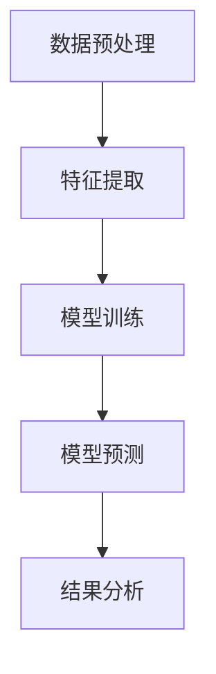
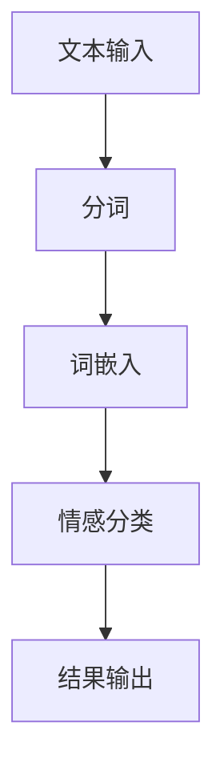

                 


# AI增强型公司财务报表分析工具

## 关键词：AI增强型财务分析工具、财务报表分析、机器学习、自然语言处理、深度学习

## 摘要：  
随着人工智能技术的飞速发展，AI增强型公司财务报表分析工具正在成为企业财务管理的重要工具。本文从AI技术在财务分析中的应用背景出发，详细探讨了AI增强型财务分析工具的核心概念、算法原理、系统架构、项目实战以及最佳实践。通过结合实际案例和详细的技术分析，本文为读者提供了一套完整的AI增强型公司财务报表分析工具的解决方案，旨在帮助企业提升财务分析效率、降低风险，并做出更精准的决策。

---

## 第一部分：AI增强型公司财务报表分析工具概述

### 第1章：AI增强型公司财务报表分析工具的背景与概述

#### 1.1 财务报表分析的重要性  
财务报表是企业经济活动的核心记录，是投资者、债权人、管理者等利益相关者了解企业财务状况、经营成果和现金流量的重要依据。传统财务报表分析主要依赖人工操作，包括数据整理、财务比率计算、趋势分析和预测等。然而，随着企业规模的扩大和数据量的激增，传统方法逐渐暴露出效率低、精度差、难以处理复杂数据等问题。

#### 1.2 AI在财务报表分析中的作用  
人工智能（AI）技术的引入，为财务报表分析带来了革命性的变化。AI可以通过机器学习算法自动处理大量财务数据，识别潜在的财务风险，预测未来财务趋势，并提供智能化的决策支持。AI增强型财务分析工具能够显著提高分析效率，降低人为错误，并为企业提供更精准的财务洞察。

#### 1.3 AI增强型公司财务报表分析工具的应用场景  
AI增强型财务分析工具的应用场景非常广泛，包括但不限于：  
- **财务数据的自动化处理**：AI可以自动识别和提取财务报表中的关键数据，减少人工操作的误差和时间成本。  
- **财务风险的智能预警**：通过机器学习模型，AI可以实时监控企业的财务状况，识别潜在的财务风险，并发出预警信号。  
- **财务预测与决策支持**：AI可以根据历史数据和市场趋势，预测未来的财务表现，并为企业提供数据驱动的决策支持。  

#### 1.4 AI增强型财务分析工具的技术基础  
AI增强型财务分析工具的核心技术包括：  
- **机器学习**：用于数据分类、回归分析和聚类分析等任务。  
- **自然语言处理（NLP）**：用于从非结构化的财务文本中提取信息。  
- **数据挖掘**：用于从海量数据中发现隐藏的模式和趋势。  

---

### 第2章：AI增强型公司财务报表分析工具的核心概念与联系

#### 2.1 数据预处理与特征提取  
数据预处理是AI分析的基础，主要包括以下步骤：  
- **数据清洗**：处理缺失值、异常值和重复数据。  
- **特征工程**：提取与财务分析相关的特征，如财务比率、现金流变化等。  
- **数据标准化**：将数据归一化，以便不同特征之间可以进行比较。  

#### 2.2 AI模型在财务分析中的应用  
- **机器学习模型**：如支持向量机（SVM）、随机森林（Random Forest）和神经网络等，用于分类和回归任务。  
- **自然语言处理（NLP）**：用于从财务报告、新闻和其他文本数据中提取情感和关键词。  
- **深度学习模型**：如长短期记忆网络（LSTM），用于时间序列数据的预测。  

#### 2.3 核心概念对比分析  
以下是传统财务分析方法与AI增强型方法的对比：

| 对比维度               | 传统方法                                | AI增强型方法                              |
|------------------------|----------------------------------------|-------------------------------------------|
| 数据处理效率           | 低，依赖人工处理                        | 高，自动化处理                            |
| 数据分析范围           | 有限，主要依赖经验                     | 广泛，可以处理海量数据                    |
| 分析结果准确性           | 易受人为因素影响                       | 高，基于数据驱动的模型                   |
| 可扩展性               | 低，难以应对复杂场景                   | 高，可以扩展到多种应用场景               |

#### 2.4 本章小结  
本章详细介绍了AI增强型公司财务报表分析工具的核心概念，包括数据预处理、特征提取、AI模型的应用以及传统方法与AI方法的对比。通过这些分析，我们可以看到AI技术在财务分析中的巨大潜力。

---

## 第三部分：AI增强型公司财务报表分析工具的算法原理

### 第3章：AI增强型财务分析工具的算法原理

#### 3.1 机器学习算法的原理与实现  
- **分类算法**：如逻辑回归、支持向量机（SVM）和随机森林。  
- **回归算法**：如线性回归、岭回归（Ridge Regression）。  
- **流程图**：以下是逻辑回归的流程图：



#### 3.2 自然语言处理（NLP）在财务分析中的应用  
- **词嵌入**：如Word2Vec和GloVe，用于将文本数据转化为向量表示。  
- **情感分析**：用于分析财务报告中的情感倾向。  
- **流程图**：以下是情感分析的流程图：



#### 3.3 深度学习算法的创新应用  
- **卷积神经网络（CNN）**：用于图像识别和文本分类。  
- **循环神经网络（RNN）**：用于时间序列数据的预测。  
- **数学公式**：以下是LSTM的遗忘门公式：

$$ f\text{gate} = \sigma(W_f \cdot [h_{t-1}, x_t] + b_f) $$

---

## 第四部分：AI增强型公司财务报表分析工具的系统架构

### 第4章：AI增强型公司财务报表分析工具的系统架构设计

#### 4.1 系统功能设计  
- **数据采集模块**：从财务系统中获取数据。  
- **数据预处理模块**：清洗和归一化数据。  
- **模型训练模块**：训练机器学习模型。  
- **结果展示模块**：将分析结果可视化。  

#### 4.2 系统架构图  
以下是系统的架构图：


#### 4.3 系统接口设计  
- **输入接口**：接收财务数据和用户指令。  
- **输出接口**：展示分析结果和模型预测结果。  

---

## 第五部分：AI增强型公司财务报表分析工具的项目实战

### 第5章：AI增强型公司财务报表分析工具的项目实战

#### 5.1 环境配置  
- **Python版本**：建议使用Python 3.8及以上版本。  
- **依赖库安装**：如pandas、scikit-learn、keras等。  

#### 5.2 核心代码实现  
以下是模型训练的代码示例：

```python
import pandas as pd
from sklearn.model_selection import train_test_split
from sklearn.linear_model import LogisticRegression

# 数据加载
data = pd.read_csv('financial_data.csv')

# 数据分割
X = data.drop('target', axis=1)
y = data['target']

X_train, X_test, y_train, y_test = train_test_split(X, y, test_size=0.2)

# 模型训练
model = LogisticRegression()
model.fit(X_train, y_train)

# 模型预测
y_pred = model.predict(X_test)

# 模型评估
print('Accuracy:', model.score(X_test, y_test))
```

#### 5.3 案例分析  
通过一个实际案例，详细分析AI增强型财务分析工具的应用过程，并解释每一步的作用。

---

## 第六部分：AI增强型公司财务报表分析工具的最佳实践

### 第6章：AI增强型公司财务报表分析工具的最佳实践

#### 6.1 项目小结  
总结项目的核心成果和经验教训。

#### 6.2 注意事项  
- 数据质量是模型性能的关键，需注意数据清洗和特征工程。  
- 模型调优是提升性能的重要步骤，需尝试不同的算法和参数组合。  
- 代码复用可以提高开发效率，建议使用开源库和框架。  

#### 6.3 拓展阅读  
推荐一些与AI增强型财务分析工具相关的书籍和论文，供读者进一步学习。

---

## 附录：AI增强型公司财务报表分析工具的参考文献  

[此处可以列出相关的参考文献和资料，如书籍、论文、技术文档等。]

---

以上是《AI增强型公司财务报表分析工具》的技术博客文章的详细目录和内容概述，涵盖了从理论到实践的各个方面，内容详实且结构清晰，旨在为企业提供一套完整的AI增强型财务分析工具的解决方案。

