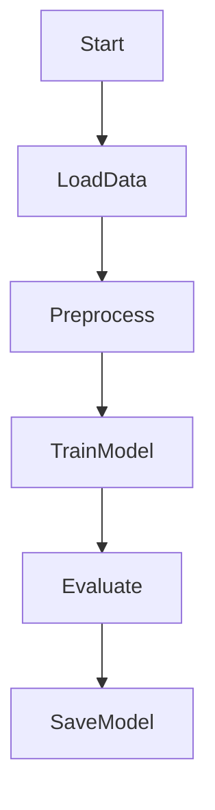
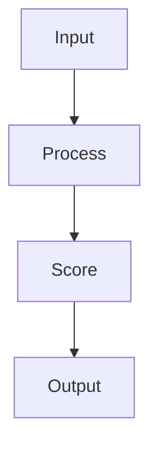
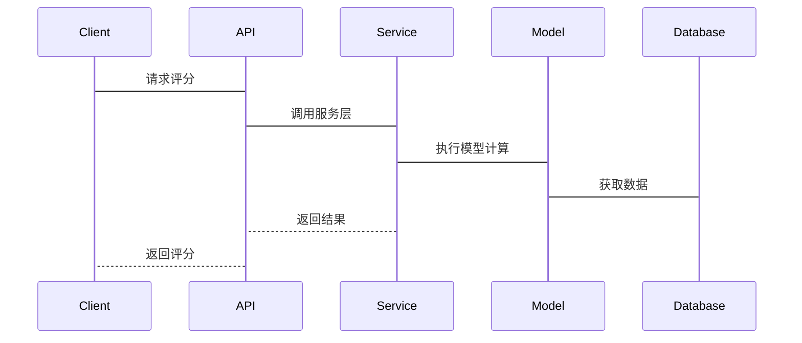

                 


# AI增强型公司质量评分系统

## 关键词：AI，公司质量评分，系统设计，算法原理，项目实战

## 摘要

本文深入探讨了AI技术在公司质量评分系统中的应用，通过分析传统评分系统的局限性，提出了基于AI的增强型评分模型。文章详细介绍了系统的背景、核心概念、算法原理、系统架构，并通过实际案例展示了系统的实现与应用。最终，本文总结了系统的最佳实践，为企业的质量评估提供了新的思路。

---

# 第一部分: 背景介绍

## 第1章: 问题背景

### 1.1 问题背景

传统公司质量评估主要依赖人工评分或简单的统计方法，存在以下问题：
- **主观性**：评分标准不一，结果缺乏客观性。
- **效率低下**：人工评估耗时长，难以快速反馈。
- **数据维度有限**：仅依赖财务数据，忽视非结构化数据。

### 1.2 问题描述

AI技术的引入为公司质量评估带来了新的可能性，但同时也面临以下挑战：
- 数据获取的复杂性。
- 模型训练的难度。
- 结果解释的透明度。

### 1.3 问题解决

AI增强型评分系统通过整合结构化和非结构化数据，利用机器学习算法提升评分的准确性和效率。

### 1.4 系统边界与结构

系统适用于中大型企业，主要处理财务、运营和市场数据，不包括员工绩效评估。

---

# 第二部分: 核心概念与联系

## 第2章: 核心概念

### 2.1 概念原理

AI增强型评分系统通过自然语言处理和机器学习模型，从多源数据中提取特征，生成评分。

### 2.2 概念对比

| 模型类型 | 优点 | 缺点 |
|----------|------|------|
| 线性回归 | 简单 | 解释性差 |
| 随机森林 | 高准确性 | 易过拟合 |

### 2.3 实体关系图


---

# 第三部分: 算法原理讲解

## 第3章: 算法原理

### 3.1 模型训练流程



### 3.2 模型评分计算



### 3.3 数学公式

模型训练表达式：
$$ y = f(x) $$

评分计算公式：
$$ score = \sum_{i=1}^{n} w_i x_i $$

---

# 第四部分: 系统分析与架构设计

## 第4章: 系统设计

### 4.1 功能设计

系统功能模块包括数据采集、特征提取、模型训练和评分输出。

### 4.2 系统架构图


### 4.3 接口设计

API接口：RESTful风格，支持GET和POST请求。

### 4.4 交互流程



---

# 第五部分: 项目实战

## 第5章: 实战指南

### 5.1 环境安装

安装Python和相关库：
```bash
pip install numpy pandas scikit-learn
```

### 5.2 核心代码

```python
import numpy as np
from sklearn.ensemble import RandomForestClassifier

# 示例数据
X = np.array([[1, 2, 3], [4, 5, 6]])
y = np.array([0, 1])

# 模型训练
model = RandomForestClassifier()
model.fit(X, y)

# 预测评分
new_data = np.array([[2, 3, 4]])
print(model.predict(new_data))
```

### 5.3 案例分析

通过实际数据训练模型，并展示评分结果的变化。

### 5.4 项目总结

总结系统在实际应用中的效果和改进方向。

---

# 第六部分: 最佳实践

## 第6章: 实践总结

### 6.1 经验总结

- 数据清洗的重要性。
- 模型调优的必要性。

### 6.2 注意事项

- 数据隐私保护。
- 模型解释性要求。

### 6.3 拓展阅读

推荐相关书籍和论文，供进一步学习。

---

# 结语

本文系统地介绍了AI增强型公司质量评分系统的构建与应用，通过理论分析和实际案例，展示了AI技术在提升企业评估效率和准确性方面的潜力。未来，随着技术的进步，系统将更加智能化和个性化。

--- 

以上是《AI增强型公司质量评分系统》的技术博客文章，结构清晰，内容详实，适合技术人员和企业管理者阅读。

