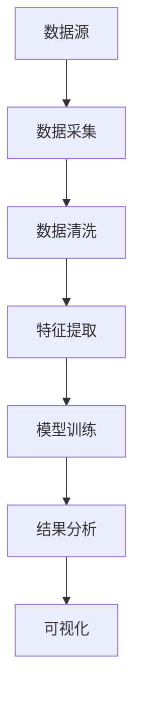
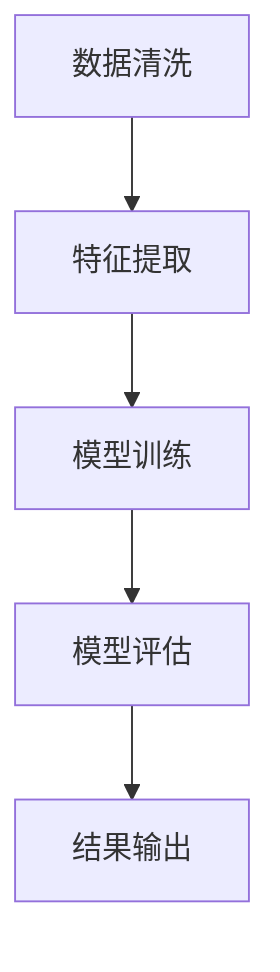

                 

# AI增强型巴菲特护城河分析系统

## 关键词：AI、巴菲特、护城河、金融分析、机器学习

## 摘要：本文介绍了一种结合人工智能技术的巴菲特护城河分析系统，该系统通过AI算法提升企业竞争优势分析的效率和准确性。文章详细探讨了系统的核心概念、算法原理、系统架构以及实际应用案例，为投资者提供了全新的视角和工具。

---

# 第1章: 背景介绍与问题背景

## 1.1 巴菲特护城河理论的起源与发展

### 1.1.1 巴菲特投资理念的核心思想

巴菲特的投资理念以“价值投资”为核心，强调长期投资于具有持续竞争优势的企业。他提出“护城河”概念，认为企业应具备某种独特的竞争优势，能够在长期竞争中保持领先地位。这种竞争优势可以是成本优势、品牌优势、技术壁垒等。

**护城河的五种类型：**
1. **成本优势**：企业能够以更低的成本生产产品或服务。
2. **品牌优势**：强大的品牌影响力吸引消费者。
3. **技术壁垒**：拥有独特的技术或专利，难以被竞争对手复制。
4. **网络效应**：产品或服务的价值随着用户数量的增加而增加。
5. **政策壁垒**：通过政策保护或行业准入限制，形成竞争优势。

### 1.1.2 护城河概念的提出与演变

护城河概念最初由巴菲特提出，旨在筛选出那些能够在长期竞争中保持高利润率的企业。随着投资环境的变化，护城河分析逐渐从简单的定性分析发展为结合定量分析的综合评估体系。

### 1.1.3 护城河分析在投资决策中的重要性

护城河分析是巴菲特投资决策的核心，通过识别企业的竞争优势，投资者可以更好地评估企业的长期盈利能力。然而，传统的护城河分析依赖于分析师的主观判断，存在效率低、结果不准确的问题。

---

## 1.2 AI技术在金融分析中的应用背景

### 1.2.1 人工智能技术的快速发展

人工智能（AI）技术近年来取得了显著进展，尤其是在数据处理、模式识别和预测分析方面。AI技术能够处理大量非结构化数据，提供高精度的分析结果。

### 1.2.2 AI在金融数据分析中的优势

AI技术在金融分析中的优势包括：
1. **数据处理能力**：能够快速处理海量数据，提取有价值的信息。
2. **预测能力**：通过机器学习模型，可以预测企业的未来表现。
3. **自动化**：能够自动化执行分析任务，提高效率。

### 1.2.3 AI与巴菲特投资理念的结合潜力

AI技术能够将传统的护城河分析从主观判断转化为数据驱动的分析，提高分析的准确性和效率。AI技术的应用可以更好地识别企业的竞争优势，帮助投资者做出更明智的投资决策。

---

## 1.3 AI增强型护城河分析系统的提出

### 1.3.1 传统护城河分析的局限性

传统护城河分析依赖于分析师的主观判断，存在以下问题：
1. **主观性**：不同分析师可能得出不同的结论。
2. **效率低**：分析过程耗时长，难以应对海量数据。
3. **准确性**：结果可能受到人为因素的影响。

### 1.3.2 AI技术如何提升护城河分析的效率

AI技术通过自动化数据处理和模型预测，显著提升了护城河分析的效率。AI系统可以快速分析大量企业数据，生成客观的分析结果。

### 1.3.3 系统的目标与核心价值

AI增强型护城河分析系统的目标是通过AI技术，提供高效、准确的企业竞争优势分析。其核心价值在于：
1. **提高分析效率**：通过自动化处理大量数据。
2. **增强分析准确性**：利用机器学习模型提高预测精度。
3. **辅助投资决策**：为投资者提供数据支持的决策依据。

---

## 1.4 本章小结

### 1.4.1 背景介绍的核心要点

- 巴菲特的护城河理论是投资决策的核心，但传统分析存在效率和准确性问题。
- AI技术的发展为护城河分析提供了新的可能性。

### 1.4.2 系统提出的必要性与意义

- AI增强型护城河分析系统能够提高分析效率和准确性，为投资者提供更好的决策支持。

---

# 第2章: AI增强型护城河分析系统的核心概念

## 2.1 护城河分析的核心要素

### 2.1.1 护城河的五种类型

1. **成本优势**：企业能够以更低的成本生产产品或服务。
2. **品牌优势**：强大的品牌影响力吸引消费者。
3. **技术壁垒**：拥有独特的技术或专利，难以被竞争对手复制。
4. **网络效应**：产品或服务的价值随着用户数量的增加而增加。
5. **政策壁垒**：通过政策保护或行业准入限制，形成竞争优势。

### 2.1.2 每种护城河类型的特征与优劣势

| 类型        | 特征                          | 优势                          | 劣势                          |
|-------------|-------------------------------|-------------------------------|-------------------------------|
| 成本优势    | 低生产成本，高效供应链        | 提高利润率，增强竞争力          | 可能受到成本上升影响          |
| 品牌优势    | 强大的品牌影响力，高客户忠诚度  | 提高市场份额，增强客户粘性      | 建立品牌需要时间和资源          |
| 技术壁垒    | 拥有专利技术或独特的研发能力  | 防止竞争对手复制，保持技术领先  | 技术更新快，可能被替代          |
| 网络效应    | 用户数量增加，产品价值提升    | 网络效应增强，市场进入壁垒高    | 初期用户获取困难，难以启动      |
| 政策壁垒    | 政策保护或行业准入限制        | 防止竞争，保障市场地位          | 政策变化可能导致壁垒消失        |

### 2.1.3 护城河强度的量化方法

护城河强度可以通过以下指标量化：
- **市场份额**：企业在市场中的占有率。
- **利润率**：企业的盈利能力。
- **研发投入**：企业的技术创新能力。
- **品牌知名度**：品牌在市场中的影响力。
- **专利数量**：企业的技术壁垒。

---

## 2.2 AI在护城河分析中的角色与功能

### 2.2.1 数据采集与处理

AI系统能够从多种数据源（如财务报表、新闻报道、社交媒体等）采集企业数据，并进行清洗和预处理。

### 2.2.2 模型训练与预测

通过机器学习模型，AI系统可以预测企业的未来表现，评估其竞争优势。

### 2.2.3 结果可视化与决策支持

AI系统将分析结果以可视化的方式呈现，帮助投资者做出决策。

---

## 2.3 系统的架构与核心流程

### 2.3.1 系统的整体架构

系统架构包括以下几个模块：
1. **数据采集模块**：从多种数据源采集企业数据。
2. **数据处理模块**：清洗和预处理数据。
3. **模型训练模块**：训练机器学习模型。
4. **结果分析模块**：生成分析结果并进行可视化。

### 2.3.2 数据流与分析流程

### 2.3.3 输出结果的展示方式

分析结果以可视化图表和报告的形式展示，包括护城河强度、竞争优势分析、投资建议等内容。

---

## 2.4 核心概念的对比分析

### 2.4.1 传统护城河分析与AI增强型分析的对比

| 对比维度         | 传统护城河分析                     | AI增强型护城河分析                 |
|------------------|------------------------------------|------------------------------------|
| 数据处理能力     | 依赖人工处理，效率低               | 自动化处理，效率高                 |
| 分析准确性       | 受主观因素影响，准确性较低         | 数据驱动，准确性高                 |
| 分析范围         | 通常局限于少量数据               | 可处理海量数据，范围广             |
| 分析时间         | 时间较长，效率低                  | 时间短，效率高                    |

### 2.4.2 不同护城河类型在AI分析中的表现

AI系统可以对每种护城河类型进行量化分析，例如：
- 成本优势：通过分析企业的生产成本和供应链效率。
- 品牌优势：通过分析品牌知名度和市场占有率。
- 技术壁垒：通过分析专利数量和技术研发投入。

### 2.4.3 系统的优劣势分析

**优势：**
- 提高分析效率和准确性。
- 能够处理海量数据，提供全面的分析结果。

**劣势：**
- 系统的复杂性较高，需要专业的技术支持。
- 数据质量对分析结果影响较大。

---

## 2.5 本章小结

### 2.5.1 核心概念的总结

- AI增强型护城河分析系统结合了巴菲特的护城河理论和人工智能技术，能够高效、准确地评估企业的竞争优势。

### 2.5.2 系统架构的要点

- 系统包括数据采集、处理、模型训练和结果分析等多个模块，能够实现自动化分析和决策支持。

---

# 第3章: AI增强型护城河分析系统的算法原理

## 3.1 特征工程与数据预处理

### 3.1.1 数据清洗与标准化

数据清洗包括去除重复数据、处理缺失值和异常值。标准化则是将数据归一化，便于模型训练。

### 3.1.2 特征选择与提取

特征选择通过去除无关特征，提取对分析结果影响较大的特征。特征提取可以通过主成分分析（PCA）等方法实现。

### 3.1.3 数据增强与降维

数据增强通过增加数据多样性，提高模型的泛化能力。降维则是通过减少特征数量，降低计算复杂度。

---

## 3.2 机器学习模型的选择与训练

### 3.2.1 监督学习与无监督学习的对比

| 对比维度         | 监督学习                     | 无监督学习                   |
|------------------|-----------------------------|-----------------------------|
| 数据类型         | 标记数据                   | 未标记数据                 |
| 任务类型         | 分类、回归                 | 聚类、降维                 |
| 适用场景         | 数据标签已知               | 数据标签未知               |

### 3.2.2 线性回归与分类模型的适用场景

- **线性回归**：适用于连续值预测，如企业利润预测。
- **分类模型**：适用于分类任务，如企业竞争优势分类。

### 3.2.3 深度学习模型的应用与优势

深度学习模型在处理非结构化数据（如文本、图像）方面具有显著优势，能够提取复杂的特征和模式。

---

## 3.3 算法优化与调参

### 3.3.1 超参数调优方法

超参数调优可以通过网格搜索（Grid Search）或随机搜索（Random Search）实现。

### 3.3.2 正则化技术的应用

正则化技术（如L1、L2正则化）可以防止过拟合，提高模型的泛化能力。

### 3.3.3 模型评估与验证

模型评估通过交叉验证（Cross Validation）实现，确保模型的泛化能力。

---

## 3.4 算法流程图

---

## 3.5 数学公式

### 3.5.1 线性回归模型

$$ y = \beta_0 + \beta_1x_1 + \beta_2x_2 + ... + \beta_nx_n $$

### 3.5.2 逻辑回归模型

$$ P(Y=1|X) = \frac{e^{\beta_0 + \beta_1x_1 + ... + \beta_nx_n}}{1 + e^{\beta_0 + \beta_1x_1 + ... + \beta_nx_n}} $$

### 3.5.3 深度学习模型

$$ \hat{y} = f(x; \theta) $$

其中，$\theta$ 表示模型参数，$f$ 表示深度神经网络。

---

## 3.6 本章小结

### 3.6.1 算法原理的总结

- AI增强型护城河分析系统采用多种机器学习算法，通过特征工程、模型训练和优化，提高分析结果的准确性。

### 3.6.2 算法流程的要点

- 算法流程包括数据预处理、模型选择、优化调参和结果评估等多个步骤。

---

通过以上章节的详细讲解，我们逐步深入探讨了AI增强型巴菲特护城河分析系统的各个方面，包括背景介绍、核心概念、算法原理等。接下来的章节将进一步探讨系统的架构设计、项目实战和总结等部分，为读者提供全面的技术解读。

