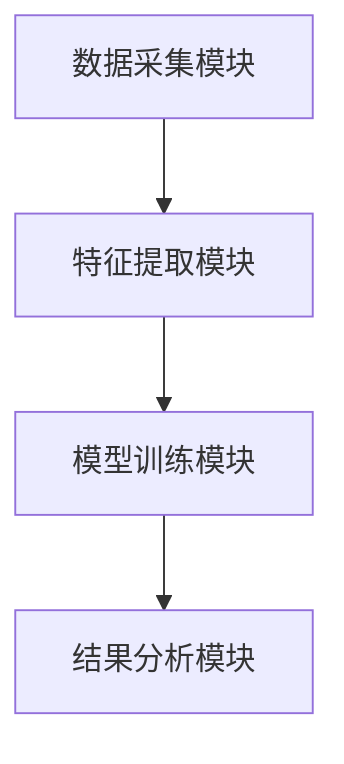
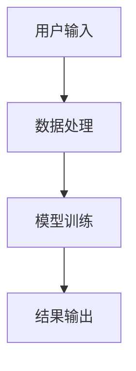

                 


# AI增强型格雷厄姆安全边际计算

> 关键词：安全边际计算，AI增强，格雷厄姆投资策略，机器学习，金融数据分析

> 摘要：本文详细探讨了如何利用人工智能技术增强格雷厄姆安全边际计算的准确性与效率。通过分析传统安全边际计算的局限性，结合机器学习算法的优势，提出了一种基于AI的安全边际预测模型，并通过实际案例验证了该模型的有效性。文章还详细介绍了系统的架构设计、算法实现以及项目实战，为读者提供了一套完整的解决方案。

---

# 第一部分: AI增强型格雷厄姆安全边际计算概述

## 第1章: 格雷厄姆安全边际计算的背景与基础

### 1.1 格雷厄姆安全边际的基本概念

#### 1.1.1 安全边际的定义与作用
安全边际是投资学中的一个核心概念，指资产的市场价格与其内在价值之间的差异。当市场价格低于内在价值时，两者之间的差额即为安全边际。安全边际的作用在于降低投资风险，为投资者提供一个“缓冲区”，避免因市场价格波动而遭受损失。

#### 1.1.2 安全边际在投资决策中的重要性
安全边际是格雷厄姆投资策略的核心，它帮助投资者在市场波动中保持稳健的投资组合。通过计算安全边际，投资者可以识别低估的资产，从而在市场下跌时减少损失，在市场上涨时获得超额收益。

#### 1.1.3 格雷厄姆投资策略的核心思想
格雷厄姆的投资策略强调安全边际的重要性，主张以低于内在价值的价格买入优质资产，并长期持有。这种方法尤其适合防御性投资者，能够在市场低迷时保护资本，同时在市场繁荣时获得收益。

### 1.2 AI技术在安全边际计算中的应用前景

#### 1.2.1 AI技术的基本概念与特点
人工智能（AI）是指计算机系统模拟人类智能的技术，包括学习、推理、自适应等能力。AI技术的特点是数据驱动、自动化和高效性，能够在处理复杂问题时提供强大的支持。

#### 1.2.2 AI技术如何增强安全边际计算
传统的安全边际计算依赖于手动分析和统计模型，而AI技术可以通过机器学习算法对大量数据进行建模和预测，提高计算的准确性和效率。AI还可以实时更新模型，适应市场变化，从而优化安全边际的计算。

#### 1.2.3 AI在金融分析中的优势与挑战
AI在金融分析中的优势包括高效的数据处理能力、强大的模式识别能力和自动化的决策支持。然而，AI技术也面临数据质量、模型解释性和计算成本等挑战，需要在实践中不断优化。

### 1.3 本书的核心目标与结构安排

#### 1.3.1 本书的核心目标
本书旨在探讨如何利用AI技术增强格雷厄姆安全边际计算的准确性和效率，提供一套完整的解决方案，包括理论分析、算法实现和实际案例。

#### 1.3.2 本书的主要内容框架
- 第一部分：AI增强型格雷厄姆安全边际计算的背景与基础
- 第二部分：AI增强型安全边际计算的核心概念与方法
- 第三部分：基于AI的安全边际计算算法原理
- 第四部分：系统架构设计与项目实战
- 第五部分：总结与展望

#### 1.3.3 本书的适用读者群体
本书适用于金融从业者、投资爱好者、数据科学家以及对AI技术感兴趣的读者。无论是理论学习还是实际应用，本书都能提供 valuable insights.

---

## 第2章: 格雷厄姆安全边际计算的核心概念与AI增强方法

### 2.1 格雷厄姆安全边际的核心要素

#### 2.1.1 市场价格与内在价值的定义与计算
市场价格是资产在市场上的交易价格，内在价值是基于资产基本面的理论价值。内在价值的计算通常涉及资产的盈利能力、成长性和财务状况等因素。

#### 2.1.2 安全边际的计算公式与影响因素
安全边际 = 内在价值 - 市场价格  
影响因素包括资产的流动性、市场情绪、经济周期等。

#### 2.1.3 安全边际的动态调整机制
随着市场环境的变化，安全边际需要动态调整。调整机制通常基于市场数据和资产基本面的变化。

### 2.2 AI增强型安全边际计算的核心原理

#### 2.2.1 机器学习在安全边际计算中的应用
机器学习算法（如线性回归、随机森林等）可以用于预测市场价格和内在价值，从而优化安全边际的计算。

#### 2.2.2 基于AI的安全边际预测模型
基于AI的安全边际预测模型通常包括数据预处理、特征提取、模型训练和结果分析等步骤。模型可以通过历史数据学习市场规律，预测未来的价格走势。

#### 2.2.3 AI算法对安全边际计算的优化作用
AI算法能够处理大量数据，发现传统方法难以察觉的模式和趋势，从而提高安全边际计算的准确性和效率。

### 2.3 格雷厄姆安全边际与AI增强方法的对比分析

#### 2.3.1 传统安全边际计算的优缺点
优点：简单易懂，易于手动计算；缺点：依赖经验判断，计算效率低，难以应对复杂市场环境。

#### 2.3.2 AI增强型安全边际计算的优缺点
优点：计算效率高，准确性高，能够适应复杂市场环境；缺点：需要大量数据支持，模型解释性较差。

#### 2.3.3 两种方法的适用场景与结合策略
传统方法适用于简单场景，AI增强方法适用于复杂场景。两者可以结合使用，取长补短，提高计算效果。

---

## 第3章: 基于AI的安全边际计算算法原理

### 3.1 机器学习在安全边际计算中的应用

#### 3.1.1 机器学习的基本概念与分类
机器学习分为监督学习、无监督学习和强化学习等类型。在安全边际计算中，监督学习应用较为广泛。

#### 3.1.2 常见机器学习算法在安全边际计算中的应用
- 线性回归：用于预测市场价格
- 支持向量机（SVM）：用于分类市场状态
- 随机森林：用于特征重要性分析

#### 3.1.3 基于机器学习的安全边际预测模型构建
模型构建步骤包括数据预处理、特征选择、模型训练和性能评估。

### 3.2 基于深度学习的安全边际计算模型

#### 3.2.1 深度学习的基本概念与特点
深度学习是一种基于神经网络的机器学习方法，能够处理复杂的数据模式。

#### 3.2.2 基于神经网络的安全边际预测模型
神经网络模型可以用于预测市场价格和内在价值，优化安全边际的计算。

#### 3.2.3 深度学习模型的训练与优化
模型训练需要大量数据和计算资源，优化方法包括参数调整和模型剪枝。

### 3.3 基于强化学习的安全边际动态调整策略

#### 3.3.1 强化学习的基本概念与特点
强化学习是一种基于奖励机制的机器学习方法，适用于动态环境中的决策问题。

#### 3.3.2 强化学习在安全边际动态调整中的应用
强化学习可以用于动态调整安全边际，适应市场环境的变化。

#### 3.3.3 基于强化学习的安全边际优化策略
优化策略包括状态空间定义、动作选择和奖励机制设计。

---

## 第4章: 基于AI的安全边际计算的数学模型与公式

### 4.1 传统安全边际计算的数学模型

#### 4.1.1 市场价格与内在价值的计算公式
市场价格 = 市场供需关系决定  
内在价值 = 资产基本面决定  

#### 4.1.2 安全边际的计算公式
安全边际 = 内在价值 - 市场价格

### 4.2 基于机器学习的安全边际预测模型

#### 4.2.1 线性回归模型
$$ y = \beta_0 + \beta_1 x + \epsilon $$
其中，y为预测的安全边际，x为输入特征，β为系数，ε为误差项。

#### 4.2.2 支持向量回归模型
支持向量回归（SVR）通过构建支持向量来最小化预测误差。

### 4.3 基于深度学习的安全边际预测模型

#### 4.3.1 多层感知机（MLP）模型
MLP模型通过多层神经网络结构进行非线性映射，能够处理复杂的市场数据。

#### 4.3.2 长短期记忆网络（LSTM）
LSTM网络适用于时间序列数据，能够捕捉市场的长期依赖关系。

### 4.4 基于强化学习的安全边际优化策略

#### 4.4.1 强化学习框架
强化学习框架包括状态、动作、奖励和策略四个部分。

#### 4.4.2 Q-learning算法
Q-learning算法通过Q值函数学习最优策略。

---

## 第5章: 系统架构设计与项目实战

### 5.1 系统功能设计

#### 5.1.1 数据采集模块
数据采集模块负责从金融市场获取实时数据，包括股票价格、财务指标等。

#### 5.1.2 特征提取模块
特征提取模块对原始数据进行特征提取，生成可用于模型训练的特征向量。

#### 5.1.3 模型训练模块
模型训练模块使用机器学习算法对特征向量进行训练，生成安全边际预测模型。

#### 5.1.4 结果分析模块
结果分析模块对模型的预测结果进行分析，生成投资决策建议。

### 5.2 系统架构设计

#### 5.2.1 系统架构图


#### 5.2.2 数据流图


### 5.3 项目实战

#### 5.3.1 环境安装
需要安装Python、机器学习库（如Scikit-learn、TensorFlow）和数据处理库（如Pandas）。

#### 5.3.2 核心代码实现
以下是基于线性回归的安全边际预测模型的代码示例：
```python
import pandas as pd
import numpy as np
from sklearn.linear_model import LinearRegression
from sklearn.metrics import mean_squared_error

# 数据加载
data = pd.read_csv('market_data.csv')

# 特征与目标变量分离
X = data[['price', 'volume', 'pe_ratio']]
y = data['margin']

# 模型训练
model = LinearRegression()
model.fit(X, y)

# 模型预测
y_pred = model.predict(X)

# 模型评估
 mse = mean_squared_error(y, y_pred)
 print(f'均方误差: {mse}')
```

#### 5.3.3 代码解读与分析
- 数据加载：从CSV文件中加载市场数据。
- 特征与目标变量分离：将价格、成交量和市盈率作为特征变量，安全边际作为目标变量。
- 模型训练：使用线性回归算法训练模型。
- 模型预测：使用训练好的模型进行预测。
- 模型评估：计算均方误差，评估模型的预测性能。

#### 5.3.4 实际案例分析
以某只股票为例，使用上述代码计算其安全边际，并与实际值进行对比，验证模型的准确性。

---

## 第6章: 总结与展望

### 6.1 本书的核心内容总结
本书详细探讨了如何利用AI技术增强格雷厄姆安全边际计算的准确性和效率，提供了完整的解决方案，包括理论分析、算法实现和实际案例。

### 6.2 未来的发展方向
- 更复杂的模型：如深度学习和强化学习的应用。
- 更多的数据源：引入更多的市场数据，提高模型的预测能力。
- 实时计算：开发实时安全边际计算系统，为投资者提供及时的决策支持。

### 6.3 注意事项与建议
- 数据质量：确保数据的准确性和完整性。
- 模型解释性：提高模型的可解释性，便于投资者理解。
- 风险管理：合理控制投资风险，避免过度依赖模型。

---

# 结语
AI技术正在改变金融行业的许多方面，格雷厄姆安全边际计算也不例外。通过结合AI技术，我们可以更准确、更高效地计算安全边际，为投资者提供更好的决策支持。希望本书的内容能够为读者提供 valuable insights，并为未来的金融分析提供新的思路。

