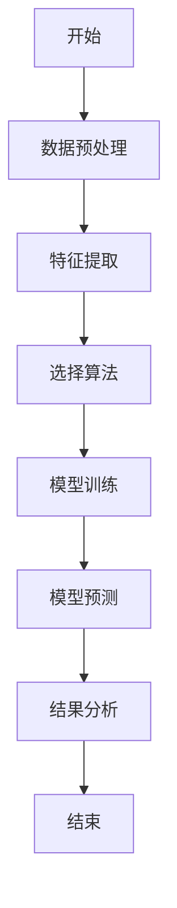
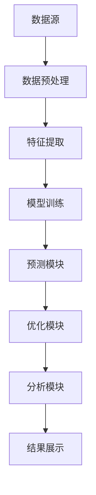
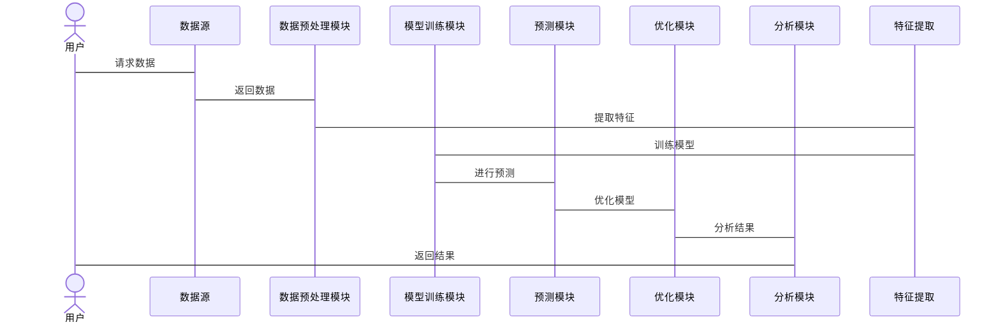

                 


# AI增强型现金流贴现模型

> 关键词：现金流贴现模型，人工智能，金融建模，机器学习，深度学习，数学建模，金融分析

> 摘要：本文系统地探讨了如何将人工智能技术与现金流贴现模型相结合，以提升企业价值评估的准确性和效率。文章首先介绍了现金流贴现模型的基本概念和传统应用，然后分析了人工智能在金融建模中的潜力与挑战，进而深入探讨了AI增强型DCF模型的核心原理、算法实现、系统架构及实际应用。通过丰富的案例分析和详细的数学公式推导，本文旨在为读者提供一个全面的理解和实践指南，帮助他们在现代金融分析中更好地应用AI技术。

---

## 第一章: 现金流贴现模型概述

### 1.1 现金流贴现模型的基本概念

#### 1.1.1 什么是现金流贴现模型
现金流贴现模型（Discounted Cash Flow Model, DCF模型）是现代金融学中用于评估企业内在价值的核心方法之一。它基于“时间价值”的概念，将未来现金流折现到当前时点，以反映其真实价值。

- 现金流贴现模型的定义
- 时间价值的基本原理
- 现金流贴现的核心公式

#### 1.1.2 DCF模型的核心假设
- 稳定增长假设
- 永续增长假设
- 贴现率的确定

#### 1.1.3 DCF模型的分类与应用场景
- 单阶段模型、双阶段模型、三阶段模型
- 现金流贴现模型在企业估值、投资决策中的应用

### 1.2 传统DCF模型的优缺点
#### 1.2.1 优点：精确性和科学性
- 能够反映企业的未来现金流
- 体现了资金的时间价值
- 是企业价值评估的基石

#### 1.2.2 缺点：假设的局限性和数据依赖性
- 对未来现金流的预测难度大
- 贴现率的选择具有主观性
- 数据质量对结果影响显著

#### 1.2.3 传统DCF模型的改进方向
- 提高现金流预测的准确性
- 优化贴现率的计算方法
- 引入更多的数据源和分析维度

---

## 第二章: AI在金融建模中的应用

### 2.1 AI技术在金融分析中的作用

#### 2.1.1 数据处理与特征提取
- 处理非结构化数据（如文本、图像）
- 提取关键特征（如市场情绪、行业趋势）

#### 2.1.2 模型预测与优化
- 使用机器学习算法（如随机森林、神经网络）进行预测
- 利用AI优化DCF模型的参数选择

#### 2.1.3 风险评估与管理
- 通过AI技术量化风险
- 制定动态风险管理策略

### 2.2 AI增强型DCF模型的必要性

#### 2.2.1 提高预测精度
- AI能够处理大量数据，捕捉复杂关系
- 传统DCF模型假设过于简化，AI可以弥补其不足

#### 2.2.2 处理非线性关系
- AI算法擅长处理非线性问题
- 能够捕捉传统模型难以发现的模式

#### 2.2.3 实现自动化与智能化
- 自动化数据收集与处理
- 智能化模型优化与调整

---

## 第三章: AI增强型DCF模型的核心概念与联系

### 3.1 核心概念原理

#### 3.1.1 现金流预测的AI方法
- 使用时间序列分析（如ARIMA、LSTM）预测未来现金流
- 基于市场数据（如股价、行业指数）调整现金流预测

#### 3.1.2 贴现率的AI优化
- 利用机器学习算法优化贴现率的计算
- 通过市场数据和公司特征动态调整贴现率

#### 3.1.3 模型的可解释性与鲁棒性
- 解释AI模型的决策过程
- 提升模型的鲁棒性以应对数据波动

### 3.2 核心概念对比表格

| 比较维度 | 传统DCF模型 | AI增强型DCF模型 |
|----------|-------------|----------------|
| 数据需求 | 固定数据集   | 大数据驱动     |
| 模型复杂度 | 简单线性     | 非线性复杂     |
| 预测精度 | 较低         | 较高           |
| 计算效率 | 低           | 高             |
| 可解释性 | 高           | 较低           |

### 3.3 ER实体关系图

```mermaid
er
  actor(投资者)
  actor(企业)
  actor(数据源)
  actor(模型)
  relation(投资者 -> 数据源)
  relation(企业 -> 数据源)
  relation(数据源 -> 模型)
  relation(模型 -> 投资者)
```

---

## 第四章: AI增强型DCF模型的算法原理讲解

### 4.1 算法选择与流程设计

#### 4.1.1 算法选择
- 使用LSTM进行现金流预测
- 使用随机森林优化贴现率

#### 4.1.2 算法流程图



#### 4.1.3 算法实现代码示例

```python
import numpy as np
import pandas as pd
from sklearn.ensemble import RandomForestRegressor

# 数据预处理
data = pd.read_csv('financial_data.csv')
X = data.drop('target', axis=1)
y = data['target']

# 特征选择
selected_features = ['revenue', 'net_income', 'cash_flow']
X = X[selected_features]

# 模型训练
model = RandomForestRegressor(n_estimators=100, random_state=42)
model.fit(X, y)

# 模型预测
new_data = pd.DataFrame({
    'revenue': [1000000],
    'net_income': [200000],
    'cash_flow': [150000]
})
prediction = model.predict(new_data[selected_features])
print(f'预测值：{prediction[0]}')
```

### 4.2 数学模型与公式

#### 4.2.1 DCF模型的基本公式

$$\text{企业价值} = \sum_{t=1}^{n} \frac{CF_t}{(1 + r)^t} + \frac{TV}{(1 + r)^n}$$

其中：
- \( CF_t \) 是第t年的现金流
- \( r \) 是贴现率
- \( TV \) 是终值
- \( n \) 是阶段数

#### 4.2.2 AI优化的贴现率公式

$$r = \alpha \cdot \text{市场风险溢价} + \beta \cdot \text{流动性风险溢价} + \gamma \cdot \text{行业风险溢价}$$

其中：
- \(\alpha\), \(\beta\), \(\gamma\) 是通过机器学习算法优化得到的系数

---

## 第五章: AI增强型DCF模型的系统架构设计

### 5.1 系统功能设计

#### 5.1.1 预测模块
- 现金流预测
- 贴现率预测

#### 5.1.2 优化模块
- 参数优化
- 模型调优

#### 5.1.3 分析模块
- 估值分析
- 风险评估

### 5.2 系统架构设计



### 5.3 系统交互设计



---

## 第六章: 项目实战与案例分析

### 6.1 环境配置

#### 6.1.1 安装必要的库
- Python
- NumPy
- Pandas
- Scikit-learn
- Keras
- TensorFlow

#### 6.1.2 数据集准备
- 获取企业财务数据
- 数据清洗与预处理

### 6.2 系统核心实现源代码

```python
import numpy as np
import pandas as pd
from sklearn.ensemble import RandomForestRegressor

# 数据加载与预处理
data = pd.read_csv('financial_data.csv')
data = data.dropna()

# 特征选择
selected_features = ['revenue', 'net_income', 'cash_flow']
X = data[selected_features]
y = data['target']

# 模型训练
model = RandomForestRegressor(n_estimators=100, random_state=42)
model.fit(X, y)

# 模型预测
new_data = pd.DataFrame({
    'revenue': [1000000],
    'net_income': [200000],
    'cash_flow': [150000]
})
prediction = model.predict(new_data[selected_features])
print(f'预测值：{prediction[0]}')
```

### 6.3 案例分析与详细解读

#### 6.3.1 案例背景
- 公司A的财务数据
- 目标：评估公司A的企业价值

#### 6.3.2 数据分析
- 现金流预测
- 贴现率计算
- 企业价值评估

#### 6.3.3 结果解读
- 通过AI模型预测的现金流
- 优化后的贴现率
- 最终的企业价值评估结果

### 6.4 项目小结

- 项目目标的实现情况
- 遇到的问题与解决方案
- 经验总结与改进建议

---

## 第七章: 总结与展望

### 7.1 最佳实践 tips

#### 7.1.1 数据处理
- 数据清洗与特征选择的重要性
- 数据来源的多样性和可靠性

#### 7.1.2 模型选择
- 根据具体问题选择合适的算法
- 模型的可解释性与准确性之间的平衡

#### 7.1.3 系统架构
- 系统模块化设计的重要性
- 系统的可扩展性和可维护性

### 7.2 小结

- 本书的核心内容总结
- AI增强型DCF模型的优势与不足

### 7.3 注意事项

- 数据质量对模型结果的影响
- 模型的局限性与应用场景
- 风险提示与合规性建议

### 7.4 拓展阅读

- 推荐相关书籍和论文
- 提供进一步学习的资源
- 指出未来的研究方向

---

通过以上目录结构，我们可以系统地探讨AI增强型现金流贴现模型的理论基础、算法实现、系统架构及实际应用，为读者提供一个全面的理解和实践指南。

