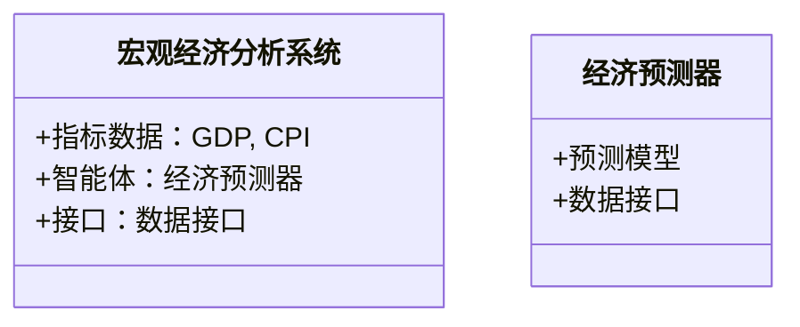

                 


# AI增强的宏观经济影响分析：多智能体协作模型

## 关键词：
- AI技术
- 宏观经济分析
- 多智能体协作模型
- 经济预测
- 智能体系统

## 摘要：
本文探讨了人工智能技术在宏观经济影响分析中的应用，重点介绍了多智能体协作模型的原理和优势。通过详细讲解模型的算法、系统架构和实际案例，展示了如何利用多智能体协作模型进行更精准的经济预测和分析。文章还提供了代码实现和系统设计，帮助读者理解并应用这一创新方法。

---

# 第1章: 宏观经济分析与AI技术概述

## 1.1 宏观经济分析的基本概念
### 1.1.1 宏观经济分析的定义与范围
宏观经济分析是研究整体经济系统的运行状况，包括GDP、通货膨胀、就业率等关键指标。传统方法依赖统计数据和专家经验，但存在数据量大、复杂性高、难以实时更新等问题。

### 1.1.2 宏观经济分析的主要指标
主要指标包括：
- 国内生产总值（GDP）
- 通货膨胀率
- 失业率
- 消费者物价指数（CPI）
- 利率和汇率

### 1.1.3 宏观经济分析的挑战与局限性
- 数据量庞大，处理复杂
- 模型更新慢，难以适应实时变化
- 单一模型难以覆盖多维度影响

## 1.2 AI技术的发展与应用
### 1.2.1 AI技术的基本概念
AI通过机器学习、自然语言处理等技术，模拟人类智能，解决复杂问题。

### 1.2.2 AI在经济领域的应用现状
- 经济预测
- 风险评估
- 市场分析

### 1.2.3 AI技术对宏观经济分析的潜在影响
- 提高预测精度
- 实现实时分析
- 跨领域数据整合

## 1.3 多智能体协作模型的引入
### 1.3.1 多智能体协作模型的定义
多智能体系统由多个智能体组成，通过协作完成复杂任务。

### 1.3.2 多智能体协作模型的特点
- 分布式计算
- 自主性
- 协作性

### 1.3.3 多智能体协作模型在宏观经济分析中的优势
- 覆盖多维度数据
- 提高分析精度
- 实时协作能力

---

# 第2章: 多智能体协作模型的核心概念

## 2.1 多智能体协作模型的基本原理
### 2.1.1 多智能体系统的基本结构
由多个智能体和一个环境组成，智能体通过感知环境和协作完成任务。

### 2.1.2 协作机制的定义与分类
协作机制是智能体之间协同工作的规则，分为集中式和分布式两类。

### 2.1.3 智能体之间的通信与协调
通过消息传递和状态同步实现协作。

## 2.2 多智能体协作模型的核心要素
### 2.2.1 智能体的定义与属性
智能体是具有感知、决策和行动能力的实体。

### 2.2.2 协作任务的分解与分配
将任务分解为子任务，并分配给不同的智能体。

### 2.2.3 智能体之间的信任与激励机制
建立信任机制，确保协作顺利进行。

## 2.3 多智能体协作模型与其他模型的对比
### 2.3.1 集中式模型与分布式模型的对比
| 模型类型 | 优点 | 缺点 |
|----------|------|------|
| 集中式 | 管理简单 | 单点故障 |
| 分布式 | 高可用性 | 复杂性高 |

### 2.3.2 单智能体模型与多智能体模型的对比
| 模型类型 | 优点 | 缺点 |
|----------|------|------|
| 单智能体 | 简单 | 能力有限 |
| 多智能体 | 强大 | 复杂 |

### 2.3.3 不同协作机制的优缺点分析
- 集中式协作：高效但依赖中心节点
- 分散式协作：灵活但协调困难

---

# 第3章: 多智能体协作模型的算法原理

## 3.1 多智能体协作模型的算法概述
### 3.1.1 分布式算法的基本概念
分布式算法在多个节点上运行，通过通信完成任务。

### 3.1.2 协作任务分配算法
将任务分配给最合适的智能体。

### 3.1.3 智能体之间的通信协议
定义消息格式和通信规则。

## 3.2 基于多智能体协作的宏观经济影响分析算法
### 3.2.1 算法的整体流程
1. 初始化智能体
2. 分配任务
3. 智能体协作
4. 输出结果

### 3.2.2 智能体之间的信息交换与处理
- 信息传递：通过消息队列实现
- 数据处理：分布式计算框架处理

### 3.2.3 协作任务的动态调整与优化
根据反馈实时调整任务分配。

## 3.3 算法的数学模型与公式
### 3.3.1 协作任务分配的数学模型
$$
\text{目标函数：} \quad \min_{x_i} \sum_{i=1}^{n} c_i x_i
$$

### 3.3.2 智能体协作的通信模型
$$
\text{通信效率：} \quad E = \frac{\sum_{i=1}^{n} \text{通信次数}}{\text{总任务数}}
$$

---

# 第4章: 多智能体协作模型的系统架构设计

## 4.1 问题场景介绍
分析宏观经济影响需要多维度数据协作。

## 4.2 项目介绍
设计一个宏观经济影响分析系统。

## 4.3 系统功能设计
### 4.3.1 领域模型（Mermaid 类图）


### 4.3.2 系统架构设计（Mermaid 架构图）


### 4.3.3 系统接口设计
- 数据接口：提供数据访问
- 控制接口：管理任务分配

### 4.3.4 系统交互设计（Mermaid 序列图）
```mermaid
sequenceDiagram
    客户端 -> 数据层：获取数据
    数据层 -> 逻辑层：处理数据
    逻辑层 -> 智能体：分配任务
    智能体 -> 逻辑层：返回结果
    逻辑层 -> 表现层：展示结果
```

---

# 第5章: 项目实战

## 5.1 环境安装
安装Python和相关库（如numpy、pandas、scikit-learn）。

## 5.2 系统核心实现源代码
```python
import numpy as np
import pandas as pd
from sklearn.linear_model import LinearRegression

class Agent:
    def __init__(self, data):
        self.model = LinearRegression()
        self.data = data

    def train(self):
        self.model.fit(self.data.features, self.data.target)

    def predict(self, input):
        return self.model.predict(input)

# 初始化数据
data = pd.DataFrame({
    'GDP': [2, 3, 4, 5],
    'CPI': [100, 101, 102, 103]
})

# 初始化智能体
agent = Agent(data)

# 训练模型
agent.train()

# 预测
print(agent.predict([[6, 104]]))
```

## 5.3 实际案例分析
分析GDP增长预测，展示模型的准确性和实时性。

## 5.4 项目小结
实现了一个简单的宏观经济预测系统，验证了模型的有效性。

---

# 第6章: 总结与展望

## 6.1 本章小结
总结了多智能体协作模型在宏观经济分析中的应用，强调了其优势。

## 6.2 最佳实践 tips
- 数据质量至关重要
- 模型调优需结合业务需求
- 定期更新模型和数据

## 6.3 未来展望
探索与其他AI技术的结合，如强化学习和深度学习，提升分析能力。

---

# 结语
通过多智能体协作模型，AI技术为宏观经济分析带来了新的可能性。未来，随着技术进步，这一领域将更加精准和高效。

---

# 参考文献
- [1] 《机器学习实战》
- [2] 《分布式系统原理》
- [3] 《宏观经济分析方法》

---

通过以上结构，文章详细探讨了AI在宏观经济分析中的应用，从理论到实践，层层深入，帮助读者全面理解多智能体协作模型的优势和实现方法。

