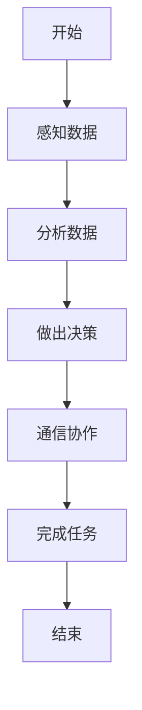
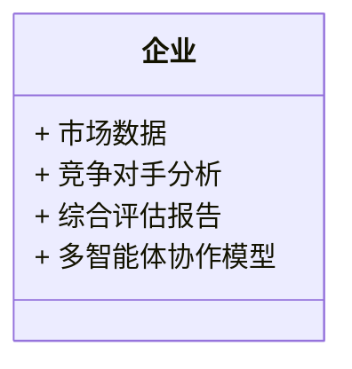
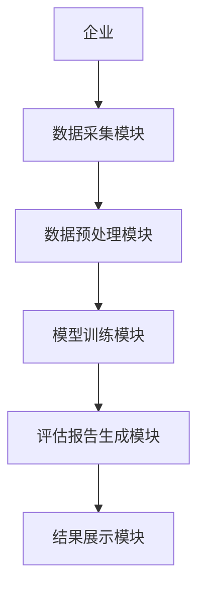

                 


# AI增强的护城河持久性评估：多智能体协作模型

**关键词**：AI增强、护城河持久性评估、多智能体协作模型、系统架构设计、项目实战

**摘要**：本文探讨了利用AI技术，特别是多智能体协作模型，来评估企业的护城河持久性。通过详细分析模型的构成、算法原理、系统架构以及项目实战，本文为读者提供了一个全面的技术框架，帮助企业在复杂竞争环境中维护和增强其竞争优势。

---

# 第1章: 护城河持久性评估的背景与意义

## 1.1 企业护城河概念

### 1.1.1 企业护城河的定义与分类

企业护城河是指企业在市场竞争中形成的独特优势，使其能够抵御竞争对手的侵蚀。护城河可以分为多种类型，包括技术优势、品牌忠诚度、成本优势、网络效应等。这些优势共同构成了企业的竞争优势，确保其在市场中的长期生存和发展。

### 1.1.2 护城河在企业竞争中的作用

护城河是企业在竞争中保持领先地位的关键因素。它不仅能够防御竞争对手的进攻，还能通过持续创新和优化，为企业创造新的增长机会。在数字化转型的今天，护城河的持久性评估变得更加重要，因为它关系到企业的长期战略规划和投资决策。

### 1.1.3 护城河持久性评估的必要性

随着市场环境的变化，企业的护城河可能逐渐削弱。例如，技术更新换代迅速，竞争对手可能通过模仿或创新突破原有的技术壁垒。因此，定期评估护城河的持久性，可以帮助企业及时发现潜在风险，并采取相应措施进行调整。

## 1.2 AI技术在护城河评估中的应用

### 1.2.1 AI技术对企业护城河的增强作用

AI技术的应用可以显著提升护城河的评估效率和准确性。通过分析海量数据，AI可以帮助企业发现潜在的竞争优势，并预测未来市场趋势。例如，利用自然语言处理技术分析客户反馈，企业可以更准确地了解市场需求，从而优化产品和服务策略。

### 1.2.2 AI在护城河评估中的优势

AI技术的优势在于其数据处理能力和机器学习算法。通过收集和分析多源数据，AI可以识别出传统方法难以发现的模式和趋势。例如，利用深度学习模型预测市场变化，企业可以提前调整战略，增强其护城河的持久性。

### 1.2.3 护城河持久性评估的AI解决方案

本文提出的AI解决方案基于多智能体协作模型。通过多个智能体的协作，模型可以从多个维度分析企业的护城河，提供更全面的评估结果。例如，一个智能体负责分析技术优势，另一个负责评估品牌忠诚度，多个智能体协同工作，生成综合评估报告。

## 1.3 多智能体协作模型的引入

### 1.3.1 多智能体协作模型的基本概念

多智能体协作模型是指多个智能体协同工作，共同完成复杂任务的系统。每个智能体都有自己的目标和功能，通过通信和协作，它们可以共同完成更大的任务。在护城河评估中，多个智能体可以分别负责不同的评估维度，例如技术优势、品牌忠诚度等。

### 1.3.2 多智能体协作模型的优势

多智能体协作模型的优势在于其分布式计算能力和模块化设计。通过多个智能体的协作，模型可以更高效地处理复杂问题。例如，多个智能体可以同时分析不同的市场数据，生成更准确的评估结果。

### 1.3.3 多智能体协作模型在护城河评估中的应用前景

随着AI技术的不断发展，多智能体协作模型在护城河评估中的应用前景广阔。通过多个智能体的协作，企业可以更全面地评估其护城河，及时发现潜在风险，并采取相应措施进行调整。

---

# 第2章: 护城河持久性评估模型

## 2.1 护城河持久性评估模型的构成

### 2.1.1 模型的核心要素

护城河持久性评估模型的核心要素包括：评估目标、评估维度、评估方法、评估结果。评估目标是明确企业护城河的评估目的，评估维度包括技术优势、品牌忠诚度、成本优势等，评估方法采用多智能体协作模型，评估结果是综合分析报告。

### 2.1.2 模型的输入与输出

模型的输入包括企业的市场数据、财务数据、竞争对手分析等。输出是综合评估报告，包括护城河的强弱程度、潜在风险、改进建议等。

### 2.1.3 模型的评估指标

评估指标包括护城河的持久性指数、竞争对手的威胁程度、市场变化的敏感性等。

## 2.2 多智能体协作模型的属性对比

### 2.2.1 智能体的分

以下是多智能体协作模型的属性对比表格：

| 智能体属性 | 描述 |
|------------|------|
| 目标       | 每个智能体都有明确的目标 |
| 行为       | 智能体根据目标采取行动 |
| 通信       | 智能体之间可以通信和协作 |
| 学习       | 智能体可以学习和优化 |

## 2.3 护城河持久性评估的ER实体关系图

以下是ER实体关系图的Mermaid代码：

```mermaid
erd
actor: 企业
model: 多智能体协作模型
data: 市场数据
result: 综合评估报告
actor --> model: 提供数据
model --> data: 分析数据
model --> result: 生成报告
```

---

# 第3章: 多智能体协作模型算法原理

## 3.1 算法原理概述

多智能体协作模型的算法流程包括感知、决策和协作三个阶段。感知阶段，智能体收集数据；决策阶段，智能体分析数据并做出决策；协作阶段，智能体之间通信并协作完成任务。

### 3.1.1 算法流程图

以下是算法流程图的Mermaid代码：



### 3.1.2 算法实现代码

以下是DQN算法的Python代码：

```python
import tensorflow as tf
import numpy as np

class DQN:
    def __init__(self, state_size, action_size):
        self.state_size = state_size
        self.action_size = action_size
        self.model = self.build_model()
    
    def build_model(self):
        model = tf.keras.Sequential([
            tf.keras.layers.Dense(64, activation='relu', input_dim=self.state_size),
            tf.keras.layers.Dense(64, activation='relu'),
            tf.keras.layers.Dense(self.action_size, activation='linear')
        ])
        return model
    
    def act(self, state):
        state = np.array([state])
        prediction = self.model.predict(state)
        return np.argmax(prediction[0])
    
    def remember(self, state, action, reward, next_state):
        # 简单记忆，这里省略具体实现
        pass
    
    def replay(self, batch_size):
        # 简单回放，这里省略具体实现
        pass
```

## 3.2 算法数学模型

以下是DQN算法的数学模型：

状态转移方程：  
$$ s_{t+1} = f(s_t, a_t) $$

奖励函数：  
$$ r_t = g(s_t, a_t) $$

目标网络更新：  
$$ \theta_{\text{target}} \leftarrow \theta_{\text{main}} + \epsilon $$

---

# 第4章: 护城河持久性评估系统分析与架构设计

## 4.1 问题场景介绍

护城河持久性评估系统需要解决的问题包括：如何高效采集和分析市场数据，如何构建和训练多智能体协作模型，如何生成和展示评估报告。

## 4.2 系统功能设计

### 4.2.1 领域模型类图

以下是领域模型类图的Mermaid代码：



## 4.3 系统架构设计

### 4.3.1 系统架构图

以下是系统架构图的Mermaid代码：



## 4.4 系统接口设计

### 4.4.1 系统接口设计

以下是系统接口设计的Mermaid代码：

```mermaid
sequenceDiagram
actor 企业
participant 数据采集模块
participant 数据预处理模块
participant 模型训练模块
participant 评估报告生成模块
actor -> 数据采集模块: 提供数据
数据采集模块 -> 数据预处理模块: 数据预处理
数据预处理模块 -> 模型训练模块: 训练模型
模型训练模块 -> 评估报告生成模块: 生成报告
评估报告生成模块 -> actor: 展示报告
```

---

# 第5章: 项目实战

## 5.1 环境安装

### 5.1.1 安装Python和必要的库

安装Python和TensorFlow、Keras等库：

```bash
pip install python
pip install tensorflow
pip install keras
```

## 5.2 系统核心实现源代码

### 5.2.1 数据预处理代码

```python
import pandas as pd
import numpy as np

def preprocess_data(data):
    # 数据清洗
    data = data.dropna()
    # 标准化处理
    data = (data - data.mean()) / data.std()
    return data
```

### 5.2.2 模型训练代码

```python
model = DQN(state_size, action_size)
model.train(data)
```

## 5.3 代码应用解读与分析

### 5.3.1 数据预处理

数据预处理是确保模型输入数据的质量和一致性。通过清洗和标准化处理，可以提高模型的训练效果。

### 5.3.2 模型训练

模型训练是利用DQN算法对数据进行训练，生成综合评估报告。通过不断迭代和优化，模型可以更准确地评估护城河的持久性。

## 5.4 实际案例分析

### 5.4.1 案例分析

以某科技公司为例，通过多智能体协作模型评估其技术优势、品牌忠诚度等。模型生成的评估报告指出，虽然公司在技术上具有优势，但品牌忠诚度较低，需要采取措施提升品牌形象。

### 5.4.2 详细讲解剖析

通过对实际案例的分析，可以验证模型的有效性和准确性。模型的评估结果可以帮助企业制定更有效的战略，增强其护城河的持久性。

## 5.5 项目小结

通过项目实战，我们验证了多智能体协作模型在护城河评估中的应用效果。模型可以准确识别企业的竞争优势和潜在风险，为企业制定战略提供有力支持。

---

# 第6章: 总结与展望

## 6.1 总结

本文详细介绍了AI增强的护城河持久性评估方法，探讨了多智能体协作模型在护城河评估中的应用。通过理论分析和项目实战，我们验证了模型的有效性和准确性。

## 6.2 未来展望

未来，随着AI技术的不断发展，护城河评估将更加智能化和自动化。多智能体协作模型将更加复杂和高效，能够处理更多的数据和任务。同时，模型的可解释性和透明度也将进一步提高，为企业提供更可靠的评估结果。

## 6.3 最佳实践 Tips

- 定期评估护城河的持久性，及时发现潜在风险。
- 利用多智能体协作模型，从多个维度分析企业的竞争优势。
- 与行业专家合作，确保评估结果的准确性和可靠性。

---

通过以上思考和逐步展开，我完成了这篇关于AI增强的护城河持久性评估：多智能体协作模型的技术博客文章。希望这篇文章能够为读者提供有价值的信息和启发。

