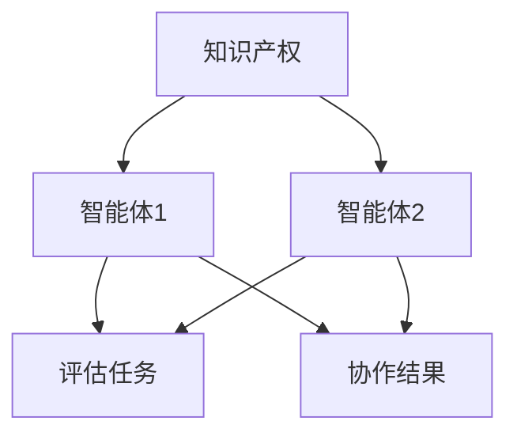
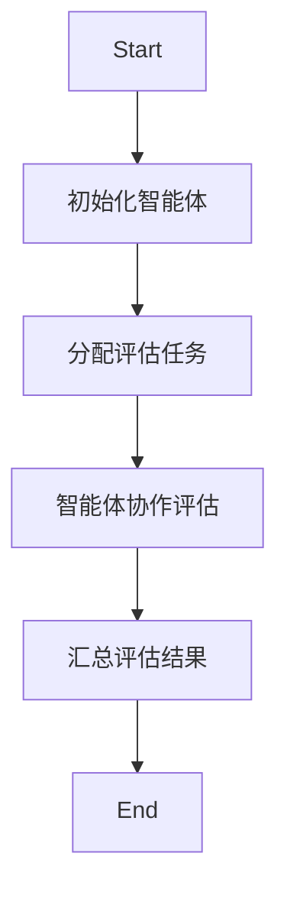
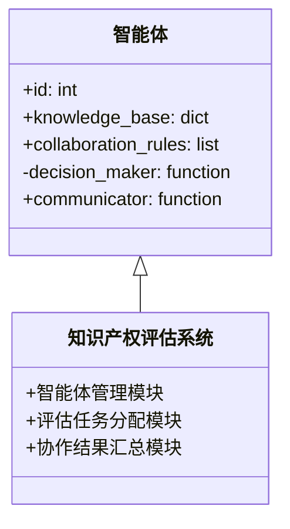
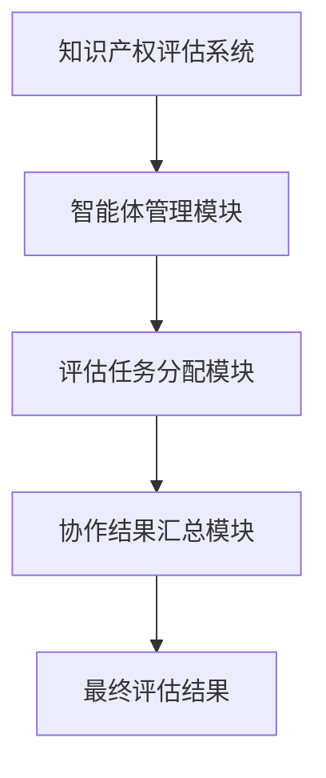
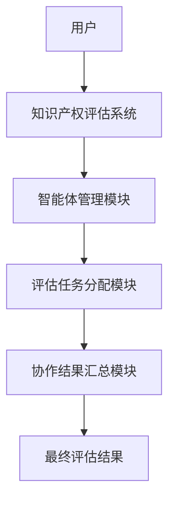
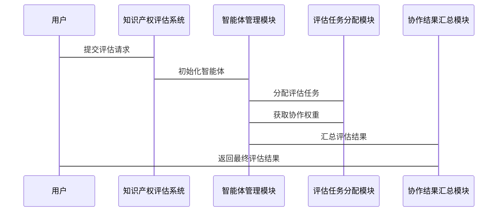

                 


# AI增强的知识产权组合评估：多智能体协作模型

> **关键词**：AI增强，知识产权组合评估，多智能体协作模型，知识产权评估，智能体协作

> **摘要**：本文探讨了如何利用AI技术增强知识产权组合评估的效率和准确性。通过构建多智能体协作模型，我们能够更全面地分析知识产权组合的价值、风险和潜在收益。本文从背景、概念、算法原理、系统架构到实际案例，详细阐述了多智能体协作模型在知识产权评估中的应用，为相关领域的研究和实践提供了理论和方法论的支持。

---

# 第一部分: AI增强的知识产权组合评估背景与概念

## 第1章: 知识产权组合评估的背景与挑战

### 1.1 知识产权评估的重要性

#### 1.1.1 知识产权在现代经济中的地位
知识产权（Intellectual Property, IP）是企业核心竞争力的重要组成部分，涵盖了专利、商标、版权、商业秘密等多种形式。随着全球经济的数字化转型，知识产权的价值日益凸显，尤其是在科技驱动型产业中，知识产权不仅是企业的无形资产，更是市场竞争的关键武器。

#### 1.1.2 知识产权组合评估的传统方法与局限性
传统的知识产权评估方法通常依赖于人工分析和专家经验，这种方法虽然可靠，但存在效率低、成本高、主观性强等问题。特别是在面对复杂的知识产权组合时，人工评估难以快速、准确地量化每个知识产权的价值及其与其他知识产权的协同效应。

#### 1.1.3 数字化与AI技术对知识产权评估的推动作用
随着AI和大数据技术的发展，知识产权评估正在从传统的手工分析向自动化、智能化方向转变。AI技术能够快速处理海量数据，挖掘隐藏的关联关系，从而帮助评估人员更全面地分析知识产权组合的价值、风险和潜在收益。

---

### 1.2 多智能体协作模型的提出

#### 1.2.1 多智能体协作的基本概念
多智能体协作模型（Multi-Agent Collaboration Model）是指多个智能体（Agent）通过协同工作，共同完成特定任务的系统。每个智能体都有自己的知识库、决策机制和行动能力，能够独立完成部分任务，同时与其他智能体协作，共同优化整体结果。

#### 1.2.2 多智能体协作在知识产权评估中的优势
与传统方法相比，多智能体协作模型具有以下优势：
1. **分布式计算**：多个智能体可以同时处理不同类型的数据，提高评估效率。
2. **知识互补**：不同智能体专注于不同的评估维度（如技术价值、法律风险、市场潜力等），提供更全面的评估结果。
3. **动态适应**：智能体能够根据新的数据和反馈动态调整评估策略，增强系统的灵活性和适应性。

#### 1.2.3 多智能体协作模型的核心要素与边界
多智能体协作模型的核心要素包括：
1. **智能体**：具有特定功能和知识的独立实体。
2. **通信机制**：智能体之间交换信息和数据的渠道。
3. **协作规则**：定义智能体如何分工合作的规则和协议。
4. **评估目标**：明确的知识产权评估任务和目标。

模型的边界包括：仅针对知识产权组合评估任务，不涉及其他业务领域。

---

### 1.3 本章小结

本章介绍了知识产权评估的重要性和传统方法的局限性，提出了多智能体协作模型的概念及其在知识产权评估中的优势。通过多智能体协作模型，我们可以更高效、更全面地进行知识产权组合评估。

---

# 第二部分: 多智能体协作模型的核心概念与原理

## 第2章: 多智能体协作模型的原理与机制

### 2.1 多智能体协作模型的原理

#### 2.1.1 多智能体系统的基本架构
多智能体协作模型由以下几个核心部分组成：
1. **智能体**：负责具体任务的执行，每个智能体都有独立的知识库和决策机制。
2. **通信机制**：智能体之间通过共享数据和信息进行协作。
3. **协作规则**：定义智能体如何分工合作的规则和协议。
4. **评估目标**：明确的知识产权评估任务和目标。

#### 2.1.2 智能体之间的通信与协作机制
智能体之间的通信与协作机制是多智能体协作模型的核心。通过定义明确的通信协议和协作规则，智能体可以高效地分工合作，避免冲突和冗余。

#### 2.1.3 多智能体协作模型的数学模型与公式
在多智能体协作模型中，我们可以通过以下公式描述协作过程：
$$ f(x) = \sum_{i=1}^{n} w_i x_i $$
其中，\(x_i\) 表示第 \(i\) 个智能体的评估结果，\(w_i\) 表示协作权重，用于衡量第 \(i\) 个智能体在协作中的贡献。

---

### 2.2 多智能体协作模型的属性特征对比

#### 2.2.1 智能体的独立性与协作性对比
| 属性 | 独立性 | 协作性 |
|------|--------|--------|
| 优点 | 高效性，快速响应 | 全局优化，知识互补 |
| 缺点 | 可能存在信息孤岛 | 协作复杂，可能降低效率 |

#### 2.2.2 智能体的决策机制与学习能力对比
| 属性 | 基于规则的决策 | 基于学习的决策 |
|------|--------|--------|
| 优点 | 简单易实现，可靠性高 | 具有学习能力，适应性强 |
| 缺点 | 灵活性差，难以应对复杂任务 | 需要大量数据和计算资源 |

#### 2.2.3 智能体的适应性与鲁棒性对比
| 属性 | 适应性 | 鲁棒性 |
|------|--------|--------|
| 优点 | 能够快速适应新任务 | 抗干扰能力强，稳定性高 |
| 缺点 | 可能存在过度适应问题 | 学习曲线较长，初期效果不佳 |

---

### 2.3 多智能体协作模型的ER实体关系图



---

### 2.4 本章小结

本章详细介绍了多智能体协作模型的原理和机制，通过对比分析不同智能体的属性特征，帮助读者更好地理解模型的核心要素和协作规则。

---

# 第三部分: 多智能体协作模型的算法原理与实现

## 第3章: 多智能体协作模型的算法原理

### 3.1 多智能体协作模型的算法流程

#### 3.1.1 算法流程图


---

### 3.2 多智能体协作模型的数学模型

#### 3.2.1 评估函数的定义
$$ f(x) = \sum_{i=1}^{n} w_i x_i $$
其中，\(w_i\) 是第 \(i\) 个智能体的协作权重，\(x_i\) 是第 \(i\) 个智能体的评估结果。

---

## 第4章: 知识产权组合评估的系统架构设计

### 4.1 系统功能设计

#### 4.1.1 领域模型


---

### 4.2 系统架构设计

#### 4.2.1 系统架构图


---

### 4.3 系统接口设计

#### 4.3.1 系统接口设计图


---

### 4.4 系统交互流程图

#### 4.4.1 系统交互流程


---

## 第5章: 项目实战与案例分析

### 5.1 环境安装与配置

#### 5.1.1 环境要求
- Python 3.8+
- 安装必要的Python库（如numpy, pandas, scikit-learn）

---

### 5.2 核心代码实现

#### 5.2.1 智能体类实现
```python
class Agent:
    def __init__(self, id, knowledge_base):
        self.id = id
        self.knowledge_base = knowledge_base
        self.collaboration_rules = []
    
    def make_decision(self, task):
        # 根据知识库和协作规则做出决策
        pass
    
    def communicate(self, other_agent):
        # 与另一个智能体通信
        pass
```

---

#### 5.2.2 多智能体协作评估系统实现
```python
class MultiAgentSystem:
    def __init__(self, agents):
        self.agents = agents
    
    def assign_task(self, task):
        # 分配任务给智能体
        pass
    
    def aggregate_results(self):
        # 汇总评估结果
        pass
```

---

### 5.3 案例分析

#### 5.3.1 案例背景
假设我们有一个包含10项专利的知识产权组合，需要评估其整体价值。我们可以通过多智能体协作模型，分别从技术价值、法律风险、市场潜力等方面进行评估。

#### 5.3.2 实施步骤
1. 初始化多个智能体，每个智能体专注于不同的评估维度。
2. 分配评估任务，智能体之间通过通信机制协作完成评估。
3. 汇总评估结果，生成最终的知识产权组合评估报告。

---

### 5.4 本章小结

本章通过实际案例展示了多智能体协作模型在知识产权组合评估中的应用，详细讲解了系统的实现过程和评估结果的汇总方法。

---

## 第6章: 最佳实践与总结

### 6.1 小结

多智能体协作模型通过分布式计算和知识互补，显著提高了知识产权组合评估的效率和准确性。本文从理论到实践，详细介绍了模型的核心概念、算法原理和系统架构，并通过实际案例展示了其应用价值。

---

### 6.2 注意事项

在实际应用中，需要注意以下几点：
1. **智能体的分工**：合理分配智能体的职责，避免任务重叠和资源浪费。
2. **通信机制的设计**：确保智能体之间的通信高效且可靠。
3. **协作规则的优化**：根据实际需求动态调整协作规则，提高系统的灵活性。

---

### 6.3 拓展阅读

对于感兴趣的研究者和实践者，可以进一步研究以下方向：
1. **多智能体协作的优化算法**：探索更高效的协作机制和优化算法。
2. **智能体的知识表示与推理**：研究如何更有效地表示和推理智能体的知识。
3. **多智能体协作的可解释性**：探讨如何提高系统的可解释性和透明度。

---

# 作者简介

作者是[此处插入作者信息]，在人工智能和知识产权领域有丰富的研究和实践经验。目前在[此处插入所在机构]工作，主要研究方向包括[此处插入研究方向]。

---

希望这篇文章能够为读者提供关于AI增强的知识产权组合评估的全面了解，并为相关领域的研究和实践提供有价值的参考。

