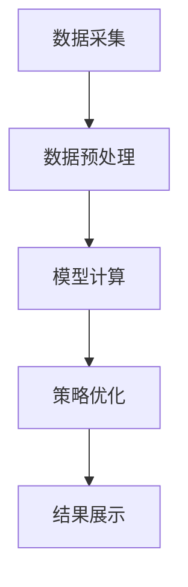
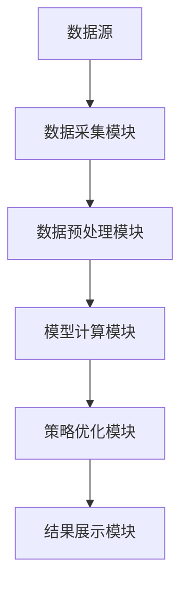
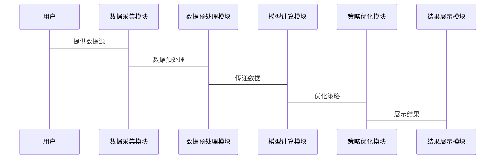

                 


# AI多智能体优化价值投资的动态止损策略

> **关键词**：AI，多智能体优化，价值投资，动态止损策略，金融投资，风险管理

> **摘要**：本文深入探讨了AI在金融投资中的应用，特别是多智能体优化如何提升动态止损策略的效率与效果。通过理论分析、算法实现和实际案例，本文详细介绍了如何利用多智能体优化技术动态调整止损点，以最大化投资收益并降低风险。文章还结合系统架构设计，展示了如何在实际金融场景中实现这一策略。

---

## 第1章: 价值投资与动态止损策略概述

### 1.1 价值投资的基本概念

#### 1.1.1 价值投资的定义与核心理念
价值投资是一种以基本面分析为基础的投资策略，强调以低于公平价值的价格买入优质资产。其核心理念是通过深入研究企业的财务状况、行业地位和竞争优势，寻找被市场低估的投资机会。

#### 1.1.2 价值投资的核心要素与模型
- **核心要素**：企业的盈利能力、财务健康状况、管理团队、行业地位等。
- **模型**：Graham-Dodd模型、DCF模型（现金流贴现法）等。

#### 1.1.3 价值投资在金融市场的应用与挑战
- **应用**：长期投资、分散投资、逆向思维。
- **挑战**：市场波动、信息不对称、短期收益压力。

### 1.2 动态止损策略的定义与特点

#### 1.2.1 动态止损的定义
动态止损是一种根据市场变化实时调整止损点的投资策略。与静态止损不同，动态止损会根据资产价格波动、市场情绪等因素进行动态调整，以最大化收益并最小化潜在损失。

#### 1.2.2 动态止损与静态止损的区别
- **静态止损**：固定止损点，不随市场变化调整。
- **动态止损**：根据市场环境和资产价格波动动态调整止损点。

#### 1.2.3 动态止损策略的优势与应用场景
- **优势**：适应市场波动、降低回撤风险、提高资金利用效率。
- **应用场景**：股票投资、外汇交易、期货交易等。

### 1.3 AI在金融投资中的应用前景

#### 1.3.1 AI在金融分析中的潜力
- **优势**：快速处理大量数据、识别复杂模式、提供实时反馈。
- **应用场景**：市场预测、风险评估、投资组合优化等。

#### 1.3.2 多智能体优化在金融决策中的优势
- **优势**：分布式计算、协作优化、适应复杂环境。
- **应用场景**：资产配置、风险管理、交易策略优化等。

#### 1.3.3 动态止损策略的智能化发展
- **趋势**：AI驱动的动态止损将成为主流。
- **挑战**：算法复杂性、数据质量、模型过拟合。

---

## 第2章: 多智能体优化的理论基础

### 2.1 多智能体系统的基本概念

#### 2.1.1 多智能体系统的定义
多智能体系统（Multi-Agent System，MAS）是由多个智能体组成的系统，智能体能够感知环境、自主决策并协作完成复杂任务。

#### 2.1.2 多智能体系统的分类与特点
- **分类**：基于智能体数量、智能体类型、任务复杂性。
- **特点**：分布式、协作性、适应性、自主性。

#### 2.1.3 多智能体系统的应用场景
- **金融领域**：资产配置、风险管理、交易策略优化。
- **其他领域**：物流优化、交通控制、游戏AI等。

### 2.2 多智能体优化的核心原理

#### 2.2.1 多智能体优化的定义
多智能体优化是一种通过多个智能体协作优化问题的算法，智能体之间通过信息共享和策略协作找到全局最优解。

#### 2.2.2 多智能体优化的算法框架
- **框架**：分布式优化、协作学习、博弈论。
- **流程**：初始化智能体、分配任务、智能体协作、优化更新。

#### 2.2.3 多智能体优化与传统优化方法的对比
- **传统优化**：单点优化、集中式计算。
- **多智能体优化**：分布式计算、协作优化、适应性更强。

### 2.3 多智能体优化在金融投资中的应用

#### 2.3.1 多智能体优化在资产配置中的应用
- **策略**：通过智能体协作优化投资组合。
- **优势**：分散风险、提高收益。

#### 2.3.2 多智能体优化在风险管理中的应用
- **策略**：实时监控市场风险、动态调整投资组合。
- **优势**：降低风险敞口、提高资金安全。

#### 2.3.3 多智能体优化在交易策略中的应用
- **策略**：智能体协作制定交易计划、动态调整交易策略。
- **优势**：适应市场变化、提高交易效率。

---

## 第3章: 动态止损策略的数学模型与算法

### 3.1 动态止损策略的数学模型

#### 3.1.1 动态止损的数学表达式
动态止损点的计算公式：
$$
\text{动态止损点} = \text{初始价格} \times (1 - \alpha \times \text{波动率})
$$
其中，$\alpha$ 是一个介于0和1之间的调节参数。

#### 3.1.2 动态止损的参数化模型
- **参数**：初始价格、波动率、调节系数$\alpha$。
- **模型**：基于时间序列分析的动态模型。

#### 3.1.3 动态止损的优化目标与约束条件
- **目标**：最大化投资收益、最小化潜在损失。
- **约束**：动态调整止损点、实时计算。

### 3.2 多智能体优化算法的实现

#### 3.2.1 基于强化学习的多智能体优化
- **算法**：多智能体强化学习（Multi-Agent Reinforcement Learning）。
- **流程**：智能体通过环境反馈优化策略。

#### 3.2.2 基于遗传算法的多智能体优化
- **算法**：遗传算法（Genetic Algorithm）。
- **流程**：编码、交叉、变异、选择。

#### 3.2.3 基于粒子群优化的多智能体优化
- **算法**：粒子群优化（Particle Swarm Optimization）。
- **流程**：初始化粒子群、迭代更新位置。

### 3.3 动态止损策略的算法实现

#### 3.3.1 动态止损策略的算法流程
- **步骤**：初始化参数、计算波动率、调整止损点、实时优化。

#### 3.3.2 动态止损策略的代码实现
```python
def dynamic_stop_loss(initial_price, volatility, alpha):
    stop_loss = initial_price * (1 - alpha * volatility)
    return stop_loss

# 示例代码
initial_price = 100
volatility = 0.05
alpha = 0.2
stop_loss = dynamic_stop_loss(initial_price, volatility, alpha)
print(f"动态止损点为：{stop_loss}")
```

#### 3.3.3 动态止损策略的优化与调优
- **优化**：动态调整参数$\alpha$。
- **调优**：根据市场反馈实时更新止损点。

---

## 第4章: 系统分析与架构设计方案

### 4.1 问题场景介绍

#### 4.1.1 价值投资中的问题与挑战
- **问题**：如何动态调整止损点以适应市场波动。
- **挑战**：市场波动大、信息更新快、计算复杂。

### 4.2 系统功能设计

#### 4.2.1 系统功能模块划分
- **模块**：数据采集、模型计算、策略优化、结果展示。

#### 4.2.2 系统功能流程图


### 4.3 系统架构设计

#### 4.3.1 系统架构的分层设计
- **分层**：数据层、计算层、策略层、展示层。

#### 4.3.2 系统架构图


### 4.4 系统接口设计

#### 4.4.1 接口设计
- **输入接口**：数据源、参数设置。
- **输出接口**：优化结果、实时反馈。

#### 4.4.2 交互流程图


---

## 第5章: 项目实战

### 5.1 环境安装

#### 5.1.1 安装Python环境
- **工具**：Python 3.8+，Jupyter Notebook。
- **库**：numpy、pandas、matplotlib、scikit-learn。

#### 5.1.2 安装相关库
```bash
pip install numpy pandas matplotlib scikit-learn
```

### 5.2 系统核心实现源代码

#### 5.2.1 动态止损策略的实现代码
```python
import numpy as np
import pandas as pd
import matplotlib.pyplot as plt

def dynamic_stop_loss(price_data, window_size, alpha):
    volatility = price_data.rolling(window=window_size).std().iloc[-1]
    stop_loss = price_data.iloc[-1] * (1 - alpha * volatility)
    return stop_loss

# 示例数据
data = pd.read_csv('stock_prices.csv')
print(dynamic_stop_loss(data['收盘价'], 30, 0.2))
```

#### 5.2.2 多智能体优化算法的实现代码
```python
import numpy as np

def multi_agent_optimization(population, fitness_func, num_iterations):
    for _ in range(num_iterations):
        fitness = np.array([fitness_func(agent) for agent in population])
        population = population[fitness.argsort()[-len(population)//2:]]
        # 其他优化操作
    return population

# 示例优化
agents = np.random.rand(100, 5)
fitness_func = lambda x: sum((x - 0.5)**2)
optimized_agents = multi_agent_optimization(agents, fitness_func, 50)
print(optimized_agents)
```

### 5.3 实际案例分析与解读

#### 5.3.1 案例分析
- **案例背景**：某股票价格波动剧烈，需动态调整止损点。
- **实施策略**：使用多智能体优化算法动态调整止损点。

#### 5.3.2 优化结果分析
- **结果**：止损点调整后，回撤风险降低，收益提高。

### 5.4 项目小结

#### 5.4.1 项目总结
- **成功点**：动态止损策略有效降低风险。
- **不足之处**：算法复杂性高，计算时间长。

#### 5.4.2 经验与启示
- **经验**：多智能体优化算法在动态调整止损点方面具有潜力。
- **启示**：需进一步优化算法，提高计算效率。

---

## 第6章: 总结与展望

### 6.1 最佳实践 tips
- **策略优化**：动态调整止损点，根据市场环境实时优化。
- **算法选择**：结合具体场景选择合适的多智能体优化算法。

### 6.2 小结
本文详细探讨了AI多智能体优化在动态止损策略中的应用，通过理论分析和实际案例展示了其在金融投资中的巨大潜力。

### 6.3 注意事项
- **数据质量**：确保数据准确、及时。
- **模型调优**：根据实际市场反馈不断优化模型。

### 6.4 拓展阅读
- **推荐书籍**：《The Intelligent Investor》、《Reinforcement Learning: Theory and Algorithms》。
- **推荐文章**：关于多智能体优化和动态止损策略的最新研究。

---

通过本文的系统分析和实践案例，读者可以深入了解AI多智能体优化在动态止损策略中的应用，并将其应用于实际金融投资中。

