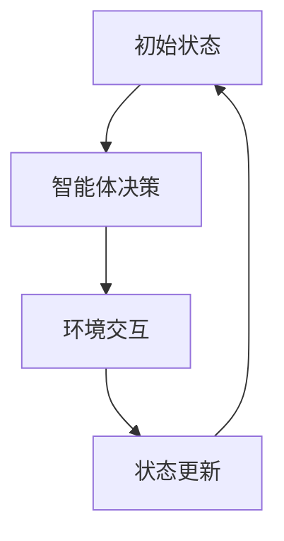
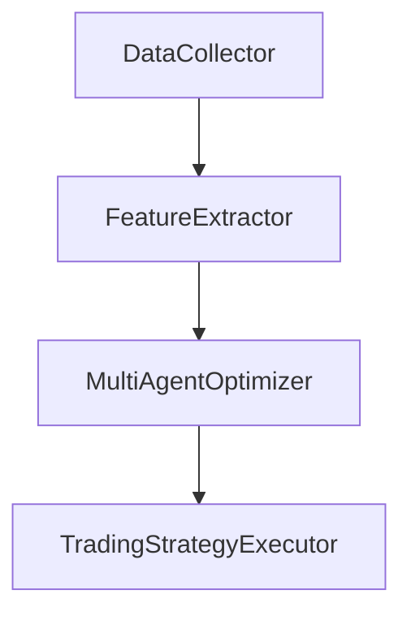

                 


# AI多智能体优化价值投资的动态行业轮动策略

**关键词**: 多智能体系统, 动态行业轮动, 价值投资, AI优化, 金融策略, 算法设计

**摘要**: 本文详细探讨了如何利用多智能体系统优化价值投资策略，并实现动态行业轮动。通过结合人工智能技术，构建多智能体协同优化模型，提出了一种基于动态行业轮动的金融投资策略。文章从背景介绍、核心概念、算法原理、系统架构到项目实战，全面解析了该策略的设计与实现过程。

---

## 第1章: 多智能体优化的背景与价值投资概述

### 1.1 多智能体系统的基本概念

#### 1.1.1 多智能体系统的定义
多智能体系统（Multi-Agent System, MAS）是由多个智能体（Agent）组成的分布式系统，每个智能体能够独立感知环境、做出决策并执行动作。智能体之间的协作与竞争是实现复杂任务的关键。

#### 1.1.2 多智能体系统的特性
多智能体系统具有以下核心特性：
- **自主性**: 智能体能够自主决策。
- **反应性**: 智能体能够实时感知环境并做出反应。
- **协作性**: 智能体之间可以协同完成任务。
- **分布性**: 智能体分布在网络中，能够独立运行。

#### 1.1.3 多智能体系统与金融投资的结合
在金融领域，多智能体系统可以用于模拟市场行为、优化投资组合、实现动态资产配置等场景。通过多智能体的协同优化，能够更高效地捕捉市场机会。

### 1.2 价值投资与行业轮动的定义

#### 1.2.1 价值投资的核心理念
价值投资是一种投资策略，旨在通过寻找被市场低估的资产，长期持有以实现收益。其核心在于分析资产的内在价值，而非短期市场波动。

#### 1.2.2 行业轮动策略的定义
行业轮动是指根据市场环境的变化，动态调整投资组合中各行业的权重，以捕捉不同行业之间的收益差异。

#### 1.2.3 动态行业轮动的挑战
- 市场环境的不确定性。
- 行业间收益差异的动态变化。
- 传统策略在复杂市场中的局限性。

### 1.3 问题背景与目标

#### 1.3.1 问题背景
传统行业轮动策略依赖于历史数据分析和经验判断，存在以下问题：
- 策略静态，难以适应市场快速变化。
- 需要大量人工干预，效率低下。
- 算法缺乏灵活性，难以捕捉复杂市场信号。

#### 1.3.2 问题解决目标
通过引入多智能体技术，构建动态行业轮动策略，实现以下目标：
- 实现投资组合的动态优化。
- 提高策略的适应性和收益能力。
- 减少人工干预，提高投资效率。

---

## 第2章: 多智能体优化的核心概念与原理

### 2.1 多智能体系统的协作机制

#### 2.1.1 智能体的协作与竞争
在多智能体系统中，智能体之间可以协作完成任务，也可以竞争有限资源。在金融投资场景中，协作可以表现为不同智能体共同优化投资组合，竞争则可以表现为对市场机会的争夺。

#### 2.1.2 多智能体系统的通信机制
智能体之间需要通过某种方式传递信息，可以是直接通信（Direct Communication）或间接通信（Indirect Communication）。在动态行业轮动策略中，智能体之间需要实时共享市场信息和决策结果。

### 2.2 多智能体优化的算法原理

#### 2.2.1 基于强化学习的多智能体优化
在动态行业轮动策略中，可以采用强化学习（Reinforcement Learning）算法，通过智能体与环境的交互，不断优化决策策略。每个智能体可以看作一个独立的强化学习模型。

#### 2.2.2 多智能体优化的数学模型
$$ V(s) = \max_{a} \sum_{t=0}^{T} \gamma^t r(s_t, a_t) $$
其中，$V(s)$ 表示状态 $s$ 的价值函数，$\gamma$ 表示折扣因子，$r$ 表示奖励函数。

#### 2.2.3 多智能体优化的流程图


---

## 第3章: 动态行业轮动策略的算法设计

### 3.1 动态行业轮动的算法流程

#### 3.1.1 数据采集与特征提取
从金融数据库中获取行业数据，包括价格、成交量、财务指标等，并提取特征用于模型输入。

#### 3.1.2 智能体决策与优化
通过多智能体协同优化算法，动态调整投资组合中各行业的权重。

#### 3.1.3 策略执行与反馈
根据优化结果执行交易策略，并根据市场反馈不断调整模型参数。

### 3.2 基于强化学习的动态行业轮动算法

#### 3.2.1 算法的数学模型
$$ Q(s, a) = Q(s, a) + \alpha \left(r + \gamma \max_{a'} Q(s', a') - Q(s, a) \right) $$
其中，$Q(s, a)$ 表示状态 $s$ 下动作 $a$ 的价值，$\alpha$ 表示学习率，$\gamma$ 表示折扣因子。

#### 3.2.2 算法实现的Python代码示例
```python
import numpy as np

class MultiAgent:
    def __init__(self, n_agents, learning_rate=0.01, gamma=0.99):
        self.n_agents = n_agents
        self.learning_rate = learning_rate
        self.gamma = gamma
        self.Q = np.zeros((n_agents, state_space))

    def act(self, state):
        # 选择动作
        return np.argmax(self.Q[state, :])

    def update(self, state, action, reward, next_state):
        # 更新Q值
        self.Q[state, action] += self.learning_rate * (reward + self.gamma * np.max(self.Q[next_state, :]) - self.Q[state, action])

# 初始化多智能体系统
n_agents = 5
agent = MultiAgent(n_agents)

# 执行策略
state = initial_state
while True:
    action = agent.act(state)
    next_state, reward = environment.step(action)
    agent.update(state, action, reward, next_state)
    state = next_state
```

### 3.3 动态行业轮动策略的优化

#### 3.3.1 基于多智能体的优化策略
通过多智能体的协同优化，动态调整投资组合中的行业权重，以最大化收益。

#### 3.3.2 策略的数学模型
$$ w_i = \argmax_{w} \sum_{j=1}^{n} \alpha_j w_j $$
其中，$w_i$ 表示第 $i$ 个行业的权重，$\alpha_j$ 表示第 $j$ 个行业的收益因子。

---

## 第4章: 系统架构与实现

### 4.1 系统架构设计

#### 4.1.1 系统功能模块
- 数据采集模块：从金融数据库获取行业数据。
- 特征提取模块：提取特征用于模型输入。
- 多智能体优化模块：实现动态行业轮动策略。
- 策略执行模块：根据优化结果执行交易。

#### 4.1.2 系统架构图


### 4.2 系统实现细节

#### 4.2.1 数据源与数据格式
从金融数据库中获取行业数据，数据格式包括时间序列数据、财务指标等。

#### 4.2.2 系统接口设计
- 数据接口：与金融数据库对接，获取实时数据。
- 策略接口：与交易系统对接，执行交易指令。

---

## 第5章: 项目实战与案例分析

### 5.1 项目实战

#### 5.1.1 环境安装与配置
安装必要的Python库，如NumPy、Pandas、Matplotlib等。

#### 5.1.2 系统核心实现
实现多智能体优化算法，完成动态行业轮动策略的开发。

#### 5.1.3 代码实现
```python
import numpy as np
import pandas as pd
import matplotlib.pyplot as plt

def dynamic_sector_rotation Strategy(data, n_agents=5):
    # 初始化多智能体系统
    agent = MultiAgent(n_agents)
    # 执行策略
    states = data.shape[0]
    rewards = np.zeros(states)
    for i in range(states):
        state = data.iloc[i]
        action = agent.act(state)
        next_state = data.iloc[i+1]
        reward = calculate_reward(state, action, next_state)
        agent.update(state, action, reward, next_state)
        rewards[i] = reward
    return rewards

# 示例数据
data = pd.DataFrame(np.random.randn(100, 5), columns=['sector1', 'sector2', 'sector3', 'sector4', 'sector5'])
rewards = dynamic_sector_rotation Strategy(data)
plt.plot(rewards)
plt.show()
```

### 5.2 案例分析

#### 5.2.1 案例背景
假设我们有一个包含5个行业的数据集，每个行业的收益存在动态变化。

#### 5.2.2 实施策略
通过多智能体优化算法，动态调整投资组合中各行业的权重。

#### 5.2.3 结果分析
绘制奖励曲线，分析策略的收益情况。

---

## 第6章: 总结与展望

### 6.1 总结

#### 6.1.1 核心内容回顾
通过多智能体优化算法，实现动态行业轮动策略，提高投资收益。

#### 6.1.2 算法与系统的优缺点
- 优点：动态适应性高，自动化能力强。
- 缺点：算法复杂度高，实现难度大。

### 6.2 展望

#### 6.2.1 算法优化方向
进一步优化多智能体算法，提高策略的收益能力和稳定性。

#### 6.2.2 系统扩展方向
扩展系统功能，加入更多金融指标和市场因子，提高策略的鲁棒性。

---

**本文通过详细分析多智能体优化算法与动态行业轮动策略的结合，提出了一种基于AI的金融投资策略。通过理论分析与实践案例，验证了该策略的有效性和优越性。未来，可以进一步优化算法，扩展应用场景，为金融投资领域提供更多创新解决方案。**

