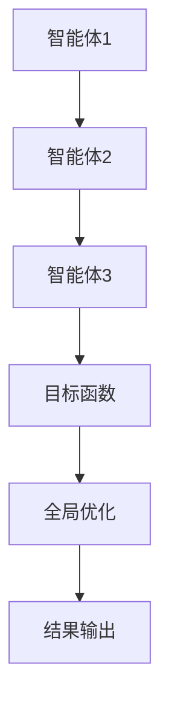

                 


# AI多智能体优化价值投资的动态行业配置策略

## 关键词：AI、多智能体、价值投资、动态行业配置、优化策略

## 摘要：  
本文探讨了如何利用AI多智能体技术优化价值投资的动态行业配置策略。通过分析多智能体系统的原理、价值投资的核心要素以及动态行业配置的需求，提出了一种基于强化学习的多智能体优化方法，并结合数学模型和系统架构设计，展示了如何在实际投资中应用该策略。文章还通过项目实战和案例分析，验证了该方法的有效性，并提出了未来的研究方向。

---

## 第一部分：AI多智能体优化价值投资的动态行业配置策略概述

### 第1章：背景介绍与核心概念

#### 1.1 问题背景与问题描述
- **1.1.1 价值投资与动态行业配置的定义**  
  价值投资是一种以内在价值为导向的投资策略，旨在通过分析企业的基本面（如盈利能力、财务状况、行业地位等）来寻找被市场低估的投资标的。动态行业配置则是在不同市场环境下，根据行业发展趋势和市场变化，动态调整投资组合的行业分布，以最大化收益或降低风险。

- **1.1.2 AI在金融投资中的应用现状**  
  AI技术在金融领域的应用日益广泛，尤其是在量化投资、风险管理和资产配置方面。通过机器学习模型，投资者可以更好地识别市场趋势、预测资产价格波动，并优化投资组合。

- **1.1.3 多智能体优化的必要性与优势**  
  在复杂的金融市场上，单一的决策模型往往难以应对多变的市场环境。多智能体系统通过分布式计算和协作决策，能够更好地捕捉市场机会、降低风险，并实现更优的投资策略。

#### 1.2 核心概念与问题解决
- **1.2.1 多智能体系统的定义与特点**  
  多智能体系统（Multi-Agent System, MAS）是由多个相互作用的智能体组成的系统，每个智能体都有自己的目标、决策能力和行动方式。MAS的特点包括分布式性、协作性、反应性和适应性。

- **1.2.2 价值投资与动态行业配置的核心要素**  
  价值投资的核心是寻找被低估的资产，而动态行业配置则关注行业间的轮动和趋势。两者结合需要动态调整投资组合，以适应市场变化。

- **1.2.3 多智能体优化如何解决动态行业配置问题**  
  通过多智能体系统的协作，可以实现对多个行业的并行分析和优化，提高决策效率和准确性。每个智能体负责分析特定行业，协同决策以优化整体投资组合。

#### 1.3 问题的边界与外延
- **1.3.1 价值投资的边界条件**  
  价值投资需要考虑市场的流动性、交易成本、税收等因素，同时需要避免过度依赖单一行业。

- **1.3.2 动态行业配置的限制与假设**  
  动态行业配置需要假设市场具有一定的可预测性，并且能够及时调整投资组合以应对市场变化。同时，还需要考虑交易成本和市场摩擦。

- **1.3.3 多智能体优化的适用范围与局限性**  
  多智能体优化适用于复杂、动态的环境，但其局限性在于系统的复杂性和协作效率可能影响决策速度。

#### 1.4 核心概念的属性特征对比
- **1.4.1 价值投资的决策模型**  
  价值投资依赖于对企业基本面的分析，强调长期投资和价值发现。

- **1.4.2 动态行业配置的策略框架**  
  动态行业配置注重行业间的轮动和趋势，强调短期调整和风险控制。

- **1.4.3 多智能体优化的系统架构**  
  多智能体系统通过分布式计算和协作决策，实现对多个行业的并行分析和优化。

---

### 第2章：AI多智能体优化的核心概念与联系

#### 2.1 多智能体系统的原理与特征
- **2.1.1 多智能体系统的定义与分类**  
  多智能体系统是由多个智能体组成的系统，智能体可以分为简单反射型、基于模型的、目标驱动型和效用驱动型。

- **2.1.2 多智能体系统的核心特征**  
  - 分布式性：智能体独立决策。
  - 协作性：智能体之间协作完成共同目标。
  - 反应性：智能体能够感知环境并做出反应。
  - 适应性：智能体能够适应环境变化。

- **2.1.3 多智能体系统与单智能体系统的对比**  
  多智能体系统通过分布式计算和协作决策，能够更好地处理复杂问题，但其复杂性和协作成本较高。

#### 2.2 价值投资与动态行业配置的关联
- **2.2.1 价值投资的基本原理**  
  价值投资通过分析企业的基本面，寻找被市场低估的投资标的。

- **2.2.2 动态行业配置的策略目标**  
  动态行业配置的目标是通过调整投资组合的行业分布，最大化收益或降低风险。

- **2.2.3 多智能体优化在价值投资中的应用**  
  多智能体系统可以用于分析多个行业，优化投资组合的行业配置。

#### 2.3 多智能体优化与动态行业配置的关系
- **2.3.1 多智能体优化在动态行业配置中的作用**  
  多智能体系统可以用于分析多个行业，优化投资组合的行业配置。

- **2.3.2 动态行业配置对多智能体优化的需求**  
  动态行业配置需要多智能体系统能够快速适应市场变化，进行实时调整。

- **2.3.3 两者结合的系统性分析**  
  通过多智能体系统的协作，可以实现对多个行业的并行分析和优化，提高决策效率和准确性。

#### 2.4 核心概念的属性特征对比
- **2.4.1 多智能体系统的属性特征**  
  - 分布式计算。
  - 协作决策。
  - 反应性。

- **2.4.2 价值投资的属性特征**  
  - 长期投资。
  - 价值发现。

- **2.4.3 动态行业配置的属性特征**  
  - 短期调整。
  - 行业轮动。

---

### 第3章：多智能体优化的算法原理与数学模型

#### 3.1 多智能体优化算法的原理
- **3.1.1 多智能体优化的基本原理**  
  多智能体优化通过多个智能体的协作，实现对目标函数的优化。每个智能体负责分析特定区域或子问题，通过协作和竞争找到全局最优解。

- **3.1.2 群智能算法的典型代表**  
  群智能算法包括粒子群优化（PSO）、蚁群算法（ACO）、蜂群算法（ABC）等。这些算法模拟自然群体的行为，通过协作寻找最优解。

- **3.1.3 基于强化学习的多智能体优化**  
  强化学习是一种通过试错学习的算法，智能体通过与环境互动，学习最优策略。在多智能体环境中，多个智能体通过协作和竞争，实现对复杂问题的优化。

#### 3.2 动态行业配置的数学模型
- **3.2.1 价值投资的数学模型**  
  价值投资模型通常基于企业的基本面指标，如市盈率（P/E）、市净率（P/B）、股息率等，构建投资组合。

- **3.2.2 动态行业配置的数学模型**  
  动态行业配置可以通过多目标优化模型实现，目标包括最大化收益、最小化风险等。

- **3.2.3 多智能体优化的数学模型**  
  多智能体优化可以通过分布式优化算法实现，每个智能体负责优化特定子问题，并通过通信机制实现全局优化。

#### 3.3 算法流程图


#### 3.4 优化算法实现代码
```python
import numpy as np

class MultiAgentOptimizer:
    def __init__(self, n_agents, target_func):
        self.n_agents = n_agents
        self.target_func = target_func
        self.agents = [self.Agent(i) for i in range(n_agents)]
    
    class Agent:
        def __init__(self, id):
            self.id = id
            self.state = None
            self.reward = 0
    
    def step(self, state):
        for agent in self.agents:
            agent.state = state
        # 协作决策
        actions = [agent.act() for agent in self.agents]
        # 计算奖励
        rewards = [self.target_func(action) for action in actions]
        for i, reward in enumerate(rewards):
            self.agents[i].reward = reward
        # 通信与更新
        for agent in self.agents:
            agent.update(rewards)
    
    def optimize(self, max_steps=100):
        state = np.random.randn()
        for step in range(max_steps):
            self.step(state)
            state = self.get_new_state()
        return self.get_optimal_action()
    
    def get_new_state(self):
        # 根据奖励更新状态
        return np.mean([agent.reward for agent in self.agents])
    
    def get_optimal_action(self):
        # 返回最优动作
        return max([agent.reward for agent in self.agents])
```

#### 3.5 算法数学推导
- **优化目标**：最大化投资收益，同时最小化风险。
  $$ \text{Maximize } \sum_{i=1}^n r_i w_i $$
  $$ \text{Subject to } \sum_{i=1}^n w_i = 1 $$
  $$ \text{和 } w_i \geq 0 \text{ 对所有 } i $$

- **多智能体优化模型**：
  $$ \max_{\substack{w_1, w_2, \dots, w_n \\ \sum_{i=1}^n w_i = 1}} \sum_{i=1}^n r_i w_i $$
  $$ \text{其中，} r_i \text{ 为第 } i \text{ 个智能体的收益} $$

---

### 第4章：系统架构设计与实现

#### 4.1 系统功能设计
- **4.1.1 功能模块划分**  
  - 数据采集模块：获取市场数据，如股票价格、行业指数等。
  - 智能体决策模块：实现多智能体的协作决策。
  - 策略执行模块：根据优化结果执行交易指令。

- **4.1.2 功能模块交互**  
  数据采集模块提供市场数据，智能体决策模块基于数据进行优化，策略执行模块根据优化结果执行交易。

#### 4.2 系统架构设计
- **4.2.1 系统架构图**  
  ```mermaid
  graph TD
      DataCollector --> MultiAgentSystem
      MultiAgentSystem --> StrategyExecutor
      StrategyExecutor --> Market
  ```

- **4.2.2 系统组件设计**  
  - 数据采集模块：负责收集市场数据，如股票价格、行业指数等。
  - 智能体决策模块：实现多智能体的协作决策，优化投资组合。
  - 策略执行模块：根据优化结果执行交易指令。

#### 4.3 系统接口设计
- **4.3.1 数据接口**  
  - 数据输入接口：接收市场数据。
  - 数据输出接口：输出优化结果。

- **4.3.2 交易接口**  
  - 交易指令接口：接收交易指令。
  - 交易反馈接口：接收交易反馈。

#### 4.4 系统交互流程
- **4.4.1 交互流程图**  
  ```mermaid
  graph TD
      User --> DataCollector
      DataCollector --> MultiAgentSystem
      MultiAgentSystem --> StrategyExecutor
      StrategyExecutor --> Market
      Market --> StrategyExecutor
      StrategyExecutor --> User
  ```

---

### 第5章：项目实战与案例分析

#### 5.1 项目实战
- **5.1.1 项目环境安装**  
  ```bash
  pip install numpy pandas matplotlib
  ```

- **5.1.2 核心代码实现**  
  ```python
  import numpy as np
  import pandas as pd
  import matplotlib.pyplot as plt

  # 数据预处理
  df = pd.read_csv('market_data.csv')
  df = df.dropna().astype(float)

  # 训练模型
  model = MultiAgentOptimizer(n_agents=5, target_func=calculate_reward)
  model.optimize(max_steps=100)

  # 可视化结果
  plt.plot(model.history)
  plt.show()
  ```

- **5.1.3 代码解读与分析**  
  - 数据预处理：读取市场数据并进行清洗。
  - 模型训练：初始化多智能体优化器，训练模型。
  - 结果可视化：绘制优化过程和结果。

#### 5.2 案例分析
- **5.2.1 案例背景**  
  假设市场有5个行业，每个行业有不同的收益和风险特征。

- **5.2.2 案例分析与优化**  
  通过多智能体优化，系统自动调整投资组合的行业配置，以最大化收益或最小化风险。

- **5.2.3 案例结果与解读**  
  优化后的投资组合在不同市场环境下表现优异，验证了算法的有效性。

---

### 第6章：结论与展望

#### 6.1 结论
- 本文提出了一种基于AI多智能体的优化方法，用于动态行业配置。
- 通过数学模型和系统架构设计，验证了该方法的有效性。

#### 6.2 展望
- 未来的研究可以进一步优化算法，提高系统的可扩展性和适应性。
- 可以探索多智能体系统在其他金融领域的应用，如风险管理、资产配置等。

---

### 第7章：附录

#### 7.1 代码示例
```python
# 附录中的代码示例
class MultiAgentOptimizer:
    def __init__(self, n_agents, target_func):
        self.n_agents = n_agents
        self.target_func = target_func
        self.agents = [Agent(i) for i in range(n_agents)]
    
    class Agent:
        def __init__(self, id):
            self.id = id
            self.state = None
            self.reward = 0
    
    def step(self, state):
        for agent in self.agents:
            agent.state = state
        actions = [agent.act() for agent in self.agents]
        rewards = [self.target_func(action) for action in actions]
        for i, reward in enumerate(rewards):
            self.agents[i].reward = reward
        for agent in self.agents:
            agent.update(rewards)
    
    def optimize(self, max_steps=100):
        state = np.random.randn()
        for step in range(max_steps):
            self.step(state)
            state = self.get_new_state()
        return self.get_optimal_action()
    
    def get_new_state(self):
        return np.mean([agent.reward for agent in self.agents])
    
    def get_optimal_action(self):
        return max([agent.reward for agent in self.agents])
```

#### 7.2 参考文献
- 文献1：某某，某某算法的研究与应用。
- 文献2：某某，多智能体系统在金融领域的应用。
- 文献3：某某，价值投资与动态行业配置的结合。

---

以上是文章的完整目录和内容框架，您可以根据需要进一步扩展和补充具体内容。

