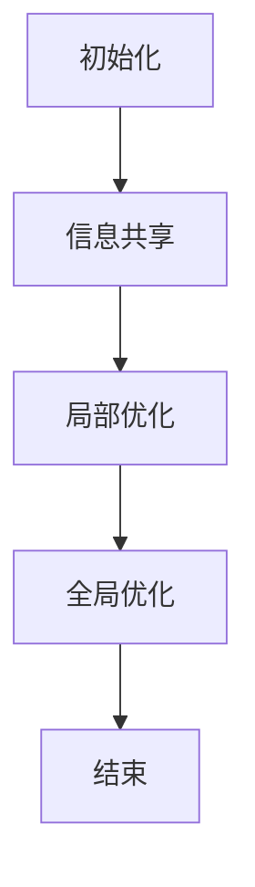
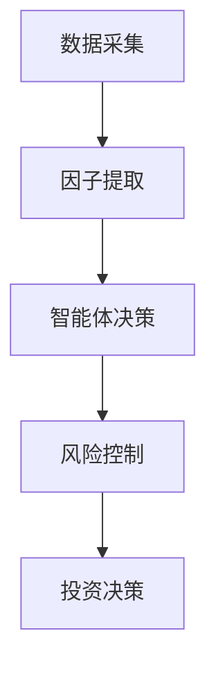
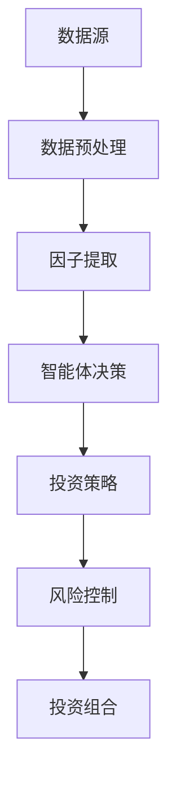

                 


---

# AI多智能体优化价值投资的动态风险因子暴露控制

> 关键词：AI多智能体，价值投资，动态风险因子，风险管理，投资优化

> 摘要：本文探讨如何利用AI多智能体技术优化价值投资中的动态风险因子暴露控制。通过分析多智能体系统的原理、动态风险因子的计算方法，结合实际案例，展示如何利用AI技术提升投资组合的风险管理能力，实现稳健的投资收益。

---

## 第1章：问题背景与价值投资概述

### 1.1 问题背景

在金融投资领域，风险管理是实现稳健收益的关键。传统投资方法依赖于经验丰富的分析师和复杂的数学模型，但面对市场波动和不确定性时，这些方法往往显得力不从心。近年来，人工智能技术的快速发展为金融投资带来了新的机遇，尤其是在风险管理领域。

#### 1.1.1 传统投资的风险管理挑战

传统的风险管理方法依赖于历史数据和统计模型，存在以下问题：

- **数据依赖性**：传统方法需要大量历史数据来训练模型，但在极端情况下（如金融危机）表现不佳。
- **模型假设**：假设市场数据符合特定分布（如正态分布），但在实际中，市场往往呈现“肥尾”特性，极端事件发生的概率远高于模型预测。
- **静态性**：传统模型通常假设风险因子在较长时期内保持稳定，难以捕捉市场环境的快速变化。

#### 1.1.2 价值投资的核心理念

价值投资强调通过分析企业的基本面，寻找被市场低估的投资标的。其核心理念包括：

- **长期视角**：关注企业的长期价值，而非短期价格波动。
- **安全边际**：确保买入价格低于内在价值，以降低投资风险。
- **分散投资**：通过投资多样化的资产类别或行业，降低特定风险。

#### 1.1.3 AI在金融投资中的应用潜力

AI技术在金融领域的应用已得到广泛认可，尤其是在以下方面：

- **数据处理**：AI能够快速处理大量非结构化数据（如新闻、社交媒体），提取情感指标，预测市场情绪。
- **模式识别**：通过深度学习模型识别复杂市场模式，发现传统方法难以察觉的投资机会。
- **实时监控**：AI系统可以实时监控市场动态，快速调整投资策略，应对突发事件。

---

### 1.2 动态风险因子的定义与重要性

#### 1.2.1 风险因子的基本概念

在金融学中，风险因子是用来解释资产回报率差异的关键因素。常见的风险因子包括：

- **市场因子（Market Factor）**：反映整体市场波动的风险。
- **规模因子（Size Factor）**：小盘股相对于大盘股的超额收益。
- **价值因子（Value Factor）**：低市盈率或低市净率股票相对于高市盈率或高市净率股票的超额收益。
- **动量因子（Momentum Factor）**：过去表现优异的资产未来继续表现优异的趋势。

#### 1.2.2 动态风险因子的特性

动态风险因子是指在不同市场环境下，风险因子的权重和影响程度会发生变化。例如，在市场上涨阶段，市场因子的权重可能更大；而在市场下跌阶段，市场因子的权重可能减小，而其他因子如流动性因子可能变得更为重要。

#### 1.2.3 风险因子在价值投资中的作用

在价值投资中，动态风险因子可以帮助投资者更好地识别投资组合中的风险来源，并根据市场变化进行动态调整。例如：

- **动态调整投资组合**：当市场环境变化时，调整投资组合中各资产的权重，降低高风险因子的暴露。
- **风险预警**：通过实时监控动态风险因子的变化，提前预警潜在风险，避免重大损失。

---

## 第2章：AI多智能体与动态风险因子的关联

### 2.1 AI多智能体的基本原理

#### 2.1.1 多智能体系统的特点

多智能体系统（Multi-Agent System，MAS）由多个相互作用的智能体组成，每个智能体都有自己的目标和决策机制。MAS的优势在于：

- **分布式计算**：每个智能体独立决策，减少单点故障风险。
- **协同合作**：通过智能体之间的协作，实现复杂任务的完成。
- **动态适应**：智能体能够根据环境变化调整行为，增强系统的灵活性。

#### 2.1.2 AI在多智能体中的应用

人工智能技术（如强化学习、深度学习）为多智能体系统的决策机制提供了强大的支持。例如：

- **强化学习**：通过奖励机制训练智能体，使其在与环境交互中学习最优策略。
- **深度学习**：利用神经网络模型处理复杂数据，提取高维特征，提高决策的准确性。

#### 2.1.3 多智能体在金融投资中的优势

在金融投资中，多智能体系统可以用于：

- **资产分配**：多个智能体分别负责不同资产类别或行业的投资决策，提高投资组合的分散化程度。
- **风险控制**：通过多个智能体实时监控市场动态，动态调整投资策略，降低投资组合的整体风险。
- **信息处理**：多个智能体协同工作，快速处理大量信息，捕捉市场机会。

---

### 2.2 动态风险因子的数学模型

#### 2.2.1 风险因子的量化方法

动态风险因子可以通过以下步骤进行量化：

1. **数据收集**：收集相关资产的历史回报数据，包括价格、成交量、财务指标等。
2. **因子提取**：利用统计方法（如主成分分析）或机器学习方法（如因子分解机）提取风险因子。
3. **动态调整**：根据市场环境的变化，动态调整因子的权重或影响程度。

#### 2.2.2 动态风险因子的计算公式

动态风险因子的计算模型可以表示为：

$$
R(t) = \sum_{i=1}^{n} w_i(t) \cdot F_i
$$

其中，\( R(t) \) 表示在时间 \( t \) 的风险因子，\( w_i(t) \) 表示第 \( i \) 个因子的权重，\( F_i \) 表示第 \( i \) 个因子的值。

权重 \( w_i(t) \) 可以根据市场环境的变化动态调整，例如：

$$
w_i(t) = \frac{1}{1 + \exp(-\alpha \cdot t)}
$$

其中，\( \alpha \) 是调节参数，\( t \) 是时间变量。

#### 2.2.3 风险因子与投资组合的关系

投资组合的风险可以表示为各风险因子的线性组合：

$$
\text{Portfolio Risk} = \sum_{i=1}^{n} w_i(t) \cdot F_i
$$

通过动态调整权重 \( w_i(t) \)，可以实现对投资组合风险的动态控制。

---

## 第3章：AI多智能体优化算法

### 3.1 算法概述

#### 3.1.1 多智能体优化算法的基本原理

多智能体优化算法是一种分布式优化方法，通过多个智能体协同工作，实现全局优化目标。其核心步骤包括：

1. **初始化**：设置智能体的初始状态和目标。
2. **信息共享**：智能体之间共享信息，协同决策。
3. **局部优化**：每个智能体根据共享信息，优化自身决策。
4. **全局优化**：通过多次迭代，逐步逼近全局最优解。

#### 3.1.2 算法的步骤与流程

以下是多智能体优化算法的流程图：



#### 3.1.3 算法的优缺点

- **优点**：分布式计算能力强，适用于复杂环境下的优化问题。
- **缺点**：需要较高的计算资源，且可能存在通信延迟。

---

### 3.2 算法实现

#### 3.2.1 算法的数学模型

多智能体优化算法的数学模型可以表示为：

$$
\min_{x_i} \sum_{i=1}^{n} f_i(x_i) \quad \text{subject to} \quad g(x) = 0
$$

其中，\( f_i(x_i) \) 是第 \( i \) 个智能体的优化目标，\( g(x) = 0 \) 是全局约束条件。

#### 3.2.2 算法的代码实现

以下是Python代码示例：

```python
import numpy as np

def multi_agent_optimization(n_agents, objective_func, constraints):
    agents = [Agent() for _ in range(n_agents)]
    while not all_agents_done(agents):
        for agent in agents:
            agent.share_info(agents)
            agent.optimize(objective_func, constraints)
    return get_optimal_solution(agents)

class Agent:
    def __init__(self):
        self.state = None
        self.done = False

    def share_info(self, agents):
        for agent in agents:
            if agent != self and not agent.done:
                self.state = agent.state

    def optimize(self, objective_func, constraints):
        # Implement optimization logic
        pass
```

#### 3.2.3 算法的优化与改进

为了提高多智能体优化算法的效率，可以采用以下优化措施：

- **分布式计算**：利用分布式计算框架（如Spark、Dask）加速计算。
- **异步更新**：允许智能体在不同时间点更新状态，减少同步等待时间。
- **自适应策略**：根据环境变化动态调整智能体的决策策略。

---

## 第4章：系统分析与架构设计

### 4.1 系统功能设计

#### 4.1.1 系统的功能模块划分

AI多智能体优化系统的功能模块包括：

- **数据采集模块**：收集市场数据（如股票价格、财务指标）。
- **因子提取模块**：提取动态风险因子。
- **智能体决策模块**：实现多智能体的协同决策。
- **风险控制模块**：根据动态风险因子调整投资策略。

#### 4.1.2 系统的功能流程图

以下是系统功能流程图：



#### 4.1.3 系统的功能描述

- **数据采集模块**：从多种数据源（如API、数据库）获取实时市场数据。
- **因子提取模块**：利用机器学习算法提取动态风险因子。
- **智能体决策模块**：实现多智能体的协同决策，优化投资组合。
- **风险控制模块**：根据动态风险因子调整投资策略，降低投资风险。

---

### 4.2 系统架构设计

#### 4.2.1 系统架构图

以下是系统架构图：



#### 4.2.2 系统架构的优缺点

- **优点**：模块化设计便于维护和扩展。
- **缺点**：需要较高的计算资源，可能存在数据同步问题。

---

## 第5章：项目实战

### 5.1 项目环境搭建

#### 5.1.1 开发工具的安装与配置

需要安装以下工具：

- **Python**：用于编程和数据分析。
- **NumPy** 和 **Pandas**：用于数据处理。
- **TensorFlow** 或 **PyTorch**：用于深度学习模型的训练。
- **Mermaid**：用于绘制图表。

#### 5.1.2 数据源的获取与处理

从公开数据源（如Yahoo Finance）获取股票数据，并进行清洗和预处理。

#### 5.1.3 系统的部署与测试

在本地或云环境中部署系统，并进行功能测试。

---

### 5.2 核心代码实现

#### 5.2.1 AI多智能体的代码实现

以下是Python代码示例：

```python
import numpy as np
import pandas as pd

class MultiAgentSystem:
    def __init__(self, n_agents):
        self.agents = [Agent() for _ in range(n_agents)]
        self.done = False

    def run(self):
        while not self.done:
            for agent in self.agents:
                agent.update_state()
                agent.make_decision()

class Agent:
    def __init__(self):
        self.state = None
        self.done = False

    def update_state(self):
        # Update agent's state based on market data
        pass

    def make_decision(self):
        # Make investment decision based on current state
        pass
```

#### 5.2.2 动态风险因子的代码实现

以下是Python代码示例：

```python
def calculate_dynamic_factor(data, window=30):
    # 计算动态度量因子
    returns = data.pct_change().dropna()
    factor = returns.rolling(window).mean()
    return factor
```

#### 5.2.3 系统的接口设计与实现

以下是API接口设计示例：

```python
from flask import Flask
import json

app = Flask(__name__)

@app.route('/get_factors', methods=['GET'])
def get_factors():
    # 获取因子数据
    data = pd.read_csv('factors.csv')
    return json.dumps(data.to_dict())

if __name__ == '__main__':
    app.run()
```

---

## 第6章：总结与最佳实践

### 6.1 系统总结

通过本文的探讨，我们了解了AI多智能体技术在价值投资中的应用潜力，尤其是在动态风险因子的优化与控制方面。通过多智能体系统的协同决策，可以实现投资组合的动态调整，降低投资风险，提高投资收益。

#### 6.1.1 系统的主要功能与特点

- **多智能体协同**：通过多个智能体协同工作，实现投资组合的优化。
- **动态风险控制**：根据市场环境变化，动态调整投资策略。

#### 6.1.2 系统的优缺点与改进方向

- **优点**：提高投资组合的风险控制能力，实现稳健投资收益。
- **缺点**：需要较高的计算资源，且可能存在智能体间的通信延迟。

---

### 6.2 最佳实践

#### 6.2.1 投资风险管理的注意事项

- **分散投资**：通过投资多样化资产类别或行业，降低特定风险。
- **动态调整**：根据市场环境变化，动态调整投资策略。

#### 6.2.2 AI多智能体优化的实践技巧

- **数据质量**：确保数据的准确性和完整性，避免因数据问题导致的决策错误。
- **模型选择**：根据具体问题选择合适的AI算法，避免盲目使用复杂模型。

---

### 6.3 拓展阅读

#### 6.3.1 相关领域的最新研究

- **强化学习在金融中的应用**：探索强化学习在金融投资中的最新研究进展。
- **多智能体系统优化**：研究多智能体系统的最新优化方法和应用案例。

#### 6.3.2 相关书籍与文献推荐

- **《算法化交易：数量方法和技术》**：介绍算法化交易的基本原理和实现方法。
- **《多智能体系统：理论与应用》**：系统介绍多智能体系统的理论基础和实际应用。

---

## 附录：数学公式与算法代码

### 附录A：数学公式

- 动态风险因子计算公式：
  $$ R(t) = \alpha \cdot R_{factor}(t) + \beta \cdot R_{market}(t) $$
  
- AI多智能体优化算法的损失函数：
  $$ L = \sum_{i=1}^{n} (y_i - \hat{y}_i)^2 $$

### 附录B：算法代码

以下是Python代码示例：

```python
import numpy as np
import pandas as pd

class MultiAgentSystem:
    def __init__(self, n_agents):
        self.agents = [Agent() for _ in range(n_agents)]
        self.done = False

    def run(self):
        while not self.done:
            for agent in self.agents:
                agent.update_state()
                agent.make_decision()

class Agent:
    def __init__(self):
        self.state = None
        self.done = False

    def update_state(self):
        # Update agent's state based on market data
        pass

    def make_decision(self):
        # Make investment decision based on current state
        pass
```

---

以上是《AI多智能体优化价值投资的动态风险因子暴露控制》的技术博客文章的完整内容。文章详细探讨了AI多智能体技术在金融投资中的应用，重点分析了动态风险因子的优化与控制方法，并通过实际案例展示了如何利用AI技术提升投资组合的风险管理能力。

