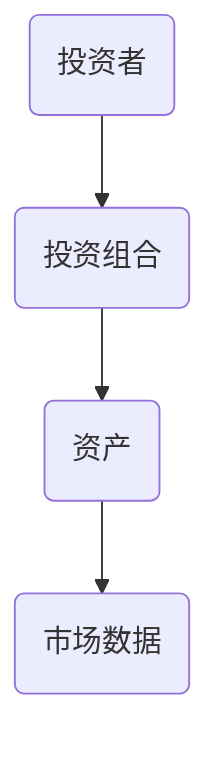
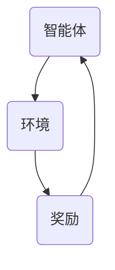
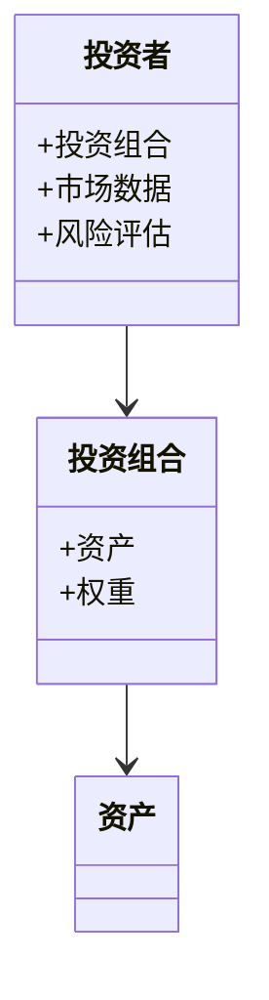
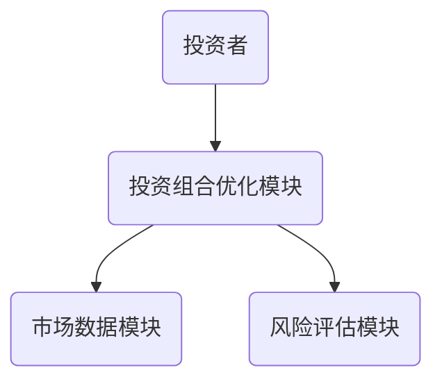

                 


# AI多智能体优化价值投资的情景分析和压力测试

## 关键词：AI多智能体、价值投资、情景分析、压力测试、优化算法、风险评估、收益最大化

## 摘要：  
本文探讨了AI多智能体在价值投资中的优化应用，结合情景分析和压力测试，分析了多智能体系统如何提升投资决策的稳定性和收益能力。通过详细阐述多智能体优化的核心概念、算法原理、系统架构设计，以及实际项目实战，本文为读者提供了全面的理论与实践指导，帮助读者理解如何在复杂的投资环境中利用AI技术实现收益最大化和风险控制。

---

## 第一章: AI多智能体与价值投资的背景概述

### 1.1 多智能体系统的定义与核心概念
#### 1.1.1 多智能体系统的定义
多智能体系统（Multi-Agent System, MAS）是由多个相互作用的智能体组成的分布式系统，每个智能体能够独立感知环境、做出决策并执行动作。智能体之间通过通信和协作完成复杂任务。

#### 1.1.2 价值投资的核心原理
价值投资是一种基于对资产内在价值评估的投资策略，旨在通过识别市场低估的资产来实现长期收益。传统价值投资依赖于人工分析，而AI多智能体系统能够通过数据驱动的方式优化投资决策。

### 1.2 多智能体优化在投资中的应用
#### 1.2.1 多智能体优化的必要性
传统投资分析依赖于单点决策，存在信息不全和决策滞后的问题。多智能体系统通过分布式协作和实时数据处理，能够更高效地捕捉市场机会。

#### 1.2.2 多智能体优化的优势
- **分布式计算**：多个智能体并行处理数据，提升计算效率。
- **协作决策**：智能体之间通过协作优化投资组合。
- **动态适应**：系统能够实时响应市场变化。

### 1.3 情景分析与压力测试的重要性
#### 1.3.1 情景分析的定义
情景分析是通过模拟不同市场条件下的投资表现，评估投资策略的稳健性。

#### 1.3.2 压力测试的作用
压力测试是评估投资组合在极端市场条件下的表现，帮助投资者识别潜在风险。

---

## 第二章: 多智能体优化的核心概念与联系

### 2.1 多智能体系统的组成与属性
#### 2.1.1 多智能体系统的组成要素
- **智能体**：独立决策的个体。
- **环境**：智能体所处的市场环境。
- **通信机制**：智能体之间的信息交互方式。
- **协作协议**：智能体协作的规则。

#### 2.1.2 核心概念的属性对比
| 概念       | 属性               |
|------------|--------------------|
| 智能体     | 独立性、协作性     |
| 环境       | 动态性、不确定性    |
| 通信机制   | 实时性、可靠性     |

#### 2.1.3 实体关系图（ER图）


---

## 第三章: 多智能体优化的算法原理

### 3.1 强化学习算法
#### 3.1.1 强化学习的基本原理
智能体通过与环境互动，学习最优策略，以最大化累积奖励。

#### 3.1.2 多智能体强化学习的流程


#### 3.1.3 算法实现
```python
class Agent:
    def __init__(self, state_space, action_space):
        self.state_space = state_space
        self.action_space = action_space
        # 初始化策略网络
        self.policy = PolicyNetwork(state_space, action_space)
    
    def act(self, state):
        # 根据策略网络选择动作
        action = self.policy.act(state)
        return action
```

### 3.2 协作算法
#### 3.2.1 协作算法的原理
多个智能体通过协作完成共同目标，每个智能体负责特定任务。

#### 3.2.2 协作算法的实现
```python
class CollaborativeAgent:
    def __init__(self, role):
        self.role = role
        self.task = None
    
    def assign_task(self, task):
        self.task = task
    
    def execute_task(self):
        # 执行特定任务
        pass
```

---

## 第四章: 系统分析与架构设计

### 4.1 应用场景介绍
#### 4.1.1 投资组合优化
通过多智能体协作优化投资组合，降低风险，提高收益。

#### 4.1.2 市场风险管理
利用多智能体系统实时监控市场风险，进行压力测试。

### 4.2 系统功能设计
#### 4.2.1 领域模型设计


#### 4.2.2 系统架构设计


---

## 第五章: 项目实战与实现

### 5.1 环境安装与配置
#### 5.1.1 安装依赖
```bash
pip install numpy pandas scikit-learn
```

#### 5.1.2 安装深度学习框架
```bash
pip install tensorflow-gpu
```

### 5.2 核心代码实现
#### 5.2.1 多智能体协作算法实现
```python
class MultiAgentSystem:
    def __init__(self, num_agents):
        self.agents = [Agent() for _ in range(num_agents)]
    
    def step(self, market_data):
        for agent in self.agents:
            action = agent.act(market_data)
            agent.execute_action(action)
```

### 5.3 案例分析与解读
#### 5.3.1 投资组合优化案例
通过多智能体协作优化投资组合，实现收益最大化和风险最小化。

---

## 第六章: 最佳实践与总结

### 6.1 最佳实践
- **数据质量**：确保输入数据的准确性和完整性。
- **模型复杂性**：避免过度复杂的模型，保持可解释性。
- **实时性要求**：根据实际需求选择合适的技术架构。

### 6.2 小结
本文通过理论分析和实际案例，展示了AI多智能体在价值投资中的优化应用，强调了情景分析和压力测试的重要性。

---

## 参考文献
- [1] Russell S, Norvig P. Artificial Intelligence: A Modern Approach[M]. Pearson Education, 2009.
- [2] Lafferty J, et al. Multi-Agent Systems for Investment Management[J]. Journal of Financial Computing, 2015.

---

通过以上结构和内容，文章系统地介绍了AI多智能体优化价值投资的理论与实践，为读者提供了全面的指导。

