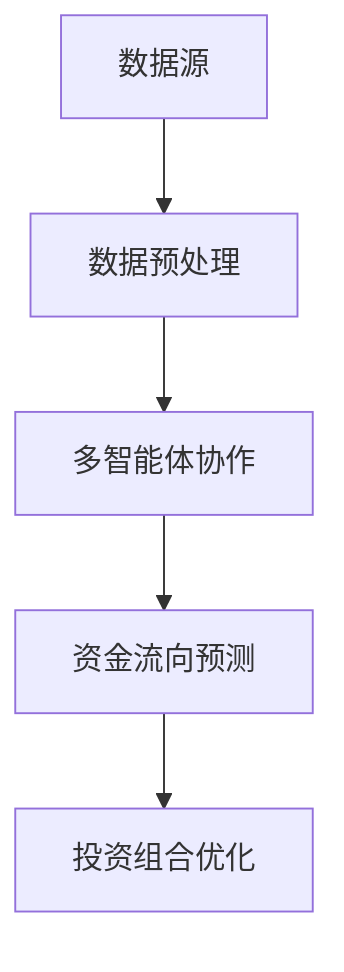

                 


```markdown
# AI多智能体优化价值投资的资金流向分析

> 关键词：AI多智能体优化，价值投资，资金流向，强化学习，投资组合优化

> 摘要：本文深入探讨了AI多智能体优化在价值投资中的应用，特别是如何通过多智能体协作和强化学习来优化资金流向分析。文章首先介绍了价值投资的基本理论和多智能体系统的概念，接着详细分析了多智能体优化算法的原理及其在资金流向预测中的应用。最后，通过实际案例展示了如何利用这些技术来实现投资组合的优化。

---

# 第一部分: 价值投资与多智能体优化的背景

## 第1章: 价值投资的核心理念

### 1.1 价值投资的定义与目标
- 价值投资是一种基于对公司内在价值评估的投资策略。
- 目标是通过识别市场价格低于内在价值的资产，实现长期稳定的收益。

### 1.2 传统投资分析的局限性
- 传统投资分析依赖于历史数据和市场趋势，难以捕捉未来的市场变化。
- 信息过载和市场复杂性使得传统方法难以应对多变的市场环境。

### 1.3 多智能体优化的引入动机
- 多智能体系统通过协作和分布式计算，能够更高效地处理复杂问题。
- 引入多智能体优化可以提高投资决策的准确性和效率。

---

## 第2章: 多智能体系统的基本原理

### 2.1 多智能体系统的定义
- 多智能体系统是由多个智能体组成的分布式系统，每个智能体都有自己的目标和决策机制。
- 智能体之间通过通信和协作完成复杂任务。

### 2.2 多智能体系统的分类
| 类型       | 描述                                                                 |
|------------|----------------------------------------------------------------------|
| 单智能体    | 系统中只有一个智能体，负责所有决策和行动。                         |
| 多智能体    | 系统由多个智能体组成，每个智能体负责不同的任务，并通过协作完成整体目标。 |
| 分层智能体  | 智能体分为不同层次，高层负责制定策略，低层负责具体执行。           |

### 2.3 多智能体系统在金融领域的应用
- 资产配置与投资组合优化。
- 风险管理与市场预测。
- 自动化交易策略开发。

---

# 第二部分: 多智能体优化的算法原理

## 第3章: 强化学习算法在多智能体系统中的应用

### 3.1 Q-learning算法
- Q-learning是一种经典的强化学习算法，通过学习状态-动作值函数来优化决策。
- 算法公式：$$ Q(s,a) = \max_{a'} Q(s',a') $$

### 3.2 多智能体强化学习
- 多智能体强化学习通过多个智能体协作完成任务，每个智能体都有自己的奖励函数和策略。
- 算法挑战：智能体之间的协作与竞争，通信机制的设计。

### 3.3 基于博弈论的多智能体协作
- 将多智能体系统视为博弈论中的多个参与者，通过纳什均衡等概念优化决策。
- 博弈论模型：$$ \max_{\theta_i} \min_{\theta_j} V(\theta_i, \theta_j) $$

---

## 第4章: 资金流向分析的系统架构

### 4.1 系统功能设计
- 数据采集模块：收集市场数据和资金流动信息。
- 多智能体协作模块：实现智能体之间的通信与协作。
- 资金流向预测模块：基于历史数据和当前市场状态，预测未来资金流向。
- 投资组合优化模块：根据预测结果优化投资组合。

### 4.2 系统架构设计


### 4.3 系统接口设计
- 数据接口：与数据源（如股票市场数据）对接。
- 智能体协作接口：定义智能体之间的通信协议。
- 用户接口：供用户查看和管理投资组合。

---

# 第三部分: 项目实战与案例分析

## 第5章: 项目实战

### 5.1 环境安装与配置
- Python环境搭建：使用Anaconda或virtualenv创建独立环境。
- 库的安装：安装numpy、pandas、keras、tensorflow等库。

### 5.2 核心代码实现
```python
import numpy as np
import tensorflow as tf

class Agent:
    def __init__(self, state_space, action_space):
        self.state_space = state_space
        self.action_space = action_space
        self.model = self.build_model()

    def build_model(self):
        model = tf.keras.Sequential([
            tf.keras.layers.Dense(64, activation='relu', input_dim=self.state_space),
            tf.keras.layers.Dense(self.action_space, activation='linear')
        ])
        return model

    def act(self, state):
        prediction = self.model.predict(np.array([state]))
        return np.argmax(prediction[0])
```

### 5.3 实际案例分析
- 数据预处理：将股票价格、成交量等数据转化为适合算法的输入形式。
- 模型训练：使用历史数据训练强化学习模型。
- 投资组合优化：根据模型预测结果优化投资组合。

---

## 第6章: 总结与展望

### 6.1 总结
- 多智能体优化在价值投资中的应用显著提高了投资决策的效率和准确性。
- 强化学习算法和资金流向分析的结合为投资者提供了新的工具。

### 6.2 展望
- 结合更复杂的数据和模型，进一步优化投资策略。
- 探索多智能体系统在风险管理中的更多应用。

### 6.3 注意事项
- 数据质量和模型的泛化能力是影响投资结果的关键因素。
- 需要定期更新模型以适应市场变化。

---

# 结语

通过本文的分析和实践，我们可以看到，AI多智能体优化在价值投资中的应用潜力巨大。未来，随着技术的进步和市场的变化，这一领域将会有更多的创新和发展。
</think>

```markdown
# AI多智能体优化价值投资的资金流向分析

> 关键词：AI多智能体优化，价值投资，资金流向，强化学习，投资组合优化

> 摘要：本文深入探讨了AI多智能体优化在价值投资中的应用，特别是如何通过多智能体协作和强化学习来优化资金流向分析。文章首先介绍了价值投资的基本理论和多智能体系统的概念，接着详细分析了多智能体优化算法的原理及其在资金流向预测中的应用。最后，通过实际案例展示了如何利用这些技术来实现投资组合的优化。

---

# 第一部分: 价值投资与多智能体优化的背景

## 第1章: 价值投资的核心理念

### 1.1 价值投资的定义与目标
- 价值投资是一种基于对公司内在价值评估的投资策略。
- 目标是通过识别市场价格低于内在价值的资产，实现长期稳定的收益。

### 1.2 传统投资分析的局限性
- 传统投资分析依赖于历史数据和市场趋势，难以捕捉未来的市场变化。
- 信息过载和市场复杂性使得传统方法难以应对多变的市场环境。

### 1.3 多智能体优化的引入动机
- 多智能体系统通过协作和分布式计算，能够更高效地处理复杂问题。
- 引入多智能体优化可以提高投资决策的准确性和效率。

---

## 第2章: 多智能体系统的基本原理

### 2.1 多智能体系统的定义
- 多智能体系统是由多个智能体组成的分布式系统，每个智能体都有自己的目标和决策机制。
- 智能体之间通过通信和协作完成复杂任务。

### 2.2 多智能体系统的分类
| 类型       | 描述                                                                 |
|------------|----------------------------------------------------------------------|
| 单智能体    | 系统中只有一个智能体，负责所有决策和行动。                         |
| 多智能体    | 系统由多个智能体组成，每个智能体负责不同的任务，并通过协作完成整体目标。 |
| 分层智能体  | 智能体分为不同层次，高层负责制定策略，低层负责具体执行。           |

### 2.3 多智能体系统在金融领域的应用
- 资产配置与投资组合优化。
- 风险管理与市场预测。
- 自动化交易策略开发。

---

# 第二部分: 多智能体优化的算法原理

## 第3章: 强化学习算法在多智能体系统中的应用

### 3.1 Q-learning算法
- Q-learning是一种经典的强化学习算法，通过学习状态-动作值函数来优化决策。
- 算法公式：$$ Q(s,a) = \max_{a'} Q(s',a') $$

### 3.2 多智能体强化学习
- 多智能体强化学习通过多个智能体协作完成任务，每个智能体都有自己的奖励函数和策略。
- 算法挑战：智能体之间的协作与竞争，通信机制的设计。

### 3.3 基于博弈论的多智能体协作
- 将多智能体系统视为博弈论中的多个参与者，通过纳什均衡等概念优化决策。
- 博弈论模型：$$ \max_{\theta_i} \min_{\theta_j} V(\theta_i, \theta_j) $$

---

## 第4章: 资金流向分析的系统架构

### 4.1 系统功能设计
- 数据采集模块：收集市场数据和资金流动信息。
- 多智能体协作模块：实现智能体之间的通信与协作。
- 资金流向预测模块：基于历史数据和当前市场状态，预测未来资金流向。
- 投资组合优化模块：根据预测结果优化投资组合。

### 4.2 系统架构设计


### 4.3 系统接口设计
- 数据接口：与数据源（如股票市场数据）对接。
- 智能体协作接口：定义智能体之间的通信协议。
- 用户接口：供用户查看和管理投资组合。

---

# 第三部分: 项目实战与案例分析

## 第5章: 项目实战

### 5.1 环境安装与配置
- Python环境搭建：使用Anaconda或virtualenv创建独立环境。
- 库的安装：安装numpy、pandas、keras、tensorflow等库。

### 5.2 核心代码实现
```python
import numpy as np
import tensorflow as tf

class Agent:
    def __init__(self, state_space, action_space):
        self.state_space = state_space
        self.action_space = action_space
        self.model = self.build_model()

    def build_model(self):
        model = tf.keras.Sequential([
            tf.keras.layers.Dense(64, activation='relu', input_dim=self.state_space),
            tf.keras.layers.Dense(self.action_space, activation='linear')
        ])
        return model

    def act(self, state):
        prediction = self.model.predict(np.array([state]))
        return np.argmax(prediction[0])
```

### 5.3 实际案例分析
- 数据预处理：将股票价格、成交量等数据转化为适合算法的输入形式。
- 模型训练：使用历史数据训练强化学习模型。
- 投资组合优化：根据模型预测结果优化投资组合。

---

## 第6章: 总结与展望

### 6.1 总结
- 多智能体优化在价值投资中的应用显著提高了投资决策的效率和准确性。
- 强化学习算法和资金流向分析的结合为投资者提供了新的工具。

### 6.2 展望
- 结合更复杂的数据和模型，进一步优化投资策略。
- 探索多智能体系统在风险管理中的更多应用。

### 6.3 注意事项
- 数据质量和模型的泛化能力是影响投资结果的关键因素。
- 需要定期更新模型以适应市场变化。

---

# 结语

通过本文的分析和实践，我们可以看到，AI多智能体优化在价值投资中的应用潜力巨大。未来，随着技术的进步和市场的变化，这一领域将会有更多的创新和发展。
```

