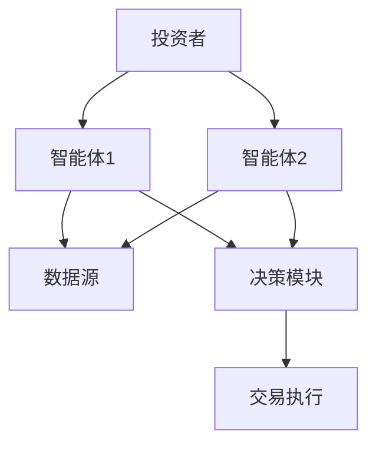

                 


# AI多智能体如何优化价值投资的长期股东回报策略

> 关键词：AI多智能体，价值投资，股东回报，长期策略，强化学习，风险管理，系统架构

> 摘要：  
本文探讨了如何利用AI多智能体技术优化价值投资的长期股东回报策略。通过分析价值投资的核心概念、多智能体系统的原理及其在金融领域的应用，结合强化学习算法和系统架构设计，提出了一种基于AI多智能体的优化策略。文章从理论基础到实际应用，详细阐述了如何通过技术手段提升投资决策的效率和准确性，为投资者和研究人员提供了新的视角和实践指导。

---

## 第1章 价值投资与多智能体概述

### 1.1 价值投资的核心概念

#### 1.1.1 价值投资的定义与特点
- **定义**：价值投资是一种以内在价值为导向的投资策略，强调以低于内在价值的价格买入优质资产。
- **特点**：注重基本面分析、长期持有、逆向思维、安全边际。
- **核心要素**：公司基本面分析、估值方法、市场情绪分析。

#### 1.1.2 价值投资的理论基础
- **格雷厄姆投资理念**：安全边际、margin of safety。
- **巴菲特的投资策略**：寻找具有持续竞争优势的企业。
- **现代金融理论**：CAPM、APT等模型对投资决策的影响。

#### 1.1.3 价值投资在现代金融中的应用
- **传统方法**：基本面分析、财务指标（如PE、PB、ROE）。
- **现代方法**：大数据分析、机器学习辅助决策。

---

### 1.2 多智能体系统的基本概念

#### 1.2.1 多智能体系统的定义
- **多智能体系统（Multi-Agent System, MAS）**：由多个相互作用的智能体组成的系统，每个智能体都能感知环境、自主决策并协同完成任务。
- **智能体特征**：自主性、反应性、主动性、社会性。

#### 1.2.2 多智能体系统的类型与特点
- **集中式与分布式系统**：集中式MAS由中央控制器协调，分布式MAS去中心化。
- **协同与竞争关系**：智能体之间可以是协同的（共同完成任务）或竞争的（博弈环境）。

#### 1.2.3 多智能体系统在金融领域的潜力
- **优势**：分布式决策、并行处理、风险分散。
- **应用场景**：股票交易、资产配置、风险管理。

---

### 1.3 AI在价值投资中的应用前景

#### 1.3.1 AI在金融分析中的优势
- **数据处理能力**：快速处理海量数据，发现非 obvious 模式。
- **预测能力**：基于历史数据预测未来趋势。
- **自动化决策**：实时分析市场动态，优化投资组合。

#### 1.3.2 多智能体在投资决策中的作用
- **分布式决策**：多个智能体分别负责不同的市场分析任务。
- **协同优化**：通过智能体间的协作，实现全局最优的投资策略。
- **风险管理**：通过多智能体的协同，实时监控和分散风险。

#### 1.3.3 价值投资与AI结合的创新点
- **动态调整**：根据市场变化实时优化投资组合。
- **多维度分析**：结合技术分析、基本面分析、情绪分析。
- **降低人为干扰**：减少投资者情绪对决策的影响。

---

## 第2章 多智能体系统的核心原理

### 2.1 多智能体系统的组成与结构

#### 2.1.1 多智能体系统的组成要素
- **智能体**：具有感知、决策、行动能力的个体。
- **环境**：智能体所处的外部世界，提供输入和反馈。
- **通信机制**：智能体之间的信息交换方式。
- **任务目标**：系统需要完成的具体任务。

#### 2.1.2 多智能体系统的通信机制
- **直接通信**：智能体之间直接交换信息。
- **间接通信**：通过中间媒介（如共享数据库）进行信息传递。
- **协议与接口**：定义智能体间通信的规则和格式。

#### 2.1.3 多智能体系统的协同策略
- **分布式决策**：每个智能体独立决策，通过通信达成一致。
- **集中式协调**：由中央控制器分配任务和协调行动。
- **混合式协同**：结合分布式与集中式的优势。

---

### 2.2 多智能体系统的分类与选择

#### 2.2.1 多智能体系统的类型
- **简单反射型智能体**：基于当前输入做出反应。
- **基于模型的智能体**：利用内部模型进行规划和决策。
- **实用推理型智能体**：基于效用函数优化决策。
- **学习型智能体**：通过经验改进性能。

#### 2.2.2 多智能体系统的类型选择
- **任务复杂度**：简单任务适合简单智能体，复杂任务需要学习型智能体。
- **决策速度**：实时决策需要高效的通信和计算能力。
- **系统规模**：大规模系统需要分布式架构。

---

### 2.3 多智能体系统的优化算法

#### 2.3.1 基于强化学习的优化算法
- **定义**：通过试错和奖励机制优化决策策略。
- **核心算法**：Q-learning、Deep Q-Network (DQN)。
- **在投资中的应用**：智能体通过学习市场动态优化交易策略。

#### 2.3.2 基于博弈论的优化策略
- **纳什均衡**：所有智能体的策略在均衡状态下无法单方面改变以提高自身收益。
- **应用**：模拟市场中的多方博弈，优化投资组合。

#### 2.3.3 分布式优化算法的实现
- **分布式计算**：利用多智能体的分布式计算能力。
- **并行优化**：多个智能体同时优化不同部分，提升整体效率。

---

## 第3章 价值投资策略的AI优化

### 3.1 价值投资的AI分析框架

#### 3.1.1 数据收集与特征提取
- **数据源**：市场数据（价格、成交量）、公司财报、新闻舆情。
- **特征提取**：从数据中提取有用的特征，如市盈率、市净率、情绪指数。

#### 3.1.2 AI模型的构建与训练
- **模型选择**：根据任务选择合适的模型（如回归、分类）。
- **训练数据**：使用历史数据训练模型，预测未来价值。
- **验证与评估**：通过回测检验模型的准确性和稳定性。

---

### 3.2 基于多智能体的价值投资策略

#### 3.2.1 多智能体在投资决策中的角色分配
- **角色分配**：每个智能体负责不同的任务，如市场分析、风险评估。
- **协同优化**：通过智能体间的协作，实现投资组合的最优配置。

#### 3.2.2 多智能体协同优化的具体实现
- **通信协议**：智能体间通过特定协议交换信息。
- **协同机制**：通过协调算法实现全局优化。

---

### 3.3 价值投资中的风险管理

#### 3.3.1 风险评估的AI方法
- **风险模型**：利用AI技术建立风险评估模型。
- **实时监控**：通过智能体实时监控市场风险。

#### 3.3.2 多智能体系统的风险分散策略
- **资产配置**：通过多智能体优化资产配置，分散投资风险。
- **止损机制**：设定止损点，避免重大损失。

---

## 第4章 强化学习在投资策略优化中的应用

### 4.1 强化学习的基本原理

#### 4.1.1 强化学习的定义与特点
- **定义**：通过试错和奖励机制优化决策策略。
- **特点**：数据驱动、在线学习、适用于动态环境。

---

### 4.2 基于强化学习的投资策略优化

#### 4.2.1 强化学习在投资决策中的应用
- **状态空间**：市场环境、资产价格、持有资产等。
- **动作空间**：买入、卖出、持有等操作。
- **奖励函数**：基于投资收益和风险的综合评估。

---

### 4.3 强化学习的数学模型与算法实现

#### 4.3.1 强化学习的数学公式推导
- **Q-learning公式**：
  $$ Q(s, a) = Q(s, a) + \alpha [r + \max_{a'} Q(s', a') - Q(s, a)] $$
- **Deep Q-Network (DQN)**：使用深度神经网络近似Q值函数。

---

### 4.4 本章小结
通过强化学习算法，我们可以实现投资策略的动态优化，提升投资回报。

---

## 第5章 价值投资策略的系统架构设计

### 5.1 系统功能设计

#### 5.1.1 系统模块划分
- **数据采集模块**：收集市场数据、公司财报等。
- **特征提取模块**：从数据中提取有用特征。
- **智能体决策模块**：基于强化学习算法优化投资策略。

---

### 5.2 系统架构设计

#### 5.2.1 系统架构图


---

### 5.3 系统接口设计

#### 5.3.1 智能体间接口
- **输入接口**：接收市场数据和指令。
- **输出接口**：发送决策指令和反馈信息。

---

## 第6章 项目实战：基于AI多智能体的价值投资策略实现

### 6.1 环境安装与配置
- **工具安装**：Python、TensorFlow、Keras、pandas、numpy。
- **数据源**：获取历史股价、财务数据等。

---

### 6.2 核心代码实现

#### 6.2.1 数据预处理
```python
import pandas as pd
import numpy as np

# 读取数据
df = pd.read_csv('stock_data.csv')

# 数据清洗
df = df.dropna()
df = df.sort_values('date')
```

#### 6.2.2 强化学习模型实现
```python
import tensorflow as tf
from tensorflow.keras import layers

# 定义DQN网络
class DQN(tf.keras.Model):
    def __init__(self, state_size, action_size):
        super(DQN, self).__init__()
        self.state_size = state_size
        self.action_size = action_size
        self.dense1 = layers.Dense(32, activation='relu')
        self.dense2 = layers.Dense(action_size)
    
    def call(self, state):
        x = self.dense1(state)
        x = self.dense2(x)
        return x
```

---

### 6.3 案例分析与结果展示
- **案例**：训练智能体在特定市场环境下的投资策略。
- **结果**：展示投资回报率、风险指标等。

---

## 第7章 总结与展望

### 7.1 本章总结
- **总结**：AI多智能体技术在价值投资中的应用前景广阔，能够显著提升投资效率和回报率。

### 7.2 未来展望
- **技术改进**：优化强化学习算法，提升模型的泛化能力。
- **应用场景扩展**：探索多智能体在更多金融领域的应用。

---

## 关键词提示与最佳实践

### Tips
- **风险管理**：在实际投资中，需结合多智能体系统的动态调整能力，实时监控和分散风险。
- **数据质量**：确保数据的准确性和完整性，避免因数据问题导致模型失效。
- **算法优化**：根据实际效果不断调优算法参数，提升投资策略的收益和稳定性。

---

## 结语
通过本文的分析与实践，我们可以看到AI多智能体技术在优化价值投资策略中的巨大潜力。未来，随着技术的进步和金融市场的不断发展，AI多智能体将在投资领域发挥越来越重要的作用。

