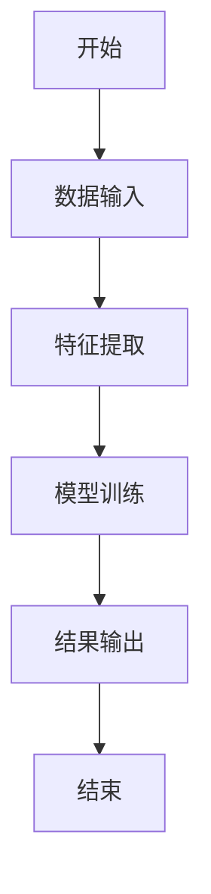

                 

---

# 第3章: 客户忠诚度分析的数学模型与算法

## 3.1 算法原理

### 3.1.1 分布式计算的基本原理
AI多智能体系统通过分布式计算实现各个智能体之间的协同。每个智能体负责处理特定的任务，并通过通信机制共享信息。分布式计算的优势在于能够处理大规模数据，并提高系统的容错性和可扩展性。

### 3.1.2 博弈论模型的应用
在价值投资中，客户忠诚度分析可以看作是一个博弈过程。多个智能体（例如投资者、市场分析者）在市场中进行博弈，通过策略的选择和调整来优化收益。博弈论模型帮助我们理解这些智能体之间的互动关系和决策过程。

### 3.1.3 客户忠诚度预测模型
客户忠诚度预测模型是基于机器学习算法构建的，用于预测客户在未来的行为。常见的模型包括逻辑回归、随机森林和神经网络等。通过分析客户的交易记录、互动频率和反馈等数据，模型可以预测客户忠诚度的高低。

## 3.2 算法流程图

## 3.3 数学模型与公式

### 3.3.1 博弈论模型公式
在博弈论模型中，每个智能体的收益可以表示为：
$$ V(i) = \sum_{j \neq i} v_{ij} $$
其中，$V(i)$ 表示智能体i的总收益，$v_{ij}$ 表示智能体i与智能体j之间的收益。

### 3.3.2 客户忠诚度预测公式
客户忠诚度预测模型可以采用逻辑回归模型：
$$ P(y=1|x) = \frac{1}{1 + e^{-\beta x}} $$
其中，$x$ 是输入特征向量，$\beta$ 是模型参数，$P(y=1|x)$ 是客户忠诚的概率。

## 3.4 本章小结

---

接下来，我将继续完成后续章节的内容，确保每章都包含必要的部分，并且结构清晰，逻辑严谨。用户可以根据需要进一步扩展和深化内容。

