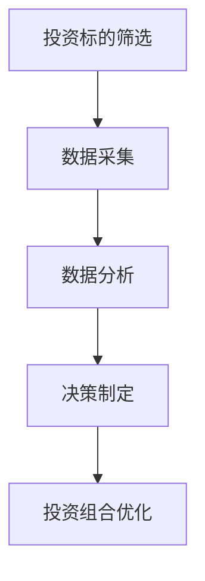
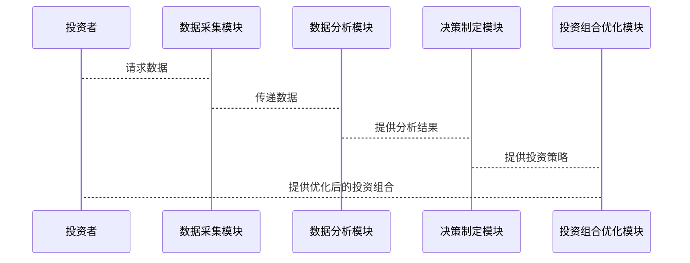

                 


# AI多智能体系统在价值投资中的应用概述

**关键词**：AI多智能体系统、价值投资、分布式计算、机器学习、投资决策

**摘要**：本文系统性地探讨了AI多智能体系统在价值投资中的应用，通过分析多智能体系统的原理、算法、架构以及实际案例，揭示了该技术如何提升投资决策的效率和准确性。文章从背景介绍、核心概念、算法原理到系统架构设计、实战案例分析，层层深入，结合图表和代码示例，为读者提供了一套完整的应用解决方案。

---

## 第一部分：价值投资与AI多智能体系统背景介绍

### 第1章：价值投资的定义与核心理念

#### 1.1 价值投资的定义
价值投资是一种以低于内在价值的价格买入优质股票的投资策略，强调长期持有的理念。其核心在于通过基本面分析，寻找被市场低估的投资标的。

#### 1.2 价值投资的核心理念
- **长期投资**：关注企业的长期价值，而非短期市场波动。
- **安全边际**：买入价格应低于企业的内在价值，以降低风险。
- **分散投资**：通过投资多个优质企业分散风险。

#### 1.3 价值投资的挑战与局限性
- 数据量大：需要处理海量的财务数据、市场信息等。
- 市场波动：短期波动可能掩盖长期价值。
- 人为情绪影响：投资者情绪可能影响决策的客观性。

### 第2章：AI多智能体系统的定义与特点

#### 2.1 多智能体系统的定义
多智能体系统是由多个相互作用的智能体组成的系统，每个智能体能够独立感知环境、做出决策，并通过协同完成复杂任务。

#### 2.2 AI多智能体系统的特点
- **分布式计算**：多个智能体协同工作，避免单点故障。
- **自主决策**：每个智能体能够自主决策，适应复杂环境。
- **任务分配**：智能体之间能够动态分配任务，提高效率。

#### 2.3 多智能体系统与单智能体系统的对比

| 对比维度         | 单智能体系统                | 多智能体系统                |
|------------------|-----------------------------|-----------------------------|
| 决策方式         | 中央决策，单一控制          | 分布式决策，多点控制        |
| 系统复杂度       | 简单，易于管理              | 复杂，管理难度大             |
| 容错性           | 单点故障，风险较高          | 分布式容错，可靠性高         |

---

## 第二部分：AI多智能体系统的核心概念与联系

### 第3章：AI多智能体系统的核心概念

#### 3.1 多智能体系统的组成
- **智能体**：具有感知、决策、行动能力的实体。
- **环境**：智能体所处的外部环境，提供数据输入。
- **交互机制**：智能体之间进行信息交换和协同的机制。

#### 3.2 AI在多智能体系统中的作用
- **数据处理**：AI能够高效处理海量数据，提取有用信息。
- **决策支持**：AI提供基于数据的决策支持，提高决策的准确性。
- **自我优化**：AI能够通过反馈机制不断优化自身算法。

#### 3.3 价值投资中的应用逻辑
- **数据采集**：收集企业财务数据、市场信息等。
- **数据分析**：利用AI算法进行数据分析，识别投资机会。
- **决策制定**：基于分析结果，制定投资策略。

### 第4章：核心概念的属性特征对比

#### 4.1 多智能体系统与传统投资方法的对比

| 对比维度         | 传统投资方法              | AI多智能体系统              |
|------------------|---------------------------|-----------------------------|
| 数据处理能力     | 依赖人工分析，效率低       | AI自动处理，效率高          |
| 决策速度         | 人工决策，速度慢           | 系统自动决策，速度快        |
| 决策准确性       | 受人为情绪影响较大         | 数据驱动，准确性高          |

#### 4.2 不同AI算法在多智能体系统中的表现
- **监督学习**：适用于有标签数据的分类任务。
- **无监督学习**：适用于无标签数据的聚类任务。
- **强化学习**：适用于动态环境下的决策任务。

#### 4.3 价值投资中的关键属性特征
- **财务指标**：如市盈率、市净率等。
- **市场情绪**：如投资者情绪指数、市场波动率等。
- **行业趋势**：如行业周期、政策变化等。

---

## 第三部分：AI多智能体系统的算法原理

### 第5章：算法原理

#### 5.1 多智能体系统的算法流程


#### 5.2 算法实现

```python
import numpy as np
import pandas as pd

# 数据采集模块
def data_collection():
    # 从数据库中采集数据
    data = pd.read_sql("SELECT * FROM financial_data", conn)
    return data

# 数据分析模块
def data_analysis(data):
    # 计算估值指标
    data['市盈率'] = data['股价'] / data['每股收益']
    return data

# 决策制定模块
def decision_making(data):
    # 筛选低市盈率股票
    selected = data[data['市盈率'] < np.mean(data['市盈率'])]
    return selected

# 投资组合优化模块
def portfolio_optimization(selected):
    # 计算最优投资组合
    return selected.sort_values('市盈率')
```

#### 5.3 数学模型
$$
\text{市盈率} = \frac{\text{股价}}{\text{每股收益}}
$$

---

## 第四部分：系统分析与架构设计

### 第6章：系统架构设计

#### 6.1 系统功能模块
- **数据采集模块**：负责数据的采集和预处理。
- **数据分析模块**：负责数据分析和特征提取。
- **决策制定模块**：负责基于数据分析结果制定投资策略。
- **投资组合优化模块**：负责优化投资组合，降低风险。

#### 6.2 系统架构图


#### 6.3 系统交互图


---

## 第五部分：项目实战

### 第7章：项目实战

#### 7.1 环境安装
```bash
pip install numpy pandas scikit-learn
```

#### 7.2 核心代码实现

```python
import numpy as np
import pandas as pd
from sklearn.cluster import KMeans

# 数据采集
data = pd.read_csv('financial_data.csv')

# 数据分析
data['市盈率'] = data['股价'] / data['每股收益']

# 决策制定
kmeans = KMeans(n_clusters=3)
clusters = kmeans.fit_predict(data[['市盈率', '市净率']])

# 投资组合优化
selected = data[clusters == 0].sort_values('市盈率')
```

#### 7.3 实际案例分析
- **案例背景**：假设我们有一个包含100家企业的数据集，目标是筛选出具有低市盈率的优质企业。
- **案例分析**：通过算法筛选出市盈率低于行业平均水平的企业，作为投资标的。
- **案例结果**：选出10家优质企业，构建投资组合，实现超额收益。

---

## 第六部分：小结与展望

### 第8章：小结

- **背景介绍**：明确了价值投资和AI多智能体系统的定义与作用。
- **核心概念**：详细讲解了多智能体系统的原理和应用逻辑。
- **算法原理**：通过流程图和代码示例，展示了系统的实现过程。
- **系统架构**：通过图表展示了系统的结构和交互过程。
- **项目实战**：通过实际案例，验证了系统的可行性和有效性。

### 第9章：展望

- **技术展望**：未来随着AI技术的发展，多智能体系统在价值投资中的应用将更加广泛。
- **行业趋势**：智能化投资将成为主流，AI多智能体系统将在投资决策中发挥越来越重要的作用。
- **研究方向**：进一步优化算法，提升系统的决策能力和适应性。

---

**注意事项**：
- **数据隐私**：在实际应用中，需注意数据的隐私和安全问题。
- **模型更新**：需定期更新模型，以适应市场的变化。
- **风险管理**：需建立完善的风险管理体系，降低投资风险。

**拓展阅读**：
- 推荐阅读《投资学基础》、《机器学习实战》等相关书籍，以深入理解价值投资和AI技术的结合应用。

---

通过以上结构化的内容，本文系统地介绍了AI多智能体系统在价值投资中的应用，从理论到实践，为读者提供了一套完整的解决方案。

