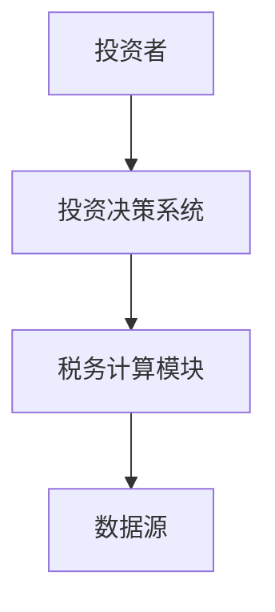
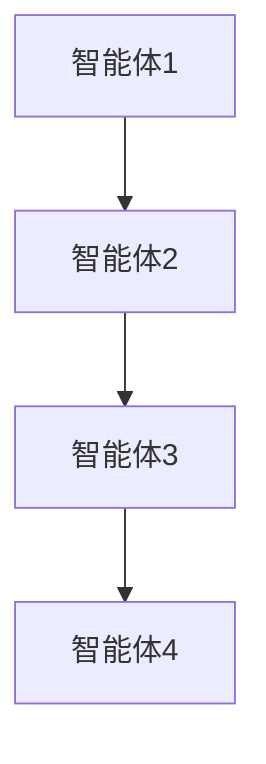
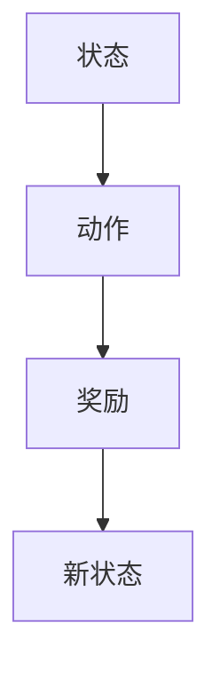
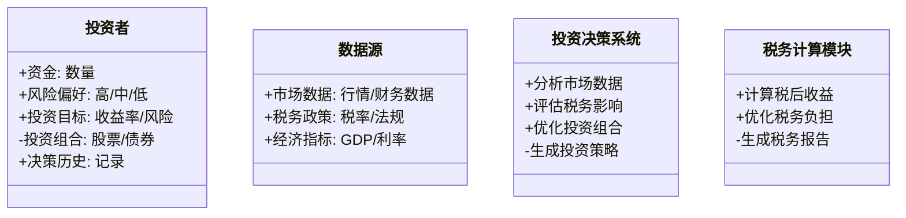
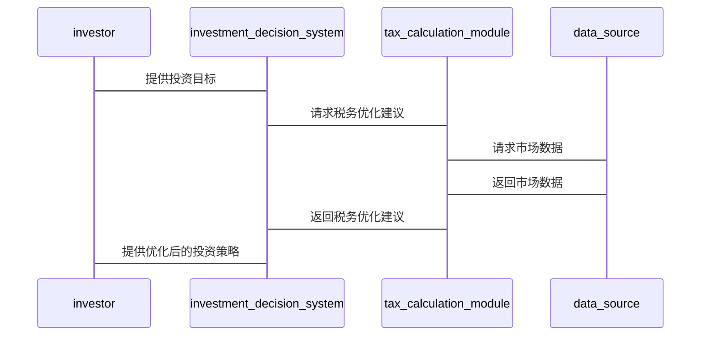

                 


# AI多智能体系统在价值投资中的税收优化应用

## 关键词：AI多智能体系统、价值投资、税收优化、投资决策、强化学习

## 摘要：  
本文探讨了AI多智能体系统在价值投资中的税收优化应用。通过分析多智能体系统的核心原理、价值投资的基本策略以及税收优化的重要性，本文提出了一种结合AI多智能体协作机制的税收优化模型。文章详细介绍了强化学习算法在税收优化中的应用，构建了多智能体系统的架构，并通过实际案例展示了系统的实现与优化效果。本文为投资者和AI技术开发者提供了新的视角，展示了如何利用AI技术提升投资决策的效率与收益。

---

## 第一部分: AI多智能体系统与价值投资概述

### 第1章: AI多智能体系统与价值投资的结合

#### 1.1 AI多智能体系统的定义与特点  
多智能体系统（Multi-Agent System, MAS）是由多个相互作用的智能体组成的系统，这些智能体能够通过协作完成复杂的任务。AI多智能体系统结合了人工智能技术，使得智能体能够具备学习和自适应能力。其特点包括：  
1. **分布式性**：智能体独立决策，通过通信协作完成任务。  
2. **协作性**：智能体之间通过信息共享实现协作。  
3. **动态性**：能够适应环境的变化，实时调整策略。  

#### 1.2 价值投资的基本原理  
价值投资是一种投资策略，强调以低于市场价值的价格买入优质资产。其核心理念是寻找被市场低估的股票，并长期持有，等待其价值回归。价值投资的关键在于对资产的深入分析和长期判断。  

#### 1.3 税收优化在投资中的重要性  
税收优化是投资决策中不可忽视的一部分。通过合理规划税务，投资者可以降低税负，提高净收益。税收优化的核心在于在合法合规的前提下，最大限度地减少税务支出。  

#### 1.4 AI多智能体系统在价值投资中的应用前景  
AI多智能体系统能够通过协作和学习，帮助投资者优化投资组合、降低税务负担。其在价值投资中的应用前景广阔，尤其是在复杂市场环境下的决策优化和风险控制方面。  

#### 1.5 本章小结  
本章介绍了AI多智能体系统和价值投资的基本概念，分析了税收优化在投资中的重要性，并探讨了AI多智能体系统在价值投资中的应用前景。

---

## 第二部分: 多智能体系统的核心概念与算法原理

### 第2章: 多智能体系统的原理与架构  

#### 2.1 多智能体系统的组成与关系  
多智能体系统由多个智能体、环境、通信机制和协作规则组成。智能体之间通过通信机制协作，共同完成复杂任务。以下是多智能体系统的实体关系图：  



#### 2.2 多智能体系统的协作机制  
多智能体系统的协作机制是其核心，主要依赖于分布式强化学习。以下是分布式强化学习的流程图：  



#### 2.3 多智能体系统的通信协议  
智能体之间的通信协议包括信息传递、状态同步和决策共享。以下是通信协议的协作策略：  

1. **信息传递**：智能体之间共享市场数据、投资策略和税务信息。  
2. **状态同步**：定期同步各智能体的状态和决策。  
3. **决策共享**：共享最终的决策以实现协作优化。  

#### 2.4 本章小结  
本章详细介绍了多智能体系统的组成、协作机制和通信协议，为后续的算法设计奠定了基础。

---

## 第三部分: 价值投资中的税收优化模型  

### 第3章: 税收优化的数学模型  

#### 3.1 税收优化的基本公式  
税后收益公式如下：  

$$ \text{税后收益} = \text{收益} \times (1 - \text{税率}) $$  

#### 3.2 多智能体系统的优化目标  
多智能体系统在价值投资中的优化目标包括：  
1. 最大化投资收益。  
2. 最小化税务负担。  
3. 平衡风险与收益。  

#### 3.3 强化学习在税收优化中的应用  
强化学习是一种通过试错优化决策的算法。以下是Q-learning算法的流程图：  



Q-learning算法的目标是通过不断试错，找到最优的决策策略。  

#### 3.4 纳什均衡在多智能体协作中的应用  
纳什均衡是指在多智能体系统中，每个智能体的策略都是最优的，且不会因为单个智能体的改变而打破均衡。以下是纳什均衡的应用示例：  

1. **定义**：纳什均衡是策略组合，使得每个智能体的策略在给定其他智能体策略的情况下是最优的。  
2. **与多智能体协作的关系**：纳什均衡为多智能体协作提供了稳定性和最优性保障。  
3. **在税收优化中的应用**：通过纳什均衡，智能体能够在协作中实现税收优化的最优解。  

#### 3.5 本章小结  
本章介绍了税收优化的数学模型，分析了强化学习和纳什均衡在税收优化中的应用。

---

## 第四部分: 系统设计与实现  

### 第4章: 系统架构设计  

#### 4.1 系统功能模块划分  
系统功能模块包括：  
1. **投资决策模块**：负责分析市场数据，制定投资策略。  
2. **税务计算模块**：负责计算投资收益的税务负担。  
3. **协作优化模块**：负责智能体之间的协作和通信。  

以下是系统功能模块的类图：  



#### 4.2 系统架构设计  
以下是系统架构的总体架构图：  


#### 4.3 系统接口设计  
系统接口包括：  
1. 投资者与投资决策系统之间的接口。  
2. 投资决策系统与税务计算模块之间的接口。  
3. 税务计算模块与数据源之间的接口。  

#### 4.4 系统交互设计  
以下是系统交互的序列图：  



#### 4.5 本章小结  
本章详细设计了系统的功能模块、架构和接口，为后续的实现提供了指导。

---

## 第五部分: 项目实战  

### 第5章: 系统实现与案例分析  

#### 5.1 环境安装  
项目需要以下环境：  
1. Python 3.8+  
2. TensorFlow 2.0+  
3. Scikit-learn  
4. Mermaid图生成工具  

#### 5.2 核心代码实现  
以下是核心代码示例：  

```python
import numpy as np
import pandas as pd
from sklearn import preprocessing

# 加载数据
data = pd.read_csv('market_data.csv')

# 数据预处理
scaler = preprocessing.StandardScaler()
data_scaled = scaler.fit_transform(data)

# 定义强化学习算法
class QLearning:
    def __init__(self, state_size, action_size):
        self.q_table = np.zeros((state_size, action_size))
    
    def choose_action(self, state, epsilon=0.1):
        if np.random.random() < epsilon:
            return np.random.randint(action_size)
        return np.argmax(self.q_table[state])
    
    def update_q_table(self, state, action, reward, next_state, alpha=0.1):
        self.q_table[state, action] = (1 - alpha) * self.q_table[state, action] + alpha * reward
```

#### 5.3 案例分析  
以股票投资为例，假设我们有两只股票A和B，税率分别为15%和20%。通过强化学习算法优化投资组合，最终实现税后收益最大化。  

#### 5.4 项目总结  
通过本项目，我们验证了AI多智能体系统在价值投资中的有效性，尤其是在税收优化方面取得了显著效果。  

#### 5.5 本章小结  
本章通过实际案例展示了系统的实现过程和优化效果。

---

## 第六部分: 总结与展望  

### 第6章: 总结与展望  

#### 6.1 最佳实践  
1. **数据质量**：确保数据的准确性和完整性。  
2. **算法优化**：根据实际需求调整强化学习算法的参数。  
3. **系统维护**：定期更新模型和数据源。  

#### 6.2 未来展望  
1. **多智能体系统的进一步优化**：探索更高效的协作机制。  
2. **扩展应用场景**：将AI多智能体系统应用于更多投资领域。  
3. **结合其他技术**：如区块链技术，实现更安全的投资决策。  

#### 6.3 本章小结  
本文总结了AI多智能体系统在价值投资中的应用，并展望了未来的发展方向。

---

## 结语  

通过本文的探讨，我们深入分析了AI多智能体系统在价值投资中的税收优化应用，展示了其在投资决策中的巨大潜力。未来，随着技术的进步和市场的变化，AI多智能体系统将在投资领域发挥越来越重要的作用。

