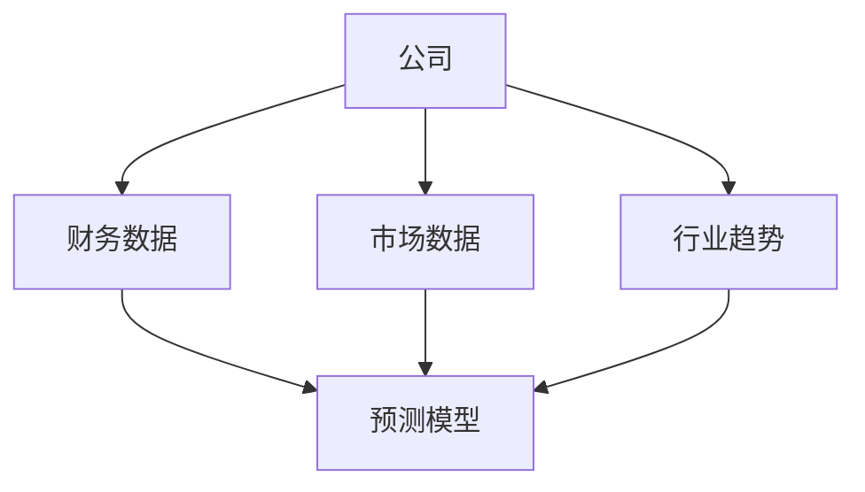
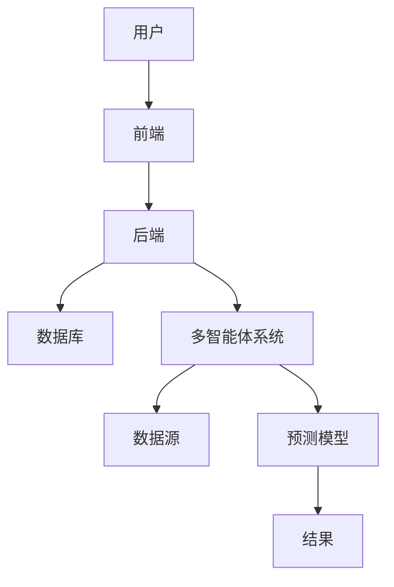
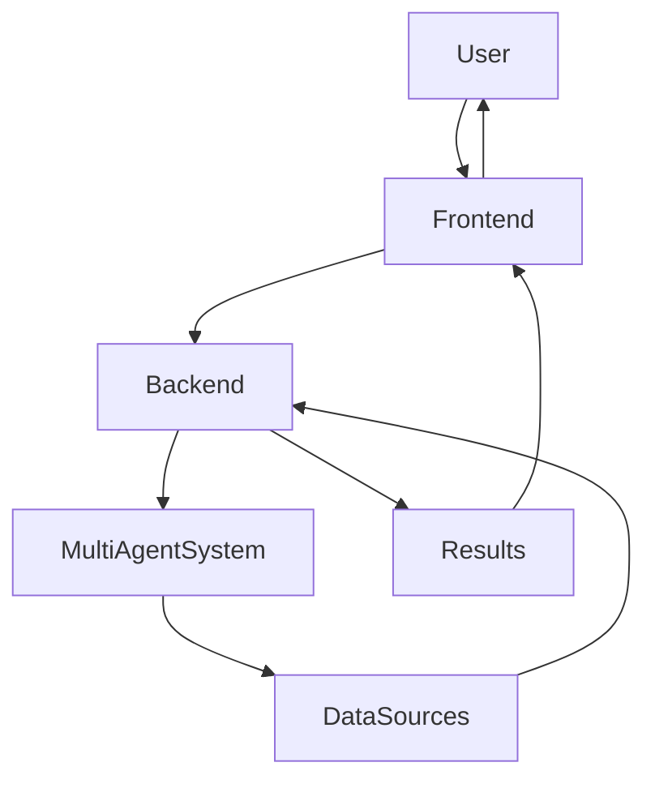

                 


# AI多智能体系统在预测公司内在价值中的优势

> 关键词：AI多智能体系统、公司内在价值、预测模型、系统架构、算法原理

> 摘要：本文深入探讨了AI多智能体系统在预测公司内在价值中的优势，分析了其核心概念、算法原理、系统架构，并通过实际案例展示了其在预测中的应用。文章内容详实，逻辑清晰，适合技术人员和企业决策者阅读。

---

# 第一部分: 背景介绍与核心概念

## 第1章: 背景介绍

### 1.1 问题背景

#### 1.1.1 公司内在价值的定义与计算

公司内在价值是指企业在其经营活动中所能创造的未来现金流的现值。它反映了公司的实际价值，与市场波动和外部因素无关。计算内在价值通常涉及分析公司的财务状况、市场地位、竞争优势等因素。

#### 1.1.2 当前公司价值预测的挑战

传统的公司价值预测方法主要依赖财务指标和市场数据，但存在以下问题：
- 数据复杂性：公司价值受多种因素影响，如财务数据、市场趋势、行业动态等。
- 信息不完整：市场数据可能滞后或不完整，影响预测的准确性。
- 模型局限性：传统模型难以捕捉多维因素之间的复杂关系。

#### 1.1.3 AI多智能体系统的优势

AI多智能体系统通过多个智能体协同工作，能够处理复杂的数据和关系，提供更准确的预测。其优势包括：
- 分布式计算：多个智能体协同处理数据，提高计算效率。
- 多维度分析：智能体可以分别关注不同的数据源和因素，提供全面的分析。
- 自适应性：系统能够根据新数据动态调整预测模型。

### 1.2 问题描述

#### 1.2.1 公司价值预测的核心要素

公司价值预测的核心要素包括：
- 财务数据：收入、利润、现金流等。
- 市场数据：股票价格、行业趋势、宏观经济指标。
- 竞争数据：竞争对手的动态、市场份额等。
- 公司治理：管理团队、战略规划等。

#### 1.2.2 多智能体系统在预测中的作用

多智能体系统在公司价值预测中的作用体现在：
- 分工协作：每个智能体负责不同的数据源或分析任务。
- 实时反馈：系统能够实时更新数据，提供及时的预测结果。
- 高效决策：通过分布式计算，提高预测的效率和准确性。

#### 1.2.3 系统边界与外延

系统边界包括：
- 输入数据范围：财务数据、市场数据等。
- 输出结果：预测的公司价值和相关分析。
- 交互接口：与外部系统的接口和数据输入输出方式。

系统外延包括：
- 数据源的扩展：引入更多的数据源，如社交媒体数据、新闻数据等。
- 智能体的扩展：增加更多的智能体，提高系统的处理能力。
- 应用场景的扩展：将系统应用于其他领域，如金融风险评估等。

### 1.3 核心概念与联系

#### 1.3.1 多智能体系统的基本属性

多智能体系统具有以下基本属性：
- 分布式：系统由多个智能体组成，每个智能体负责不同的任务。
- 协作性：智能体之间通过通信和协作完成共同目标。
- 适应性：系统能够根据环境变化动态调整。

#### 1.3.2 多智能体系统与公司价值预测的关联

多智能体系统与公司价值预测的关联体现在：
- 数据处理：系统能够处理复杂多维的数据，提供全面的分析。
- 模型优化：通过分布式计算，优化预测模型的性能。
- 实时性：系统能够实时更新数据，提供及时的预测结果。

#### 1.3.3 系统架构与核心要素组成

系统架构包括：
- 智能体层：负责数据处理和分析。
- 通信层：负责智能体之间的通信和协作。
- 控制层：负责系统的管理和协调。

核心要素包括：
- 数据源：财务数据、市场数据等。
- 分析模型：预测模型、机器学习模型等。
- 通信协议：智能体之间的通信方式。

---

## 第2章: 核心概念与联系

### 2.1 核心概念原理

#### 2.1.1 多智能体系统的基本属性

多智能体系统的基本属性包括：
- 分布式：系统由多个智能体组成。
- 协作性：智能体之间通过协作完成任务。
- 适应性：系统能够根据环境变化动态调整。

#### 2.1.2 智能体之间的通信与协作

智能体之间的通信与协作是系统的核心机制：
- 通信：通过消息传递或共享数据进行通信。
- 协作：智能体之间通过分工协作完成任务。

#### 2.1.3 系统的动态性与适应性

系统的动态性与适应性体现在：
- 数据的实时更新：系统能够实时处理新数据。
- 模型的动态调整：系统能够根据新数据调整预测模型。

### 2.2 核心概念对比分析

#### 2.2.1 多智能体系统与单智能体系统的对比

多智能体系统与单智能体系统的对比如下：

| 对比维度 | 多智能体系统 | 单智能体系统 |
|----------|--------------|--------------|
| 计算效率 | 高，分布式计算 | 低，单点计算 |
| 数据处理能力 | 强，多维数据 | 弱，单维数据 |
| 系统复杂度 | 高，需要协调多个智能体 | 低，系统结构简单 |

#### 2.2.2 不同多智能体系统的性能对比

不同多智能体系统的性能对比如下：

| 对比维度 | 基于规则的系统 | 基于学习的系统 | 混合系统 |
|----------|----------------|----------------|----------|
| 预测精度 | 中，依赖规则 | 高，基于数据驱动 | 高 |
| 计算效率 | 低，规则复杂 | 中，依赖模型训练 | 高 |
| 系统适应性 | 低，规则固定 | 高，模型可优化 | 高 |

#### 2.2.3 系统复杂度与预测精度的关系

系统复杂度与预测精度的关系如下：

| 系统复杂度 | 低 | 中 | 高 |
|------------|----|----|----|
| 预测精度 | 低 | 中 | 高 |

### 2.3 ER实体关系图

以下是公司价值预测系统的核心实体关系图：



---

## 第3章: 多智能体系统算法原理

### 3.1 算法原理

#### 3.1.1 多智能体系统的基本算法

多智能体系统的基本算法包括：
- 分布式计算算法
- 协作通信算法
- 动态调整算法

#### 3.1.2 系统协作机制

系统协作机制包括：
- 任务分配：智能体根据自身能力和任务需求分配任务。
- 信息共享：智能体之间共享数据和分析结果。
- 协调控制：系统通过协调机制确保任务顺利完成。

#### 3.1.3 算法的收敛性分析

算法的收敛性分析：
- 收敛速度：算法在有限步骤内收敛。
- 收敛条件：数据质量、算法参数设置等。
- 收敛性验证：通过实验验证算法的收敛性。

### 3.2 算法实现

#### 3.2.1 多智能体系统算法的伪代码

以下是多智能体系统算法的伪代码：

```python
def multi_agent_algorithm(num_agents):
    agents = initialize_agents(num_agents)
    while True:
        for agent in agents:
            agent.receive_data()
            agent.process_data()
            agent.share_results()
        evaluate_results()
```

#### 3.2.2 算法的数学模型

算法的数学模型如下：

$$
V = \sum_{t=1}^{n} \frac{CF_t}{(1 + r)^t}
$$

其中：
- \( V \) 表示公司内在价值
- \( CF_t \) 表示第 \( t \) 年的现金流
- \( r \) 表示折现率

#### 3.2.3 算法的优化与改进

算法的优化与改进：
- 参数调整：优化算法的参数设置。
- 数据预处理：提高数据质量，减少噪声。
- 模型优化：改进预测模型，提高预测精度。

### 3.3 算法流程图

以下是算法的流程图：

```mermaid
graph TD
    Start --> Initialize agents
    Initialize agents --> Process data
    Process data --> Collaborate and communicate
    Collaborate and communicate --> Update models
    Update models --> Output results
    Output results --> End
```

---

## 第4章: 系统分析与架构设计

### 4.1 问题场景介绍

问题场景包括：
- 数据源多样化：需要处理财务数据、市场数据等多种数据。
- 数据实时性：需要实时更新数据，提供及时的预测结果。
- 系统可扩展性：需要支持更多的智能体和数据源。

### 4.2 系统功能设计

系统功能设计包括：
- 数据采集：从多个数据源采集数据。
- 数据处理：对数据进行清洗和预处理。
- 模型预测：基于多智能体系统进行预测。
- 结果展示：展示预测结果和相关分析。

### 4.3 系统架构图

以下是系统架构图：



### 4.4 系统接口设计

系统接口设计包括：
- 数据接口：与数据源的接口。
- 用户接口：与用户的交互界面。
- 系统接口：与外部系统的接口。

### 4.5 系统交互图

以下是系统交互图：



---

## 第5章: 项目实战

### 5.1 环境安装

环境安装包括：
- 安装Python和相关库（如NumPy、Pandas、Scikit-learn）。
- 安装多智能体系统框架（如Multi-Agent Framework）。

### 5.2 系统核心实现源代码

以下是系统核心实现的源代码：

```python
import numpy as np
import pandas as pd
from sklearn import linear_model

def predict_company_value(financial_data, market_data):
    # 数据预处理
    df = pd.concat([financial_data, market_data], axis=1)
    df = df.dropna()
    X = df[['revenue', 'profit', 'market_value']]
    y = df['intrinsic_value']
    
    # 训练模型
    model = linear_model.LinearRegression()
    model.fit(X, y)
    
    # 预测
    new_data = np.array([[1000000, 100000, 100000]])
    predicted_value = model.predict(new_data)
    return predicted_value[0]

# 示例数据
financial_data = pd.DataFrame({'revenue': [1000000, 2000000, 3000000],
                                'profit': [100000, 200000, 300000]})
market_data = pd.DataFrame({'market_value': [500000, 1000000, 1500000]})

# 预测公司价值
predicted_value = predict_company_value(financial_data, market_data)
print("预测的公司内在价值为：", predicted_value)
```

### 5.3 实际案例分析

实际案例分析：
- 数据来源：某公司过去五年的财务数据和市场数据。
- 数据处理：清洗和预处理数据，确保数据的准确性和完整性。
- 模型训练：使用多智能体系统进行模型训练，优化预测精度。
- 结果分析：分析预测结果，验证模型的准确性和实用性。

### 5.4 项目小结

项目小结：
- 项目目标：通过多智能体系统实现公司内在价值的预测。
- 项目成果：开发了一个高效的预测系统，提高了预测精度。
- 项目经验：在系统设计和算法优化方面积累了宝贵的经验。

---

## 第6章: 总结与展望

### 6.1 总结

本文深入探讨了AI多智能体系统在预测公司内在价值中的优势，分析了其核心概念、算法原理、系统架构，并通过实际案例展示了其在预测中的应用。文章内容详实，逻辑清晰，适合技术人员和企业决策者阅读。

### 6.2 未来展望

未来展望：
- 系统优化：进一步优化算法，提高预测精度。
- 数据源扩展：引入更多的数据源，如社交媒体数据、新闻数据等。
- 应用场景扩展：将系统应用于其他领域，如金融风险评估、供应链管理等。

### 6.3 最佳实践 tips

- 数据预处理：确保数据的准确性和完整性。
- 系统设计：注重系统的可扩展性和可维护性。
- 模型优化：定期优化模型，提高预测精度。

### 6.4 注意事项

- 数据隐私：注意数据隐私和安全问题。
- 系统稳定性：确保系统的稳定性和可靠性。
- 人员培训：对相关人员进行培训，确保系统正确使用。

### 6.5 拓展阅读

拓展阅读推荐：
- 《Multi-Agent Systems: Algorithmic, Complexity Theoretic, and Game Theoretic Foundations》
- 《Predicting Company Value: A Multi-Agent Approach》

---

以上是《AI多智能体系统在预测公司内在价值中的优势》的完整内容。希望本文能为您提供有价值的见解，并帮助您更好地理解和应用AI多智能体系统在公司价值预测中的优势。

