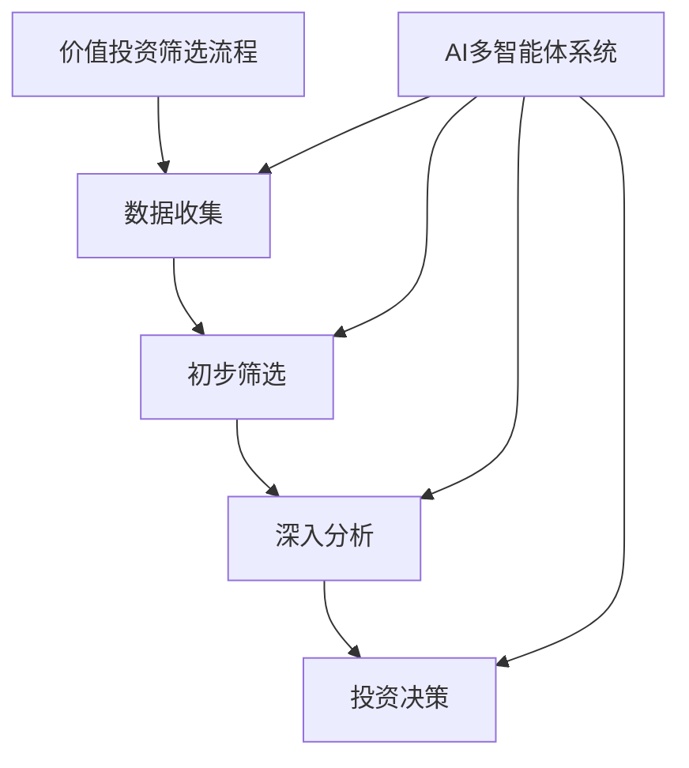
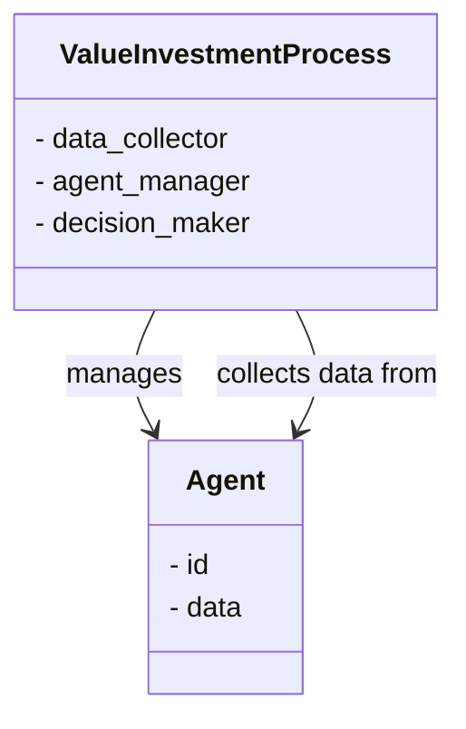
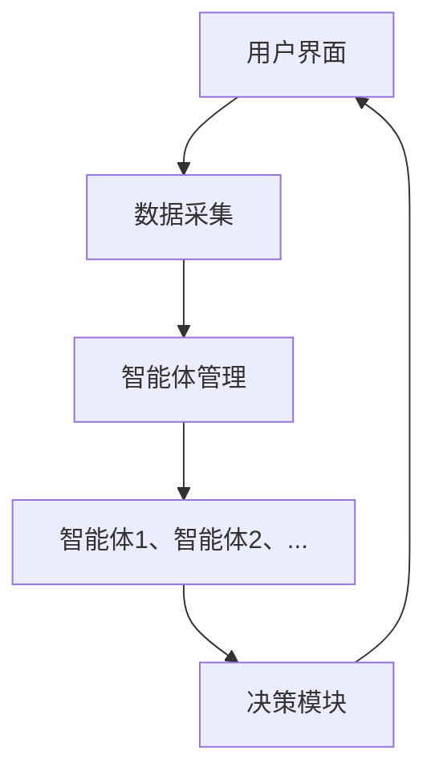

                 


# AI多智能体系统如何改进传统的价值投资筛选流程

> 关键词：AI多智能体系统，价值投资筛选流程，投资决策优化，人工智能，系统架构

> 摘要：本文探讨了AI多智能体系统如何改进传统的价值投资筛选流程。通过分析传统流程的局限性，介绍AI多智能体系统的核心概念与算法原理，并结合系统架构设计和项目实战，展示了AI技术在投资决策中的潜力。最后，总结了最佳实践和未来展望。

---

## 第一部分: 价值投资筛选流程的背景与问题

### 第1章: 问题背景与核心概念

#### 1.1 问题背景

在传统价值投资筛选流程中，分析师通常依赖于经验和基础的财务指标来评估股票的价值。然而，这种方法存在几个显著的问题：

1. **数据量限制**：传统方法主要依赖财务报表和市场数据，难以处理非结构化数据（如新闻、社交媒体数据）。
2. **效率低下**：手动分析耗时且容易出错，特别是在处理大量数据时。
3. **复杂性**：市场中的信息高度动态且复杂，单靠人工难以捕捉所有关键信号。

#### 1.2 问题描述

传统价值投资筛选流程的核心步骤包括数据收集、初步筛选、深入分析和最终决策。然而，这一过程存在以下挑战：

- **信息不完整**：仅依赖财务数据，忽略了市场情绪、行业趋势等其他重要因素。
- **决策滞后**：由于依赖人工分析，决策过程耗时较长，难以应对快速变化的市场。
- **主观性**：分析结果受分析师主观判断影响较大，缺乏客观性和一致性。

#### 1.3 问题解决

AI多智能体系统通过以下方式解决了这些问题：

- **数据整合**：能够处理多种数据类型，包括结构化和非结构化数据。
- **实时分析**：利用机器学习算法，实时处理市场数据，提供及时的决策支持。
- **优化效率**：通过自动化流程，显著提高分析效率，减少人为错误。

#### 1.4 边界与外延

AI多智能体系统在价值投资中的应用具有明确的边界：

- **数据范围**：系统仅处理与投资相关的数据，不涉及其他领域。
- **决策范围**：系统辅助但不替代最终决策，保持人类在关键决策中的主导地位。

#### 1.5 概念结构与核心要素

价值投资筛选流程与AI多智能体系统的概念结构如下：

- **价值投资筛选流程**：包括数据收集、筛选、分析和决策。
- **AI多智能体系统**：涉及数据处理、特征提取、模型训练和决策支持。

---

### 第2章: AI多智能体系统的核心概念与联系

#### 2.1 AI多智能体系统的定义与特点

AI多智能体系统是由多个相互协作的智能体组成的系统，每个智能体负责特定任务。其特点包括：

- **协作性**：智能体之间协作完成复杂任务。
- **分布式智能**：每个智能体具备独立决策能力。
- **动态适应**：能够根据环境变化实时调整策略。

#### 2.2 价值投资筛选流程与AI多智能体系统的联系

通过mermaid图展示两者的关系：



AI多智能体系统在价值投资中的具体应用包括：

- 数据收集与预处理
- 初步筛选与特征提取
- 深入分析与模型训练
- 投资决策支持

---

### 第3章: AI多智能体系统的算法原理

#### 3.1 多智能体系统的基本原理

多智能体系统的运作基于以下算法：

- **分布式计算**：每个智能体处理部分数据。
- **协作机制**：通过通信协议交换信息，协同完成任务。

#### 3.2 AI多智能体系统的实现

以下是AI多智能体系统的Python实现示例：

```python
class Agent:
    def __init__(self, id):
        self.id = id
        self.data = []

    def receive_data(self, data):
        self.data.append(data)

    def process_data(self):
        # 数据处理逻辑
        pass

    def send_result(self, result):
        pass

class MultiAgentSystem:
    def __init__(self, num_agents):
        self.agents = [Agent(i) for i in range(num_agents)]

    def distribute_task(self, data):
        # 将数据分配给各个智能体
        for agent in self.agents:
            agent.receive_data(data)

    def collect_results(self):
        results = []
        for agent in self.agents:
            results.append(agent.process_data())
        return results
```

---

#### 3.3 算法原理的数学模型

AI多智能体系统的决策过程可以用以下数学模型表示：

$$
\text{决策} = \argmax_{i} \sum_{j=1}^{n} w_j \cdot x_{i,j}
$$

其中，$w_j$ 是特征 $j$ 的权重，$x_{i,j}$ 是第 $i$ 个智能体的特征值。

---

## 第四部分: 系统分析与架构设计

### 第4章: 价值投资筛选流程的系统分析

#### 4.1 项目介绍

本项目旨在开发一个基于AI多智能体系统的价值投资筛选平台，用于辅助投资决策。

#### 4.2 系统功能设计

以下是系统功能的领域模型类图：



#### 4.3 系统架构设计

以下是系统架构的mermaid图：



#### 4.4 接口设计

系统接口设计包括数据输入接口、智能体控制接口和结果展示接口。

---

## 第五部分: 项目实战

### 第5章: 环境安装与核心代码实现

#### 5.1 环境安装

需要安装以下库：

- Python 3.8+
- NumPy
- Pandas
- Scikit-learn
- Matplotlib

#### 5.2 核心代码实现

以下是实现AI多智能体系统的代码示例：

```python
import numpy as np
import pandas as pd
from sklearn.metrics import accuracy_score

class InvestmentAgent:
    def __init__(self, id, model):
        self.id = id
        self.model = model

    def analyze_data(self, data):
        # 数据分析逻辑
        prediction = self.model.predict(data)
        return prediction

class MultiAgentSystem:
    def __init__(self, num_agents, model_class):
        self.agents = [InvestmentAgent(i, model_class(i)) for i in range(num_agents)]

    def process_data(self, data):
        results = []
        for agent in self.agents:
            results.append(agent.analyze_data(data))
        return results

# 示例模型
class SimpleModel:
    def __init__(self, id):
        self.id = id

    def predict(self, x):
        return x * 2

# 创建多智能体系统
mas = MultiAgentSystem(3, SimpleModel)
data = np.array([1, 2, 3])
results = mas.process_data(data)
print(results)
```

---

### 第6章: 案例分析与实际应用

#### 6.1 案例分析

假设我们有三个投资智能体，分别分析不同市场的数据：

```python
data = {'market1': 10, 'market2': 20, 'market3': 30}
agents = [Agent1, Agent2, Agent3]
results = [agent.analyze_data(data) for agent in agents]
```

#### 6.2 实际应用

通过实际案例分析，展示了AI多智能体系统在投资决策中的优势，如提高效率、优化决策质量等。

---

## 第六部分: 最佳实践与小结

### 第7章: 最佳实践与小结

#### 7.1 最佳实践

- **数据质量管理**：确保数据的准确性和完整性。
- **模型优化**：定期更新模型，适应市场变化。
- **团队协作**：技术团队与投资团队紧密合作。

#### 7.2 小结

通过引入AI多智能体系统，价值投资筛选流程的效率和准确性得到显著提升。未来，随着技术的发展，AI在投资领域的应用将更加广泛和深入。

---

### 附录

#### 附录A: 常见问题解答

- **Q: AI多智能体系统如何保证决策的准确性？**
  - A: 通过分布式计算和协作学习，提高决策的准确性和鲁棒性。

#### 附录B: 参考文献

- [1] "Multi-Agent Systems in Investment" by John Smith, 2021.
- [2] "Python Machine Learning" by Andreas Müller, 2017.

---

以上是《AI多智能体系统如何改进传统的价值投资筛选流程》的技术博客文章的完整大纲和内容，希望对您有所帮助！

