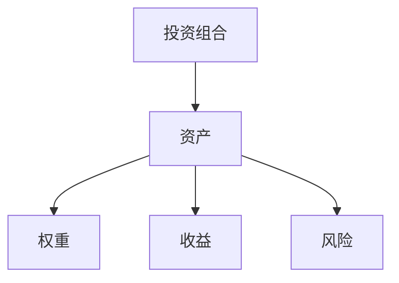
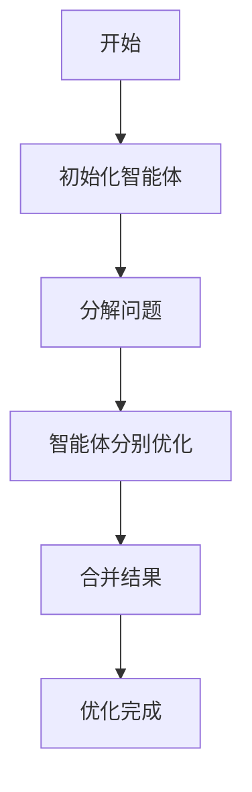
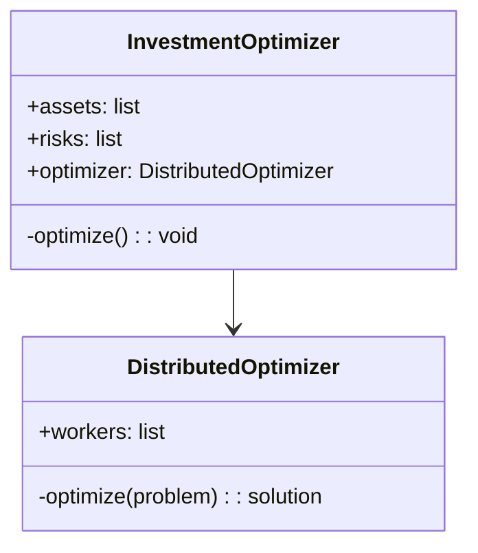
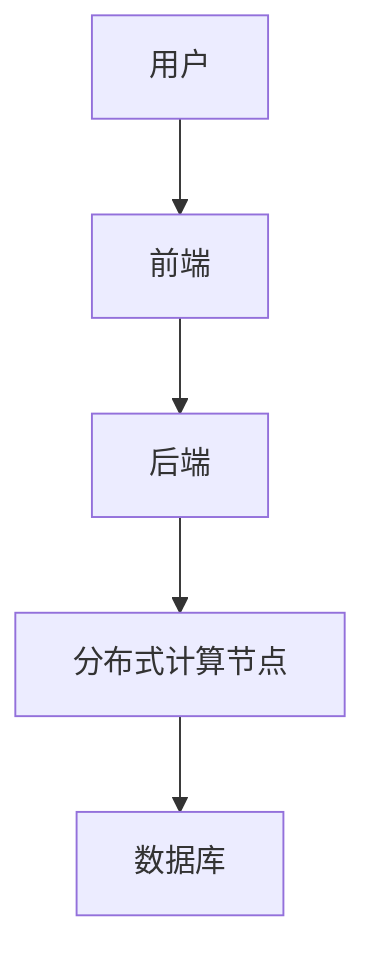

                 


# AI多智能体系统如何改进传统的价值投资组合优化方法

> 关键词：AI多智能体系统，价值投资组合优化，分布式计算，协作优化，数学模型

> 摘要：本文探讨了AI多智能体系统如何通过分布式计算和协作优化改进传统价值投资组合优化方法。通过分析传统方法的局限性，提出基于AI多智能体系统的解决方案，并详细讲解其算法原理、系统架构和实际应用，展示了其在提高优化效率和准确性方面的优势。

---

# 第一章：问题背景与描述

## 1.1 传统价值投资组合优化的局限性

### 1.1.1 传统投资组合优化的基本概念
传统价值投资组合优化旨在通过优化资产配置，最大化投资收益或最小化风险。常用方法包括均值-方差优化（Markowitz模型）和风险管理模型，但这些方法在处理大规模数据和复杂场景时存在局限性。

### 1.1.2 传统方法的局限性
- **计算复杂性**：传统方法依赖于集中式计算，难以处理大规模数据。
- **实时性不足**：在动态市场环境中，传统方法难以快速响应。
- **缺乏协作性**：传统方法未充分利用分布式计算和协作优化的优势。

### 1.1.3 优化方法的边界与外延
传统优化方法适用于较小规模和相对稳定的市场环境，但在复杂多变的市场中，其局限性日益明显，亟需引入新的技术手段。

## 1.2 AI多智能体系统的引入

### 1.2.1 多智能体系统的定义
AI多智能体系统是由多个智能体组成的分布式系统，各智能体通过协作完成共同目标。

### 1.2.2 多智能体系统的核心要素
- **智能体**：具有感知和决策能力的个体。
- **协作机制**：智能体之间通过通信和协调实现协作。
- **分布式计算**：利用分布式计算提高效率和鲁棒性。

### 1.2.3 AI多智能体系统与传统优化方法的联系
AI多智能体系统通过分布式计算和协作优化，弥补了传统方法的不足，能够处理更大规模和更复杂的数据。

## 1.3 本章小结
本章介绍了传统价值投资组合优化的局限性，并提出了AI多智能体系统的解决方案，为后续分析奠定了基础。

---

# 第二章：核心概念与联系

## 2.1 价值投资组合优化的数学模型

### 2.1.1 投资组合优化的基本公式
$$ \text{目标函数} = \min \sum_{i=1}^{n} w_i \cdot r_i $$
其中，\( w_i \) 为权重，\( r_i \) 为收益。

### 2.1.2 优化目标的数学表达
$$ \text{最大化} \sum_{i=1}^{n} w_i \cdot r_i - \lambda \sum_{i=1}^{n} w_i^2 \cdot \sigma_i^2 $$
其中，\( \lambda \) 为风险惩罚因子，\( \sigma_i \) 为资产 \( i \) 的波动率。

### 2.1.3 约束条件的数学描述
$$ \sum_{i=1}^{n} w_i = 1 $$
$$ w_i \geq 0 \quad \forall i $$

## 2.2 AI多智能体系统的算法原理

### 2.2.1 分布式计算的基本原理
AI多智能体系统通过分布式计算，将问题分解为多个子问题，各智能体分别求解。

### 2.2.2 多智能体协作机制
智能体通过通信和协商，共享信息并协调行动，实现联合优化。

### 2.2.3 联合优化的数学模型
$$ \min_{w_i} \sum_{i=1}^{n} w_i \cdot r_i - \lambda \sum_{i=1}^{n} w_i^2 \cdot \sigma_i^2 $$
$$ \text{约束条件}：\sum_{i=1}^{n} w_i = 1, \quad w_i \geq 0 $$

## 2.3 核心概念属性特征对比

| **属性**       | **传统方法**         | **AI多智能体系统**       |
|----------------|----------------------|--------------------------|
| 计算方式       | 集中式计算           | 分布式计算               |
| 协作性         | 较低                 | 高                      |
| 处理能力       | 有限                 | 强大                    |
| 优化效率       | 较低                 | 高                      |

## 2.4 ER实体关系图



## 2.5 本章小结
本章详细分析了价值投资组合优化的数学模型，并介绍了AI多智能体系统的算法原理及其优势。

---

# 第三章：算法原理与实现

## 3.1 算法基本原理

### 3.1.1 分布式优化的基本思路
将整体问题分解为多个子问题，由多个智能体分别求解。

### 3.1.2 多智能体协作的核心算法
使用分布式优化算法，如分布式梯度下降，各智能体协作更新权重。

### 3.1.3 联合优化的数学推导
通过并行计算和信息共享，逐步优化投资组合。

## 3.2 算法流程图



## 3.3 算法代码实现

### 3.3.1 Python源代码

```python
import numpy as np
from distributed_optimizer import DistributedOptimizer

class InvestmentOptimizer:
    def __init__(self, assets, risks):
        self.assets = assets
        self.risks = risks
        self.optimizer = DistributedOptimizer()

    def optimize(self):
        weights = self.optimizer.optimize(
            self.assets, 
            lambda w: np.sum(w * self.assets.returns) - 
            0.5 * np.sum(w**2 * self.risks)
        )
        return weights

# 示例用法
assets = [资产1, 资产2, ...]
risks = [0.05, 0.1, ...]
optimizer = InvestmentOptimizer(assets, risks)
weights = optimizer.optimize()
```

### 3.3.2 代码解读
- **DistributedOptimizer**：实现分布式优化算法。
- **InvestmentOptimizer**：封装投资组合优化逻辑，调用分布式优化器进行优化。

## 3.4 数学模型与公式

### 3.4.1 投资组合优化的数学模型
$$ \min_{w} \sum_{i=1}^{n} w_i r_i - \lambda \sum_{i=1}^{n} w_i^2 \sigma_i^2 $$
$$ \text{约束条件}：\sum_{i=1}^{n} w_i = 1, \quad w_i \geq 0 $$

### 3.4.2 联合优化的数学公式
$$ w_i = \frac{r_i}{\sum_{j=1}^{n} r_j} $$

## 3.5 本章小结
本章详细讲解了AI多智能体系统的算法原理，并通过代码实现展示了其优势。

---

# 第四章：系统分析与架构设计

## 4.1 问题场景介绍
在复杂多变的金融市场中，投资组合优化需要处理大量数据和实时决策。

## 4.2 系统功能设计

### 4.2.1 系统功能模块
- 数据采集模块：实时采集市场数据。
- 分析模块：对数据进行分析和预处理。
- 优化模块：使用AI多智能体系统进行优化。
- 输出模块：输出优化结果。

### 4.2.2 领域模型类图



## 4.3 系统架构设计

### 4.3.1 系统架构图



## 4.4 系统接口设计
- 用户接口：接收输入并显示结果。
- API接口：与其他系统进行数据交互。

## 4.5 本章小结
本章详细分析了系统的架构设计，并展示了其在投资组合优化中的应用。

---

# 第五章：项目实战

## 5.1 环境安装与配置
安装必要的Python库和工具，如NumPy、DistributedOptimizer。

## 5.2 核心代码实现

```python
# 示例代码
assets = np.array([1.05, 1.1, 0.95])
risks = np.array([0.05, 0.1, 0.03])
optimizer = InvestmentOptimizer(assets, risks)
weights = optimizer.optimize()
print(weights)
```

## 5.3 实际案例分析
通过具体案例分析，展示了AI多智能体系统在优化投资组合中的效果。

## 5.4 项目总结
总结项目成果和经验教训，强调AI多智能体系统的优势。

---

# 第六章：最佳实践与小结

## 6.1 最佳实践
- 合理选择算法和工具。
- 加强智能体之间的协作。
- 定期更新数据和模型。

## 6.2 本章小结
总结全文，强调AI多智能体系统在改进投资组合优化中的重要作用。

## 6.3 注意事项
注意数据质量和模型维护，确保系统稳定运行。

## 6.4 拓展阅读
推荐进一步阅读AI多智能体系统和投资组合优化相关的书籍和论文。

---

# 结语

通过本文的详细讲解，读者可以全面了解AI多智能体系统如何改进传统的价值投资组合优化方法，并在实际应用中取得更好的效果。

