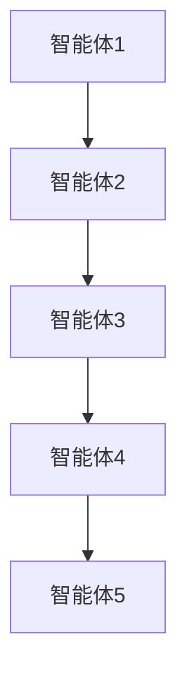
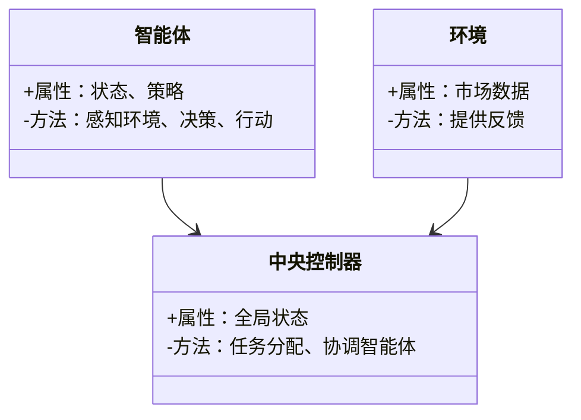
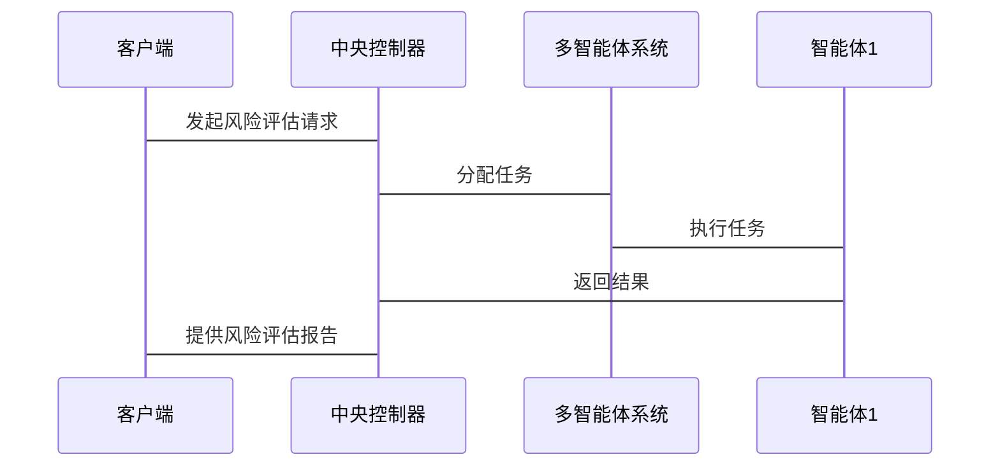

                 


# AI多智能体系统如何改进传统的价值投资风险控制方法

---

## 关键词：AI多智能体系统，价值投资，风险控制，强化学习，分布式系统，金融建模

---

## 摘要：  
本文探讨了AI多智能体系统如何改进传统的价值投资风险控制方法。通过分析多智能体系统的核心原理、其在金融领域的应用，以及与传统方法的对比，本文详细阐述了AI多智能体系统在风险控制中的优势和具体应用场景。文章从算法原理、系统架构、项目实战等角度，全面解析了AI多智能体系统如何优化传统价值投资的风险控制流程。

---

# 第1章: 多智能体系统与价值投资概述

## 1.1 多智能体系统的定义与特点

### 1.1.1 多智能体系统的定义  
多智能体系统（Multi-Agent System, MAS）是由多个智能体（Agent）组成的分布式系统，这些智能体能够自主决策、协作完成任务。智能体具有感知环境、自主决策、主动行动的能力，并通过通信与协作实现复杂目标。

### 1.1.2 多智能体系统的核心特点  
- **分布式性**：多个智能体协同工作，不存在中心控制节点。  
- **自主性**：每个智能体独立决策，无需外部干预。  
- **协作性**：智能体之间通过通信与协作完成共同目标。  
- **动态性**：智能体能够适应环境变化，实时调整策略。  

### 1.1.3 多智能体系统与传统单智能体系统的对比  
| 对比维度 | 多智能体系统 | 单智能体系统 |  
|----------|--------------|--------------|  
| 系统复杂性 | 高 | 低 |  
| 协作能力 | 强 | 弱 |  
| 灵活性 | 高 | 低 |  

---

## 1.2 价值投资的基本原理

### 1.2.1 价值投资的定义  
价值投资是一种以基本面分析为基础的投资策略，旨在通过分析公司的财务状况、行业地位等因素，找到市场价格低于其内在价值的股票进行投资。

### 1.2.2 价值投资的核心理念  
- **安全边际**：买入价格低于内在价值，以降低风险。  
- **长期视角**：关注公司长期盈利能力，而非短期价格波动。  
- **分散投资**：通过分散投资降低特定风险。  

### 1.2.3 价值投资在风险控制中的作用  
传统价值投资通过基本面分析和分散投资来降低风险，但面对复杂多变的市场环境，其风险控制能力有限。

---

## 1.3 传统价值投资风险控制方法的优缺点

### 1.3.1 传统风险控制方法的优缺点  
- **优点**：  
  - 理论基础扎实，强调安全边际和长期价值。  
  - 通过分散投资降低特定风险。  
- **缺点**：  
  - 对市场短期波动的反应较慢。  
  - 需要大量人工分析，效率较低。  
  - 难以应对复杂的多因素风险。  

### 1.3.2 传统方法在实际应用中的挑战  
- 市场波动剧烈时，传统方法难以快速调整投资组合。  
- 需要依赖人工判断，主观性较强。  
- 面对多因素风险（如宏观经济、行业政策等），传统方法难以全面评估。  

### 1.3.3 引入AI多智能体系统的必要性  
AI多智能体系统能够通过实时数据分析、多维度风险评估和高效协作，弥补传统方法的不足。

---

## 1.4 本章小结  
本章介绍了多智能体系统的定义与特点，以及价值投资的基本原理。通过分析传统价值投资风险控制方法的优缺点，提出了引入AI多智能体系统的必要性。为后续章节的展开奠定了基础。

---

# 第2章: AI多智能体系统的原理与技术基础

## 2.1 AI多智能体系统的定义与核心要素

### 2.1.1 AI多智能体系统的定义  
AI多智能体系统是结合人工智能技术的多智能体系统，通过智能体之间的协作与通信，实现复杂任务的智能决策与执行。

### 2.1.2 多智能体系统的核心要素  
- **智能体**：具有感知、决策和行动能力的个体。  
- **通信机制**：智能体之间交换信息的方式。  
- **协作机制**：智能体共同完成任务的策略。  
- **环境**：智能体所处的外部环境，包括金融市场数据等。  

### 2.1.3 AI技术在多智能体系统中的应用  
- **机器学习**：用于智能体的决策和预测。  
- **自然语言处理**：用于智能体之间的信息交互。  
- **强化学习**：用于智能体的自主决策与策略优化。  

---

## 2.2 多智能体系统的通信与协作机制

### 2.2.1 多智能体系统中的通信方式  
- **直接通信**：智能体之间通过共享信息直接交互。  
- **间接通信**：通过中间媒介（如共享数据库）进行信息交互。  

### 2.2.2 多智能体系统的协作机制  
- **任务分配**：根据智能体的能力分配任务。  
- **协调与同步**：确保智能体之间的动作协调一致。  
- **冲突解决**：处理智能体之间的利益冲突。  

### 2.2.3 通信与协作对风险控制的提升作用  
通过高效的通信与协作，AI多智能体系统能够实时共享市场信息，快速调整风险控制策略。

---

## 2.3 多智能体系统与其他技术的对比

### 2.3.1 与传统单智能体系统的对比  
| 对比维度 | 多智能体系统 | 单智能体系统 |  
|----------|--------------|--------------|  
| 系统复杂性 | 高 | 低 |  
| 协作能力 | 强 | 弱 |  
| 灵活性 | 高 | 低 |  

### 2.3.2 与分布式系统的主要区别  
- **目标不同**：分布式系统关注任务的分解与执行，而多智能体系统关注智能体的协作与决策。  
- **智能性**：多智能体系统具有更强的智能性和自主性。  

### 2.3.3 与机器学习模型的结合  
多智能体系统可以结合机器学习模型，通过强化学习优化智能体的决策策略。

---

## 2.4 本章小结  
本章详细介绍了AI多智能体系统的原理与技术基础，重点分析了多智能体系统的通信与协作机制，以及其与其他技术的区别与优势。

---

# 第3章: 价值投资风险控制的改进方向

## 3.1 传统风险控制方法的改进需求

### 3.1.1 传统方法在复杂市场环境中的不足  
- 面对多因素风险，传统方法难以全面评估。  
- 市场波动剧烈时，传统方法反应较慢。  

### 3.1.2 市场波动对传统方法的挑战  
- 传统方法依赖人工判断，主观性较强。  
- 需要大量时间进行数据分析，效率较低。  

### 3.1.3 引入AI多智能体系统的必要性  
AI多智能体系统能够通过实时数据分析和高效协作，快速调整风险控制策略。

---

## 3.2 AI多智能体系统在风险控制中的优势

### 3.2.1 高效的数据处理能力  
AI多智能体系统能够快速处理大量数据，实时监控市场波动。  

### 3.2.2 多维度的风险评估  
通过多智能体的协作，系统能够从多个维度评估风险，提供更全面的风险分析。  

### 3.2.3 实时的市场响应能力  
AI多智能体系统能够实时调整策略，快速应对市场变化。  

---

## 3.3 多智能体系统在价值投资中的具体应用

### 3.3.1 多智能体系统在组合管理中的应用  
通过多智能体协作，优化投资组合，降低风险。  

### 3.3.2 多智能体系统在风险预警中的应用  
实时监控市场数据，提前发现潜在风险。  

### 3.3.3 多智能体系统在投资决策中的应用  
基于实时数据分析，提供更精准的投资决策支持。  

---

## 3.4 本章小结  
本章分析了传统风险控制方法的改进需求，提出了AI多智能体系统在风险控制中的优势，并具体探讨了其在价值投资中的应用场景。

---

# 第4章: 多智能体系统在风险控制中的算法原理

## 4.1 多智能体强化学习的基本原理

### 4.1.1 强化学习的定义与特点  
强化学习是一种通过试错机制，学习策略以最大化累积奖励的算法。  

### 4.1.2 多智能体强化学习的核心概念  
- **策略**：智能体采取动作的概率分布。  
- **奖励函数**：衡量智能体行为的奖励机制。  
- **状态空间**：智能体所处的环境状态。  

### 4.1.3 多智能体强化学习的数学模型  
数学模型描述了智能体的决策过程，如下：  
$$ Q(s, a) = r + \gamma \max_{a'} Q(s', a') $$  
其中，$s$ 是当前状态，$a$ 是当前动作，$r$ 是奖励，$\gamma$ 是折扣因子。  

---

## 4.2 多智能体系统中的通信与协作算法

### 4.2.1 通信协议的设计  
智能体之间通过共享信息进行协作，通信协议定义了信息的格式和交互方式。  

### 4.2.2 协作策略的实现  
通过任务分配和冲突解决机制，确保智能体之间的协作高效有序。  

### 4.2.3 算法流程图  


---

## 4.3 本章小结  
本章详细讲解了多智能体系统在风险控制中的算法原理，包括强化学习的基本概念和数学模型，以及通信与协作算法的设计与实现。

---

# 第5章: 系统架构设计与实现

## 5.1 问题场景介绍  
在价值投资中，需要实时监控市场数据，优化投资组合，并进行风险预警。  

## 5.2 系统功能设计

### 5.2.1 领域模型（Mermaid 类图）  


---

## 5.3 系统架构设计（Mermaid 架构图）  


---

## 5.4 系统接口设计  
- **智能体接口**：定义智能体的感知、决策和行动接口。  
- **中央控制器接口**：定义任务分配和协调接口。  
- **数据库接口**：定义数据存储与查询接口。  

---

## 5.5 系统交互（Mermaid 序列图）  


---

## 5.6 本章小结  
本章从系统架构设计的角度，详细分析了AI多智能体系统的实现方案，包括领域模型、架构图、接口设计和系统交互流程。

---

# 第6章: 项目实战与案例分析

## 6.1 环境安装  
- **Python**：安装Python 3.8及以上版本。  
- **库依赖**：安装`numpy`, `pandas`, `scikit-learn`, `pygame`等库。  

## 6.2 核心代码实现

### 6.2.1 多智能体系统的实现  
```python
class Agent:
    def __init__(self, id):
        self.id = id
        self.state = None
        self.policy = None

    def perceive(self, environment):
        self.state = environment.get_state()

    def decide(self):
        # 简单策略：根据当前状态选择动作
        if self.state > 0:
            return 'buy'
        else:
            return 'sell'

    def act(self, action):
        return action

class Environment:
    def __init__(self):
        self.agents = []
        self.market_data = []

    def add_agent(self, agent):
        self.agents.append(agent)

    def get_state(self):
        return self.market_data[-1] if self.market_data else 0

# 初始化环境和智能体
env = Environment()
agent1 = Agent(1)
env.add_agent(agent1)

# 模拟环境变化
env.market_data = [100, 90, 80, 95, 85]

# 智能体感知环境并决策
agent1.perceive(env)
action = agent1.decide()
print(f"Agent {agent1.id}采取动作：{action}")
```

### 6.2.2 风险控制策略的实现  
```python
import numpy as np
from sklearn.linear_model import LinearRegression

class RiskControlSystem:
    def __init__(self, agents, environment):
        self.agents = agents
        self.environment = environment
        self.model = LinearRegression()

    def train_model(self, data):
        self.model.fit(data.features, data.labels)

    def predict_risk(self, current_state):
        return self.model.predict(current_state)
```

## 6.3 案例分析  
以某股票市场为例，模拟多智能体系统的风险控制过程。通过代码实现，展示系统如何实时监控市场数据，调整投资策略，并进行风险预警。

---

## 6.4 本章小结  
本章通过项目实战，详细讲解了AI多智能体系统的实现过程，包括环境安装、核心代码实现和案例分析，为读者提供了实践指导。

---

# 第7章: 总结与展望

## 7.1 本章总结  
本文详细探讨了AI多智能体系统如何改进传统的价值投资风险控制方法，从算法原理、系统架构到项目实战，全面解析了其在金融领域的应用。

## 7.2 最佳实践 tips  
- 在实际应用中，建议结合具体业务需求选择合适的算法。  
- 系统优化方面，可以尝试引入更复杂的强化学习算法（如DQN）。  
- 系统维护方面，需定期更新模型参数，确保系统的适应性。  

## 7.3 未来展望  
随着AI技术的不断发展，多智能体系统在金融领域的应用前景广阔。未来的研究方向可以包括更高效的通信机制和更智能的协作策略。

---

## 7.4 本章小结  
本章总结了全文内容，提出了最佳实践建议，并展望了未来的研究方向。

---

# 结语  
AI多智能体系统通过其高效的数据处理能力和多维度的风险评估，为传统的价值投资风险控制方法带来了新的突破。随着技术的不断进步，AI多智能体系统在金融领域的应用将更加广泛和深入，为投资者提供更智能、更高效的决策支持。

