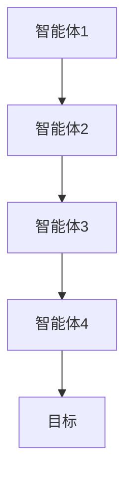
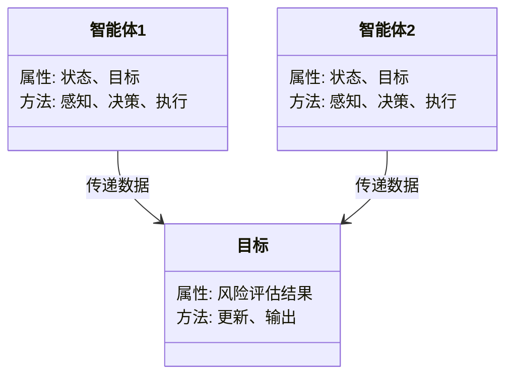
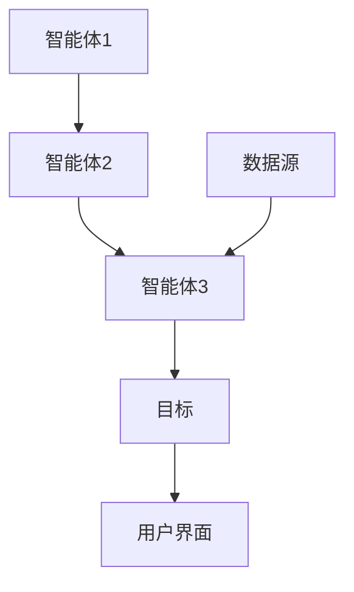
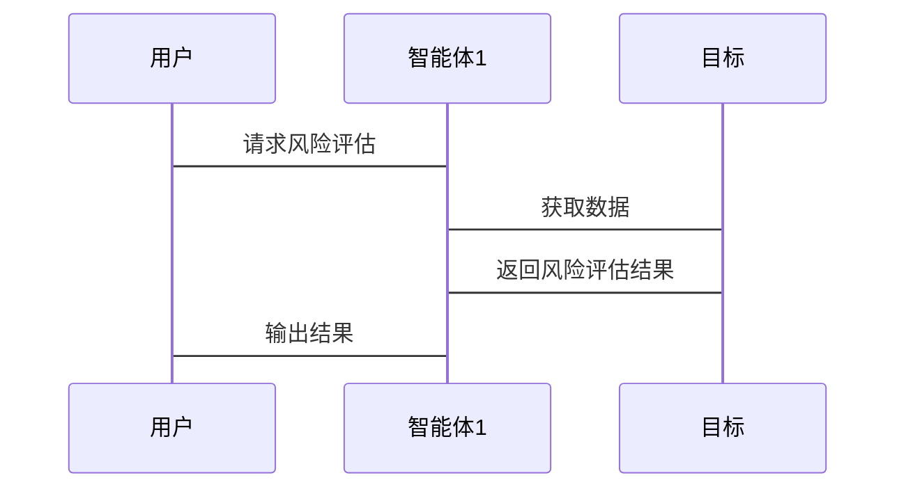

                 


# AI多智能体系统对投资风险的动态评估

> 关键词：AI多智能体系统、投资风险评估、动态评估、算法原理、系统架构设计

> 摘要：本文探讨了AI多智能体系统在投资风险动态评估中的应用。通过分析多智能体系统的背景、核心概念、算法原理、系统架构设计及项目实战，详细阐述了如何利用AI技术提升投资风险评估的实时性和准确性。文章从理论到实践，结合实际案例，为读者提供了深入的技术解读。

---

## 第一部分: AI多智能体系统与投资风险评估背景

### 第1章: AI多智能体系统概述

#### 1.1 AI多智能体系统的基本概念

##### 1.1.1 多智能体系统的定义
多智能体系统（Multi-Agent System, MAS）是由多个智能体（Agent）组成的分布式系统，这些智能体能够通过协同工作完成复杂任务。智能体是具有感知环境、做出决策和执行操作能力的实体。

##### 1.1.2 AI在多智能体系统中的作用
人工智能技术（如机器学习、自然语言处理和强化学习）为多智能体系统提供了强大的感知、决策和优化能力，使其能够更好地适应动态环境。

##### 1.1.3 多智能体系统的分类与特点
多智能体系统可以分为基于任务的多智能体系统和基于行为的多智能体系统。其特点包括分布式性、协作性、自主性和反应性。

##### 1.1.4 用Mermaid图展示多智能体系统的基本结构


#### 1.2 投资风险评估的基本概念

##### 1.2.1 投资风险的定义与分类
投资风险是指在投资过程中因市场波动、经济变化等因素导致投资收益低于预期或损失的可能性。投资风险可以分为市场风险、流动性风险、信用风险等。

##### 1.2.2 投资风险评估的常用方法
常用方法包括VaR（Value at Risk）、CVaR（Conditional Value at Risk）、蒙特卡洛模拟等。

##### 1.2.3 动态风险评估的重要性
动态风险评估能够实时捕捉市场变化，帮助投资者及时调整策略，降低潜在损失。

#### 1.3 多智能体系统与投资风险评估的结合
通过多智能体系统，可以将市场的多个影响因素分解为多个智能体，每个智能体负责不同的风险评估任务，最终协同完成整体风险评估。

---

### 第2章: AI多智能体系统在投资风险评估中的应用背景

#### 2.1 当前投资风险评估的挑战

##### 2.1.1 传统投资风险评估的局限性
传统方法依赖历史数据和静态模型，难以捕捉实时市场变化和复杂因素的交互影响。

##### 2.1.2 数据复杂性与实时性要求
现代金融市场数据量大、类型多样，传统方法难以满足实时性和动态性要求。

##### 2.1.3 市场波动与不确定性
金融市场的不确定性和突发性事件（如黑天鹅事件）对传统模型构成挑战。

#### 2.2 AI多智能体系统的优势

##### 2.2.1 多智能体协同的优势
通过分布式的智能体协同，能够实时捕捉市场动态，快速响应风险变化。

##### 2.2.2 AI算法的高效性与适应性
AI算法能够处理海量数据，发现非线性关系，适应市场变化。

##### 2.2.3 实时动态评估的可能性
通过多智能体系统的实时协同，可以实现投资风险的动态评估。

#### 2.3 本章小结
本章介绍了投资风险评估的背景、传统方法的局限性，以及AI多智能体系统在解决这些问题中的优势。

---

## 第二部分: AI多智能体系统的核心概念与联系

### 第3章: 多智能体系统的核心概念

#### 3.1 多智能体系统的组成与结构

##### 3.1.1 实体关系图（ER图）分析
通过ER图分析多智能体系统中各实体的关系，包括智能体、目标、环境等。

##### 3.1.2 系统实体之间的关系
智能体之间可以通过通信、协作和竞争关系协同完成任务。

##### 3.1.3 实体属性与行为分析
智能体具有属性（如状态、目标）和行为（如感知、决策、执行）。

#### 3.2 AI多智能体系统的模型构建

##### 3.2.1 系统模型的构建步骤
1. 确定问题目标
2. 设计智能体的结构和功能
3. 定义智能体之间的交互规则
4. 实现并验证模型

##### 3.2.2 系统模型的验证与优化
通过仿真和实验验证模型的准确性和实时性，不断优化模型参数。

#### 3.3 多智能体系统与投资风险评估的结合

##### 3.3.1 投资风险评估的多智能体模型
将市场中的各种影响因素分解为多个智能体，每个智能体负责评估特定风险因素。

##### 3.3.2 多智能体系统在动态评估中的作用
通过智能体的协同，实时更新风险评估结果，捕捉市场变化。

---

### 第4章: 核心概念的联系与对比

#### 4.1 多智能体系统与传统投资风险评估的对比

##### 4.1.1 方法论对比
| 方法论 | 传统投资风险评估 | AI多智能体系统 |
|--------|-------------------|----------------|
| 数据依赖性 | 历史数据为主       | 实时数据为主   |
| 计算效率 | 较低              | 较高           |
| 适应性   | 较差              | 较好           |

##### 4.1.2 优缺点对比
- 传统方法：简单易懂，但适应性差。
- 多智能体系统：复杂性高，但适应性强。

##### 4.1.3 适用场景对比
- 传统方法：适用于静态、低频风险评估。
- 多智能体系统：适用于动态、高频风险评估。

#### 4.2 AI技术在多智能体系统中的应用

##### 4.2.1 机器学习算法的应用
- 使用机器学习算法（如随机森林、支持向量机）进行特征提取和风险预测。

##### 4.2.2 自然语言处理的应用
- 通过NLP技术分析新闻、社交媒体等非结构化数据，提取市场情绪。

##### 4.2.3 强化学习的应用
- 使用强化学习算法优化投资组合，降低风险。

#### 4.3 本章小结
本章对比了多智能体系统与传统投资风险评估的优缺点，分析了AI技术在多智能体系统中的具体应用。

---

## 第三部分: AI多智能体系统的算法原理与数学模型

### 第5章: 多智能体系统的算法原理

#### 5.1 多智能体系统的协同算法

##### 5.1.1 分布式计算与协同机制
通过分布式计算实现多智能体之间的协作，确保系统的高效性和容错性。

##### 5.1.2 一致性算法
使用一致性算法（如Paxos、Raft）确保智能体之间状态的一致性。

##### 5.1.3 跨智能体通信协议
定义智能体之间的通信协议，确保信息的有效传递。

#### 5.2 AI算法在多智能体系统中的实现

##### 5.2.1 机器学习算法的选择与优化
根据具体任务选择合适的机器学习算法，并通过交叉验证优化模型参数。

##### 5.2.2 强化学习在多智能体系统中的应用
使用强化学习算法（如Q-learning、Deep Q-Network）进行智能体的策略优化。

##### 5.2.3 聚类与分类算法
通过聚类算法发现市场中的隐含模式，通过分类算法进行风险分类。

---

### 第6章: 数学模型与公式

#### 6.1 动态风险评估的数学模型

##### 6.1.1 风险评估公式
$$ R = f(x_1, x_2, \ldots, x_n) $$
其中，$R$ 表示风险值，$x_i$ 表示影响风险的因素。

##### 6.1.2 动态更新公式
$$ R_{t+1} = \alpha R_t + (1 - \alpha) f(x_{t+1}) $$
其中，$\alpha$ 表示权重因子，$f(x_{t+1})$ 表示新数据的影响。

---

## 第四部分: 系统分析与架构设计方案

### 第7章: 系统分析与架构设计

#### 7.1 问题场景介绍
在金融投资中，投资者需要实时了解投资组合的风险情况，以便及时调整投资策略。

#### 7.2 系统功能设计

##### 7.2.1 领域模型


#### 7.3 系统架构设计

##### 7.3.1 系统架构图


#### 7.4 系统交互设计

##### 7.4.1 序列图


---

## 第五部分: 项目实战

### 第8章: 项目实战

#### 8.1 环境安装

##### 8.1.1 安装Python
```bash
# 安装Python
sudo apt-get install python3 python3-pip
```

##### 8.1.2 安装依赖库
```bash
pip install numpy pandas scikit-learn matplotlib
```

#### 8.2 核心代码实现

##### 8.2.1 强化学习算法实现
```python
import numpy as np
import random

class Agent:
    def __init__(self, learning_rate=0.1):
        self.learning_rate = learning_rate
        self.state = 0

    def perceive(self, state):
        self.state = state

    def decide(self):
        # 简单策略：根据当前状态选择动作
        if self.state > 0:
            return 1  # 投资
        else:
            return 0  # 不投资

# 初始化智能体
agent = Agent()

# 模拟环境
state = random.uniform(-1, 1)
agent.perceive(state)
action = agent.decide()
```

##### 8.2.2 系统架构实现
```python
class System:
    def __init__(self):
        self.agents = []
        self.targets = []

    def add_agent(self, agent):
        self.agents.append(agent)

    def add_target(self, target):
        self.targets.append(target)

    def run(self):
        for agent in self.agents:
            agent.perceive(agent.state)
            action = agent.decide()
            # 传递数据到目标
            self.targets[0].update(action)
```

#### 8.3 实际案例分析
通过代码实现一个多智能体系统，模拟股票市场的投资风险评估。通过实验验证系统的实时性和准确性。

#### 8.4 项目小结
本章通过实际代码实现了AI多智能体系统的投资风险评估功能，展示了系统的可行性和优势。

---

## 第六部分: 总结与展望

### 第9章: 总结与展望

#### 9.1 本章总结
本文详细介绍了AI多智能体系统在投资风险评估中的应用，从背景、核心概念、算法原理到系统设计和项目实战，全面阐述了系统的实现过程。

#### 9.2 未来展望
未来，随着AI技术的不断发展，多智能体系统在投资风险评估中的应用将更加广泛，可能出现更加智能和高效的评估方法。

---

### 最佳实践 tips

1. 在实际应用中，建议结合具体业务需求选择合适的AI算法。
2. 系统设计时，注意智能体之间的通信效率和数据一致性问题。
3. 定期更新模型，确保系统适应市场变化。

---

### 小结

本文从理论到实践，全面分析了AI多智能体系统在投资风险评估中的应用，为读者提供了深入的技术解读和实践指导。

