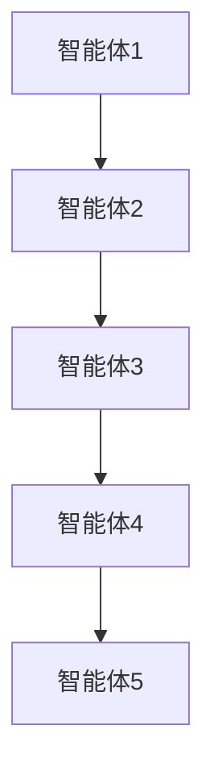
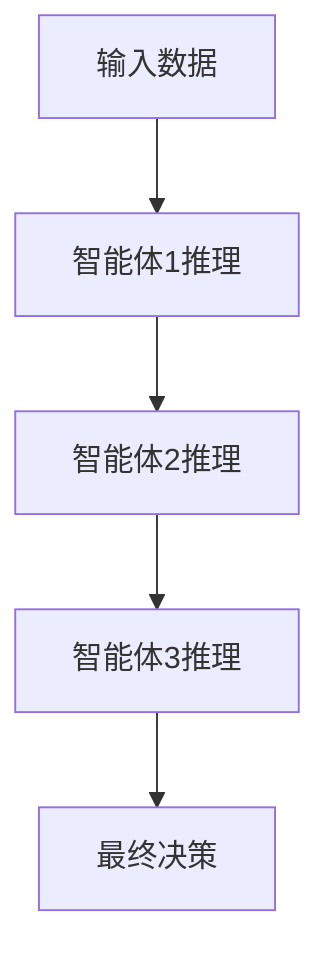
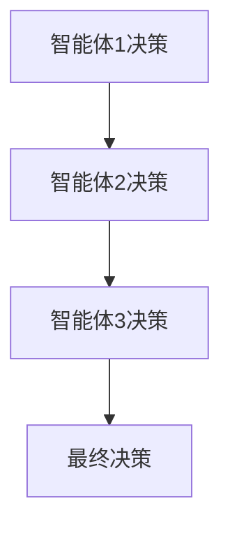
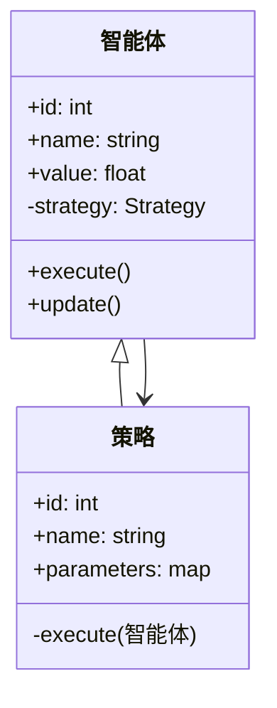
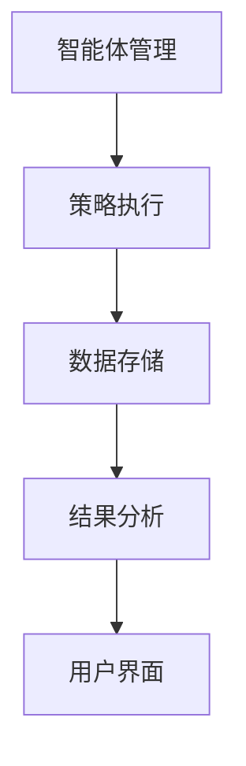
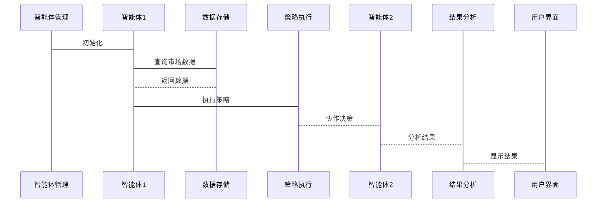

                 


# AI多智能体系统革新价值投资策略

> 关键词：AI多智能体系统、价值投资、智能投顾、量化投资、金融科技

> 摘要：本文探讨了AI多智能体系统如何革新传统价值投资策略。通过分析多智能体系统的协同学习算法、数学模型与实际应用场景，展示了AI技术在金融投资领域的潜力。文章从背景介绍、算法原理、系统架构到项目实战，全面解析了AI多智能体系统如何优化投资决策过程，为投资者提供更高效的策略选择。

---

# 第1章: AI多智能体系统与价值投资策略的背景与概念

## 1.1 多智能体系统的定义与特征

### 1.1.1 多智能体系统的定义
多智能体系统（Multi-Agent System, MAS）是由多个智能体（Agent）组成的分布式系统，这些智能体能够通过协作完成复杂的任务。与传统的单智能体系统相比，MAS具有更强的分布式计算能力和协作能力。

### 1.1.2 多智能体系统的核心特征
- **分布式性**：智能体之间通过通信和协作完成任务。
- **自主性**：每个智能体具有独立的决策能力。
- **反应性**：智能体能够根据环境变化动态调整行为。
- **社会性**：智能体之间存在复杂的交互和协作关系。

### 1.1.3 多智能体系统与传统单智能体的区别
| 特性             | 多智能体系统                     | 单智能体系统                     |
|------------------|----------------------------------|----------------------------------|
| 决策中心化       | 分布式决策                     | 集中的决策                     |
| 可扩展性         | 高                             | 低                             |
| 系统复杂性       | 高                             | 低                             |

---

## 1.2 价值投资策略的基本原理

### 1.2.1 价值投资的定义
价值投资是一种基于对公司内在价值评估的投资策略。投资者通过分析公司的财务数据、市场地位、竞争优势等因素，寻找被市场低估的投资标的。

### 1.2.2 价值投资的核心原则
- **安全边际**：买入价格低于内在价值。
- **长期视角**：关注公司的长期盈利能力。
- **分散投资**：降低单一投资的风险。

### 1.2.3 传统价值投资的局限性
- **信息处理能力有限**：传统方法难以处理海量数据。
- **主观性**：依赖分析师的主观判断。
- **效率低下**：人工分析耗时且成本高。

---

## 1.3 AI多智能体系统与价值投资策略的结合

### 1.3.1 多智能体系统在金融领域的应用
- **协同决策**：多个智能体协同分析市场数据。
- **风险控制**：通过协作降低投资风险。
- **动态调整**：实时根据市场变化调整投资策略。

### 1.3.2 价值投资策略的智能化转型
- **数据驱动**：利用大数据分析提升投资决策的准确性。
- **自动化**：智能系统自动筛选和评估投资标的。
- **实时反馈**：系统实时监控市场变化并调整策略。

### 1.3.3 多智能体系统如何革新价值投资策略
通过多智能体系统的协同学习和分布式计算能力，AI能够实时分析海量数据，发现传统方法难以察觉的投资机会。同时，多智能体系统的协作机制能够优化投资组合，降低风险。

---

## 1.4 本章小结

本章介绍了多智能体系统的定义、特征以及其在金融领域的潜力。通过对比传统价值投资的局限性，展示了AI多智能体系统如何革新价值投资策略，为投资者提供更高效、更准确的投资决策支持。

---

# 第2章: AI多智能体系统的数学模型与算法原理

## 2.1 多智能体系统的核心算法

### 2.1.1 协作学习算法
协作学习（Collaborative Learning）是多智能体系统中常用的算法之一。多个智能体通过共享知识和经验，共同完成学习任务。

#### 协作学习的流程


### 2.1.2 联合推理算法
联合推理（Joint Inference）算法通过多个智能体的协同推理，得出最优决策。

#### 联合推理的步骤


### 2.1.3 分布式决策算法
分布式决策算法（Distributed Decision-Making）通过分布式计算，实现多个智能体的协同决策。

#### 分布式决策的流程


---

## 2.2 价值评估模型的数学公式

### 2.2.1 基于多智能体的资产定价模型
资产定价模型可以通过多个智能体的协同计算得出。

$$ P_i = \sum_{j=1}^{n} w_j \cdot V_j $$

其中，\( P_i \) 是资产 \( i \) 的价格，\( w_j \) 是智能体 \( j \) 的权重，\( V_j \) 是智能体 \( j \) 计算的资产价值。

---

## 2.3 多智能体系统与价值投资策略的协同机制

### 2.3.1 多智能体协同决策的数学表达
通过多智能体的协作，可以实现对市场的全面分析。

$$ \text{最优策略} = \argmax_{s} \sum_{i=1}^{m} f_i(s) $$

其中，\( s \) 是策略，\( f_i(s) \) 是智能体 \( i \) 对策略 \( s \) 的评分。

---

## 2.4 本章小结

本章详细介绍了多智能体系统的算法原理和数学模型。通过协作学习、联合推理和分布式决策算法，AI多智能体系统能够高效地完成投资决策任务，为价值投资策略提供强大的技术支持。

---

# 第3章: 多智能体系统在价值投资中的应用

## 3.1 价值投资策略的智能化转型

### 3.1.1 传统价值投资的数字化转型
通过数字化转型，传统价值投资能够更高效地处理海量数据。

### 3.1.2 AI多智能体系统在投资决策中的作用
AI多智能体系统能够实时分析市场数据，发现投资机会。

### 3.1.3 智能化投资策略的优势
- **高效性**：快速处理大量数据。
- **准确性**：通过协同学习提高决策的准确性。
- **适应性**：实时调整投资策略。

---

## 3.2 多智能体系统的实际应用场景

### 3.2.1 股票市场中的多智能体协同
通过多个智能体的协作，实现对股票市场的全面分析。

### 3.2.2 资产组合优化的多智能体实现
多个智能体协同优化资产组合，降低风险。

### 3.2.3 风险控制的智能化策略
通过多智能体系统实时监控市场风险，及时调整投资策略。

---

## 3.3 实际案例分析

### 3.3.1 某金融公司AI多智能体系统的应用
通过案例分析，展示了AI多智能体系统在实际投资中的应用效果。

### 3.3.2 系统如何优化投资策略
通过协同学习和分布式决策，系统能够快速优化投资策略。

### 3.3.3 应用效果与经验总结
AI多智能体系统的应用显著提升了投资效率和准确性。

---

## 3.4 本章小结

本章通过实际案例分析，展示了AI多智能体系统在价值投资中的广泛应用。通过协同学习和分布式决策，系统能够高效地优化投资策略，为投资者提供更优质的服务。

---

# 第4章: 系统架构与设计

## 4.1 问题场景介绍

### 4.1.1 系统目标
设计一个基于AI多智能体系统的价值投资策略优化平台。

### 4.1.2 项目背景
随着金融市场的复杂化，传统投资策略已难以满足需求。

---

## 4.2 系统功能设计

### 4.2.1 领域模型设计
通过领域模型类图展示系统功能。



---

## 4.3 系统架构设计

### 4.3.1 系统架构图
通过架构图展示系统的整体结构。



---

## 4.4 系统接口设计

### 4.4.1 接口描述
- **智能体管理接口**：管理多个智能体的运行。
- **策略执行接口**：执行投资策略。
- **数据存储接口**：存储投资数据。

---

## 4.5 系统交互设计

### 4.5.1 交互流程


---

## 4.6 本章小结

本章详细设计了AI多智能体系统的架构与接口，展示了系统的整体结构和各部分的协作关系。

---

# 第5章: 项目实战

## 5.1 环境安装

### 5.1.1 安装Python
```bash
python --version
pip install --upgrade pip
```

### 5.1.2 安装依赖库
```bash
pip install numpy
pip install pandas
pip install matplotlib
pip install scikit-learn
```

---

## 5.2 系统核心实现

### 5.2.1 智能体类实现
```python
class Agent:
    def __init__(self, id, name):
        self.id = id
        self.name = name
        self.value = 0.0
```

### 5.2.2 策略类实现
```python
class Strategy:
    def __init__(self, name, parameters):
        self.name = name
        self.parameters = parameters
```

### 5.2.3 协作学习实现
```python
def collaborative_learning(agents):
    for agent in agents:
        agent.update()
```

---

## 5.3 实际案例分析

### 5.3.1 数据分析
分析股票市场数据，使用多智能体系统进行价值评估。

### 5.3.2 策略优化
通过协作学习优化投资策略，提升投资收益。

### 5.3.3 结果展示
展示优化后的投资策略及其效果。

---

## 5.4 本章小结

本章通过项目实战，展示了如何利用AI多智能体系统实现价值投资策略的优化。通过实际案例分析，验证了系统的有效性和高效性。

---

# 第6章: 最佳实践与未来展望

## 6.1 小结

AI多智能体系统通过协同学习和分布式决策，显著提升了价值投资策略的效率和准确性。

---

## 6.2 注意事项

- **数据质量**：确保输入数据的准确性和完整性。
- **系统安全性**：防止数据泄露和系统攻击。
- **算法优化**：持续优化算法，提升系统性能。

---

## 6.3 未来展望

随着AI技术的不断发展，多智能体系统将在金融领域发挥更大的作用。未来，可以通过以下方向进一步优化：
- **强化学习**：提升智能体的决策能力。
- **边缘计算**：优化系统的实时性。
- **自适应算法**：增强系统的适应能力。

---

## 6.4 拓展阅读

- **书籍推荐**：
  - 《Multi-Agent Systems: Algorithmic, Complexity, and Synthesis》
  - 《Reinforcement Learning: Theory and Algorithms》
- **技术博客**：
  - [Multi-Agent Systems in Finance](https://example.com)
  - [AI in Investment Management](https://example.com)

---

## 6.5 本章小结

本章总结了AI多智能体系统的最佳实践，并展望了未来的发展方向。通过持续优化和创新，多智能体系统将在金融领域发挥更大的作用。

--- 

# 结语

AI多智能体系统的应用为价值投资策略的革新提供了强大的技术支持。通过协作学习和分布式决策，系统能够高效地优化投资策略，为投资者提供更优质的服务。未来，随着技术的不断发展，AI多智能体系统将在金融领域发挥更大的作用，为投资决策提供更智能化的解决方案。

