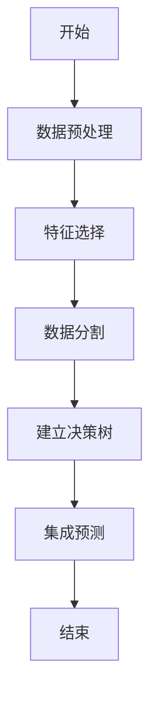
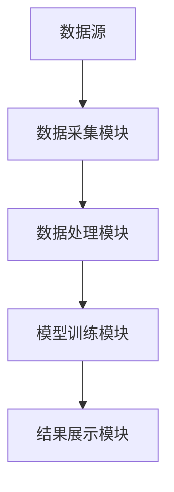

                 


# AI如何优化大卫·德雷曼的宏观经济分析

> 关键词：AI，宏观经济分析，大卫·德雷曼，机器学习，经济预测，数据驱动

> 摘要：本文探讨了人工智能（AI）如何优化大卫·德雷曼的宏观经济分析。通过结合宏观经济分析的核心概念与AI技术，本文详细分析了AI在宏观经济预测、政策制定和经济模型优化中的应用。文章从背景介绍、核心概念、算法原理、系统架构到项目实战，全面阐述了AI如何提升宏观经济分析的效率与准确性。通过具体案例分析和代码实现，本文为读者展示了AI在宏观经济分析中的巨大潜力和实际应用价值。

---

## 第1章：宏观经济分析的背景与挑战

### 1.1 宏观经济分析的核心概念

#### 1.1.1 宏观经济分析的定义与范围
宏观经济分析是研究整体经济系统运行状况的学科，包括GDP、通货膨胀、失业率、货币政策和财政政策等核心指标。这些指标反映了经济的健康状况，帮助政府和企业制定相关政策。

#### 1.1.2 宏观经济指标的分类与作用
- **总量指标**：如GDP、失业率等，用于衡量整体经济表现。
- **价格指标**：如通货膨胀率，反映货币购买力的变化。
- **结构指标**：如行业分布，揭示经济结构特征。
- **对外经济指标**：如国际贸易和汇率，影响全球经济互动。

#### 1.1.3 宏观经济分析的复杂性与挑战
宏观经济分析涉及众多变量，且变量之间存在复杂的相互作用。传统的分析方法依赖于假设和简化模型，可能导致预测偏差。此外，数据的实时性和多样性增加了分析的难度。

### 1.2 大卫·德雷曼的宏观经济分析方法

#### 1.2.1 德雷曼宏观经济分析的理论基础
大卫·德雷曼（David L. Dimson）是一位著名的金融学家，其研究主要集中在投资组合管理和风险评估领域。他的分析方法强调数据驱动和实证研究，注重利用历史数据和统计方法来预测经济趋势。

#### 1.2.2 德雷曼分析方法的独特性
德雷曼的方法注重长期数据的分析，并结合统计学方法进行预测。他的研究不仅关注单一经济指标，还强调多个指标之间的相互关系。例如，他通过分析历史数据发现，通货膨胀率与股票市场的表现存在一定的相关性。

#### 1.2.3 德雷曼分析方法的实际应用案例
德雷曼的研究成果被广泛应用于投资决策和政策制定中。例如，他的研究成果帮助投资者更好地理解经济周期波动，并据此调整投资策略。

### 1.3 AI在宏观经济分析中的潜力

#### 1.3.1 AI技术在宏观经济分析中的优势
AI技术能够处理海量数据，并通过机器学习算法发现复杂的数据模式。与传统方法相比，AI在宏观经济预测中的优势在于其高效性和准确性。

#### 1.3.2 AI如何提升宏观经济分析的效率与准确性
通过AI技术，可以实时分析大量的宏观经济数据，并快速生成预测结果。此外，AI能够识别传统方法难以发现的非线性关系，从而提高预测的准确性。

#### 1.3.3 AI在宏观经济预测中的应用前景
随着AI技术的不断发展，其在宏观经济预测中的应用前景广阔。例如，通过自然语言处理技术，AI可以从新闻、政策文件中提取信息，辅助经济预测。

---

## 第2章：宏观经济分析的核心概念与AI的关系

### 2.1 宏观经济分析的关键要素

#### 2.1.1 GDP、通货膨胀、失业率等核心指标
- **GDP（国内生产总值）**：衡量一个国家或地区的经济规模。
- **通货膨胀率**：反映物价水平的变化。
- **失业率**：衡量劳动力市场的健康状况。

#### 2.1.2 宏观经济政策的制定与执行
宏观经济政策包括货币政策和财政政策。货币政策由中央银行通过调整利率和货币供应量来实现，而财政政策则通过政府支出和税收来调节经济。

#### 2.1.3 宏观经济模型的构建与应用
宏观经济模型用于模拟经济系统的运行，帮助政策制定者预测政策效果。常见的模型包括凯恩斯模型和货币主义模型。

### 2.2 AI技术的核心原理

#### 2.2.1 机器学习的基本概念与分类
机器学习是一种人工智能技术，通过数据训练模型，使其能够从数据中学习并做出预测或决策。机器学习主要分为监督学习、无监督学习和强化学习。

#### 2.2.2 深度学习与传统机器学习的区别
深度学习是一种特殊的机器学习技术，通过多层神经网络模型来学习数据的特征。与传统机器学习相比，深度学习能够处理更复杂的数据模式。

#### 2.2.3 AI在数据处理与模式识别中的优势
AI技术能够处理海量数据，并通过模式识别技术发现数据中的潜在规律。例如，通过图像识别技术，AI可以从卫星图像中识别经济活动的特征。

### 2.3 宏观经济分析与AI的结合点

#### 2.3.1 数据驱动的宏观经济预测
通过AI技术，可以利用历史数据和实时数据进行宏观经济预测。例如，通过时间序列分析预测GDP增长率。

#### 2.3.2 AI在经济政策制定中的辅助作用
AI可以通过模拟政策效果，帮助政策制定者做出更科学的决策。例如，通过政策模拟模型，AI可以预测不同货币政策对经济的影响。

#### 2.3.3 AI在经济模型优化中的应用
通过AI技术，可以优化宏观经济模型的参数，使其更准确地反映经济系统的运行。

---

## 第3章：宏观经济预测的机器学习算法

### 3.1 常见的宏观经济预测算法

#### 3.1.1 线性回归模型
线性回归是一种简单而有效的预测模型。其基本假设是自变量与因变量之间存在线性关系。数学模型如下：
$$ y = \beta_0 + \beta_1x + \epsilon $$

#### 3.1.2 支持向量机（SVM）
支持向量机是一种监督学习算法，适用于分类和回归问题。其核心思想是通过找到一个超平面，使得数据点与超平面的距离最大化。

#### 3.1.3 随机森林与梯度提升树
随机森林是一种基于决策树的集成算法，通过组合多个决策树的结果来提高预测准确性。梯度提升树是一种通过迭代优化模型的算法。

### 3.2 算法原理与流程图

#### 3.2.1 线性回归的数学模型
$$ y = \beta_0 + \beta_1x + \epsilon $$

#### 3.2.2 随机森林的算法流程图


### 3.3 算法实现与优化

#### 3.3.1 算法的调参与优化
通过调整模型参数（如学习率、树的深度等），可以优化模型的性能。例如，在随机森林中，可以通过调整树的数量和特征选择方法来提高预测准确率。

#### 3.3.2 算法的可解释性问题
尽管AI技术能够提高预测的准确性，但其预测结果往往缺乏可解释性。例如，深度学习模型的预测结果难以解释。

#### 3.3.3 算法的鲁棒性与稳定性
模型的鲁棒性是指其对数据噪声的抵抗能力，稳定性则是指模型在不同训练数据上的表现一致性。通过交叉验证和模型集成，可以提高模型的鲁棒性和稳定性。

---

## 第4章：宏观经济分析的系统架构与AI结合方案

### 4.1 宏观经济分析系统的功能模块

#### 4.1.1 数据采集模块
数据采集模块负责从各种来源获取宏观经济数据，如政府统计机构发布的数据、新闻媒体的报道等。

#### 4.1.2 数据处理模块
数据处理模块对采集到的数据进行清洗、转换和标准化处理，确保数据的准确性和一致性。

#### 4.1.3 模型训练模块
模型训练模块利用处理后的数据训练机器学习模型，如线性回归、随机森林等。

#### 4.1.4 结果展示模块
结果展示模块将模型的预测结果以可视化的方式呈现，如图表、报告等。

### 4.2 宏观经济分析系统的架构设计

#### 4.2.1 系统功能设计
- **数据采集**：从多种数据源获取宏观经济数据。
- **数据处理**：清洗、转换和标准化数据。
- **模型训练**：训练机器学习模型。
- **结果展示**：可视化预测结果。

#### 4.2.2 系统架构设计


---

## 第5章：项目实战

### 5.1 环境安装与数据准备

#### 5.1.1 环境安装
需要安装Python、NumPy、Pandas、Scikit-learn等库。

#### 5.1.2 数据准备
从公开数据源获取宏观经济数据，如GDP、通货膨胀率、失业率等。

### 5.2 系统核心实现源代码

#### 5.2.1 数据预处理
```python
import pandas as pd
import numpy as np

# 读取数据
data = pd.read_csv('macroeconomic.csv')

# 数据清洗
data.dropna(inplace=True)

# 标准化处理
from sklearn.preprocessing import StandardScaler
scaler = StandardScaler()
scaled_data = scaler.fit_transform(data[['GDP', 'inflation', 'unemployment']])
```

#### 5.2.2 模型训练
```python
from sklearn.ensemble import RandomForestRegressor
from sklearn.model_selection import train_test_split

# 划分训练集和测试集
X_train, X_test, y_train, y_test = train_test_split(scaled_data, data['GDP'], test_size=0.2)

# 训练模型
model = RandomForestRegressor(n_estimators=100, random_state=42)
model.fit(X_train, y_train)

# 预测结果
y_pred = model.predict(X_test)
```

### 5.3 实际案例分析

#### 5.3.1 案例分析
假设我们有一个包含GDP、通货膨胀率和失业率的数据集，目标是预测未来的GDP增长率。

#### 5.3.2 模型评估
通过均方误差（MSE）和R²评分来评估模型的性能。

### 5.4 项目小结

#### 5.4.1 项目总结
通过项目实战，我们了解了AI技术在宏观经济分析中的具体应用，掌握了数据处理和模型训练的步骤。

#### 5.4.2 项目收获
通过项目，我们学会了如何利用Python和机器学习算法进行宏观经济预测，提高了实际操作能力。

---

## 第6章：总结与展望

### 6.1 总结

#### 6.1.1 AI在宏观经济分析中的优势
AI技术能够提高宏观经济预测的效率和准确性，帮助政策制定者做出更科学的决策。

#### 6.1.2 宏观经济分析与AI的结合前景
随着AI技术的不断发展，其在宏观经济分析中的应用前景广阔。例如，通过自然语言处理技术，AI可以从新闻、政策文件中提取信息，辅助经济预测。

### 6.2 展望

#### 6.2.1 未来的挑战
AI技术在宏观经济分析中的应用仍面临一些挑战，如数据的实时性、模型的可解释性等。

#### 6.2.2 未来的机遇
随着技术的进步，AI在宏观经济分析中的应用将更加广泛。例如，通过边缘计算技术，AI可以实现实时经济预测。

### 6.3 最佳实践 tips

#### 6.3.1 数据预处理的重要性
数据预处理是保证模型性能的关键步骤，需要仔细清洗和标准化数据。

#### 6.3.2 模型选择与调优
选择合适的模型并进行参数调优，可以显著提高模型的预测准确率。

#### 6.3.3 结果解释与可视化
通过可视化工具，可以更直观地展示预测结果，并帮助用户理解模型的输出。

---

通过以上步骤，我们详细探讨了AI如何优化大卫·德雷曼的宏观经济分析，从理论到实践，为读者提供了全面的指导。希望这篇文章能够为宏观经济分析领域的研究者和实践者提供有价值的参考。

