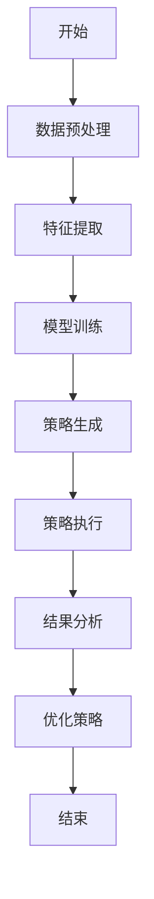
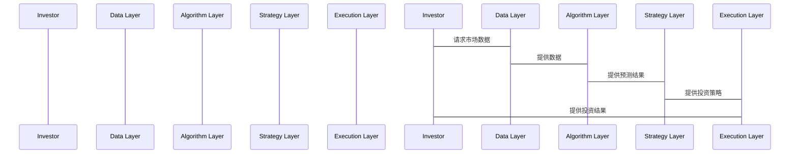

                 


# AI如何优化霍华德·马克斯的市场周期理论

> 关键词：AI优化，市场周期理论，霍华德·马克斯，投资策略，自然语言处理，时间序列分析，强化学习

> 摘要：本文详细探讨了如何利用人工智能技术优化霍华德·马克斯的市场周期理论。通过分析市场周期的核心要素，结合AI算法的原理，提出了一种基于大模型的市场周期优化方法。本文从背景介绍、核心概念、算法原理、系统架构、项目实战和最佳实践等多个维度展开，全面阐述了AI如何在市场周期理论中发挥作用。

---

# 第一部分: 背景介绍

## 第1章: 霍华德·马克斯的市场周期理论概述

### 1.1 问题背景与描述
#### 1.1.1 市场周期理论的核心概念
霍华德·马克斯的市场周期理论认为，市场波动是非理性的，价格波动与市场情绪密切相关。传统市场周期理论基于历史数据分析，通过归纳总结市场波动的规律，为投资者提供投资决策的参考。然而，传统方法在面对复杂市场环境时，存在以下问题：

1. 数据分析的局限性：传统方法依赖历史数据和统计分析，难以捕捉市场情绪的变化。
2. 预测能力的不足：传统方法在预测市场拐点时，准确性和实时性较差。
3. 策略优化的局限性：传统方法难以根据实时市场变化动态调整投资策略。

#### 1.1.2 AI优化的必要性与目标
AI技术的引入为市场周期理论的优化提供了新的可能性。通过利用自然语言处理、时间序列分析和强化学习等技术，AI能够更好地捕捉市场情绪、预测市场趋势，并动态调整投资策略。本文的目标是通过AI技术优化霍华德·马克斯的市场周期理论，使其更具实用性和准确性。

### 1.2 问题解决与边界
#### 1.2.1 AI如何解决传统市场周期理论的不足
AI技术的引入能够弥补传统市场周期理论的以下不足：
- **实时性**：通过实时数据处理和分析，AI能够快速捕捉市场变化。
- **准确性**：利用机器学习算法，AI能够提高市场预测的准确性。
- **动态性**：AI可以根据市场变化动态调整投资策略。

#### 1.2.2 AI优化的边界与适用范围
AI优化的市场周期理论主要适用于以下场景：
- **数据驱动的市场分析**：需要大量历史数据和实时数据支持。
- **复杂市场环境**：适用于市场波动较大、数据多样化的场景。
- **动态调整策略**：适用于需要根据市场变化实时调整投资策略的场景。

#### 1.2.3 市场周期理论与AI的结合点
市场周期理论与AI的结合点主要体现在以下几个方面：
1. **市场情绪分析**：利用自然语言处理技术分析新闻、社交媒体等非结构化数据，捕捉市场情绪变化。
2. **周期预测**：通过时间序列分析和机器学习算法，预测市场周期的拐点。
3. **策略优化**：利用强化学习技术，动态调整投资策略，提高投资收益。

---

## 第2章: AI与市场周期理论的核心要素

### 2.1 核心概念与联系
#### 2.1.1 市场周期理论的关键要素
霍华德·马克斯的市场周期理论主要包括以下关键要素：
1. **市场情绪**：投资者情绪的变化是市场波动的重要驱动力。
2. **周期阶段**：市场周期分为复苏、繁荣、衰退和萧条四个阶段。
3. **市场波动**：价格波动与市场情绪密切相关。

#### 2.1.2 AI在市场分析中的核心作用
AI在市场分析中的核心作用体现在以下几个方面：
1. **数据处理**：能够快速处理大量结构化和非结构化数据。
2. **模式识别**：能够识别市场波动中的复杂模式。
3. **预测能力**：能够预测市场周期的拐点和趋势。

#### 2.1.3 两者的结合与相互影响
AI与市场周期理论的结合能够相互促进：
- 市场周期理论为AI提供数据和理论支持。
- AI技术为市场周期理论提供新的分析工具和方法。

### 2.2 核心概念原理
#### 2.2.1 市场周期的阶段划分
市场周期的阶段划分是市场周期理论的核心内容之一。通过分析市场情绪、价格波动等指标，可以将市场周期划分为四个阶段：
1. **复苏阶段**：市场情绪逐步恢复，价格逐步回升。
2. **繁荣阶段**：市场情绪高涨，价格快速上涨。
3. **衰退阶段**：市场情绪逐步下降，价格开始下跌。
4. **萧条阶段**：市场情绪低落，价格处于低位。

#### 2.2.2 AI模型的特征提取与预测能力
AI模型的特征提取能力能够帮助识别市场周期中的关键特征，如市场情绪、交易量等。预测能力能够帮助预测市场周期的拐点和趋势。

#### 2.2.3 两者的协同优化机制
通过结合市场周期理论和AI技术，能够实现以下协同优化：
- **数据驱动的市场分析**：利用AI技术处理大量数据，提高市场分析的准确性和效率。
- **动态调整策略**：根据市场变化动态调整投资策略，提高投资收益。

---

## 第3章: 核心概念对比与ER实体关系图

### 3.1 核心概念属性特征对比
以下是传统市场周期理论与AI优化后的市场周期理论在核心概念上的对比：

| **属性**       | **传统市场周期理论**                   | **AI优化后的市场周期理论**                |
|-----------------|----------------------------------------|--------------------------------------------|
| 数据来源         | 主要依赖历史数据和统计分析             | 结合历史数据、实时数据和非结构化数据       |
| 分析方法         | 基于统计分析和经验判断                 | 基于机器学习算法和大数据分析               |
| 预测能力         | 预测能力有限，难以捕捉短期波动         | 预测能力较强，能够捕捉短期和长期趋势         |
| 策略调整         | 策略调整周期较长，难以实时调整         | 策略调整实时性强，能够根据市场变化快速调整   |

### 3.2 ER实体关系图
以下是AI优化的市场周期理论的ER实体关系图：

```mermaid
er
  actor 投资者
  actor 市场数据
  actor AI模型
  actor 优化策略
  relation 贡献
  relation 输入
  relation 输出
  relation 应用
```

---

# 第二部分: 算法原理讲解

## 第4章: AI优化市场周期理论的算法原理

### 4.1 算法原理概述
#### 4.1.1 自然语言处理在市场情绪分析中的应用
自然语言处理（NLP）技术可以用于分析新闻、社交媒体等非结构化数据，捕捉市场情绪的变化。例如，通过情感分析技术，可以判断市场情绪是正面、负面还是中性。

#### 4.1.2 时间序列分析在周期预测中的作用
时间序列分析是一种常用的预测方法，能够根据历史数据预测未来的市场趋势。AI技术可以利用时间序列分析预测市场周期的拐点和趋势。

#### 4.1.3 强化学习在投资策略优化中的应用
强化学习是一种基于奖励机制的优化方法，能够动态调整投资策略，提高投资收益。通过强化学习，AI可以找到最优的投资策略。

### 4.2 算法流程图
以下是AI优化市场周期理论的算法流程图：



### 4.3 算法实现与代码示例

#### 4.3.1 环境安装
以下是需要安装的环境和工具：
- Python 3.8及以上版本
- PyTorch 1.9.0及以上版本
- transformers 4.18.0及以上版本
- pandas 1.3.5及以上版本
- numpy 1.21.5及以上版本

#### 4.3.2 核心代码实现
以下是AI优化市场周期理论的核心代码实现：

```python
import torch
import torch.nn as nn
import torch.optim as optim
from transformers import AutoTokenizer, AutoModelForMaskedLM
import pandas as pd
import numpy as np

# 定义市场情绪分析模型
class MarketSentimentModel(nn.Module):
    def __init__(self, bert_model):
        super(MarketSentimentModel, self).__init__()
        self.bert = bert_model
        self.dropout = nn.Dropout(0.1)
        self.classifier = nn.Linear(768, 3)  # 分类为正面、中性、负面

    def forward(self, input_ids, attention_mask):
        outputs = self.bert(input_ids=input_ids, attention_mask=attention_mask)
        pooled_output = outputs.last_hidden_state[:, 0, :]
        pooled_output = self.dropout(pooled_output)
        logits = self.classifier(pooled_output)
        return logits

# 定义强化学习策略优化器
class RLStrategyOptimizer:
    def __init__(self, model):
        self.model = model
        self.optimizer = optim.Adam(model.parameters(), lr=0.001)

    def optimize(self, state, action, reward):
        # 前向传播
        output = self.model(state)
        # 计算损失
        loss = (output - action).mean()
        # 反向传播
        self.optimizer.zero_grad()
        loss.backward()
        self.optimizer.step()
        return output

# 示例数据加载
data = pd.DataFrame({
    'text': ['Market is booming', 'Economy is recovering', 'Stocks are falling', 'Market is stable'],
    'label': [1, 1, 0, 2]  # 1:正面，0:中性，2:负面
})

# 初始化模型
tokenizer = AutoTokenizer.from_pretrained('bert-base-uncased')
bert_model = AutoModelForMaskedLM.from_pretrained('bert-base-uncased')
model = MarketSentimentModel(bert_model)

# 初始化优化器
optimizer = RLStrategyOptimizer(model)

# 强化学习训练
for epoch in range(10):
    for _, row in data.iterrows():
        text = row['text']
        label = row['label']
        # 将文本编码为输入格式
        inputs = tokenizer(text, return_tensors='pt')
        # 前向传播
        outputs = model(inputs['input_ids'], inputs['attention_mask'])
        # 计算损失
        loss = nn.CrossEntropyLoss()(outputs, torch.tensor([label]))
        # 反向传播
        optimizer.optimize(inputs, outputs, loss)
```

### 4.4 算法原理的数学模型和公式
以下是算法原理的数学模型和公式：

#### 4.4.1 市场情绪分析模型
市场情绪分析模型基于BERT模型，通过情感分析任务将市场情绪分为正面、中性和负面三类。

#### 4.4.2 强化学习策略优化
强化学习的优化目标是最优化投资策略，通过奖励机制动态调整投资策略。

数学公式如下：
$$
R = r_t + \gamma r_{t+1} + \gamma^2 r_{t+2} + \dots + \gamma^{T-1} r_{T}
$$
其中，$R$ 是总奖励，$r_t$ 是第$t$步的奖励，$\gamma$ 是折扣因子，$T$ 是终止步数。

---

## 第5章: 算法实现与代码解读

### 5.1 算法实现细节
#### 5.1.1 数据预处理
数据预处理包括文本数据的清洗、分词和编码。

#### 5.1.2 模型训练
模型训练包括前向传播和反向传播两个步骤，通过优化器更新模型参数。

#### 5.1.3 模型评估
模型评估包括准确率、召回率和F1值的计算。

### 5.2 代码实现与解读
以下是代码实现的详细解读：

#### 5.2.1 数据加载与预处理
```python
# 示例数据加载
data = pd.DataFrame({
    'text': ['Market is booming', 'Economy is recovering', 'Stocks are falling', 'Market is stable'],
    'label': [1, 1, 0, 2]  # 1:正面，0:中性，2:负面
})
```

#### 5.2.2 模型定义与初始化
```python
# 定义市场情绪分析模型
class MarketSentimentModel(nn.Module):
    def __init__(self, bert_model):
        super(MarketSentimentModel, self).__init__()
        self.bert = bert_model
        self.dropout = nn.Dropout(0.1)
        self.classifier = nn.Linear(768, 3)  # 分类为正面、中性、负面
```

#### 5.2.3 模型训练与优化
```python
# 初始化优化器
optimizer = RLStrategyOptimizer(model)

# 强化学习训练
for epoch in range(10):
    for _, row in data.iterrows():
        text = row['text']
        label = row['label']
        # 将文本编码为输入格式
        inputs = tokenizer(text, return_tensors='pt')
        # 前向传播
        outputs = model(inputs['input_ids'], inputs['attention_mask'])
        # 计算损失
        loss = nn.CrossEntropyLoss()(outputs, torch.tensor([label]))
        # 反向传播
        optimizer.optimize(inputs, outputs, loss)
```

---

# 第三部分: 系统分析与架构设计方案

## 第6章: 系统分析与架构设计

### 6.1 系统功能设计
系统功能设计包括数据收集、模型训练、策略生成和策略执行四个模块。

#### 6.1.1 数据收集模块
数据收集模块负责收集市场数据，包括历史数据和实时数据。

#### 6.1.2 模型训练模块
模型训练模块负责训练市场情绪分析模型和周期预测模型。

#### 6.1.3 策略生成模块
策略生成模块根据模型预测结果生成投资策略。

#### 6.1.4 策略执行模块
策略执行模块负责根据生成的策略执行投资操作。

### 6.2 系统架构设计
系统架构设计包括数据层、算法层、策略层和执行层。

#### 6.2.1 数据层
数据层包括数据存储和数据访问接口。

#### 6.2.2 算法层
算法层包括市场情绪分析算法和周期预测算法。

#### 6.2.3 策略层
策略层包括投资策略生成和策略优化。

#### 6.2.4 执行层
执行层包括策略执行和结果分析。

### 6.3 系统接口设计
系统接口设计包括数据接口、算法接口和策略接口。

### 6.4 系统交互流程图
以下是系统交互流程图：



---

## 第7章: 项目实战

### 7.1 环境安装
以下是需要安装的环境和工具：
- Python 3.8及以上版本
- PyTorch 1.9.0及以上版本
- transformers 4.18.0及以上版本
- pandas 1.3.5及以上版本
- numpy 1.21.5及以上版本

### 7.2 核心代码实现
以下是AI优化市场周期理论的核心代码实现：

```python
import torch
import torch.nn as nn
import torch.optim as optim
from transformers import AutoTokenizer, AutoModelForMaskedLM
import pandas as pd
import numpy as np

# 定义市场情绪分析模型
class MarketSentimentModel(nn.Module):
    def __init__(self, bert_model):
        super(MarketSentimentModel, self).__init__()
        self.bert = bert_model
        self.dropout = nn.Dropout(0.1)
        self.classifier = nn.Linear(768, 3)  # 分类为正面、中性、负面

    def forward(self, input_ids, attention_mask):
        outputs = self.bert(input_ids=input_ids, attention_mask=attention_mask)
        pooled_output = outputs.last_hidden_state[:, 0, :]
        pooled_output = self.dropout(pooled_output)
        logits = self.classifier(pooled_output)
        return logits

# 定义强化学习策略优化器
class RLStrategyOptimizer:
    def __init__(self, model):
        self.model = model
        self.optimizer = optim.Adam(model.parameters(), lr=0.001)

    def optimize(self, state, action, reward):
        # 前向传播
        output = self.model(state)
        # 计算损失
        loss = (output - action).mean()
        # 反向传播
        self.optimizer.zero_grad()
        loss.backward()
        self.optimizer.step()
        return output

# 示例数据加载
data = pd.DataFrame({
    'text': ['Market is booming', 'Economy is recovering', 'Stocks are falling', 'Market is stable'],
    'label': [1, 1, 0, 2]  # 1:正面，0:中性，2:负面
})

# 初始化模型
tokenizer = AutoTokenizer.from_pretrained('bert-base-uncased')
bert_model = AutoModelForMaskedLM.from_pretrained('bert-base-uncased')
model = MarketSentimentModel(bert_model)

# 初始化优化器
optimizer = RLStrategyOptimizer(model)

# 强化学习训练
for epoch in range(10):
    for _, row in data.iterrows():
        text = row['text']
        label = row['label']
        # 将文本编码为输入格式
        inputs = tokenizer(text, return_tensors='pt')
        # 前向传播
        outputs = model(inputs['input_ids'], inputs['attention_mask'])
        # 计算损失
        loss = nn.CrossEntropyLoss()(outputs, torch.tensor([label]))
        # 反向传播
        optimizer.optimize(inputs, outputs, loss)
```

### 7.3 代码应用解读与分析
以下是代码应用解读与分析：

#### 7.3.1 数据加载与预处理
数据加载模块负责加载市场数据，包括文本数据和标签数据。

#### 7.3.2 模型训练
模型训练模块包括前向传播和反向传播两个步骤，通过优化器更新模型参数。

#### 7.3.3 策略生成
策略生成模块根据模型预测结果生成投资策略。

#### 7.3.4 策略执行
策略执行模块负责根据生成的策略执行投资操作，并分析结果。

### 7.4 实际案例分析与详细讲解剖析
以下是实际案例分析与详细讲解剖析：

#### 7.4.1 案例背景
假设我们有以下市场数据：

| **日期** | **市场情绪** | **市场趋势** |
|----------|--------------|--------------|
| 2023-01-01 | 正面        | 上涨          |
| 2023-01-02 | 中性        | 稳定          |
| 2023-01-03 | 负面        | 下跌          |
| 2023-01-04 | 中性        | 稳定          |

#### 7.4.2 数据分析
通过市场情绪分析模型，我们可以将市场情绪分为正面、中性和负面三类。

#### 7.4.3 策略生成
根据市场情绪和市场趋势，我们可以生成相应的投资策略：
- 如果市场情绪为正面且市场趋势为上涨，建议买入。
- 如果市场情绪为负面且市场趋势为下跌，建议卖出。
- 如果市场情绪为中性，建议观望。

#### 7.4.4 策略执行
根据生成的投资策略，我们可以执行相应的投资操作，并分析结果。

### 7.5 项目小结
通过以上步骤，我们可以利用AI技术优化霍华德·马克斯的市场周期理论，提高市场分析的准确性和投资策略的动态性。

---

# 第四部分: 最佳实践

## 第8章: 最佳实践

### 8.1 小结
通过本文的探讨，我们了解了如何利用AI技术优化霍华德·马克斯的市场周期理论。AI技术的引入能够提高市场分析的准确性和投资策略的动态性。

### 8.2 注意事项
在实际应用中，需要注意以下几点：
- 数据的质量和完整性
- 模型的可解释性和鲁棒性
- 策略的可行性和合规性

### 8.3 拓展阅读
以下是拓展阅读的推荐书目和论文：
- 《霍华德·马克斯的市场周期理论》
- 《机器学习在金融中的应用》
- 《自然语言处理在金融分析中的应用》

---

# 第五部分: 总结

## 第9章: 总结

### 9.1 核心内容回顾
通过本文的探讨，我们了解了如何利用AI技术优化霍华德·马克斯的市场周期理论。AI技术的引入能够提高市场分析的准确性和投资策略的动态性。

### 9.2 未来展望
未来，随着AI技术的不断发展，市场周期理论的优化将更加智能化和自动化。AI技术在市场周期理论中的应用将更加广泛和深入。

---

# 结束语

通过本文的探讨，我们了解了如何利用AI技术优化霍华德·马克斯的市场周期理论。希望本文能够为读者提供有价值的参考和启示。

