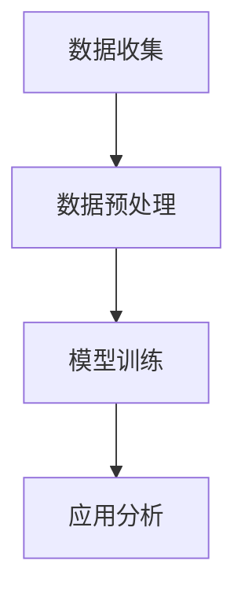
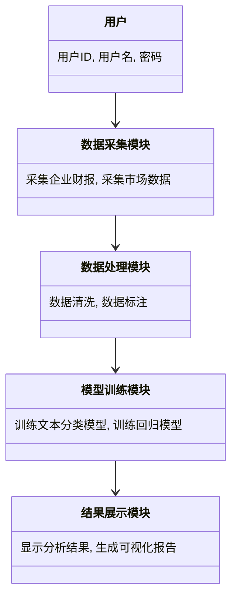
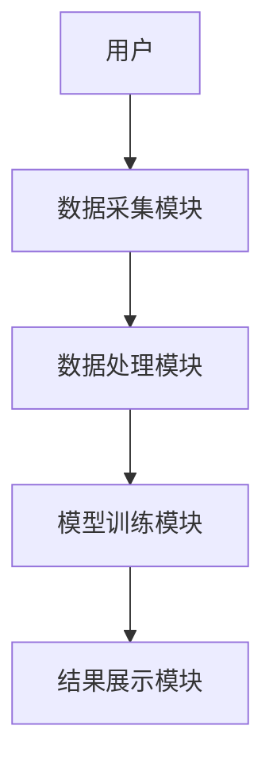
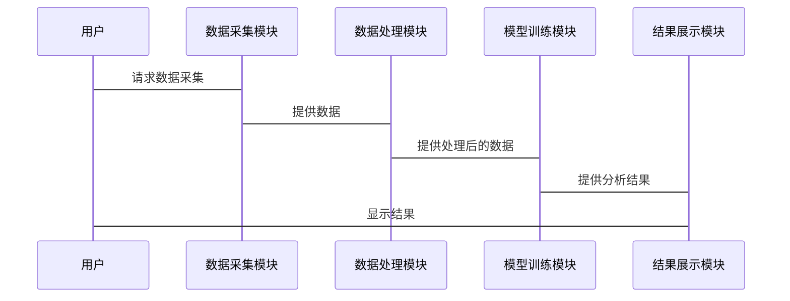

                 


# AI如何增强巴菲特的商业分析方法

> 关键词：AI, 巴菲特, 商业分析, 投资决策, 数据分析, 价值投资

> 摘要：本文探讨了人工智能（AI）技术如何增强巴菲特的商业分析方法。通过分析巴菲特的价值投资理念和AI技术的核心原理，结合实际案例，展示了AI在文本分析、数据预测和竞争分析等方面对巴菲特方法的增强作用。文章还详细介绍了系统架构设计、项目实战和算法实现，为读者提供了一个全面的视角，理解如何将AI技术与巴菲特的投资策略相结合，以提升商业分析的深度与广度。

---

# 第一章: 引言: AI与巴菲特商业分析方法的结合

## 1.1 问题背景

### 1.1.1 巴菲特商业分析方法的核心理念
巴菲特的价值投资理念强调长期、基本面分析和安全边际。他通过分析企业的财务报表、竞争优势和管理层质量，寻找具有持续盈利能力的企业进行投资。这种方法依赖于大量的数据和深入的分析，但其依赖人工判断和经验的局限性逐渐显现。

### 1.1.2 AI技术的快速发展与商业分析的结合
人工智能技术，特别是大语言模型（LLM）和机器学习算法，近年来取得了显著进步。这些技术能够处理和分析海量数据，发现隐藏的模式和趋势，为商业分析提供了新的工具和方法。

### 1.1.3 问题解决：AI如何增强商业分析的深度与广度
AI技术可以增强巴菲特商业分析方法的深度与广度，通过自动化数据处理、模式识别和预测建模，帮助投资者更高效地识别投资机会，优化决策过程。

## 1.2 问题描述

### 1.2.1 巴菲特分析方法的局限性
- **数据处理能力有限**：巴菲特的方法依赖人工分析，难以处理海量数据。
- **经验依赖性**：分析结果受到分析师经验和判断的影响。
- **效率问题**：手动分析耗时且效率低下。

### 1.2.2 AI在商业分析中的潜在价值
- **自动化数据处理**：AI能够快速处理和分析大量数据。
- **模式识别**：AI可以发现人类难以察觉的模式和趋势。
- **预测能力**：AI可以通过历史数据预测未来趋势。

### 1.2.3 结合AI与巴菲特方法的可行性与必要性
- **可行性**：AI技术已经成熟，可以应用于商业分析。
- **必要性**：通过结合AI技术，巴菲特的方法可以更高效、准确地应用于复杂市场环境。

## 1.3 问题解决：AI如何增强巴菲特方法

### 1.3.1 数据驱动的商业分析
AI技术通过数据驱动的方法，帮助投资者更全面地分析企业的财务状况、市场表现和竞争优势。

### 1.3.2 自然语言处理在商业文本分析中的应用
AI可以通过自然语言处理技术，分析企业财报、新闻报道和行业报告，提取关键信息和情感倾向，辅助投资决策。

### 1.3.3 AI辅助决策的逻辑与流程
AI通过数据收集、特征提取、模型训练和预测分析，为巴菲特的商业分析提供自动化支持。

## 1.4 边界与外延

### 1.4.1 巴菲特方法的适用范围
巴菲特的方法适用于长期价值投资，特别适合分析企业的财务状况和竞争优势。

### 1.4.2 AI技术的适用场景
AI技术适用于数据量大、模式复杂、需要快速决策的商业分析场景。

### 1.4.3 结合AI与巴菲特方法的边界与限制
- **数据质量**：AI依赖高质量数据，数据不足或错误会影响分析结果。
- **模型局限性**：AI模型可能存在过拟合或遗漏重要因素的风险。
- **伦理与风险管理**：AI决策可能带来伦理和风险管理挑战。

## 1.5 概念结构与核心要素组成

### 1.5.1 巴菲特商业分析的核心要素
- 企业财务状况
- 市场竞争优势
- 管理层质量

### 1.5.2 AI技术的核心要素
- 数据处理能力
- 自然语言处理
- 机器学习算法

### 1.5.3 两者的结合与协同作用
- 数据驱动的深度分析
- 自动化与智能化的决策支持
- 高效的模式识别与预测能力

## 1.6 本章小结

---

# 第二章: 巴菲特商业分析方法的核心原理

## 2.1 巴菲特投资理念

### 2.1.1 价值投资的核心思想
价值投资强调寻找市场价格低于内在价值的企业进行投资，长期持有，等待市场价值回归。

### 2.1.2 财务报表分析的关键指标
- 资产负债表：评估企业的财务健康状况。
- 利润表：分析企业的盈利能力。
- 现金流量表：评估企业的现金流健康状况。

### 2.1.3 企业竞争优势的识别
识别企业的竞争优势，如成本优势、品牌优势和市场地位。

## 2.2 巴菲特分析框架

### 2.2.1 股票估值模型
通过DCF模型等方法评估企业的内在价值。

### 2.2.2 企业基本面分析
分析企业的财务状况、行业地位和竞争优势。

### 2.2.3 行业分析与竞争优势评估
评估行业发展趋势和企业在行业中的竞争优势。

## 2.3 巴菲特分析方法的优缺点

### 2.3.1 优点：深度分析与长期视角
- 深入的财务分析
- 长期投资视角
- 强调安全边际

### 2.3.2 缺点：依赖人工判断与经验
- 依赖分析师的经验
- 分析效率有限
- 数据处理能力受限

### 2.3.3 优缺点对比分析
巴菲特方法在深度分析和长期视角方面具有优势，但在数据处理和效率方面存在局限性。

## 2.4 本章小结

---

# 第三章: AI技术的核心原理与商业分析中的应用潜力

## 3.1 AI技术的核心原理

### 3.1.1 机器学习与深度学习概述
机器学习通过数据训练模型，深度学习则通过多层神经网络提取数据特征。

### 3.1.2 自然语言处理（NLP）的基本原理
NLP通过语言模型理解和处理文本数据，提取关键词、主题和情感倾向。

### 3.1.3 大语言模型（LLM）的结构与特点
大语言模型通过海量数据训练，具有强大的文本生成和理解能力。

## 3.2 AI在商业分析中的应用潜力

### 3.2.1 文本数据挖掘与情感分析
- 从企业财报和新闻中提取关键信息。
- 分析市场情绪对股价的影响。

### 3.2.2 财务数据预测与风险评估
- 利用历史数据预测企业财务指标。
- 评估企业的风险敞口。

### 3.2.3 市场趋势分析与竞争情报
- 分析行业趋势和竞争对手策略。
- 提供市场进入和退出的决策支持。

## 3.3 AI与巴菲特方法的结合点

### 3.3.1 文本分析：财报与新闻解读
AI通过NLP技术分析企业财报和新闻，提取关键信息和情感倾向。

### 3.3.2 数据预测：企业业绩预测
利用机器学习模型预测企业的未来财务表现。

### 3.3.3 竞争分析：行业趋势与竞争优势
AI通过大数据分析识别行业趋势和竞争优势，辅助投资决策。

## 3.4 本章小结

---

# 第四章: AI如何增强巴菲特商业分析方法的核心原理

## 4.1 文本分析：从财报到市场情绪的解读

### 4.1.1 文本分析的基本流程
1. 数据收集：获取企业财报和新闻数据。
2. 数据预处理：清洗和标注数据。
3. 模型训练：训练文本分类和情感分析模型。
4. 应用分析：提取关键信息和情感倾向。

### 4.1.2 自然语言处理在商业分析中的应用
- 识别企业财报中的关键词和主题。
- 分析市场情绪对企业股价的影响。

### 4.1.3 实际案例：企业财报分析



---

## 4.2 数据预测：从财务指标到企业估值的预测

### 4.2.1 数据预测的基本流程
1. 数据收集：获取企业的历史财务数据和市场数据。
2. 数据预处理：清洗和标准化数据。
3. 模型训练：训练回归模型预测企业估值。
4. 应用分析：评估模型的准确性和稳定性。

### 4.2.2 机器学习在企业估值中的应用
- 使用回归模型预测企业的未来估值。
- 通过特征工程提取关键财务指标。

### 4.2.3 实际案例：企业估值预测


---

## 4.3 竞争分析：从行业趋势到竞争优势的识别

### 4.3.1 竞争分析的基本流程
1. 数据收集：获取行业数据和竞争对手信息。
2. 数据预处理：清洗和标注数据。
3. 模型训练：训练聚类模型识别行业趋势。
4. 应用分析：评估企业的竞争优势。

### 4.3.2 大数据在行业分析中的应用
- 通过聚类分析识别行业趋势。
- 分析竞争对手的市场策略。

### 4.3.3 实际案例：行业趋势分析


---

## 4.4 本章小结

---

# 第五章: 系统架构设计与实现

## 5.1 系统功能设计

### 5.1.1 领域模型设计
- 用户需求：文本分析、数据预测、竞争分析。
- 功能模块：数据采集、数据处理、模型训练、结果展示。



### 5.1.2 系统架构设计
- 分层架构：数据采集层、数据处理层、模型训练层、结果展示层。
- 模块交互：数据采集模块与数据处理模块交互，模型训练模块与结果展示模块交互。



### 5.1.3 系统接口设计
- 数据接口：提供RESTful API接口，供其他系统调用。
- 模型接口：提供预测接口，供其他系统使用模型服务。

### 5.1.4 系统交互设计
- 用户通过界面对系统进行操作。
- 系统通过接口与其他系统进行数据交换。



## 5.2 本章小结

---

# 第六章: 项目实战：AI增强巴菲特商业分析方法的实现

## 6.1 环境安装与配置

### 6.1.1 安装Python
- 安装Python 3.x
- 安装pip

### 6.1.2 安装必要的库
- `pandas`：数据处理
- `numpy`：数值计算
- `scikit-learn`：机器学习
- `transformers`：自然语言处理

## 6.2 系统核心实现

### 6.2.1 数据采集模块实现
- 使用`requests`库采集企业财报数据。

```python
import requests

def fetch_financial_data(symbol):
    url = f"https://api.example.com/stock/{symbol}/financial"
    response = requests.get(url)
    return response.json()
```

### 6.2.2 数据处理模块实现
- 使用`pandas`进行数据清洗和预处理。

```python
import pandas as pd

def preprocess_data(df):
    df.dropna(inplace=True)
    df['date'] = pd.to_datetime(df['date'])
    return df
```

### 6.2.3 模型训练模块实现
- 使用`scikit-learn`训练文本分类模型。

```python
from sklearn.feature_extraction.text import TfidfVectorizer
from sklearn.svm import SVC

def train_model(X, y):
    vectorizer = TfidfVectorizer()
    X_vec = vectorizer.fit_transform(X)
    model = SVC()
    model.fit(X_vec, y)
    return model, vectorizer
```

### 6.2.4 结果展示模块实现
- 使用`matplotlib`生成可视化报告。

```python
import matplotlib.pyplot as plt

def plot_results(results):
    plt.figure(figsize=(10, 6))
    plt.plot(results)
    plt.xlabel('Time')
    plt.ylabel('Value')
    plt.show()
```

## 6.3 代码应用解读与分析

### 6.3.1 数据采集模块
- 从API获取企业财报数据，清洗数据并存储在数据库中。

### 6.3.2 数据处理模块
- 对数据进行清洗、转换和预处理，为模型训练做好准备。

### 6.3.3 模型训练模块
- 使用机器学习算法训练模型，评估模型的性能和准确性。

### 6.3.4 结果展示模块
- 将分析结果可视化，生成报告供用户查看。

## 6.4 实际案例分析

### 6.4.1 案例背景
分析某企业的历史财报数据，预测其未来财务表现。

### 6.4.2 数据采集与处理
- 采集企业财报数据。
- 清洗数据并提取关键指标。

### 6.4.3 模型训练与预测
- 训练回归模型，预测企业的未来估值。
- 评估模型的准确性和稳定性。

### 6.4.4 结果展示与解读
- 生成可视化报告，展示预测结果和分析结论。

## 6.5 项目小结

---

# 第七章: 总结与展望

## 7.1 本章总结

### 7.1.1 核心观点回顾
- AI技术可以增强巴菲特的商业分析方法，通过自动化数据处理和模式识别提高分析效率和准确性。

### 7.1.2 系统实现总结
- 系统实现了文本分析、数据预测和竞争分析功能，为投资者提供了强大的工具支持。

## 7.2 未来展望

### 7.2.1 技术发展
- AI技术的进一步发展将为商业分析提供更强大的工具。
- 多模态模型的应用将提升分析的全面性。

### 7.2.2 应用场景扩展
- AI技术可以应用于更多领域的商业分析，如私募股权和风险管理。

### 7.2.3 挑战与机遇
- 数据隐私和模型解释性是未来需要解决的挑战。
- 技术进步将带来更多的投资机会。

## 7.3 本章小结

---

# 第八章: 最佳实践与注意事项

## 8.1 最佳实践

### 8.1.1 数据质量管理
- 确保数据的准确性和完整性，避免数据偏差。

### 8.1.2 模型选择与调优
- 根据具体需求选择合适的模型，进行参数调优和模型验证。

### 8.1.3 结果解释与验证
- 对模型结果进行解释和验证，确保分析结果的合理性和准确性。

## 8.2 注意事项

### 8.2.1 数据隐私与合规性
- 遵守数据隐私法规，确保数据处理的合规性。

### 8.2.2 模型局限性
- 了解模型的局限性，避免过度依赖AI技术。

### 8.2.3 投资风险管理
- 综合考虑市场风险和模型风险，制定合理的投资策略。

## 8.3 本章小结

---

# 第九章: 拓展阅读与学习资源

## 9.1 拓展阅读

### 9.1.1 AI与金融投资
- 推荐书籍：《机器学习实战》、《Python机器学习》。
- 推荐论文：自然语言处理在金融领域的应用。

### 9.1.2 巴菲特投资理念
- 推荐书籍：《巴菲特致股东的信》、《投资之道》。
- 推荐博客：巴菲特投资思想的深度解读。

## 9.2 学习资源

### 9.2.1 在线课程
- 推荐课程：Coursera上的《机器学习专项课程》。
- 推荐平台：Udemy、edX。

### 9.2.2 工具与库
- 推荐工具：Jupyter Notebook、PyCharm。
- 推荐库：Pandas、NumPy、Scikit-learn。

## 9.3 本章小结

---

# 第十章: 结语

## 10.1 致谢
感谢读者的耐心阅读，感谢合作伙伴的支持。

## 10.2 作者简介
作者简介，包括作者的学术背景、研究领域和著作。

## 10.3 联系方式
提供联系方式，如邮箱、社交媒体等。

## 10.4 本章小结

---

通过以上章节的详细讲解，我们系统地探讨了AI技术如何增强巴菲特的商业分析方法，从理论到实践，从分析到实现，为读者提供了一个全面的视角。希望本文能够为投资者和AI技术爱好者提供有价值的参考和启发。

