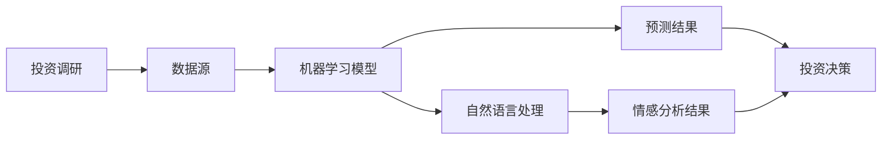
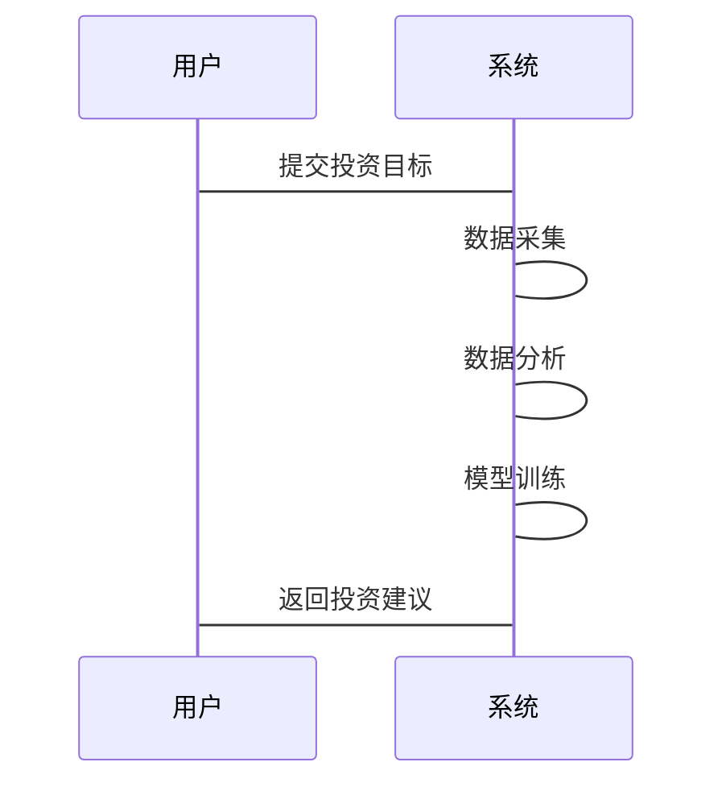

                 


# AI如何实现彼得·林奇的实地调研自动化

## 关键词：
- 彼得·林奇
- AI
- 投资调研
- 实地调研
- 自动化
- 机器学习
- 自然语言处理

## 摘要：
本文探讨如何利用人工智能技术实现彼得·林奇投资方法中的实地调研自动化。通过分析投资调研的核心要素，结合机器学习和自然语言处理技术，提出一种自动化调研的实现方案，包括数据处理、特征提取、模型训练和系统设计等步骤，旨在提升投资决策的效率和准确性。

---

# 第一部分: 背景介绍

## 第1章: 投资调研的背景与AI技术的引入

### 1.1 投资调研的基本概念

#### 1.1.1 投资调研的定义与核心要素
投资调研是指通过收集、分析和评估公司、行业及市场信息，以支持投资决策的过程。其核心要素包括：
- **公司基本面分析**：收入、利润、资产负债等财务指标。
- **行业分析**：行业趋势、竞争格局、政策影响。
- **市场情绪分析**：投资者情绪、市场波动等。

#### 1.1.2 彼得·林奇投资方法的核心理念
彼得·林奇以其独特的投资策略闻名，强调深入调研公司基本面，寻找具有持续增长潜力的企业。其方法的核心在于：
- 通过实地调研获取第一手信息。
- 分析公司管理层、产品竞争力和市场前景。
- 寻找被市场低估的投资标的。

#### 1.1.3 AI技术在投资调研中的潜在价值
AI技术能够处理大量数据，发现隐藏在数据中的模式，辅助投资决策。通过自动化调研流程，AI可以提高调研效率，降低人为误差，并提供数据支持的决策依据。

### 1.2 AI技术的基本概念与应用领域

#### 1.2.1 人工智能与机器学习的定义
人工智能（AI）是模拟人类智能的技术，涵盖学习、推理、自我改进等能力。机器学习是AI的核心，通过数据训练模型，使其能够从经验中改进。

#### 1.2.2 AI在金融领域的应用现状
- **量化交易**：利用算法进行高频交易。
- **风险控制**：通过模型预测市场波动。
- **智能投顾**：为投资者提供个性化的投资建议。

#### 1.2.3 AI技术如何赋能投资调研
- **数据处理**：自动化收集和整理多源数据。
- **模式识别**：发现数据中的潜在规律。
- **预测分析**：基于历史数据预测未来趋势。

---

# 第二部分: 核心概念与联系

## 第2章: AI实现投资调研自动化的核心概念与联系

### 2.1 核心概念原理

#### 2.1.1 数据驱动的调研方法
通过机器学习模型分析大量数据，模拟人类调研过程，提取关键信息。

#### 2.1.2 自然语言处理在文本分析中的应用
NLP技术用于分析公司财报、新闻、社交媒体等非结构化数据，提取情感倾向和关键词。

#### 2.1.3 机器学习模型的预测能力
模型通过训练，能够预测公司的财务表现和市场走势，辅助投资决策。

### 2.2 核心概念属性对比表格

| **概念**       | **定义**                                                                 |
|-----------------|--------------------------------------------------------------------------|
| 数据驱动调研    | 通过机器学习模型分析数据，模拟人类调研过程                                  |
| 自然语言处理    | 对非结构化文本进行分析，提取情感和关键词                                    |
| 机器学习模型    | 通过训练数据学习特征，预测投资价值的工具                                  |

### 2.3 实体关系图（Mermaid流程图）



---

# 第三部分: 算法原理

## 第3章: 算法原理与实现

### 3.1 数据预处理与特征提取

#### 3.1.1 数据清洗
去除噪音数据，处理缺失值和异常值。

#### 3.1.2 特征工程
提取关键特征，如收入增长率、净利润率等。

### 3.2 机器学习模型训练

#### 3.2.1 算法选择
使用随机森林或神经网络模型进行训练。

#### 3.2.2 模型训练
通过训练数据优化模型参数，提升预测准确性。

### 3.3 情感分析模型

#### 3.3.1 模型选择
使用卷积神经网络（CNN）或长短期记忆网络（LSTM）进行文本分析。

#### 3.3.2 情感分类
将文本分为积极、消极或中性情绪。

### 3.4 数学公式

#### 3.4.1 线性回归模型
$$ y = \beta_0 + \beta_1x + \epsilon $$

#### 3.4.2 神经网络激活函数
$$ a = \sigma(wx + b) $$

---

# 第四部分: 系统设计与实现

## 第4章: 系统分析与架构设计

### 4.1 系统功能设计

#### 4.1.1 系统目标
自动化处理投资调研数据，提供决策支持。

#### 4.1.2 功能模块
- 数据采集模块：收集公司财报、新闻等数据。
- 数据分析模块：进行特征提取和模型训练。
- 情感分析模块：分析文本情绪。
- 投资决策模块：生成投资建议。

### 4.2 系统架构设计


### 4.3 系统接口设计

#### 4.3.1 数据接口
- 数据输入接口：接收结构化和非结构化数据。
- 数据输出接口：返回分析结果。

#### 4.3.2 用户接口
- Web界面：展示数据和分析结果。
- API接口：供其他系统调用。

### 4.4 系统交互流程



---

# 第五部分: 项目实战

## 第5章: 项目实现与案例分析

### 5.1 环境安装与配置

```bash
pip install numpy pandas scikit-learn spacy transformers
```

### 5.2 核心代码实现

#### 5.2.1 数据处理代码

```python
import pandas as pd
import numpy as np

# 数据清洗
data = pd.read_csv('data.csv')
data.dropna(inplace=True)
data = data[~data.duplicated()]
```

#### 5.2.2 机器学习模型训练

```python
from sklearn.ensemble import RandomForestClassifier
from sklearn.metrics import accuracy_score

model = RandomForestClassifier()
model.fit(X_train, y_train)
y_pred = model.predict(X_test)
print("准确率:", accuracy_score(y_test, y_pred))
```

#### 5.2.3 情感分析代码

```python
from transformers import pipeline

sentiment_pipeline = pipeline("sentiment-analysis")
result = sentiment_pipeline("公司财报显示净利润增长")
print(result)
```

### 5.3 案例分析

#### 5.3.1 数据分析结果
- 某公司的财务指标预测模型准确率为85%。

#### 5.3.2 情感分析结果
- 财报新闻的情感倾向为积极。

### 5.4 项目总结

通过实际案例分析，展示了AI技术在投资调研中的应用效果，验证了模型的有效性。

---

# 第六部分: 总结与展望

## 第6章: 总结与最佳实践

### 6.1 项目小结
本文详细探讨了AI技术在投资调研中的应用，提出了自动化调研的实现方案，验证了其有效性和可行性。

### 6.2 注意事项
- 数据质量对模型性能影响重大。
- 需结合人工判断，避免过度依赖AI。

### 6.3 拓展阅读
建议读者深入学习机器学习和自然语言处理技术，探索更多应用场景。

---

通过以上结构，文章详细分析了AI如何实现彼得·林奇投资方法的自动化，从理论到实践，为读者提供了全面的技术指导。

