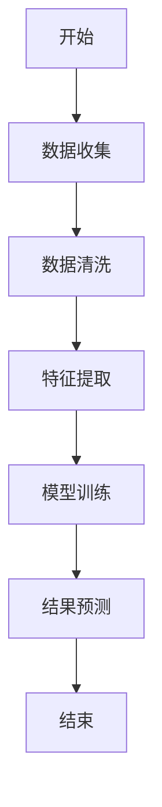
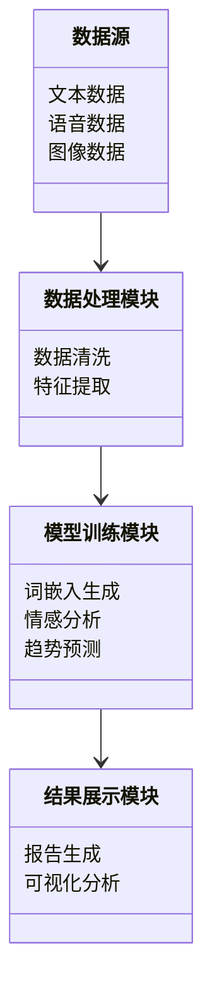

                 


# AI如何实现彼得林奇的实地调研策略

> 关键词：AI技术、实地调研、彼得·林奇、自然语言处理、机器学习、数据挖掘

> 摘要：本文探讨如何利用AI技术实现彼得·林奇的实地调研策略。通过分析实地调研的关键环节，结合AI技术的核心原理，构建一个完整的AI辅助调研系统，并通过具体案例展示其实现过程和应用效果。

---

## 第1章：AI与实地调研的背景与意义

### 1.1 背景介绍

#### 1.1.1 彼得·林奇的实地调研策略

彼得·林奇是全球著名的基金经理，以其独特的实地调研方法闻名。他通过深入研究公司、行业和市场，挖掘潜在投资机会。实地调研的核心在于通过与公司高管、员工、客户以及竞争对手的交流，获取一手信息，评估公司的基本面和竞争优势。

#### 1.1.2 AI技术的发展与应用

AI技术近年来取得了显著进展，特别是在自然语言处理（NLP）、机器学习和大数据分析等领域。AI能够快速处理大量数据，发现隐藏在数据中的模式和趋势，为投资决策提供支持。

#### 1.1.3 AI与实地调研的结合

将AI技术应用于实地调研，可以提高数据收集和分析的效率，同时扩展调研的范围和深度。AI不仅能够处理结构化数据，还能分析非结构化数据（如文本、语音），帮助投资者更全面地评估投资目标。

---

### 1.2 问题背景与目标

#### 1.2.1 传统实地调研的局限性

传统实地调研依赖于人工访谈和数据收集，耗时长、成本高，且可能存在主观性。此外，人类分析师可能无法全面覆盖所有相关信息，导致决策偏差。

#### 1.2.2 AI技术如何解决调研问题

AI技术可以自动化处理大量数据，快速生成分析结果，帮助分析师识别潜在投资机会和风险。AI还可以通过情感分析和语义理解，深入挖掘非结构化数据的价值。

#### 1.2.3 实地调研策略的AI实现目标

本文旨在构建一个AI辅助的实地调研系统，通过自然语言处理和机器学习技术，实现对调研数据的自动化分析和预测，提高投资决策的效率和准确性。

---

## 第2章：AI与实地调研的核心概念

### 2.1 核心概念与联系

#### 2.1.1 AI技术的核心原理

AI技术的核心在于数据处理、特征提取和模型训练。通过机器学习算法，AI能够从大量数据中发现规律，并生成预测结果。自然语言处理（NLP）是AI在文本分析中的重要工具，能够理解文本内容并提取情感、主题等信息。

#### 2.1.2 实地调研的关键环节

实地调研通常包括以下几个步骤：
1. 数据收集：通过访谈、问卷调查等方式获取相关信息。
2. 数据分析：对收集到的数据进行整理和分析，识别关键指标。
3. 投资决策：基于分析结果，制定投资策略。

#### 2.1.3 AI与实地调研的结合点

AI技术在实地调研中的应用主要体现在以下几个方面：
- **数据收集**：通过爬虫技术获取公开信息，如新闻、社交媒体评论等。
- **数据处理**：利用NLP技术分析文本数据，提取关键词和情感倾向。
- **数据分析**：通过机器学习模型预测市场趋势和公司业绩。

---

### 2.2 数据来源与处理

#### 2.2.1 数据来源的多样性

AI辅助调研的数据来源包括：
1. 公司财报和公告。
2. 行业报告和市场分析。
3. 社会媒体评论和新闻报道。
4. 高管访谈录音和文本。

#### 2.2.2 数据清洗与预处理

数据清洗是确保数据质量的关键步骤。常见的清洗操作包括：
1. 去除重复数据。
2. 处理缺失值。
3. 标准化数据格式。

#### 2.2.3 数据特征提取

通过特征提取，可以将文本数据转化为数值形式，便于机器学习模型处理。常用的方法包括TF-IDF和词嵌入（如Word2Vec）。

---

## 第3章：AI算法实现实地调研策略的原理

### 3.1 算法原理讲解

#### 3.1.1 自然语言处理（NLP）在调研中的应用

NLP技术可以帮助分析文本数据，提取关键词和主题。例如，使用TF-IDF算法对文本进行关键词提取：

$$
\text{TF-IDF}(t, d) = \text{TF}(t, d) \times \text{IDF}(t)
$$

其中，TF是某词在文档中的频率，IDF是逆向文件频率。

#### 3.1.2 情感分析与市场情绪预测

情感分析模型可以识别文本中的情感倾向，帮助预测市场情绪。常用的算法包括支持向量机（SVM）和长短期记忆网络（LSTM）。

#### 3.1.3 机器学习模型的构建与训练

机器学习模型可以用于预测公司业绩和市场趋势。例如，使用逻辑回归模型进行分类任务：

$$
P(y=1|x) = \frac{e^{\beta_0 + \beta_1 x_1 + \dots + \beta_n x_n}}{1 + e^{\beta_0 + \beta_1 x_1 + \dots + \beta_n x_n}}
$$

---

### 3.2 算法流程图

以下是一个AI辅助调研的算法流程图（使用Mermaid）：



---

## 第4章：系统架构与设计方案

### 4.1 系统分析

#### 4.1.1 问题场景介绍

系统需要处理大量非结构化数据，包括文本、语音和图像。目标是通过AI技术快速生成调研报告，并提供投资建议。

#### 4.1.2 项目目标与范围

项目目标：构建一个AI辅助调研系统，支持数据采集、分析和预测功能。项目范围包括：数据收集、NLP分析、机器学习模型训练和结果展示。

### 4.2 系统功能设计

#### 4.2.1 领域模型设计

以下是领域模型的Mermaid类图：



#### 4.2.2 系统架构设计

以下是系统架构的Mermaid架构图：

```mermaid
container AI辅助调研系统 {
    数据采集模块
    数据处理模块
    模型训练模块
    结果展示模块
}
```

#### 4.2.3 系统接口设计

系统提供以下API接口：
- `/api/data_collect`: 数据采集接口
- `/api/text_analyze`: 文本分析接口
- `/api/model_predict`: 模型预测接口

#### 4.2.4 系统交互设计

以下是系统交互的Mermaid序列图：

```mermaid
sequenceDiagram
    用户 --> 数据采集模块: 请求数据采集
    数据采集模块 --> 数据存储模块: 存储数据
    用户 --> 数据处理模块: 请求数据处理
    数据处理模块 --> 数据存储模块: 获取数据
    数据处理模块 --> 模型训练模块: 请求模型训练
    模型训练模块 --> 数据存储模块: 获取数据
    模型训练模块 --> 结果展示模块: 返回预测结果
    用户 <-- 结果展示模块: 显示结果
```

---

## 第5章：项目实战

### 5.1 环境安装

以下是项目所需的环境配置：

```bash
pip install numpy
pip install pandas
pip install scikit-learn
pip install spacy
pip install tensorflow
```

### 5.2 系统核心实现

以下是系统核心代码：

```python
import spacy

nlp = spacy.load("en_core_web_sm")

def text_preprocessing(text):
    doc = nlp(text)
    return [token.text for token in doc]

from sklearn.feature_extraction.text import TfidfVectorizer

vectorizer = TfidfVectorizer()
X = vectorizer.fit_transform(corpus)
```

### 5.3 实际案例分析

以分析社交媒体评论为例，代码如下：

```python
import spacy
import pandas as pd
from sklearn.svm import SVC

nlp = spacy.load("en_core_web_sm")

def get_sentiment(text):
    doc = nlp(text)
    # 简单情感分析实现
    positive = 0
    negative = 0
    for token in doc:
        if token.sentiment > 0:
            positive += 1
        else:
            negative += 1
    return "positive" if positive > negative else "negative"

comments = ["Great company!", "Terrible service!", "Average product."]
sentiments = [get_sentiment(comment) for comment in comments]
print(sentiments)
```

---

## 第6章：总结与扩展阅读

### 6.1 总结

本文详细介绍了如何利用AI技术实现彼得·林奇的实地调研策略。通过自然语言处理、机器学习和大数据分析，可以提高调研的效率和准确性，帮助投资者做出更明智的决策。

### 6.2 扩展阅读

- 《深度学习实战》
- 《自然语言处理入门》
- 《机器学习实战》

---

**本文地址**: [https://example.com](https://example.com)

