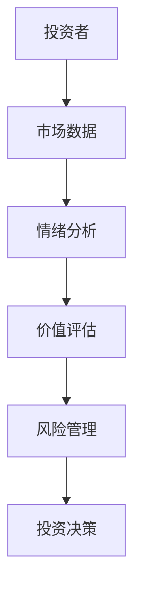
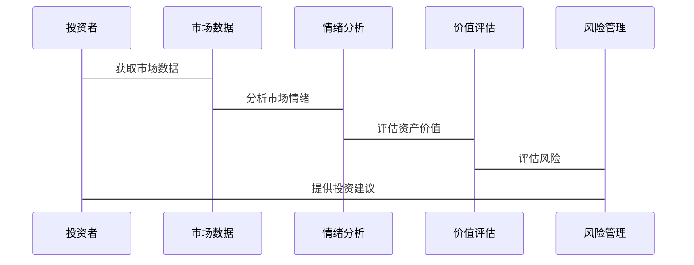

                 


# AI如何实现格雷厄姆的Mr. Market理论

## 关键词：
- AI, 人工智能, 格雷厄姆, Mr. Market, 投资理论, 市场情绪, 价值评估

## 摘要：
本文探讨了如何利用人工智能技术实现格雷厄姆的Mr. Market理论。通过结合市场情绪分析、价值评估和风险管理等核心概念，详细阐述了AI在投资决策中的应用。文章从背景介绍、核心概念、算法原理、系统架构、项目实战到总结与展望，全面分析了AI如何助力Mr. Market理论的实现，为投资者提供了一种基于技术的新视角。

---

# 第一部分: 背景介绍

## 第1章: 格雷厄姆的Mr. Market理论概述

### 1.1 Mr. Market的定义与核心思想
#### 1.1.1 市场先生的概念
格雷厄姆在《聪明的投资者》中提出了“市场先生”的概念，市场先生代表市场情绪，每天以不同的价格出售投资组合。投资者的任务是利用市场先生的非理性来获取超额收益。

#### 1.1.2 Mr. Market的核心投资理念
- **价值投资**：买入低于内在价值的资产，卖出高于内在价值的资产。
- **市场情绪**：市场的波动性为理性投资者提供了套利机会。

#### 1.1.3 市场波动与价值投资的关系
市场波动是价值投资的机会，当市场恐慌时，理性投资者可以以低价买入优质资产。

### 1.2 AI技术的基本概念与应用领域
#### 1.2.1 人工智能的基本定义
人工智能（AI）是模拟人类智能的技术，包括学习、推理、自适应等能力。

#### 1.2.2 AI在金融领域的应用
- **自动化交易**：基于算法的高频交易。
- **风险管理**：通过AI预测市场风险。
- **客户画像**：利用AI分析客户行为。

#### 1.2.3 AI与投资决策的结合
AI可以通过数据分析、模式识别等技术，辅助投资者做出更明智的投资决策。

---

## 第2章: AI如何助力Mr. Market理论的实现

### 2.1 AI在市场情绪分析中的应用
#### 2.1.1 市场情绪分析的定义
市场情绪分析是指通过分析市场参与者的心理状态，预测市场的短期走势。

#### 2.1.2 基于NLP的市场情绪分析方法
- **自然语言处理（NLP）**：分析新闻、社交媒体等文本数据，提取市场情绪。
- **情感分析**：判断市场情绪是正面、负面还是中性。

#### 2.1.3 情绪指标与投资决策的关系
情绪指标可以帮助投资者判断市场的非理性波动，从而做出逆向投资决策。

### 2.2 AI在价值评估中的应用
#### 2.2.1 价值评估的基本原理
价值评估是通过分析资产的内在价值，判断其市场价格是否被高估或低估。

#### 2.2.2 基于机器学习的估值模型
- **数据特征**：收入、利润、市盈率等。
- **模型训练**：使用历史数据训练模型，预测资产的内在价值。

#### 2.2.3 AI在财务数据挖掘中的应用
通过AI挖掘财务数据中的规律，发现被市场低估的资产。

### 2.3 AI在风险管理中的应用
#### 2.3.1 风险管理的基本概念
风险管理是指通过识别和评估风险，采取措施降低风险的影响。

#### 2.3.2 基于AI的风险评估模型
- **风险因子**：市场波动率、信用风险等。
- **模型构建**：使用机器学习算法预测风险事件。

#### 2.3.3 AI在投资组合优化中的应用
通过AI优化投资组合，降低风险的同时最大化收益。

---

## 第3章: Mr. Market理论与AI的结合模型

### 3.1 基于AI的市场情绪预测模型
#### 3.1.1 数据来源与特征提取
- **数据来源**：新闻、社交媒体、市场数据等。
- **特征提取**：关键词提取、情感强度分析。

#### 3.1.2 模型构建与训练
- **算法选择**：使用深度学习模型如LSTM进行时间序列预测。

#### 3.1.3 模型评估与优化
- **评估指标**：准确率、召回率、F1分数。

### 3.2 基于AI的价值评估模型
#### 3.2.1 数据特征的选择
- **财务数据**：收入、利润、市盈率等。
- **市场数据**：股价、成交量等。

#### 3.2.2 模型构建与训练
- **算法选择**：使用回归模型预测内在价值。

#### 3.2.3 模型在投资决策中的应用
- **投资策略**：买入低估资产，卖出高估资产。

### 3.3 基于AI的风险管理模型
#### 3.3.1 风险因子的识别
- **市场波动率**：通过历史数据计算波动率。
- **信用风险**：通过AI分析企业信用状况。

#### 3.3.2 模型构建与训练
- **算法选择**：使用聚类算法识别风险因子。

#### 3.3.3 模型在投资组合优化中的应用
- **优化策略**：通过AI调整投资组合，降低风险。

---

# 第二部分: AI实现Mr. Market理论的核心算法与数学模型

## 第4章: 市场情绪分析的算法实现

### 4.1 基于NLP的文本挖掘算法
#### 4.1.1 分词与情感分析
- **分词**：将文本分割成单词或短语。
- **情感分析**：判断文本的情感倾向。

#### 4.1.2 基于词袋模型的文本表示
- **词袋模型**：将文本表示为单词的集合。

#### 4.1.3 基于深度学习的文本表示
- **深度学习模型**：如BERT用于文本表示。

### 4.2 情绪指标计算的数学模型
#### 4.2.1 情绪指标的定义与计算公式
- **情绪强度**：通过情感分析结果计算情绪强度。

#### 4.2.2 基于情感强度的加权计算
- **加权公式**：$$\text{情绪强度} = \sum (\text{权重} \times \text{情感值})$$

#### 4.2.3 情绪指标的时间序列分析
- **时间序列模型**：如ARIMA预测情绪趋势。

---

## 第5章: 价值评估的算法实现

### 5.1 基于机器学习的价值评估模型
#### 5.1.1 数据特征的选择与提取
- **财务数据**：收入、利润、市盈率等。
- **市场数据**：股价、成交量等。

#### 5.1.2 基于线性回归的估值模型
- **线性回归公式**：$$y = \beta_0 + \beta_1 x + \epsilon$$

#### 5.1.3 基于神经网络的价值评估模型
- **深度学习模型**：如LSTM用于时间序列预测。

---

## 第6章: 风险管理的算法实现

### 6.1 基于机器学习的风险评估模型
#### 6.1.1 风险因子的识别
- **市场波动率**：$$\text{波动率} = \sqrt{\frac{1}{n}\sum_{i=1}^{n}(r_i - \bar{r})^2}$$

#### 6.1.2 风险评估模型的构建
- **聚类算法**：识别风险因子。

#### 6.1.3 风险管理模型的应用
- **投资组合优化**：通过AI调整投资组合，降低风险。

---

# 第三部分: 系统分析与架构设计方案

## 第7章: 系统架构设计

### 7.1 问题场景介绍
- **目标**：构建一个基于AI的Mr. Market理论系统。
- **用户需求**：投资者需要基于AI的决策支持。

### 7.2 系统功能设计
#### 7.2.1 领域模型
- **实体**：投资者、资产、市场数据。
- **关系**：投资者通过市场数据进行资产评估和交易决策。

#### 7.2.2 系统架构图


### 7.3 系统接口设计
- **输入接口**：市场数据接口。
- **输出接口**：情绪指标、价值评估结果、风险评估结果。

### 7.4 系统交互序列图


---

# 第四部分: 项目实战

## 第8章: 项目实战

### 8.1 环境安装
- **Python**：安装Python 3.x。
- **库的安装**：安装Numpy、Pandas、Scikit-learn、NLTK、TensorFlow等。

### 8.2 系统核心实现源代码
```python
# 情绪分析代码示例
from sklearn.feature_extraction.text import TfidfVectorizer
from sklearn.svm import SVC
from nltk.sentiment import SentimentIntensityAnalyzer

# 数据加载
text = "The market is bullish on tech stocks."

# 情感分析
sia = SentimentIntensityAnalyzer()
sentiment = sia.polarity_scores(text)

# 特征提取
vectorizer = TfidfVectorizer()
X = vectorizer.fit_transform([text])
```

### 8.3 代码应用解读与分析
- **情感分析**：通过Nltk提取文本情感。
- **特征提取**：使用TF-IDF提取文本特征。
- **模型训练**：使用SVM分类器进行情感分类。

### 8.4 实际案例分析
- **案例**：分析某公司的新闻文本，预测市场情绪，评估资产价值，制定投资策略。

### 8.5 项目小结
- **成果**：构建了一个基于AI的Mr. Market理论系统。
- **经验**：AI在投资中的应用需要结合市场实际，不断优化模型。

---

# 第五部分: 总结与展望

## 第9章: 总结与展望

### 9.1 文章总结
本文详细探讨了AI如何实现格雷厄姆的Mr. Market理论，从市场情绪分析、价值评估到风险管理，全面分析了AI在投资中的应用。

### 9.2 未来展望
- **技术进步**：AI算法的优化和数据的丰富将提升模型的准确性。
- **应用场景**：AI在投资中的应用将更加广泛，如智能投顾、量化交易等。

### 9.3 最佳实践 tips
- **数据质量**：确保数据来源可靠，特征提取全面。
- **模型优化**：结合实际需求，不断优化模型。
- **风险管理**：AI决策需结合人工判断，避免过度依赖技术。

### 9.4 小结
AI为投资领域带来了新的可能性，投资者需结合技术与实际，才能在市场中获得长期收益。

---

通过以上结构，您可以根据需要进一步扩展和补充具体细节，撰写一篇详尽的技术博客文章。

