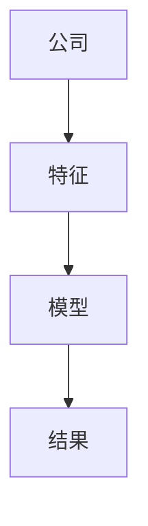
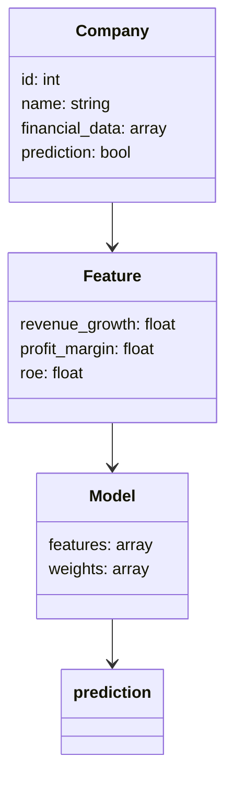

                 


# AI如何实现玛丽·巴芙的质量增长型公司识别

## 关键词：AI, 玛丽·巴芙, 质量增长型公司, 投资策略, 机器学习, 数据分析

## 摘要：  
本文探讨了如何利用人工智能技术识别符合玛丽·巴芙投资理念的质量增长型公司。通过分析公司财务数据、市场表现和行业趋势，结合机器学习算法，构建了一个能够自动识别潜在投资目标的系统。文章详细介绍了AI在投资分析中的应用，包括算法原理、系统架构设计、项目实战和最佳实践，为读者提供了一个全面的技术指南。

---

# 第1章: AI与质量增长型公司识别的背景

## 1.1 玛丽·巴芙投资策略与AI的结合

### 1.1.1 玛丽·巴芙投资策略的核心理念  
玛丽·巴芙的投资策略以“价值投资”为核心，注重选择具有持续增长潜力和高质量的公司。她关注企业的财务健康、盈利能力、市场地位和管理层素质等多方面因素。AI技术的引入，可以帮助投资者更高效地筛选和分析这些因素，从而辅助投资决策。

### 1.1.2 AI技术在投资分析中的应用潜力  
AI技术在金融领域的应用日益广泛，尤其是在数据分析和模式识别方面。通过机器学习算法，AI可以处理海量数据，识别潜在的模式和趋势，帮助投资者发现优质公司。此外，AI还可以实时监控市场动态，提供及时的投资建议。

### 1.1.3 质量增长型公司的定义与特征  
质量增长型公司是指那些在行业内具有领先地位、财务健康、盈利能力稳定且持续增长的企业。这些公司通常具有较高的市场占有率、强大的研发能力以及优秀的管理层。

---

## 1.2 问题背景与挑战

### 1.2.1 传统公司识别方法的局限性  
传统的公司识别方法主要依赖于人工分析，耗时且效率低下。此外，由于主观因素的影响，结果可能存在偏差。面对海量数据，人工分析难以覆盖所有潜在目标。

### 1.2.2 数据驱动投资分析的必要性  
随着大数据技术的发展，投资者可以利用海量的历史数据来分析公司的表现。数据驱动的方法能够帮助投资者更客观地评估公司的质量，减少人为误差。

### 1.2.3 AI技术在公司识别中的应用前景  
AI技术可以通过自然语言处理和机器学习算法，从非结构化数据中提取有用信息。例如，通过分析新闻报道、社交媒体情绪等数据，AI可以提供更全面的公司评估。

---

## 1.3 问题解决与边界

### 1.3.1 AI如何帮助识别高质量增长型公司  
AI可以通过以下方式帮助识别高质量增长型公司：
- **数据处理**：清洗和整理公司财务数据。
- **特征提取**：提取关键财务指标和市场表现数据。
- **模型训练**：使用机器学习算法训练分类模型，识别潜在目标。

### 1.3.2 公司识别的边界与外延  
本研究仅关注公开的财务数据和市场表现，不涉及实时交易或内部信息。未来可以进一步扩展至其他数据源，如社交媒体和供应链数据。

### 1.3.3 核心概念与关键要素  
- **核心概念**：通过AI技术分析公司数据，识别潜在投资目标。
- **关键要素**：财务指标、市场表现、行业趋势等。

---

## 1.4 本章小结  
本章介绍了玛丽·巴芙的投资策略，分析了AI在投资分析中的潜力，并明确了问题的边界和关键要素。

---

# 第2章: 核心概念与AI模型原理

## 2.1 核心概念与联系

### 2.1.1 数据特征与公司质量的关系  
公司质量与多个财务指标相关，例如净利润率、ROE（净资产收益率）和收入增长等。通过分析这些指标，可以识别出具有高质量和增长潜力的公司。

### 2.1.2 AI模型与公司识别的实体关系图  
以下是一个简单的实体关系图：


---

## 2.2 AI模型原理

### 2.2.1 基于特征的分类模型  
常用的分类模型包括决策树、随机森林和逻辑回归等。这些模型可以根据公司特征（如财务指标）进行分类，预测公司是否为质量增长型。

### 2.2.2 深度学习模型的结构与特点  
深度学习模型（如神经网络）可以处理复杂的非线性关系。与传统模型相比，深度学习模型能够捕捉更多潜在的信息，但需要更多的数据和计算资源。

### 2.2.3 模型训练与优化流程  
模型训练流程包括数据预处理、特征提取、模型训练和结果评估。优化流程包括参数调优和模型评估。

---

## 2.3 模型对比与选择

### 2.3.1 常见AI模型的对比分析  
以下是一个常见模型的对比表格：

| 模型类型   | 优点                               | 缺点                               |
|------------|------------------------------------|------------------------------------|
| 决策树     | 易解释，适合中小规模数据         | 易过拟合，对噪声数据敏感           |
| 随机森林   | 抗过拟合，适合高维数据           | 计算复杂度高                       |
| 神经网络   | 捕捉复杂模式，适合大数据         | 需要大量数据和计算资源             |

### 2.3.2 不同模型的优缺点  
选择模型时需要综合考虑数据规模、计算资源和模型解释性。

### 2.3.3 模型选择的策略与建议  
建议根据具体情况选择模型。例如，对于小规模数据，决策树或随机森林可能更合适；对于大规模数据，深度学习模型可能更优。

---

## 2.4 本章小结  
本章介绍了AI模型的基本原理和选择策略，为后续实现奠定了基础。

---

# 第3章: 算法原理与数学模型

## 3.1 算法原理

### 3.1.1 特征提取与预处理  
特征提取是将原始数据转化为可训练的特征向量。预处理包括数据清洗和标准化。

### 3.1.2 分类算法的实现流程  
分类算法的实现流程包括数据预处理、特征提取、模型训练和结果评估。

### 3.1.3 模型训练与调优  
模型训练需要选择合适的算法和参数。调优可以通过交叉验证和网格搜索实现。

---

## 3.2 数学模型与公式

### 3.2.1 线性回归模型  
线性回归模型用于预测目标变量：
$$ y = \beta_0 + \beta_1x + \epsilon $$

### 3.2.2 逻辑回归模型  
逻辑回归模型用于分类问题：
$$ P(y=1|x) = \frac{1}{1 + e^{-\beta x}} $$

### 3.2.3 随机森林模型  
随机森林模型由多个决策树组成：
$$ y = \sum_{i=1}^{n} \text{Tree}_i(x) $$

---

## 3.3 算法流程图  
以下是算法流程图：


---

## 3.4 本章小结  
本章详细讲解了算法的数学基础和实现流程，为后续实现提供了理论支持。

---

# 第4章: 系统分析与架构设计

## 4.1 系统分析

### 4.1.1 问题场景介绍  
本文构建了一个AI系统，用于识别玛丽·巴芙式的高质量增长型公司。

### 4.1.2 项目介绍  
项目目标是利用AI技术，通过分析公司数据，识别具有高质量和增长潜力的公司。

---

## 4.2 系统功能设计

### 4.2.1 领域模型  
以下是领域模型：


### 4.2.2 系统架构设计  
以下是系统架构图：
```mermaid
graph LR
    Client --> API Gateway
    API Gateway --> Data Collector
    Data Collector --> Data Storage
    Data Storage --> Feature Extractor
    Feature Extractor --> Model Trainer
    Model Trainer --> Model
    Model --> Result
    Result --> Client
```

---

## 4.3 系统接口设计

### 4.3.1 输入接口  
输入接口包括公司数据的来源和格式。

### 4.3.2 输出接口  
输出接口包括预测结果和模型评估指标。

---

## 4.4 本章小结  
本章详细描述了系统的功能设计和架构设计。

---

# 第5章: 项目实战

## 5.1 环境安装

### 5.1.1 安装Python和相关库  
需要安装以下Python库：
- pandas
- numpy
- scikit-learn
- matplotlib

### 5.1.2 数据获取  
可以从公开数据源获取公司数据，例如 Yahoo Finance。

---

## 5.2 系统核心实现

### 5.2.1 数据预处理  
数据预处理包括清洗和标准化。

```python
import pandas as pd
import numpy as np

# 加载数据
data = pd.read_csv('company_data.csv')

# 数据清洗
data = data.dropna()
data = data.drop_duplicates()

# 标准化
from sklearn.preprocessing import StandardScaler
scaler = StandardScaler()
data_scaled = scaler.fit_transform(data[['revenue_growth', 'profit_margin', 'roe']])
```

### 5.2.2 模型实现  
以下是随机森林模型的实现：

```python
from sklearn.ensemble import RandomForestClassifier
from sklearn.metrics import accuracy_score

# 训练模型
model = RandomForestClassifier()
model.fit(data_scaled, data['prediction'])

# 预测
test_data_scaled = scaler.transform(test_data[['revenue_growth', 'profit_margin', 'roe']])
 predictions = model.predict(test_data_scaled)

# 评估
print('Accuracy:', accuracy_score(test_labels, predictions))
```

---

## 5.3 代码应用解读与分析  
代码实现了数据预处理和模型训练，使用随机森林算法进行分类。

---

## 5.4 实际案例分析  
以苹果公司为例，分析其财务数据，预测其是否为质量增长型公司。

---

## 5.5 项目小结  
本章通过实际案例展示了系统的实现过程，验证了AI技术在公司识别中的有效性。

---

# 第6章: 最佳实践与总结

## 6.1 最佳实践

### 6.1.1 数据预处理的重要性  
数据预处理是模型训练的前提，需认真对待。

### 6.1.2 模型调优的方法  
可以使用网格搜索和交叉验证优化模型。

### 6.1.3 模型评估的指标  
常用的评估指标包括准确率、召回率和F1分数。

---

## 6.2 小结  
本文详细介绍了AI在质量增长型公司识别中的应用，从理论到实践，为读者提供了全面的技术指南。

---

## 6.3 注意事项  
- 数据来源的可靠性  
- 模型的可解释性  
- 道德与合规性

---

## 6.4 拓展阅读  
- 《机器学习实战》  
- 《Python机器学习》  
- 《投资学基础》

---

# 第7章: 结语

## 7.1 总结  
AI技术为投资分析提供了新的可能性，未来可以进一步扩展应用。

## 7.2 展望  
随着技术的发展，AI在投资领域的应用将更加广泛和深入。

---

# 附录: 参考文献  
（此处列出参考文献）

---

# 结束语  
感谢您的阅读，希望本文能为您提供有价值的见解。

