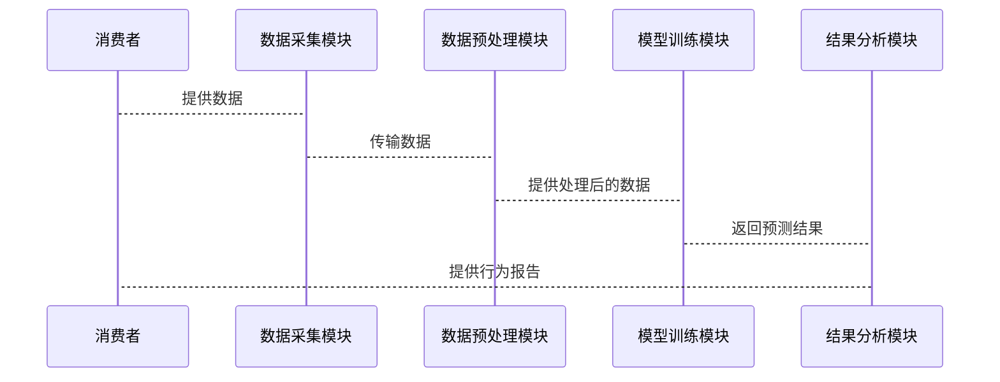

                 


# AI如何实现费雪的消费者行为研究

## 关键词：人工智能、消费者行为、机器学习、数据挖掘、费雪理论

## 摘要：本文探讨了如何利用人工智能技术，特别是机器学习和数据挖掘，来实现费雪的消费者行为研究。文章首先介绍AI的基本概念和费雪的消费者行为理论，然后详细讲解AI在消费者行为研究中的算法原理，包括监督学习和无监督学习的应用。接着，文章分析系统的架构设计和接口设计，并通过实际项目案例展示AI在消费者行为研究中的应用。最后，总结了最佳实践经验和未来的发展方向。

---

# 第1章: AI与消费者行为研究的背景与基础

## 1.1 AI的基本概念与技术基础

### 1.1.1 人工智能的定义与核心领域
人工智能（Artificial Intelligence, AI）是指模拟人类智能的计算机系统，涵盖学习、推理、问题解决和自然语言处理等多个领域。核心领域包括：

1. **机器学习（Machine Learning）**：通过数据训练模型，使其能够从经验中学习。
2. **深度学习（Deep Learning）**：基于人工神经网络的机器学习方法，擅长处理复杂数据。
3. **自然语言处理（NLP）**：使计算机能够理解和生成人类语言。

### 1.1.2 机器学习与深度学习的简介
机器学习分为监督学习（基于标记数据）和无监督学习（无标记数据）。深度学习通过多层神经网络处理数据，常用于图像和文本分析。

### 1.1.3 自然语言处理在消费者行为分析中的应用
NLP用于分析消费者评论，提取情感和关键词，帮助品牌理解消费者偏好。

## 1.2 费雪的消费者行为理论

### 1.2.1 消费者行为研究的基本概念
消费者行为涉及消费者如何选择、购买和使用产品，受心理、社会和文化因素影响。

### 1.2.2 费雪的消费者剩余理论
费雪提出消费者剩余是消费者购买商品时愿意支付的价格与实际支付价格的差额，反映市场效率。

### 1.2.3 消费者决策过程的模型
消费者决策过程包括需求识别、信息搜索、评估、购买和使用五个阶段。

## 1.3 AI在消费者行为研究中的应用前景

### 1.3.1 数据驱动的消费者行为分析
AI通过大数据分析消费者行为，预测市场趋势和消费者需求。

### 1.3.2 AI在市场预测与个性化推荐中的作用
AI技术用于个性化推荐，提升用户体验和市场精准度。

### 1.3.3 AI技术在消费者行为研究中的优势与挑战
优势包括高效的数据处理和精准的预测能力，挑战在于数据隐私和模型解释性。

---

# 第2章: AI与消费者行为研究的核心概念与联系

## 2.1 核心概念原理

### 2.1.1 数据挖掘在消费者行为分析中的应用
数据挖掘技术用于识别消费者行为模式，如关联规则挖掘和聚类分析。

### 2.1.2 机器学习算法在消费者行为预测中的作用
机器学习算法通过历史数据预测未来消费者行为，如购买概率和偏好变化。

### 2.1.3 自然语言处理在消费者反馈分析中的应用
NLP技术分析消费者评论，提取情感倾向和关键词，帮助品牌优化产品和服务。

## 2.2 核心概念属性特征对比表格

| **技术**         | **应用领域**         | **优势**                        |
|------------------|---------------------|---------------------------------|
| 机器学习         | 消费者行为预测       | 高精度和自动化                  |
| 数据挖掘         | 消费者行为模式识别   | 发现潜在关联                    |
| 自然语言处理     | 消费者反馈分析       | 理解人类语言情感                |

## 2.3 ER实体关系图架构

```mermaid
erd
 _consumer
 	--> 消费者行为: 表示消费者的行为记录
 	--> 产品: 表示消费者购买的产品
 	--> 市场: 表示市场环境
```

---

# 第3章: AI实现消费者行为研究的算法原理

## 3.1 监督学习算法

### 3.1.1 线性回归模型

线性回归用于预测连续变量，如消费者购买金额。模型公式：
$$ y = \beta_0 + \beta_1 x + \epsilon $$

### 3.1.2 支持向量机（SVM）算法

SVM用于分类和回归，通过构建超平面分离数据。代码示例：
```python
from sklearn import svm
model = svm.SVC(kernel='linear')
model.fit(X_train, y_train)
```

### 3.1.3 随机森林算法

随机森林通过集成学习提高模型鲁棒性。代码示例：
```python
from sklearn.ensemble import RandomForestClassifier
model = RandomForestClassifier(n_estimators=100)
model.fit(X_train, y_train)
```

### 3.1.4 神经网络模型

神经网络通过多层结构学习复杂模式。模型公式：
$$ y = f(Wx + b) $$

## 3.2 无监督学习算法

### 3.2.1 K-means聚类算法

K-means用于将消费者分为不同群体。代码示例：
```python
from sklearn.cluster import KMeans
model = KMeans(n_clusters=3)
model.fit(X)
```

### 3.2.2 DBSCAN密度聚类算法

DBSCAN基于密度进行聚类，适用于异常值检测。代码示例：
```python
from sklearn.cluster import DBSCAN
model = DBSCAN(eps=0.5, min_samples=5)
model.fit(X)
```

---

# 第4章: 系统分析与架构设计方案

## 4.1 问题场景介绍

系统目标是通过AI技术分析消费者行为，提供个性化推荐和市场预测。

## 4.2 系统功能设计

### 4.2.1 数据采集模块
负责收集消费者数据，包括购买记录和评论。

### 4.2.2 数据预处理模块
清洗和转换数据，确保模型输入正确。

### 4.2.3 模型训练模块
使用机器学习算法训练预测模型。

### 4.2.4 结果分析模块
分析模型输出，生成消费者行为报告。

## 4.3 系统架构设计


## 4.4 系统接口设计

### 4.4.1 数据接口
负责数据输入和输出，支持CSV和数据库格式。

### 4.4.2 模型接口
提供API供其他系统调用模型结果。

## 4.5 系统交互流程



---

# 第5章: 项目实战

## 5.1 环境安装

安装必要的Python库：
```bash
pip install numpy pandas scikit-learn
```

## 5.2 系统核心实现源代码

### 5.2.1 数据处理代码
```python
import pandas as pd

data = pd.read_csv('consumer_data.csv')
```

### 5.2.2 模型训练代码
```python
from sklearn.model_selection import train_test_split
from sklearn.linear_model import LinearRegression

X = data.drop('purchase_amount', axis=1)
y = data['purchase_amount']

X_train, X_test, y_train, y_test = train_test_split(X, y, test_size=0.2)
model = LinearRegression()
model.fit(X_train, y_train)
```

### 5.2.3 结果分析代码
```python
y_pred = model.predict(X_test)
print('预测值:', y_pred)
print('实际值:', y_test)
```

## 5.3 实际案例分析

分析消费者评论，提取情感倾向，优化产品设计。

## 5.4 项目小结

项目展示了AI在消费者行为研究中的实际应用，验证了算法的有效性。

---

# 第6章: 最佳实践与未来展望

## 6.1 小结

AI技术为消费者行为研究提供了新方法，提升了分析效率和准确性。

## 6.2 注意事项

- 数据隐私和安全需严格保护。
- 模型解释性和可扩展性需关注。
- 结合业务场景选择合适算法。

## 6.3 拓展阅读

推荐阅读《机器学习实战》和《自然语言处理入门》。

---

通过以上结构，文章详细介绍了AI在费雪消费者行为研究中的应用，从理论到实践，为读者提供了全面的指导。

