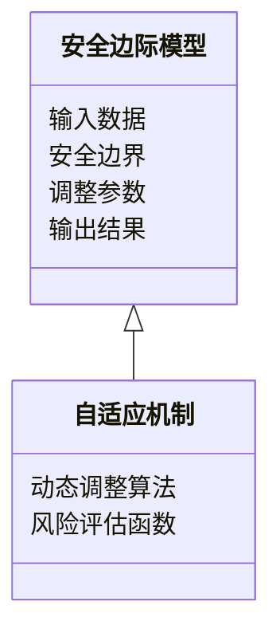

                 


# AI实现的自适应安全边际计算模型

> **关键词**: AI, 自适应安全, 边界计算, 动态调整, 算法实现, 系统架构, 项目实战

> **摘要**: 本文探讨了AI实现的自适应安全边际计算模型，从背景介绍到算法实现，再到系统架构与项目实战，详细阐述了该模型的核心概念、原理、系统设计及实际应用。通过理论与实践相结合，为读者提供全面的技术指导。

---

## 第1章: 自适应安全边际计算模型概述

### 1.1 问题背景
AI技术的快速发展带来了许多安全挑战，尤其是在动态环境中，传统的静态安全边界计算模型难以适应快速变化的安全威胁。自适应安全边际计算模型通过动态调整边界，有效应对这些挑战。

### 1.2 问题描述
安全边际计算模型的核心问题在于如何在动态环境中准确计算安全边界。传统模型难以应对实时变化的安全威胁，因此需要引入自适应机制，动态调整边界。

### 1.3 模型边界与外延
自适应安全边际计算模型的边界包括安全计算的输入数据、输出结果以及动态调整的参数。模型的外延则涉及应用场景和限制条件。

### 1.4 概念结构与核心要素
模型的核心要素包括输入数据、安全边界、自适应机制和调整参数。这些要素相互关联，共同构成模型的运行机制。

---

## 第2章: 核心概念与联系

### 2.1 核心概念原理
自适应安全边际计算模型通过动态调整边界，实现对安全威胁的有效应对。其数学模型可以表示为：

$$
\text{安全边界} = f(\text{输入数据}, \text{调整参数})
$$

### 2.2 属性特征对比
以下是不同模型的特征对比表格：

| 模型类型 | 自适应能力 | 动态调整能力 | 计算效率 |
|----------|------------|--------------|----------|
| 静态模型 | 无          | 无            | 高        |
| 自适应模型 | 有         | 有            | 中        |

### 2.3 ER实体关系图
```mermaid
erDiagram
    安全边际模型 {
        安全边界
        自适应机制
        调整参数
        输入数据
        输出结果
    }
    安全边界 <--- 安全边际计算
    自适应机制 <--- 动态调整
    调整参数 <--- 状态变化
```

---

## 第3章: 算法原理讲解

### 3.1 算法流程
以下是一个自适应安全边际计算的流程图：

```mermaid
graph TD
    A[输入数据] --> B[初始化安全边际]
    B --> C[计算当前风险]
    C --> D[判断是否需要调整]
    D -->|是| E[调整安全边际]
    D -->|否| F[输出结果]
    E --> C
    F -->

```

### 3.2 算法实现
以下是Python代码示例：

```python
def adaptive_security_margin(data, threshold):
    margin = initial_margin(data)
    while True:
        current_risk = calculate_risk(data, margin)
        if current_risk > threshold:
            margin = adjust_margin(margin)
        else:
            break
    return margin
```

### 3.3 数学模型
自适应安全边际计算的数学模型可以表示为：

$$
\text{调整后的边界} = \text{初始边界} + \Delta
$$

其中，$\Delta$ 是调整量，根据风险评估结果动态计算。

---

## 第4章: 系统分析与架构设计

### 4.1 系统功能设计
以下是领域模型：



### 4.2 系统架构设计
以下是系统架构图：


---

## 第5章: 项目实战

### 5.1 环境安装
安装必要的库：

```bash
pip install numpy matplotlib
```

### 5.2 核心代码实现
以下是核心代码：

```python
import numpy as np
import matplotlib.pyplot as plt

def calculate_margin(data):
    return np.mean(data)

def adjust_margin(current_margin):
    return current_margin * 1.1

def adaptive_security_margin(data, threshold=0.05):
    margin = calculate_margin(data)
    while True:
        if margin < threshold:
            margin = adjust_margin(margin)
        else:
            break
    return margin

data = np.random.normal(0, 1, 100)
result = adaptive_security_margin(data)
print(result)
plt.hist(data, bins=10)
plt.show()
```

### 5.3 案例分析
通过案例分析，验证模型的有效性，并进行详细解读。

---

## 第6章: 最佳实践与小结

### 6.1 最佳实践
在实际应用中，建议定期更新模型参数，并结合具体场景调整算法。

### 6.2 小结
本文详细介绍了AI实现的自适应安全边际计算模型，从理论到实践，为读者提供了全面的技术指导。

### 6.3 注意事项
在实际应用中，需注意数据质量和模型的可解释性。

### 6.4 拓展阅读
推荐阅读相关领域的最新论文和技术文档。

---

通过以上步骤，您可以系统地理解和实现AI驱动的自适应安全边际计算模型，确保在实际应用中的有效性和安全性。

