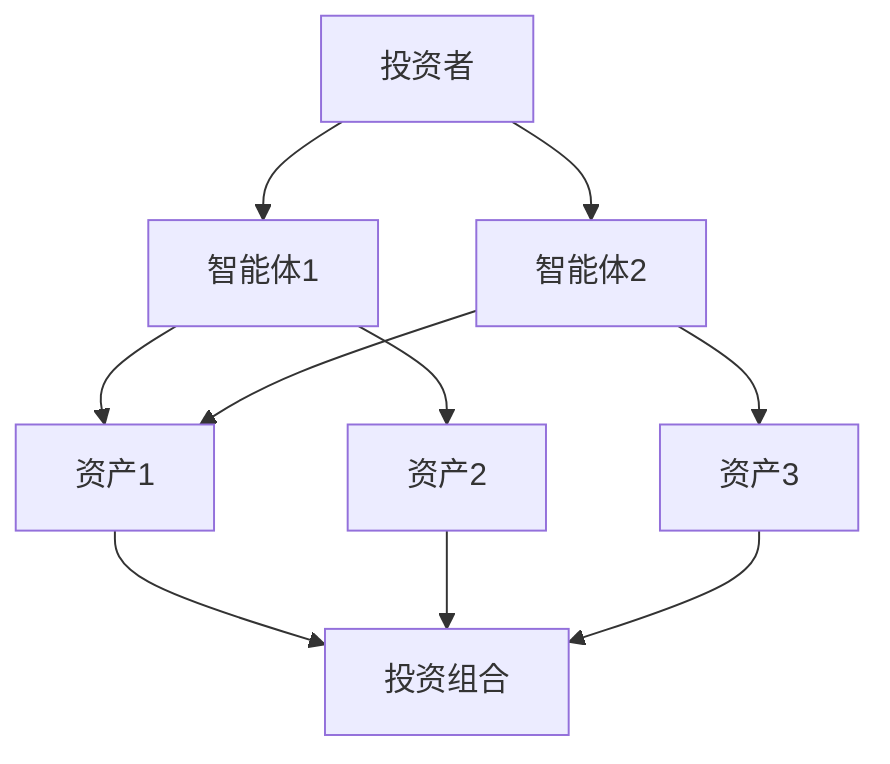
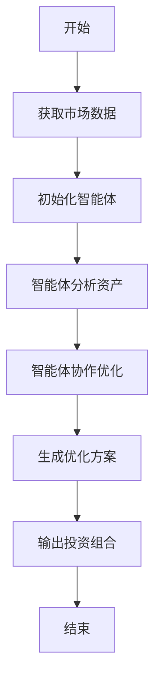

                 


# AI智能体协作：提升价值投资组合管理效率

## 关键词：AI智能体协作，投资组合管理，多智能体系统，优化算法，金融应用

## 摘要：本文探讨了AI智能体协作在投资组合管理中的应用，通过分析问题背景、核心概念、算法原理、系统架构、项目实战等多个方面，详细阐述了如何利用智能体协作提升投资组合管理的效率和效果，为读者提供了一套完整的解决方案和实践指南。

---

## 第1章：问题背景与描述

### 1.1 问题背景
#### 1.1.1 传统投资组合管理的挑战
- 数据量大且复杂：金融市场数据呈现高维、非线性特征，传统方法难以高效处理。
- 实时性要求高：投资决策需要快速响应市场变化，传统人工分析效率不足。
- 市场波动频繁：金融市场的不确定性要求投资策略具备动态调整能力。
- 信息处理能力有限：传统方法难以捕捉复杂市场中的潜在机会和风险。

#### 1.1.2 AI技术在金融领域的应用现状
- 量化投资：AI用于预测股价、识别趋势，优化投资组合。
- 风险控制：通过AI技术识别市场风险，评估投资组合的稳定性。
- 自动化交易：AI算法实现高频交易，提升交易效率和收益。

#### 1.1.3 智能体协作在投资管理中的潜力
- 分布式计算：智能体协作能够并行处理大量数据，提升计算效率。
- 多目标优化：通过协作实现风险与收益的平衡，优化投资组合。
- 动态调整：智能体实时互动，快速响应市场变化，动态优化投资策略。

### 1.2 问题描述
#### 1.2.1 投资组合管理的核心目标
- 最大化收益：在风险可控的前提下，实现投资收益的最大化。
- 风险控制：通过分散投资降低风险，避免重大损失。
- 资产配置：根据市场变化调整资产比例，优化投资结构。

#### 1.2.2 当前投资组合管理的主要痛点
- 数据处理效率低：传统方法难以应对海量数据和复杂计算。
- 投资策略静态：市场变化快，静态策略难以适应动态环境。
- 决策过程缺乏协作：单一决策主体难以实现多目标优化。

#### 1.2.3 智能体协作在投资组合管理中的具体应用场景
- 分散投资决策：多个智能体分别负责不同资产类别，实现分散化投资。
- 动态调整策略：智能体实时互动，根据市场变化动态优化投资组合。
- 风险预警与控制：智能体协作识别潜在风险，及时调整投资策略。

### 1.3 问题解决与边界
#### 1.3.1 AI智能体协作如何解决投资组合管理问题
- 分布式计算：智能体协作能够并行处理数据，提升计算效率。
- 多目标优化：通过协作实现收益与风险的平衡，优化投资组合。
- 动态调整：智能体实时互动，快速响应市场变化，动态优化投资策略。

#### 1.3.2 智能体协作的边界与外延
- 边界：智能体协作仅限于投资组合管理的具体问题，不涉及其他业务领域。
- 外延：智能体协作可以应用于风险管理、资产配置等多个投资管理环节。

#### 1.3.3 核心概念与组成要素
- 核心概念：智能体协作、投资组合优化、多目标优化。
- 组成要素：智能体、协作机制、优化算法、数据源。

---

## 第2章：核心概念与联系

### 2.1 AI智能体协作的原理
#### 2.1.1 智能体的定义与特征
- 智能体：具有感知环境、自主决策能力的实体。
- 特征：自主性、反应性、协作性、学习能力。

#### 2.1.2 多智能体协作的基本原理
- 分布式计算：多个智能体协同完成任务。
- 信息共享：智能体之间共享信息，实现协同决策。
- 协作协议：智能体之间通过协议实现协作。

#### 2.1.3 智能体协作在投资组合管理中的具体实现
- 每个智能体负责不同的资产类别或风险因子。
- 智能体之间共享市场数据和分析结果，实现协同优化。

### 2.2 核心概念属性对比
#### 2.2.1 不同智能体协作机制的对比分析
- 并行计算：智能体独立计算，不共享信息。
- 分布式协作：智能体共享信息，协同完成任务。
- 基于规则的协作：智能体根据预定义规则协作。
- 基于学习的协作：智能体通过机器学习实现协作。

#### 2.2.2 投资组合管理中的关键属性特征
- 收益最大化：投资组合的收益目标。
- 风险控制：投资组合的风险指标。
- 资产分散：投资组合的资产配置。

#### 2.2.3 智能体协作与传统投资策略的对比
- 传统策略：基于历史数据分析，静态调整。
- 智能体协作：实时动态调整，多目标优化。

### 2.3 实体关系图与协作架构
#### 2.3.1 ER实体关系图展示
```mermaid
er
    entity 投资者 {
        id
        资产配置
        风险偏好
    }
    entity 资产 {
        id
        类别
        风险
        收益
    }
    entity 智能体 {
        id
        感知数据
        决策策略
    }
    entity 投资组合 {
        id
        资产组成
        风险收益比
    }
    投资者 --> 投资组合: 优化
    资产 --> 投资组合: 分配
    智能体 --> 资产: 分析
    智能体 --> 投资组合: 优化
```

#### 2.3.2 协作架构的Mermaid流程图


#### 2.3.3 实体间关系的详细说明
- 投资者：通过智能体分析资产数据，优化投资组合。
- 资产：被智能体分析，提供风险和收益数据。
- 智能体：分析资产数据，优化投资组合。
- 投资组合：由智能体优化，包含多个资产。

---

## 第3章：算法原理与流程

### 3.1 算法流程图


### 3.2 算法实现代码
```python
import numpy as np
import pandas as pd

# 定义智能体类
class Agent:
    def __init__(self, data):
        self.data = data
        self.position = None

    def analyze(self):
        # 简单的分析逻辑，根据数据计算最优资产分配
        pass

    def decide(self):
        # 决策逻辑，生成投资组合
        pass

# 定义投资组合优化函数
def optimize_portfolio(agents):
    # 聚合各智能体的决策，生成最终投资组合
    pass

# 主函数
def main():
    # 获取市场数据
    data = pd.read_csv('market_data.csv')
    agents = [Agent(data) for _ in range(5)]
    optimize_portfolio(agents)
    print("投资组合优化完成")

if __name__ == "__main__":
    main()
```

### 3.3 数学模型与公式
#### 投资组合优化的数学模型
$$
\text{目标函数：最大化收益} \quad \max \sum_{i=1}^{n} w_i r_i
$$
$$
\text{约束条件：风险可控} \quad \sum_{i=1}^{n} w_i^2 r_i^2 \leq R^2
$$
$$
\text{权重约束} \quad \sum_{i=1}^{n} w_i = 1
$$

---

## 第4章：系统分析与架构设计方案

### 4.1 问题场景介绍
- 投资者希望通过智能体协作优化投资组合，实现收益与风险的平衡。
- 系统需要处理海量市场数据，实时调整投资策略。

### 4.2 系统功能设计
- 数据获取与预处理：获取市场数据，清洗和特征提取。
- 智能体分析：各智能体分析不同资产，生成分析结果。
- 智能体协作：智能体协作优化投资组合，生成最终方案。
- 输出结果：生成优化后的投资组合。

### 4.3 系统架构设计


### 4.4 系统接口设计
- API接口：智能体间通过API接口传递数据和指令。
- 数据格式：统一数据格式，方便智能体协作。

---

## 第5章：项目实战

### 5.1 环境安装
```bash
pip install numpy pandas mermaid4j
```

### 5.2 核心代码实现
```python
import numpy as np
import pandas as pd

# 定义智能体类
class Agent:
    def __init__(self, data):
        self.data = data
        self.position = None

    def analyze(self):
        # 简单的分析逻辑，根据数据计算最优资产分配
        return np.random.random()

    def decide(self):
        # 决策逻辑，生成投资组合
        return np.random.random()

# 定义投资组合优化函数
def optimize_portfolio(agents):
    results = [agent.analyze() for agent in agents]
    return np.mean(results)

# 主函数
def main():
    # 获取市场数据
    data = pd.read_csv('market_data.csv')
    agents = [Agent(data) for _ in range(5)]
    result = optimize_portfolio(agents)
    print(f"投资组合优化结果：{result}")

if __name__ == "__main__":
    main()
```

### 5.3 案例分析与解读
- 数据获取：从市场数据中获取资产价格和风险数据。
- 智能体分析：每个智能体分析一个资产类别，生成分析结果。
- 智能体协作：智能体协作优化投资组合，生成最终方案。
- 结果输出：输出优化后的投资组合，包括资产比例和风险收益比。

### 5.4 项目小结
- 通过智能体协作优化投资组合，提升了投资效率和效果。
- 代码实现简单，但展示了智能体协作的基本原理和应用方式。

---

## 第6章：最佳实践、小结与展望

### 6.1 最佳实践
- 数据处理：确保数据质量和实时性。
- 模型调优：根据实际情况调整智能体协作机制。
- 风险控制：建立完善的风险预警和控制机制。

### 6.2 小结
- 本文详细探讨了AI智能体协作在投资组合管理中的应用，通过理论分析和实践案例，展示了智能体协作的优势和具体实现方式。

### 6.3 注意事项
- 数据隐私：确保数据安全，遵守相关法律法规。
- 模型局限：智能体协作存在一定的局限性，需结合实际情况使用。
- 系统维护：定期更新模型和数据，确保系统稳定运行。

### 6.4 拓展阅读
- 推荐阅读相关书籍和论文，深入学习智能体协作和投资组合优化的理论和方法。

---

## 结语
通过本文的详细讲解，读者可以全面了解AI智能体协作在投资组合管理中的应用和优势，掌握核心概念和实现方法，为实际应用提供有价值的参考和指导。

