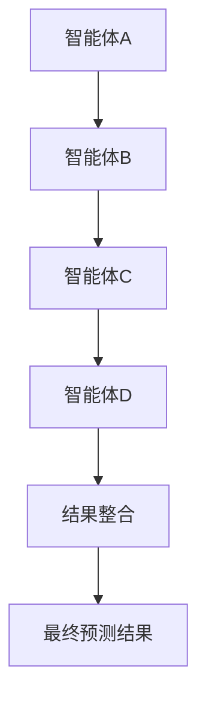
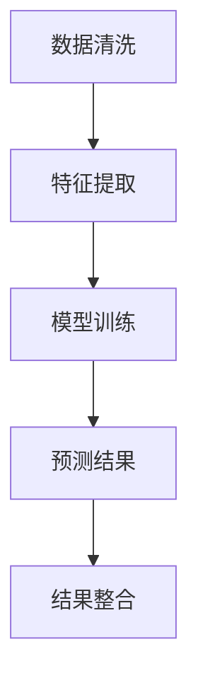
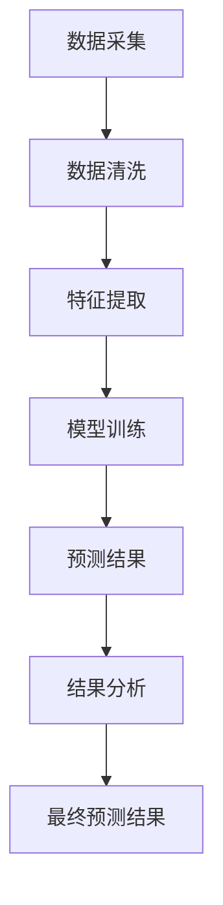
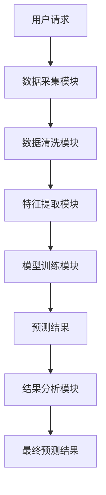

                 


# AI智能体协作：提升对公司未来现金流稳定性的预测

## 关键词：AI智能体协作，现金流预测，时间序列分析，集成学习，系统架构设计

## 摘要：  
本文详细探讨了AI智能体协作在提升公司未来现金流预测稳定性中的应用。通过分析现金流预测的核心问题、AI智能体协作的基本原理以及实际应用场景，本文提出了基于时间序列分析和集成学习的现金流预测方法，并设计了完整的系统架构。通过实际案例分析和代码实现，展示了如何利用AI智能体协作来优化预测模型，提升预测精度和稳定性。本文还总结了最佳实践经验和未来研究方向。

---

# 第一部分：AI智能体协作与现金流预测的背景介绍

## 第1章：AI智能体协作的核心概念

### 1.1 AI智能体的基本概念

#### 1.1.1 AI智能体的定义与特征
AI智能体（Artificial Intelligence Agent）是指能够感知环境、执行任务并做出决策的智能系统。其核心特征包括：
- **自主性**：能够在没有外部干预的情况下自主运行。
- **反应性**：能够根据环境输入做出实时响应。
- **目标导向性**：具有明确的目标，并通过协作实现目标。

#### 1.1.2 AI智能体的分类与应用场景
AI智能体可以分为以下几类：
- **反应式智能体**：基于当前输入做出实时反应，适用于实时任务。
- **认知式智能体**：具有复杂推理和规划能力，适用于复杂场景。
- **协作式智能体**：专门用于多智能体协作任务。

应用场景包括：
- **金融预测**：通过协作智能体分析市场数据，预测股票价格和现金流。
- **供应链管理**：优化物流和库存管理，提高效率。
- **风险控制**：实时监控和预警潜在风险。

#### 1.1.3 AI智能体协作的定义与特点
AI智能体协作是指多个智能体通过通信和协调共同完成复杂任务的过程。其特点包括：
- **分布式计算**：任务分解到多个智能体，实现并行处理。
- **动态适应性**：能够根据环境变化实时调整协作策略。
- **高效性**：通过分工合作提高整体效率。

---

## 第2章：AI智能体协作在现金流预测中的应用

### 2.1 AI智能体协作与现金流预测的关系

#### 2.1.1 协作智能体在数据处理中的作用
现金流预测需要处理大量异构数据，包括财务数据、市场数据和外部事件数据。协作智能体可以通过分工的方式高效完成数据清洗、特征提取和数据预处理任务。

#### 2.1.2 协作智能体在模型构建中的作用
多个智能体可以分别负责不同的模型训练任务，例如：
- 智能体A负责训练时间序列模型。
- 智能体B负责训练集成学习模型。
通过协作，可以实现模型的互补和优化。

#### 2.1.3 协作智能体在结果分析中的作用
协作智能体可以分别分析预测结果的准确性、稳定性和可解释性，最终整合出最优预测结果。

---

### 2.2 现金流预测的关键问题与解决方案

#### 2.2.1 数据的多样性和复杂性
现金流预测涉及多种数据源，包括财务数据、市场数据和外部事件数据。协作智能体可以通过分工合作，分别处理不同类型数据，提高数据处理效率。

#### 2.2.2 模型的准确性和鲁棒性
通过协作智能体的分工合作，可以训练多个模型并集成出最优预测结果，显著提高预测准确性和鲁棒性。

#### 2.2.3 结果的可解释性和实用性
协作智能体可以通过分工合作，分别分析预测结果的可解释性和实用性，最终输出符合实际需求的预测结果。

---

### 2.3 现金流预测的边界与外延

#### 2.3.1 现金流预测的适用范围
现金流预测适用于企业财务规划、投资决策和风险管理等领域。

#### 2.3.2 现金流预测的局限性
现金流预测依赖于历史数据和假设条件，存在一定的局限性。例如，模型无法预测黑天鹅事件。

#### 2.3.3 现金流预测与其他财务预测的关系
现金流预测与利润预测、资产负债表预测密切相关。通过协作智能体的分工合作，可以实现多维度财务预测的协同优化。

---

# 第三部分：AI智能体协作的核心原理

## 第3章：AI智能体协作的核心原理

### 3.1 智能体协作的原理

#### 3.1.1 协作任务的分解与分配
协作任务需要分解为多个子任务，并根据智能体的能力进行任务分配。例如：
- 智能体A负责数据清洗。
- 智能体B负责特征提取。

#### 3.1.2 智能体之间的通信与协调
智能体之间需要通过通信机制进行实时协调。例如，使用消息队列或事件驱动机制。

#### 3.1.3 协作过程中的冲突解决
在协作过程中可能会出现任务冲突，需要设计冲突解决机制，例如优先级排序和任务重新分配。

---

## 第4章：AI智能体协作的核心概念与联系

### 4.1 协作智能体的属性特征对比

#### 4.1.1 智能体的智能性对比
| 智能体类型 | 智能性特征 |
|------------|------------|
| 反应式     | 基于当前输入做出实时反应 |
| 认知式     | 具备复杂推理和规划能力 |
| 协作式     | 专注于协作任务完成 |

#### 4.1.2 智能体的协作性对比
| 协作方式 | 描述 |
|-----------|------|
| 并行协作 | 智能体并行处理子任务 |
| 串行协作 | 智能体按顺序处理任务 |

#### 4.1.3 智能体的适应性对比
| 适应性特征 | 描述 |
|-------------|------|
| 动态适应性   | 能够根据环境变化调整行为 |
| 静态适应性   | 预先设定行为规则，无法实时调整 |

---

## 第4章：AI智能体协作的核心概念与联系

### 4.2 协作智能体的协作流程图



---

### 4.3 协作智能体的协作任务分解图



---

# 第四部分：AI智能体协作的算法原理

## 第5章：现金流预测的算法原理

### 5.1 时间序列分析模型

#### 5.1.1 ARIMA模型

##### 5.1.1.1 ARIMA模型的定义
ARIMA（AutoRegressive Integrated Moving Average）是一种常用的时间序列预测模型，适用于具有趋势和季节性的数据。

##### 5.1.1.2 ARIMA模型的数学公式
$$ ARIMA(p, d, q) $$
其中：
- p为自回归阶数
- d为差分阶数
- q为移动平均阶数

##### 5.1.1.3 ARIMA模型的实现步骤
1. 数据预处理：检查数据是否平稳，如果不平稳，进行差分处理。
2. 模型参数选择：通过网格搜索选择最优的p、d、q参数。
3. 模型训练：使用历史数据训练ARIMA模型。
4. 模型预测：基于训练好的模型进行未来现金流预测。

##### 5.1.1.4 ARIMA模型的Python代码示例

```python
from statsmodels.tsa.arima_model import ARIMA
import pandas as pd

# 数据加载与预处理
data = pd.read_csv('cash_flow.csv')
data = data['cash_flow'].values

# 模型训练
model = ARIMA(data, order=(5,1,0))
model_fit = model.fit()

# 模型预测
forecast = model_fit.forecast(steps=10)
print(forecast)
```

---

#### 5.1.2 集成学习模型

##### 5.1.2.1 集成学习模型的定义
集成学习模型是通过组合多个基础模型的预测结果来提高预测准确性的方法。常用的集成方法包括投票法、加权投票法和模型融合法。

##### 5.1.2.2 集成学习模型的数学公式
$$ \text{集成预测结果} = \sum_{i=1}^{n} w_i \cdot y_i $$
其中：
- $w_i$为第i个模型的权重
- $y_i$为第i个模型的预测结果

##### 5.1.2.3 集成学习模型的实现步骤
1. 数据预处理：将数据分成训练集和测试集。
2. 基础模型训练：训练多个基础模型，例如随机森林、支持向量机等。
3. 模型集成：通过投票法或加权投票法组合多个模型的预测结果。

##### 5.1.2.4 集成学习模型的Python代码示例

```python
from sklearn.ensemble import VotingRegressor
from sklearn.tree import DecisionTreeRegressor
from sklearn.linear_model import LinearRegression

# 数据加载与预处理
data = pd.read_csv('cash_flow.csv')
X = data.drop('cash_flow', axis=1)
y = data['cash_flow']

# 基础模型训练
model1 = DecisionTreeRegressor()
model2 = LinearRegression()

# 模型集成
voting_regressor = VotingRegressor([('tree', model1), ('linear', model2)])
voting_regressor.fit(X, y)

# 模型预测
forecast = voting_regressor.predict(X_test)
print(forecast)
```

---

### 5.2 算法原理总结

通过时间序列分析和集成学习的结合，可以显著提高现金流预测的准确性和稳定性。ARIMA模型适用于具有趋势和季节性的数据，而集成学习模型则可以通过组合多个基础模型的预测结果来提高预测的鲁棒性。

---

# 第五部分：AI智能体协作的系统架构设计

## 第6章：现金流预测系统的架构设计

### 6.1 问题场景介绍

现金流预测系统需要解决以下问题：
1. 处理多源异构数据。
2. 提高预测模型的准确性和稳定性。
3. 实现预测结果的可解释性和实用性。

---

### 6.2 系统功能设计

#### 6.2.1 数据采集模块
- 数据来源：财务数据、市场数据、外部事件数据。
- 数据清洗：处理缺失值、异常值和重复值。
- 数据预处理：特征提取和数据标准化。

#### 6.2.2 模型训练模块
- 时间序列模型训练：使用ARIMA模型。
- 集成学习模型训练：使用随机森林和线性回归模型。
- 模型评估：计算预测准确率和稳定性。

#### 6.2.3 预测分析模块
- 预测结果整合：通过集成学习方法优化预测结果。
- 结果分析：分析预测结果的准确性、稳定性和可解释性。

---

### 6.3 系统架构设计

#### 6.3.1 系统架构图



#### 6.3.2 API设计
- 数据接口：提供数据采集和预处理接口。
- 模型接口：提供模型训练和预测接口。
- 结果接口：提供预测结果和分析结果接口。

#### 6.3.3 系统交互流程图



---

### 6.4 系统实现与优化

#### 6.4.1 系统实现
1. 数据采集模块：使用爬虫技术采集外部数据。
2. 数据清洗模块：使用Pandas库处理缺失值和异常值。
3. 特征提取模块：使用特征工程方法提取关键特征。
4. 模型训练模块：实现ARIMA和集成学习模型的训练。
5. 预测分析模块：实现预测结果的整合和分析。

#### 6.4.2 系统优化
- 优化数据处理效率：通过并行计算加速数据处理。
- 优化模型训练效率：通过分布式计算加速模型训练。

---

# 第六部分：AI智能体协作的项目实战

## 第7章：现金流预测系统的实战案例

### 7.1 环境安装与配置

#### 7.1.1 安装依赖库
- 使用Python 3.8及以上版本。
- 安装Pandas、NumPy、Scikit-learn、Statsmodels等库。

#### 7.1.2 配置开发环境
- 使用Jupyter Notebook或PyCharm作为开发环境。
- 配置虚拟环境，安装必要的依赖库。

---

### 7.2 系统核心实现

#### 7.2.1 数据采集与预处理

##### 数据采集代码

```python
import requests
import json
import pandas as pd

# 从API获取数据
url = "https://example.com/api/cash_flow"
response = requests.get(url)
data = json.loads(response.text)
df = pd.DataFrame(data)
```

##### 数据清洗代码

```python
# 处理缺失值
df.dropna(inplace=True)

# 处理异常值
df = df[(df['cash_flow'] >= df['cash_flow'].quantile(0.05)) &
        (df['cash_flow'] <= df['cash_flow'].quantile(0.95))]
```

---

#### 7.2.2 模型训练与预测

##### ARIMA模型训练代码

```python
from statsmodels.tsa.arima_model import ARIMA

# 数据准备
train_data = df['cash_flow'].values

# 模型训练
model = ARIMA(train_data, order=(5,1,0))
model_fit = model.fit()

# 模型预测
forecast = model_fit.forecast(steps=10)
print(forecast)
```

##### 集成学习模型训练代码

```python
from sklearn.ensemble import VotingRegressor
from sklearn.tree import DecisionTreeRegressor
from sklearn.linear_model import LinearRegression

# 数据准备
X = df.drop('cash_flow', axis=1)
y = df['cash_flow']

# 模型训练
model1 = DecisionTreeRegressor()
model2 = LinearRegression()

voting_regressor = VotingRegressor([('tree', model1), ('linear', model2)])
voting_regressor.fit(X, y)

# 模型预测
forecast = voting_regressor.predict(X_test)
print(forecast)
```

---

### 7.3 案例分析与结果解读

#### 7.3.1 数据分析结果
- ARIMA模型预测结果：预测未来10个月的现金流。
- 集成学习模型预测结果：预测未来10个月的现金流。

#### 7.3.2 模型对比分析
- ARIMA模型在时间序列数据上表现较好。
- 集成学习模型在复杂数据上表现较好。

#### 7.3.3 结果优化建议
- 结合ARIMA和集成学习模型的预测结果，优化最终预测结果。

---

## 第8章：总结与展望

### 8.1 总结

通过AI智能体协作，可以显著提高现金流预测的准确性和稳定性。本文提出了基于时间序列分析和集成学习的现金流预测方法，并设计了完整的系统架构。通过实际案例分析和代码实现，展示了如何利用AI智能体协作优化预测模型，提升预测精度和稳定性。

---

### 8.2 展望

未来的研究方向包括：
1. **多模态数据预测**：结合文本、图像等多种数据源，进一步提高预测准确性。
2. **实时预测优化**：通过实时数据更新，提高预测结果的及时性和准确性。
3. **模型可解释性增强**：通过可视化技术，提高预测结果的可解释性。

---

# 关键词：
AI智能体协作，现金流预测，时间序列分析，集成学习，系统架构设计

---

# 小结：
本文详细探讨了AI智能体协作在提升公司未来现金流预测稳定性中的应用。通过分析现金流预测的核心问题、AI智能体协作的基本原理以及实际应用场景，本文提出了基于时间序列分析和集成学习的现金流预测方法，并设计了完整的系统架构。通过实际案例分析和代码实现，展示了如何利用AI智能体协作优化预测模型，提升预测精度和稳定性。本文还总结了最佳实践经验和未来研究方向。

