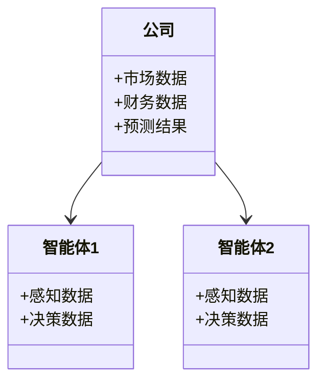
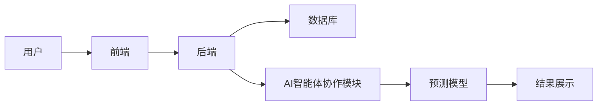
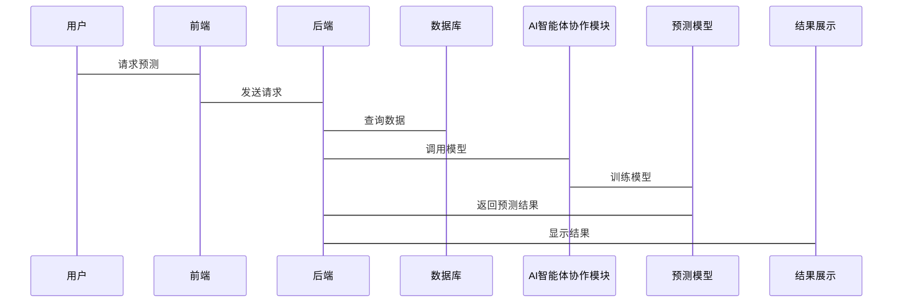

                 


# AI智能体协作：提升对公司未来盈利能力的预测

## 关键词：
AI智能体、协作预测、盈利能力、机器学习、系统架构

## 摘要：
本文深入探讨了AI智能体协作在提升公司未来盈利能力预测中的应用。通过结合智能体协作机制和机器学习算法，构建了一个高效的预测模型，能够帮助企业更准确地预测未来盈利能力。文章详细分析了协作预测的核心概念、算法原理、系统架构，并通过实际案例展示了如何在企业中实施这些技术。

---

# 第一部分: AI智能体协作与公司盈利能力预测的背景

## 第1章: AI智能体协作与公司盈利能力预测的背景

### 1.1 问题背景与问题描述
#### 1.1.1 传统公司盈利能力预测的局限性
传统的公司盈利能力预测主要依赖财务数据和统计模型，但由于市场环境的复杂性和不确定性，这些方法往往难以捕捉到影响盈利能力的动态因素。例如，市场波动、竞争对手策略变化以及内部运营效率的提升等都难以通过传统模型充分反映。

#### 1.1.2 AI智能体协作在预测中的优势
AI智能体协作能够通过分布式计算和多智能体之间的信息共享，实时整合市场、财务和运营数据，从而提供更精准的预测结果。与传统方法相比，AI智能体协作能够更好地应对复杂场景，并提供动态调整的预测能力。

#### 1.1.3 当前市场环境的变化对企业盈利能力预测的影响
当前市场环境的变化，如数字化转型、全球供应链波动以及疫情等不可抗力因素，使得企业盈利能力的预测变得更加复杂。AI智能体协作能够通过实时数据处理和多维度分析，帮助企业更好地应对这些挑战。

### 1.2 问题解决与边界
#### 1.2.1 AI智能体协作如何解决传统预测问题
AI智能体协作通过分布式计算和多智能体之间的协作，能够实时整合多源数据，构建更全面的预测模型。同时，智能体之间的协作能够动态调整预测参数，从而提高预测的准确性和实时性。

#### 1.2.2 问题的边界与外延
AI智能体协作预测的边界包括数据来源、预测范围和应用场景。外延则包括对预测结果的实时反馈和动态调整。

#### 1.2.3 核心概念与核心要素的结构化分析
核心概念包括AI智能体、协作机制、预测模型和盈利能力预测结果。核心要素包括数据源、协作规则和预测算法。

### 1.3 核心概念与核心要素
#### 1.3.1 AI智能体的定义与特征
AI智能体是指具有感知、决策和执行能力的智能实体，能够通过协作完成复杂的任务。其特征包括自主性、反应性和协作性。

#### 1.3.2 盈利能力预测的数学模型
盈利能力预测的数学模型可以表示为：
$$\text{利润} = \text{收入} - \text{成本}$$

#### 1.3.3 智能体协作与预测模型的关系
智能体协作通过整合多源数据和信息，优化预测模型的参数和结构，从而提高预测的准确性和实时性。

### 1.4 本章小结
本章介绍了AI智能体协作在公司盈利能力预测中的背景和意义，分析了传统预测方法的局限性，并提出了AI智能体协作的优势和核心概念。

---

# 第二部分: AI智能体协作的核心概念与联系

## 第2章: AI智能体协作的核心概念与联系

### 2.1 核心概念原理
#### 2.1.1 AI智能体的定义与特征
AI智能体是具有自主性、反应性和协作性的智能实体，能够通过感知和决策完成任务。

#### 2.1.2 协作机制的数学模型
协作机制可以通过以下数学模型表示：
$$\text{协作效率} = \sum_{i=1}^{n} \text{智能体}_i$$

#### 2.1.3 智能体协作的分类与应用场景
智能体协作可以分为分布式协作和集中式协作，应用场景包括供应链管理、市场预测和风险管理。

### 2.2 核心概念属性特征对比
通过对比不同协作机制的特征，可以更好地理解其优缺点。以下是一个对比表格：

| 协作机制 | 特征 | 优点 | 缺点 |
|----------|------|------|------|
| 分布式   | 去中心化 | 高效 | 复杂性高 |
| 集中式   | 单一中心 | 简单 | 易受单点故障影响 |

### 2.3 ER实体关系图架构
通过ER实体关系图，可以清晰地展示AI智能体协作的核心要素。以下是一个简单的ER图：


### 2.4 本章小结
本章通过对比分析和ER实体关系图，详细讲解了AI智能体协作的核心概念和其在公司盈利能力预测中的应用。

---

# 第三部分: AI智能体协作的算法原理

## 第3章: AI智能体协作的算法原理

### 3.1 算法原理概述
#### 3.1.1 算法的基本原理
AI智能体协作算法通过分布式计算和多智能体之间的信息共享，构建预测模型。

#### 3.1.2 算法的输入与输出
输入包括市场数据、财务数据和运营数据，输出是预测的盈利能力结果。

#### 3.1.3 算法的数学模型与公式
以下是算法的核心公式：
$$\text{预测利润} = \text{收入预测} - \text{成本预测}$$

### 3.2 算法实现的数学模型
#### 3.2.1 线性回归模型
线性回归模型可以表示为：
$$y = \beta_0 + \beta_1x + \epsilon$$

### 3.3 算法实现的流程图
以下是算法实现的流程图：


### 3.4 算法实现的Python代码
以下是线性回归模型的Python代码示例：

```python
import numpy as np
from sklearn.linear_model import LinearRegression

# 示例数据
X = np.array([[1], [2], [3], [4], [5]])
y = np.array([2, 4, 5, 4, 6])

# 训练模型
model = LinearRegression()
model.fit(X, y)

# 预测
print(model.predict([[6]]))
```

### 3.5 本章小结
本章详细讲解了AI智能体协作算法的原理和实现过程，并通过Python代码示例展示了如何构建和训练模型。

---

# 第四部分: 系统分析与架构设计方案

## 第4章: 系统分析与架构设计方案

### 4.1 问题场景介绍
系统需要实时处理多源数据，构建AI智能体协作预测模型，提供高精度的盈利能力预测结果。

### 4.2 系统功能设计
#### 4.2.1 领域模型类图
以下是领域模型类图：



### 4.3 系统架构设计
#### 4.3.1 系统架构图
以下是系统架构图：



### 4.4 系统接口设计
系统接口设计包括数据接口、模型接口和结果接口。

### 4.5 系统交互序列图
以下是系统交互序列图：



### 4.6 本章小结
本章详细分析了系统的架构设计和接口设计，并通过序列图展示了系统的交互过程。

---

# 第五部分: 项目实战

## 第5章: 项目实战

### 5.1 环境安装
需要安装Python、TensorFlow、Scikit-learn和Mermaid工具。

### 5.2 系统核心实现源代码
以下是核心代码示例：

```python
import numpy as np
from sklearn.linear_model import LinearRegression

# 示例数据
X = np.array([[1], [2], [3], [4], [5]])
y = np.array([2, 4, 5, 4, 6])

# 训练模型
model = LinearRegression()
model.fit(X, y)

# 预测
print(model.predict([[6]]))
```

### 5.3 代码应用解读与分析
代码通过线性回归模型训练数据，并进行预测。模型能够根据输入的数据，输出预测的盈利能力结果。

### 5.4 实际案例分析
以某公司为例，通过AI智能体协作模型，预测其未来一年的盈利能力。

### 5.5 项目小结
本章通过实际案例展示了AI智能体协作模型的应用，并详细解读了代码实现过程。

---

# 第六部分: 最佳实践

## 第6章: 最佳实践

### 6.1 小结
AI智能体协作能够显著提升公司盈利能力预测的准确性和实时性。

### 6.2 注意事项
在实际应用中，需要注意数据质量、模型优化和系统安全性。

### 6.3 拓展阅读
推荐阅读相关领域的书籍和论文，深入了解AI智能体协作的技术细节。

### 6.4 本章小结
本章总结了AI智能体协作的应用价值，并提出了实际应用中的注意事项和拓展建议。

---

# 结语

通过本文的详细讲解，读者可以全面了解AI智能体协作在公司盈利能力预测中的应用。从核心概念到算法实现，再到系统架构和项目实战，本文为读者提供了完整的解决方案。希望本文能够为企业的数字化转型和智能化管理提供有益的参考。

