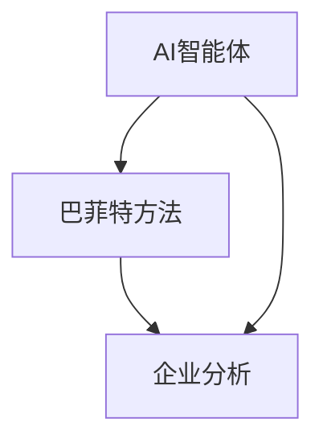
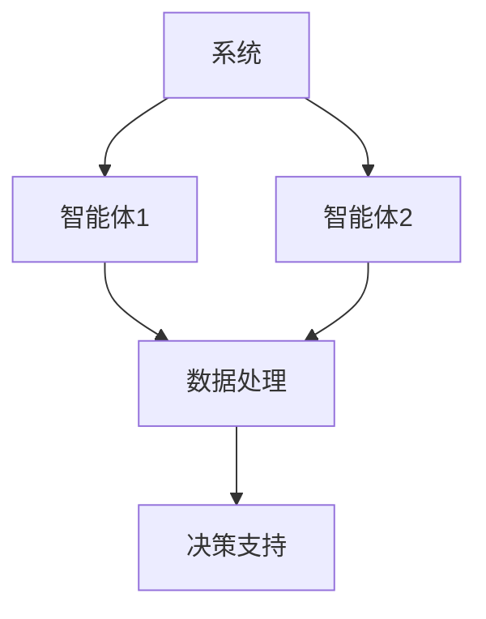
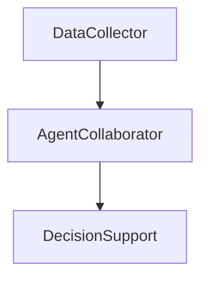

                 


# AI智能体协作：提升巴菲特的企业分析方法

## 关键词：AI智能体、巴菲特方法、企业分析、协作机制、系统架构

## 摘要

本文探讨如何将AI智能体协作技术应用于巴菲特的企业分析方法中，提升企业分析的效率和准确性。通过结合多智能体协作和价值投资理念，提出一种创新的企业分析框架，详细分析其系统架构、实现方法和实际应用案例，提供最佳实践和未来展望。

---

# 正文

## 第1章：AI智能体协作的背景与概念

### 1.1 背景介绍

#### 1.1.1 AI智能体协作的背景
人工智能（AI）技术的发展日新月异，智能体协作作为一种新兴的技术，正在改变企业分析的方式。智能体协作通过多个智能体协同工作，能够处理复杂问题，提升决策效率。

#### 1.1.2 巴菲特方法的核心要素
巴菲特的价值投资理念强调对企业基本面的深入分析，包括财务指标、行业趋势和竞争优势。这种方法依赖于详尽的数据分析和逻辑推理。

#### 1.1.3 结合的必要性
将AI智能体协作应用于巴菲特方法，可以弥补传统分析的不足，提高分析效率和准确性，同时捕捉更多潜在信息。

### 1.2 核心概念与联系

#### 1.2.1 核心概念对比
| 概念       | 描述                                                                 |
|------------|----------------------------------------------------------------------|
| AI智能体   | 具备自主决策能力的实体，能够与其他智能体协作完成任务                 |
| 巴菲特方法 | 以企业基本面分析为基础，寻找具有长期投资价值的企业                 |

#### 1.2.2 实体关系图


### 1.3 结合理论基础

#### 1.3.1 理论融合的必要性
AI智能体协作能够提供高效的数据处理和分析能力，而巴菲特方法提供了明确的分析框架，两者结合可以优化企业分析过程。

#### 1.3.2 协作机制
通过分布式任务分配和结果共享，AI智能体协作能够快速处理大量数据，并提供实时反馈，辅助投资决策。

---

## 第2章：AI智能体协作与巴菲特方法的结合

### 2.1 理论基础

#### 2.1.1 多智能体协作算法
基于多智能体系统的分布式决策算法，如Distributed Constraint Optimization Problems（DCOP），用于协调各智能体的任务分配。

#### 2.1.2 协作机制设计


### 2.2 算法实现

#### 2.2.1 基于DCOP的协作算法
DCOP算法用于智能体之间的任务分配和优化，具体步骤如下：
1. 问题建模：将企业分析任务分解为多个子任务。
2. 分布式求解：各智能体协同解决子任务，确保全局最优。
3. 结果整合：汇总各智能体的结果，形成最终决策支持。

#### 2.2.2 算法代码示例
```python
def distributed_decision_making(tasks):
    # 分解任务
    sub_tasks = decompose_tasks(tasks)
    # 分配任务
    agents = assign_tasks(sub_tasks)
    # 协作解决
    solutions = [agent.solve(task) for agent, task in zip(agents, sub_tasks)]
    # 整合结果
    return combine_solutions(solutions)
```

### 2.3 应用场景

#### 2.3.1 数据采集与处理
通过AI智能体协作，实时采集并处理企业财务数据，识别潜在的投资机会。

#### 2.3.2 风险评估与预警
利用协作机制，及时发现企业潜在风险，提供预警信息，辅助投资决策。

---

## 第3章：系统架构与实现

### 3.1 系统架构设计

#### 3.1.1 功能模块划分
- 数据采集模块：负责收集企业数据。
- 智能体协作模块：处理协作任务。
- 决策支持模块：提供投资建议。

#### 3.1.2 系统架构图


### 3.2 接口与交互设计

#### 3.2.1 API接口
- 数据接口：用于数据传输。
- 协作接口：用于任务分配和结果共享。

#### 3.2.2 交互流程
1. 数据采集模块接收数据请求。
2. 智能体协作模块处理数据。
3. 决策支持模块生成报告。

---

## 第4章：项目实战

### 4.1 环境搭建

#### 4.1.1 环境配置
安装Python、TensorFlow、Keras等工具。

#### 4.1.2 依赖管理
使用虚拟环境管理依赖，确保各模块兼容。

### 4.2 核心代码实现

#### 4.2.1 数据预处理
```python
import pandas as pd

def preprocess_data(data):
    # 假设data是一个DataFrame
    data = data.dropna()
    data = pd.get_dummies(data)
    return data
```

#### 4.2.2 智能体协作实现
```python
class Agent:
    def __init__(self, id):
        self.id = id
        self.tasks = []
    
    def receive_task(self, task):
        self.tasks.append(task)
    
    def solve_task(self, task):
        # 简单实现，具体任务处理逻辑可扩展
        return f"Task {task} solved by Agent {self.id}"
```

### 4.3 案例分析

#### 4.3.1 案例背景
分析一家虚构企业的财务数据，评估其投资价值。

#### 4.3.2 实验结果
通过协作算法，智能体快速分析数据，生成投资建议。

---

## 第5章：总结与展望

### 5.1 最佳实践

#### 5.1.1 数据质量
确保数据准确性和完整性，提高分析结果的可靠性。

#### 5.1.2 系统维护
定期更新模型和数据，适应市场变化。

### 5.2 未来展望

#### 5.2.1 技术创新
探索更高效的协作算法，提升分析效率。

#### 5.2.2 应用扩展
将AI智能体协作应用于更多领域，如金融风险控制和投资组合优化。

---

## 结语

通过本文的探讨，我们展示了如何将AI智能体协作技术应用于巴菲特的企业分析方法中，提供了一种创新的企业分析框架。未来，随着技术的进步，这一方法将为企业分析带来更大的价值。

