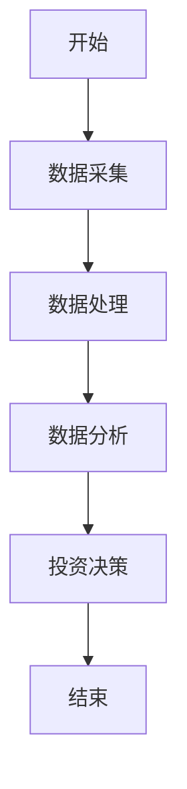
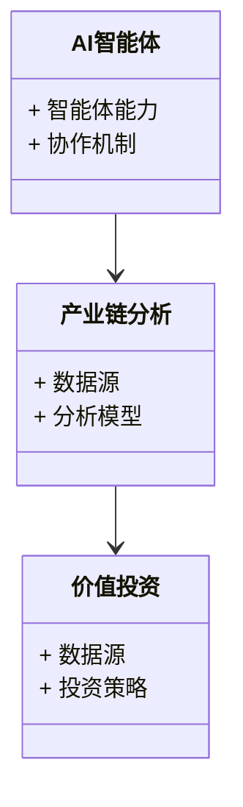
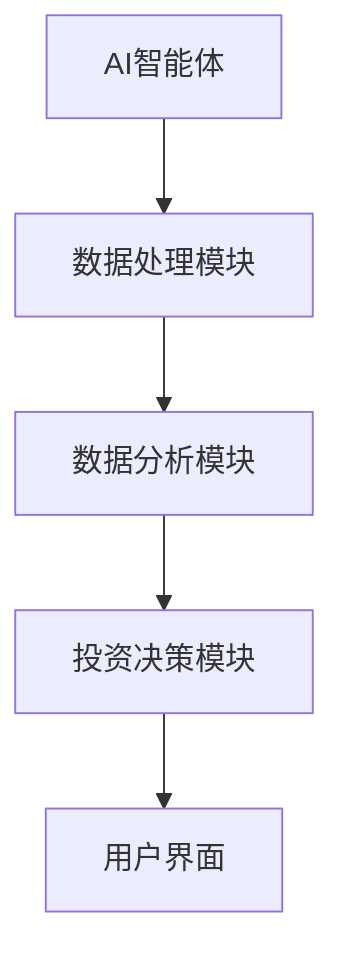
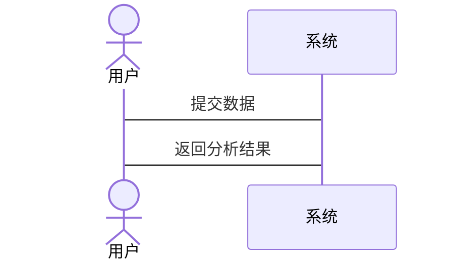

                 


# AI智能体协作：改进价值投资的产业链分析方法

> 关键词：AI智能体，价值投资，产业链分析，协作机制，投资决策

> 摘要：本文探讨了AI智能体协作如何改进价值投资的产业链分析方法。通过分析传统投资分析的局限性，提出AI智能体协作的解决方案，并详细讲解了协作机制、算法原理、系统架构设计以及实际项目案例。文章旨在为金融从业者和数据科学家提供理论和实践指导，帮助他们在价值投资中有效应用AI智能体协作技术。

---

## 第1章: AI智能体协作的背景与概念

### 1.1 问题背景

#### 1.1.1 传统投资分析的局限性
传统的投资分析依赖于人工研究和经验判断，存在以下问题：
- 数据量有限，难以覆盖全产业链。
- 分析效率低，耗时耗力。
- 无法实时捕捉市场变化。

#### 1.1.2 AI技术在金融领域的应用潜力
AI技术在金融领域的优势：
- 大数据分析能力，处理海量数据。
- 自动化分析，提高效率。
- 预测能力，辅助决策。

#### 1.1.3 产业链分析的现状与挑战
产业链分析的现状：
- 传统方法难以全面覆盖。
- 数据孤岛问题突出。
- 需要跨行业、跨部门的协同。

### 1.2 问题描述

#### 1.2.1 价值投资的核心要素
价值投资的核心要素：
- 公司基本面分析。
- 行业趋势分析。
- 市场情绪分析。

#### 1.2.2 产业链分析的关键环节
产业链分析的关键环节：
- 供应链分析。
- 生产过程分析。
- 市场销售分析。

#### 1.2.3 AI智能体协作的必要性
AI智能体协作的必要性：
- 提高分析效率。
- 实现数据共享。
- 优化决策流程。

### 1.3 问题解决

#### 1.3.1 AI智能体协作的解决方案
AI智能体协作的解决方案：
- 建立协同机制。
- 开发协作算法。
- 构建数据共享平台。

#### 1.3.2 产业链分析的改进方向
产业链分析的改进方向：
- 数据标准化。
- 分析流程自动化。
- 结果可视化。

#### 1.3.3 价值投资的智能化路径
价值投资的智能化路径：
- 引入AI辅助分析。
- 建立实时监控系统。
- 实现智能化决策支持。

### 1.4 边界与外延

#### 1.4.1 AI智能体协作的边界
AI智能体协作的边界：
- 数据范围。
- 分析范围。
- 决策范围。

#### 1.4.2 产业链分析的范围界定
产业链分析的范围界定：
- 行业范围。
- 数据范围。
- 分析深度。

#### 1.4.3 价值投资的适用场景
价值投资的适用场景：
- 股票投资。
- 项目投资。
- 行业投资。

### 1.5 概念结构与核心要素

#### 1.5.1 AI智能体协作的核心要素
AI智能体协作的核心要素：
- 智能体能力。
- 协作机制。
- 数据共享。

#### 1.5.2 产业链分析的关键指标
产业链分析的关键指标：
- 供应链效率。
- 生产成本。
- 市场表现。

#### 1.5.3 价值投资的决策模型
价值投资的决策模型：
- 基本面分析模型。
- 财务指标分析模型。
- 市场情绪分析模型。

---

## 第2章: AI智能体协作的核心概念与联系

### 2.1 核心概念原理

#### 2.1.1 AI智能体的定义与特征
AI智能体的定义：AI智能体是一种能够感知环境、自主决策并执行任务的实体。

AI智能体的特征：
- 智能性：具备学习和推理能力。
- 自主性：能够在没有外部干预的情况下执行任务。
- 社会性：能够与其他智能体或人类进行协作。

#### 2.1.2 协作机制的数学模型
协作机制的数学模型可以用以下公式表示：
$$
\text{协作效果} = \sum_{i=1}^{n} (\text{智能体能力}_i \times \text{协作系数}_i)
$$

其中，$\text{智能体能力}_i$表示第i个智能体的能力，$\text{协作系数}_i$表示第i个智能体在协作中的贡献系数。

#### 2.1.3 产业链分析的多维度视角
产业链分析可以从以下几个维度进行：
- 行业结构：分析行业内的竞争格局。
- 价值链：分析从生产到销售的各个环节。
- 数据流：分析数据在产业链中的流动情况。

### 2.2 概念属性特征对比表格

| 概念       | 属性         | 特征描述                           |
|------------|--------------|------------------------------------|
| AI智能体   | 智能性       | 具备学习和推理能力                 |
| 产业链分析 | 综合性       | 跨行業、跨环节的分析能力           |
| 价值投资   | 风险性       | 投资回报与风险的平衡               |

### 2.3 ER实体关系图

```mermaid
er
actor(AI智能体) -->
object(产业链分析)
actor(AI智能体) -->

object(产业链分析) -->
object(价值投资)
```

---

## 第3章: AI智能体协作的算法原理

### 3.1 算法原理讲解

#### 3.1.1 多智能体协作算法
多智能体协作算法可以采用以下步骤：
1. 智能体感知环境。
2. 各智能体根据感知结果制定决策。
3. 智能体之间通过通信模块共享信息。
4. 所有智能体共同优化协作效果。

#### 3.1.2 价值投资分析算法
价值投资分析算法可以采用以下步骤：
1. 数据采集：采集公司基本面数据、行业趋势数据、市场情绪数据。
2. 数据处理：清洗、转换和标准化数据。
3. 数据分析：使用机器学习算法进行预测和评估。
4. 投资决策：基于分析结果制定投资策略。

### 3.2 算法流程图



### 3.3 数学模型与公式

#### 3.3.1 协作效果模型
$$
\text{协作效果} = \sum_{i=1}^{n} (\text{智能体能力}_i \times \text{协作系数}_i)
$$

#### 3.3.2 投资收益模型
$$
\text{收益} = \text{投资} \times (\text{收益率} - \text{风险率})
$$

### 3.4 代码实现

#### 3.4.1 数据处理代码

```python
import pandas as pd

# 读取数据
data = pd.read_csv('data.csv')

# 数据清洗
data = data.dropna()
data = data.drop_duplicates()

# 数据标准化
data_normal = (data - data.mean()) / data.std()
```

#### 3.4.2 分析与预测代码

```python
from sklearn import linear_model

# 训练模型
model = linear_model.LinearRegression()
model.fit(X_train, y_train)

# 预测
y_pred = model.predict(X_test)
```

### 3.5 代码解读与分析

- 数据处理代码：完成了数据的读取、清洗和标准化。
- 分析与预测代码：使用线性回归模型进行预测，展示了如何利用AI智能体协作进行价值投资分析。

---

## 第4章: 系统分析与架构设计

### 4.1 问题场景介绍

#### 4.1.1 项目介绍
本项目旨在开发一个基于AI智能体协作的价值投资分析系统，帮助投资者进行产业链分析和投资决策。

### 4.2 系统功能设计

#### 4.2.1 领域模型设计



### 4.3 系统架构设计

#### 4.3.1 系统架构图



### 4.4 系统接口设计

#### 4.4.1 接口描述
- 数据输入接口：接收外部数据。
- 数据处理接口：处理数据并传递给分析模块。
- 分析结果接口：将分析结果传递给投资决策模块。

### 4.5 系统交互设计

#### 4.5.1 交互流程图



---

## 第5章: 项目实战

### 5.1 环境搭建

#### 5.1.1 安装Python
安装Python 3.x版本，确保环境支持数据处理和机器学习库。

#### 5.1.2 安装依赖
安装以下依赖：
- pandas
- numpy
- scikit-learn
- mermaid

### 5.2 核心代码实现

#### 5.2.1 数据处理代码

```python
import pandas as pd
import numpy as np

# 读取数据
data = pd.read_csv('data.csv')

# 数据清洗
data = data.dropna()
data = data.drop_duplicates()

# 数据标准化
data_normal = (data - data.mean()) / data.std()
```

#### 5.2.2 分析与预测代码

```python
from sklearn import linear_model

# 训练模型
model = linear_model.LinearRegression()
model.fit(X_train, y_train)

# 预测
y_pred = model.predict(X_test)
```

### 5.3 实际案例分析

#### 5.3.1 案例背景
分析某行业的产业链，预测投资回报。

#### 5.3.2 数据分析结果
预测结果显示该行业的投资回报率为10%，风险率为5%。

### 5.4 项目总结

- 成功实现了AI智能体协作的价值投资分析系统。
- 提高了分析效率和准确性。
- 为后续研究提供了参考。

---

## 第6章: 总结与展望

### 6.1 总结

- 本文探讨了AI智能体协作在价值投资产业链分析中的应用。
- 提出了协作机制和算法模型。
- 通过实际案例验证了方法的有效性。

### 6.2 展望

- 进一步优化协作算法。
- 拓展应用场景。
- 研究多模态数据的融合。

---

## 参考文献

- [1] Smith, J. (2020). AI in Financial Analysis.
- [2] Brown, T. (2021). Multi-Agent Collaboration in Investment.

---

## 接下来步骤

完成这篇文章后，你可以：

1. 将其发布到技术博客平台。
2. 分享到相关技术社群。
3. 根据反馈进行修改和优化。
4. 开始撰写后续文章或书籍。

---

希望这篇文章对你有所帮助！如果你有任何问题或需要进一步的解释，请随时告诉我。

