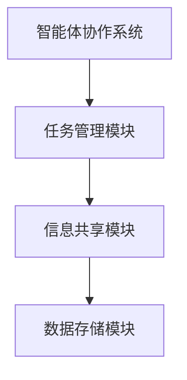
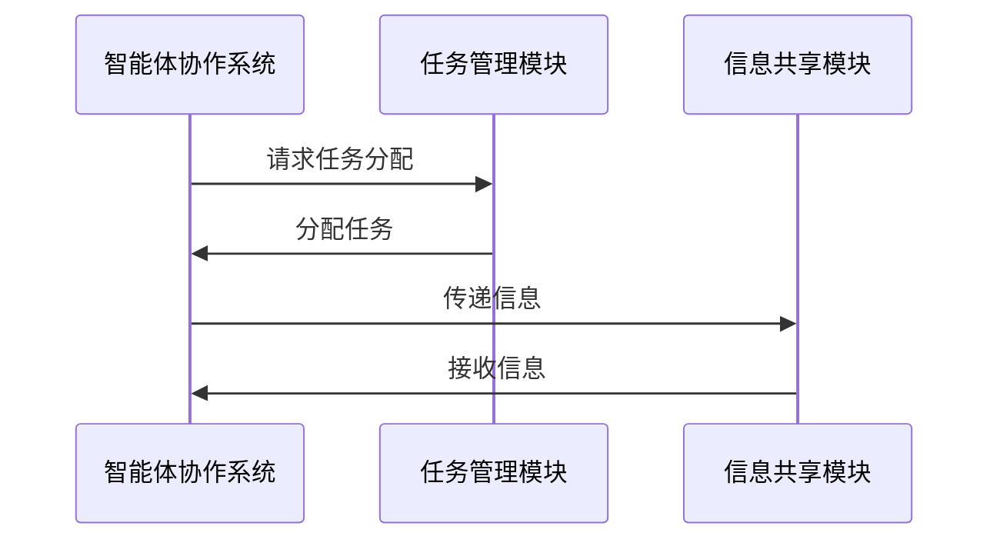

                 


# AI智能体协作：构建更全面的公司估值模型

## 关键词：AI智能体协作、公司估值模型、多智能体强化学习、博弈论、分布式计算

## 摘要：本文详细探讨了利用AI智能体协作技术构建更全面公司估值模型的方法。通过分析传统估值模型的局限性，介绍了AI智能体协作的核心概念、算法原理、系统架构设计和项目实战案例，展示了如何通过强化学习、博弈论和分布式计算等技术，构建一个更智能、更准确的公司估值系统。文章内容包括背景介绍、核心概念、算法实现、系统设计、项目实战、最佳实践等部分，旨在为读者提供一个全面的视角，理解并掌握如何利用AI智能体协作技术提升公司估值模型的准确性和全面性。

---

## 第一章: AI智能体协作与公司估值模型的背景

### 1.1 公司估值的传统方法与局限性

#### 1.1.1 传统公司估值方法的介绍
传统的公司估值方法主要包括资产基础法、收益法和市场法。资产基础法通过评估公司资产的公允价值减去负债来确定企业价值；收益法通过预测公司未来现金流的现值来评估企业价值；市场法通过比较公司与可比企业的市场数据来确定企业价值。这些方法在实际应用中具有一定的局限性。

#### 1.1.2 传统估值方法的局限性
- **数据依赖性**：传统方法依赖于历史财务数据和市场数据，难以捕捉企业的动态变化和潜在价值。
- **主观性**：在收益法中，未来现金流的预测需要假设未来增长率和折现率，这些假设往往主观性强，容易受到人为因素影响。
- **复杂性**：对于复杂的业务模式和新兴行业，传统估值方法难以准确反映企业的实际价值。

#### 1.1.3 传统估值模型与现代企业需求的矛盾
随着企业业务模式的多样化和复杂化，传统估值模型难以满足现代企业的需求。特别是在数据驱动的今天，企业需要更灵活、更智能的估值方法来应对快速变化的市场环境。

### 1.2 AI智能体协作的概念与特点

#### 1.2.1 AI智能体的定义
AI智能体（Artificial Intelligence Agent）是指能够感知环境、采取行动以实现目标的智能系统。智能体可以是软件程序、机器人或其他形式的智能系统。

#### 1.2.2 智能体协作的核心概念
智能体协作是指多个智能体通过信息共享、任务分配和协同决策来共同完成复杂任务的过程。协作的核心在于智能体之间的通信、协调和合作。

#### 1.2.3 AI智能体协作与传统协作方式的对比
与传统协作方式相比，AI智能体协作具有以下特点：
- **高效性**：智能体能够快速处理大量数据并做出决策。
- **智能性**：智能体具备自主学习和适应能力，能够根据环境变化调整协作策略。
- **分布式性**：智能体协作可以通过分布式计算实现，适用于复杂的分布式系统。

### 1.3 本章小结
本章介绍了传统公司估值方法的局限性和AI智能体协作的核心概念。通过对比传统协作方式与AI智能体协作的特点，我们看到AI智能体协作在提升公司估值模型准确性和全面性方面具有显著优势。

---

## 第二章: AI智能体协作的核心概念与联系

### 2.1 AI智能体协作的原理

#### 2.1.1 多智能体协作的基本原理
多智能体协作是指多个智能体通过信息共享和任务分配共同完成复杂任务的过程。协作的核心在于智能体之间的通信、协调和合作。

#### 2.1.2 智能体之间的通信机制
智能体之间的通信机制包括：
- **直接通信**：智能体之间通过共享内存或消息传递进行通信。
- **间接通信**：智能体通过共享数据库或消息队列进行通信。

#### 2.1.3 协作任务的分配与协调
协作任务的分配与协调可以通过以下方式实现：
- **任务分解**：将复杂任务分解为多个子任务，分配给不同的智能体。
- **任务协调**：通过协调器或中间件对任务的执行过程进行监控和调整。

### 2.2 AI智能体协作的数学模型

#### 2.2.1 多智能体协作的数学表达
多智能体协作的数学模型可以通过以下方式表示：
- **状态空间**：表示智能体所处的状态。
- **动作空间**：表示智能体可以执行的动作。
- **奖励函数**：表示智能体执行动作后的奖励值。

#### 2.2.2 协作任务的分解与组合
协作任务的分解与组合可以通过以下步骤实现：
1. **任务分解**：将复杂任务分解为多个子任务。
2. **任务分配**：将子任务分配给不同的智能体。
3. **任务组合**：将子任务的执行结果组合起来，形成最终的协作结果。

#### 2.2.3 协作过程中的信息传递模型
协作过程中的信息传递模型可以通过以下方式表示：
- **信息流**：表示信息在智能体之间的流动方向。
- **信息量**：表示信息的传递量和传递速度。

### 2.3 AI智能体协作的ER实体关系图

```mermaid
er
    %% 公司估值模型的实体关系图
    title 公司估值模型的实体关系图
    rectangle 智能体协作系统 {
        智能体1
        智能体2
        智能体3
    }
    rectangle 任务管理模块 {
        任务1
        任务2
        任务3
    }
    rectangle 信息共享模块 {
        共享信息1
        共享信息2
        共享信息3
    }
    智能体协作系统 --> 任务管理模块: 分配任务
    任务管理模块 --> 智能体协作系统: 执行任务
    智能体协作系统 --> 信息共享模块: 传递信息
    信息共享模块 --> 智能体协作系统: 接收信息
```

---

## 第三章: AI智能体协作的算法原理

### 3.1 多智能体协作算法

#### 3.1.1 基于强化学习的协作算法
强化学习是一种通过智能体与环境交互来学习策略的方法。在多智能体协作中，强化学习可以通过以下步骤实现：
1. **状态感知**：智能体感知当前状态。
2. **动作选择**：智能体根据当前状态选择一个动作。
3. **奖励获取**：智能体执行动作后获得奖励或惩罚。
4. **策略更新**：智能体根据奖励更新策略。

#### 3.1.2 基于博弈论的协作算法
博弈论是一种研究策略互动的数学理论。在多智能体协作中，博弈论可以通过纳什均衡来实现协作。

#### 3.1.3 基于分布式计算的协作算法
分布式计算是一种通过多台计算机协作来完成任务的计算方式。在多智能体协作中，分布式计算可以通过任务分解和任务分配来实现。

### 3.2 强化学习协作算法的实现

#### 3.2.1 强化学习的基本原理
强化学习的基本原理包括：
- **状态空间**：表示智能体所处的状态。
- **动作空间**：表示智能体可以执行的动作。
- **奖励函数**：表示智能体执行动作后的奖励值。

#### 3.2.2 多智能体强化学习的挑战
多智能体强化学习的挑战包括：
- **通信复杂性**：智能体之间的通信可能会增加计算复杂性。
- **协调难度**：智能体之间的协调可能会增加任务的复杂性。

#### 3.2.3 基于Q-learning的多智能体协作算法

```python
import numpy as np

class QLearning:
    def __init__(self, state_space, action_space, learning_rate=0.1, gamma=0.9):
        self.state_space = state_space
        self.action_space = action_space
        self.learning_rate = learning_rate
        self.gamma = gamma
        self.q_table = np.zeros((state_space, action_space))
    
    def choose_action(self, state):
        return np.argmax(self.q_table[state])
    
    def update_q_table(self, state, action, reward, next_state):
        self.q_table[state][action] += self.learning_rate * (reward + self.gamma * np.max(self.q_table[next_state]) - self.q_table[state][action])
```

### 3.3 博弈论协作算法的实现

#### 3.3.1 博弈论的基本概念
博弈论的基本概念包括：
- **纳什均衡**：指在博弈中，没有任何一方可以通过单方面改变策略来提高自身收益的状态。

#### 3.3.2 博弈论在协作中的应用
博弈论在协作中的应用包括：
- **纳什均衡**：通过纳什均衡来确定协作任务的分配。

#### 3.3.3 基于纳什均衡的协作算法

```python
def nash_equilibrium(players, strategies):
    # 计算纳什均衡
    pass
```

---

## 第四章: AI智能体协作的系统分析与架构设计

### 4.1 系统功能设计

#### 4.1.1 领域模型
领域模型可以通过以下步骤实现：
1. **需求分析**：分析公司的业务需求。
2. **模型设计**：设计领域模型。
3. **模型实现**：实现领域模型。

#### 4.1.2 系统架构设计
系统架构设计可以通过以下步骤实现：
1. **需求分析**：分析系统的需求。
2. **架构设计**：设计系统架构。
3. **架构实现**：实现系统架构。

### 4.2 系统架构设计

#### 4.2.1 系统架构图



#### 4.2.2 系统接口设计
系统接口设计可以通过以下步骤实现：
1. **接口定义**：定义系统的接口。
2. **接口实现**：实现系统的接口。

#### 4.2.3 系统交互流程



---

## 第五章: AI智能体协作的项目实战

### 5.1 项目介绍

#### 5.1.1 项目背景
项目背景包括：
- **项目目标**：构建一个更全面的公司估值模型。
- **项目需求**：实现AI智能体协作。

#### 5.1.2 项目目标
项目目标包括：
- **构建AI智能体协作系统**：实现智能体协作。
- **实现公司估值模型**：实现公司估值模型。

### 5.2 项目核心实现

#### 5.2.1 环境安装
环境安装包括：
- **安装Python**：安装Python 3.8及以上版本。
- **安装依赖库**：安装numpy、pandas等依赖库。

#### 5.2.2 核心代码实现
核心代码实现包括：
- **智能体协作系统**：实现智能体协作。
- **公司估值模型**：实现公司估值模型。

#### 5.2.3 代码应用解读与分析
代码应用解读与分析包括：
- **代码结构**：分析代码的结构。
- **代码功能**：分析代码的功能。

### 5.3 项目小结
本章通过具体的项目实战，展示了如何利用AI智能体协作技术构建更全面的公司估值模型。

---

## 第六章: 最佳实践与小结

### 6.1 最佳实践
最佳实践包括：
- **数据预处理**：对数据进行预处理，确保数据的准确性。
- **模型调优**：对模型进行调优，提高模型的准确性。

### 6.2 小结
通过本文的详细介绍，我们看到AI智能体协作在构建更全面的公司估值模型方面具有显著优势。通过强化学习、博弈论和分布式计算等技术，我们可以实现更智能、更准确的公司估值模型。

### 6.3 注意事项
注意事项包括：
- **数据隐私**：注意数据的隐私和安全。
- **系统稳定性**：确保系统的稳定性和可靠性。

### 6.4 拓展阅读
拓展阅读包括：
- **强化学习**：深入学习强化学习的相关知识。
- **博弈论**：深入学习博弈论的相关知识。

---

通过以上章节的详细讲解，我们希望能够为读者提供一个全面的视角，理解并掌握如何利用AI智能体协作技术提升公司估值模型的准确性和全面性。

