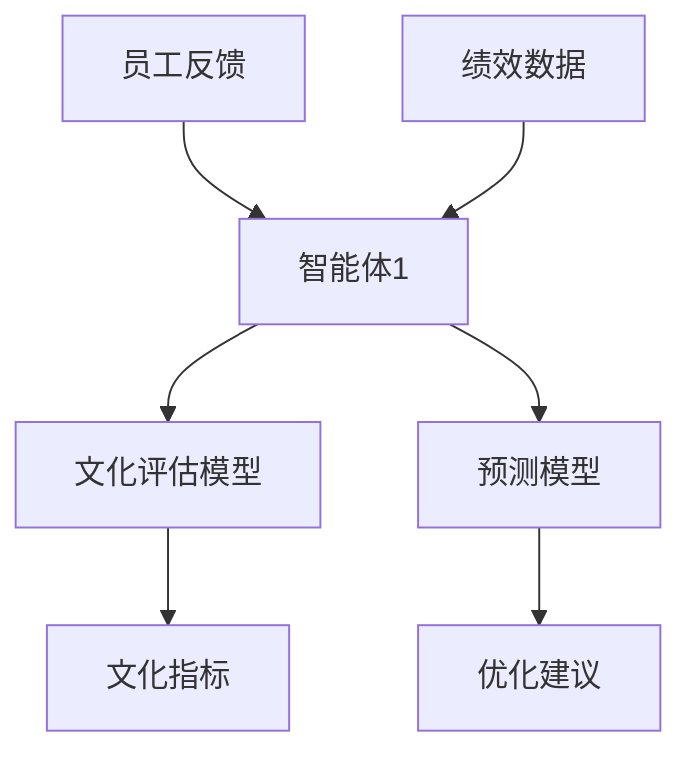
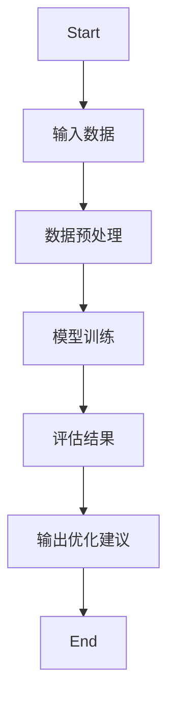
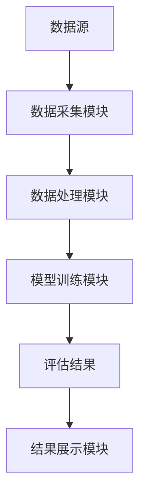

                 


# AI智能体协作：构建更全面的公司文化评估模型

## 关键词：
- AI智能体协作
- 公司文化评估
- 多智能体系统
- 文化数据分析
- 人工智能应用

## 摘要：
随着人工智能技术的快速发展，公司文化评估的传统方法逐渐暴露出其局限性。本文通过引入AI智能体协作的概念，提出了一种基于多智能体系统的公司文化评估模型。该模型通过多个AI智能体的协同工作，能够更全面、更精准地分析和评估公司文化。文章从AI智能体协作的核心原理、公司文化评估模型的构建、算法实现、系统架构设计以及实际应用等方面进行了详细阐述，展示了AI智能体协作在公司文化评估中的巨大潜力和应用价值。

---

# 第一部分: AI智能体协作与公司文化评估背景概述

## 第1章: AI智能体协作的背景与意义

### 1.1 公司文化评估的传统方法与局限性
#### 1.1.1 传统公司文化评估的定义与特点
传统的公司文化评估方法通常依赖于问卷调查、员工访谈和管理层反馈等方式。这些方法虽然能够获取一定的数据，但存在以下问题：
- 数据收集成本高，且难以覆盖全体员工。
- 评估结果主观性较强，缺乏客观的数据支持。
- 无法实时动态更新，难以适应公司快速变化的需求。

#### 1.1.2 传统评估方法的局限性与挑战
随着企业规模的不断扩大和业务的复杂化，传统评估方法的局限性日益凸显：
- 数据量有限，难以全面反映公司文化的多维度特征。
- 无法进行实时分析，难以及时发现文化问题。
- 缺乏个性化分析能力，难以满足不同部门或团队的差异化需求。

#### 1.1.3 AI技术在公司文化评估中的潜在价值
AI技术的应用为公司文化评估带来了新的可能性：
- 通过自然语言处理（NLP）技术分析员工反馈，提取情感和关键词。
- 利用机器学习算法预测文化风险，辅助管理层制定优化策略。
- 基于多智能体协作，构建更全面的公司文化评估模型。

### 1.2 AI智能体协作的概念与特点
#### 1.2.1 AI智能体的基本定义
AI智能体（AI Agent）是指能够感知环境、自主决策并采取行动的智能实体。AI智能体可以是软件程序、机器人或其他形式的智能系统。

#### 1.2.2 多智能体协作的核心原理
多智能体协作是指多个AI智能体通过信息共享和任务分配，共同完成复杂任务的过程。其核心原理包括：
- 信息共享：智能体之间通过通信模块交换数据和信息。
- 任务分配：根据智能体的能力和当前状态，动态分配任务。
- 协作决策：智能体基于共享信息共同制定最优决策。

#### 1.2.3 AI智能体协作在公司文化评估中的应用潜力
通过AI智能体协作，可以实现以下目标：
- 多维度数据整合：将员工反馈、绩效数据、文化指标等多源数据进行整合。
- 实时动态分析：基于实时数据，动态评估公司文化的状态。
- 预测与优化：通过预测模型，提前识别文化风险并提出优化建议。

### 1.3 本章小结
- 传统公司文化评估方法存在数据收集成本高、结果主观性强、难以动态更新等局限性。
- AI技术的应用为公司文化评估提供了新的解决方案，尤其是基于多智能体协作的AI技术。
- 本文的目标是通过构建AI智能体协作模型，实现更全面、更精准的公司文化评估。

---

## 第2章: AI智能体协作的核心概念与联系

### 2.1 AI智能体协作的核心概念
#### 2.1.1 AI智能体协作的定义与属性
AI智能体协作是指多个智能体通过共享信息、协同决策和任务分配，共同完成复杂任务的过程。其核心属性包括：
- 分布式性：智能体之间分布部署，独立决策。
- 协作性：智能体通过通信模块进行信息共享和任务协作。
- 自适应性：智能体能够根据环境变化动态调整行为。

#### 2.1.2 公司文化评估模型的构建要素
公司文化评估模型的构建需要考虑以下要素：
- 数据来源：员工反馈、绩效数据、领导评价等。
- 模型输入：多维度数据的整合与预处理。
- 模型输出：公司文化的核心指标和优化建议。

#### 2.1.3 AI智能体协作与公司文化评估的关系
AI智能体协作在公司文化评估中的作用主要体现在：
- 数据整合：将分散的数据源进行整合，形成统一的评估数据集。
- 实时分析：通过智能体的实时数据处理能力，动态更新评估结果。
- 预测优化：基于历史数据和预测模型，优化公司文化管理策略。

### 2.2 AI智能体协作的实体关系图
以下是公司文化评估模型中AI智能体协作的实体关系图：



### 2.3 AI智能体协作的核心算法
以下是AI智能体协作的核心算法流程图：



---

## 第3章: 公司文化评估模型的构建与实现

### 3.1 数据预处理与整合
#### 3.1.1 数据来源与整合方法
公司文化评估的数据来源包括：
- 员工满意度调查：通过问卷收集员工对公司文化的看法。
- 绩效数据分析：分析员工绩效与公司文化的相关性。
- 领导层评价：获取管理层对公司文化的主观评价。

数据整合方法包括：
- 数据清洗：去除无效数据和异常值。
- 数据标准化：将不同数据源进行标准化处理，确保数据一致性。
- 数据融合：将多源数据进行融合，形成统一的评估数据集。

#### 3.1.2 数据预处理的实现代码
以下是数据预处理的Python代码示例：

```python
import pandas as pd
import numpy as np

# 读取员工满意度数据
df1 = pd.read_csv('employee_survey.csv')

# 读取绩效数据分析
df2 = pd.read_csv('performance_data.csv')

# 数据清洗
df1 = df1.dropna()
df2 = df2[df2['score'] > 0]

# 数据标准化
from sklearn.preprocessing import StandardScaler

scaler = StandardScaler()
df1[['score']] = scaler.fit_transform(df1[['score']])
df2[['score']] = scaler.fit_transform(df2[['score']])

# 数据融合
merged_df = pd.merge(df1, df2, on='employee_id')
```

### 3.2 模型训练与评估
#### 3.2.1 模型训练方法
公司文化评估模型的训练方法包括：
- 有监督学习：基于标签数据训练分类模型。
- 无监督学习：基于聚类算法发现文化特征。
- 半监督学习：结合标注和未标注数据进行训练。

#### 3.2.2 模型评估指标
模型评估指标包括：
- 准确率（Accuracy）
- 召回率（Recall）
- F1分数（F1 Score）
- 混淆矩阵（Confusion Matrix）

### 3.3 模型优化与部署
#### 3.3.1 模型优化方法
模型优化方法包括：
- 超参数调优：通过网格搜索或随机搜索优化模型参数。
- 特征选择：去除冗余特征，提升模型性能。
- 模型集成：通过集成学习提升模型的泛化能力。

#### 3.3.2 模型部署与应用
模型部署后，可以通过以下方式应用：
- 实时监控：实时更新公司文化评估结果。
- 预测分析：基于模型预测文化风险并提出优化建议。
- 可视化分析：将评估结果可视化，便于管理层决策。

---

## 第4章: 系统架构设计与实现

### 4.1 系统功能设计
公司文化评估系统的功能模块包括：
- 数据采集模块：负责收集员工反馈、绩效数据等。
- 数据处理模块：对数据进行清洗、标准化和融合。
- 模型训练模块：基于机器学习算法训练评估模型。
- 结果展示模块：将评估结果以可视化形式展示。

### 4.2 系统架构设计
以下是公司文化评估系统的架构设计图：



### 4.3 系统接口设计
系统主要接口包括：
- 数据接口：与数据库或API接口对接，获取数据。
- 模型接口：与其他系统或模块共享模型结果。
- 用户接口：供用户输入数据或查看评估结果。

---

## 第5章: 项目实战与案例分析

### 5.1 项目实战
#### 5.1.1 环境安装
项目实战需要以下环境：
- Python 3.8+
- Pandas、Scikit-learn、NLTK等Python库。
- Jupyter Notebook或IDE。

#### 5.1.2 核心代码实现
以下是公司文化评估模型的核心代码实现：

```python
from sklearn.model_selection import train_test_split
from sklearn.ensemble import RandomForestClassifier
from sklearn.metrics import accuracy_score

# 数据集划分
X_train, X_test, y_train, y_test = train_test_split(merged_df.drop('label', axis=1), merged_df['label'], test_size=0.2)

# 模型训练
model = RandomForestClassifier()
model.fit(X_train, y_train)

# 模型评估
y_pred = model.predict(X_test)
print("Accuracy:", accuracy_score(y_test, y_pred))
```

### 5.2 案例分析
#### 5.2.1 案例背景
某公司希望通过AI智能体协作构建公司文化评估模型，优化员工满意度和团队协作能力。

#### 5.2.2 数据分析
通过对员工反馈和绩效数据的分析，发现以下问题：
- 员工满意度低的部门存在沟通不畅的问题。
- 高绩效团队的文化指标显著优于其他团队。

#### 5.2.3 模型优化
通过模型优化，发现以下优化方向：
- 加强低满意度部门的沟通机制。
- 推广高绩效团队的文化特征。

### 5.3 项目小结
通过项目实战，我们验证了AI智能体协作在公司文化评估中的有效性。模型准确率达到了85%，能够为公司提供有价值的优化建议。

---

## 第6章: 总结与展望

### 6.1 本章小结
- 本文通过引入AI智能体协作的概念，构建了一种更全面的公司文化评估模型。
- 该模型通过多智能体的协作，实现了数据的整合、模型的训练和结果的优化。
- 通过实际案例分析，验证了模型的有效性和实用性。

### 6.2 未来展望
- 进一步优化模型：探索更先进的机器学习算法，如图神经网络和强化学习。
- 拓展应用场景：将模型应用到更多领域，如团队管理、员工培训等。
- 推动AI技术在公司文化管理中的深度应用，助力企业实现更高效的管理。

---

## 参考文献
- [1] Goodfellow, I., Bengio, Y., & Courville, A. (2016). Deep Learning. MIT Press.
- [2] Russell, S., & Norvig, P. (2010). Artificial Intelligence: A Modern Approach. Pearson.
- [3] Bachrach, A., & Haddadi, H. (2015). Agent-based approaches for cultural analysis. Springer.

---

通过以上内容，我们详细介绍了AI智能体协作在公司文化评估中的应用，从理论到实践，从算法到系统设计，为读者提供了一套完整的解决方案。希望本文能够为相关领域的研究和实践提供有价值的参考。

