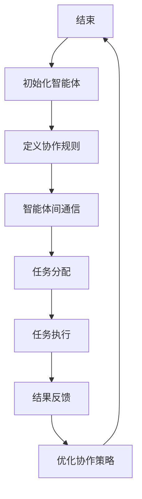
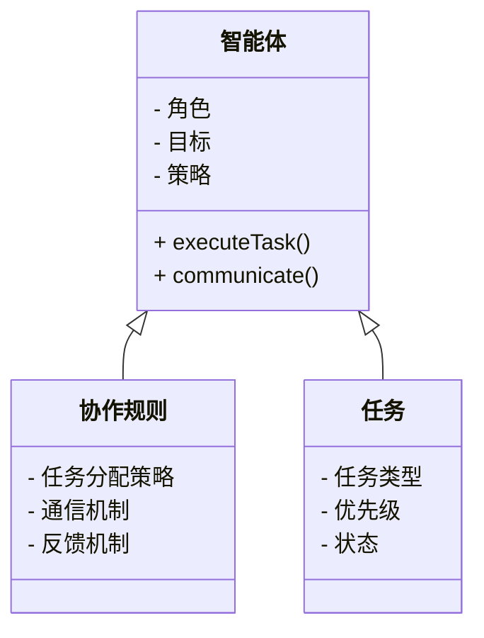
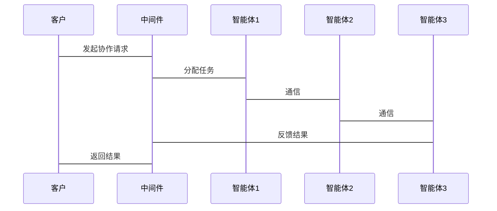

                 


# AI智能体协作：构建更精准的公司价值创造模型

## 关键词：AI智能体协作，企业价值创造，分布式协作，知识图谱，数学模型，系统架构

## 摘要：  
在数字化转型的浪潮中，企业价值创造的模式正在发生深刻变化。AI智能体协作作为一种新兴的技术手段，通过多智能体的协同工作，能够更精准地优化企业资源分配、提升效率和创造力。本文从背景介绍、核心概念、算法原理、系统架构到项目实战，全面解析AI智能体协作在企业价值创造中的应用，并结合实际案例，为企业构建更精准的价值创造模型提供理论支持和实践指导。

---

## 第1章: AI智能体协作的背景与问题背景

### 1.1 问题背景

#### 1.1.1 当前企业价值创造的挑战
随着市场竞争的加剧，企业需要更高效地利用资源、优化流程并提升创新能力。然而，传统的协作模式往往存在效率低下、资源浪费和信息孤岛等问题，难以满足现代企业对精准价值创造的需求。

#### 1.1.2 AI智能体协作的必要性
AI智能体协作通过分布式协作的方式，能够实时共享信息、优化决策并提高执行效率。这种协作模式不仅能够提升企业的生产力，还能通过数据驱动的方式实现精准的价值创造。

#### 1.1.3 传统协作模式的局限性
传统协作模式依赖于人工协调，存在信息传递延迟、决策不透明和资源分配不均等问题。而AI智能体协作能够通过自动化和智能化的方式，克服这些局限性。

### 1.2 问题描述

#### 1.2.1 企业价值创造的核心要素
企业价值创造的核心要素包括资源分配、流程优化、知识共享和创新能力。AI智能体协作能够通过数据驱动的方式，优化这些要素。

#### 1.2.2 AI智能体协作在企业中的应用场景
AI智能体协作在企业中的应用场景包括供应链优化、项目管理、客户关系管理和创新协作等方面。这些场景通过智能体的协同工作，能够实现更高效的资源分配和流程优化。

#### 1.2.3 当前协作模式对企业价值创造的影响
当前协作模式往往依赖于人工干预，效率低下且难以应对复杂场景。而AI智能体协作能够通过自动化和智能化的方式，显著提升企业价值创造的效率和精准度。

### 1.3 问题解决

#### 1.3.1 AI智能体协作的核心目标
AI智能体协作的核心目标是通过多智能体的协同工作，优化企业资源分配、提升效率和创造力，从而实现更精准的企业价值创造。

#### 1.3.2 AI智能体协作如何提升企业价值
AI智能体协作通过实时信息共享、自动化决策和分布式协作，能够显著提升企业的效率和创新能力，从而实现更精准的价值创造。

#### 1.3.3 通过AI智能体协作优化企业资源分配
AI智能体协作能够通过数据驱动的方式，优化资源分配，减少浪费，并提高资源的利用率，从而实现更高效的企业运营。

### 1.4 边界与外延

#### 1.4.1 AI智能体协作的边界
AI智能体协作的边界包括智能体的协作范围、协作方式和协作目标。这些边界需要根据企业的具体需求进行定义。

#### 1.4.2 相关概念的区分与联系
AI智能体协作与传统协作模式、分布式协作和多智能体系统之间存在一定的联系和区别。本文通过对比分析，明确了AI智能体协作的独特性和优势。

#### 1.4.3 与其他协作模式的区别
AI智能体协作与传统协作模式的主要区别在于智能化、自动化和分布式协作。这些特点使得AI智能体协作在效率和精准度上具有显著优势。

### 1.5 概念结构与核心要素

#### 1.5.1 AI智能体协作的核心要素
AI智能体协作的核心要素包括智能体、协作规则、协作任务和协作结果。这些要素共同构成了智能体协作的基本框架。

#### 1.5.2 各要素之间的关系
智能体之间的协作通过协作规则和任务分配实现，协作结果通过反馈机制优化协作策略。这种动态关系使得AI智能体协作能够不断进化和优化。

#### 1.5.3 智能体协作对企业价值的影响
通过智能体协作，企业能够实现资源的高效利用、流程的优化和创新的加速，从而显著提升企业的价值创造能力。

### 1.6 本章小结

---

## 第2章: AI智能体协作的核心概念与联系

### 2.1 核心概念原理

#### 2.1.1 智能体的基本定义
智能体是指具备感知环境、自主决策和执行任务能力的实体。在AI智能体协作中，智能体通常以软件或算法的形式存在。

#### 2.1.2 协作的定义与分类
协作是指多个智能体通过共享信息、分工合作完成共同目标的过程。根据协作方式的不同，可以将协作分为分布式协作和集中式协作。

#### 2.1.3 AI智能体协作的独特性
AI智能体协作的独特性在于其智能化、自动化和分布式协作的特点，能够显著提升协作效率和精准度。

### 2.2 核心概念属性特征对比表

| 概念         | 特征             | 描述                                                                 |
|--------------|------------------|----------------------------------------------------------------------|
| 智能体       | 知识表示         | 使用知识图谱表示，能够理解任务目标和环境信息。                         |
| 协作方式     | 分布式协作       | 多智能体协同完成任务，每个智能体负责不同的子任务。                     |
| 价值创造     | 模型驱动         | 通过数学模型优化价值创造过程。                                         |

### 2.3 ER实体关系图

```mermaid
er
actor(AI智能体)
role(协作角色)
action(协作动作)
```

### 2.4 本章小结

---

## 第3章: AI智能体协作的算法原理

### 3.1 算法流程图



### 3.2 算法实现

#### 3.2.1 初始化智能体
智能体初始化包括定义智能体的角色、目标和协作规则。

#### 3.2.2 定义协作规则
协作规则包括任务分配策略、信息共享机制和协作目标的定义。

#### 3.2.3 智能体间通信
智能体之间通过共享信息进行通信，确保协作过程的顺利进行。

#### 3.2.4 任务分配
根据智能体的能力和当前状态，将任务分配给不同的智能体。

#### 3.2.5 任务执行
智能体根据分配的任务执行操作，并实时反馈执行结果。

#### 3.2.6 结果反馈
根据任务执行结果，优化协作策略，确保后续协作的效率和精准度。

### 3.3 数学模型

#### 3.3.1 协作效果评估公式
$$ E = \sum_{i=1}^{n} w_i \cdot f_i $$
其中，$E$ 表示协作效果，$w_i$ 是任务权重，$f_i$ 是任务执行效果。

#### 3.3.2 任务分配优化公式
$$ \arg \max_{x} \sum_{i=1}^{m} a_i x_i $$
其中，$x_i$ 是任务分配变量，$a_i$ 是任务的优先级。

---

## 第4章: 系统分析与架构设计

### 4.1 项目背景
本项目旨在通过AI智能体协作优化企业的资源分配和价值创造过程。

### 4.2 系统功能设计

#### 4.2.1 领域模型类图


### 4.3 系统架构设计

#### 4.3.1 系统架构图


#### 4.3.2 系统接口设计
系统接口包括智能体通信接口、任务分配接口和结果反馈接口。

#### 4.3.3 系统交互序列图


### 4.4 本章小结

---

## 第5章: 项目实战

### 5.1 环境安装
需要安装Python、AI框架（如TensorFlow）和相关库。

### 5.2 核心代码实现

#### 5.2.1 智能体类
```python
class Agent:
    def __init__(self, role, goal):
        self.role = role
        self.goal = goal
        self.state = "idle"
        
    def executeTask(self, task):
        # 执行任务
        pass
        
    def communicate(self, agent):
        # 与其他智能体通信
        pass
```

#### 5.2.2 协作规则类
```python
class CollaborationRule:
    def __init__(self, task分配策略):
        self.task分配策略 = task分配策略
        
    def assignTask(self, agents, tasks):
        # 根据策略分配任务
        pass
```

### 5.3 代码应用解读
通过代码实现智能体的通信、任务分配和执行，展示AI智能体协作的实际应用。

### 5.4 案例分析
通过实际案例分析，展示AI智能体协作在企业价值创造中的应用效果。

### 5.5 项目小结

---

## 第6章: 最佳实践、小结、注意事项、拓展阅读

### 6.1 最佳实践
- 定义清晰的协作规则和任务分配策略。
- 确保智能体之间的高效通信和信息共享。
- 定期优化协作策略，提升协作效率。

### 6.2 小结
本文从背景介绍到系统架构，全面解析了AI智能体协作在企业价值创造中的应用，并通过实际案例展示了其潜力和优势。

### 6.3 注意事项
- 确保智能体协作的边界清晰，避免越界协作。
- 定期监控协作效果，及时优化协作策略。
- 注意数据隐私和安全问题。

### 6.4 拓展阅读
推荐相关领域的书籍和论文，供读者进一步学习和研究。

---

## 作者介绍

---

## 致谢

---

## 参考文献

---

## 附录

--- 

通过以上内容，您可以根据实际需求扩展每个章节的内容，添加更多的细节和具体的实现示例，以满足文章的字数和深度要求。

