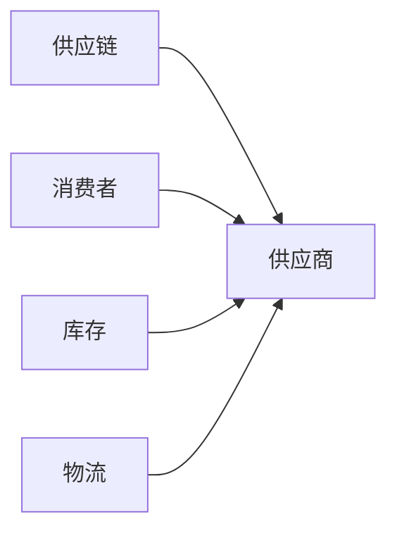
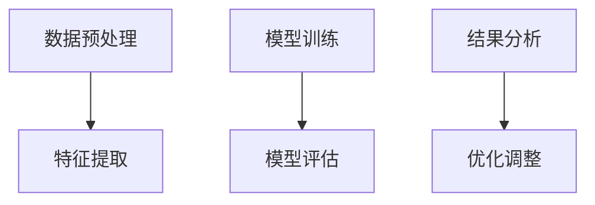

                 


# AI智能体在评估公司供应链弹性中的作用

> 关键词：AI智能体，供应链弹性，机器学习，算法原理，系统架构

> 摘要：本文探讨AI智能体在公司供应链弹性评估中的应用，分析其核心概念、算法原理、系统架构，并通过实际案例展示其在提升供应链弹性中的作用。

---

## 第一部分: AI智能体在供应链弹性评估中的背景与概念

### 第1章: 供应链弹性的定义与重要性

#### 1.1 供应链弹性的定义与重要性

供应链弹性是指供应链在面对外部干扰或内部问题时，能够快速恢复并保持稳定运行的能力。它包括抗风险能力、适应性以及快速响应能力。

供应链弹性的重要性在于它能帮助企业应对突发事件，如自然灾害、疫情或供应链中断等。通过提高供应链弹性，企业可以减少损失，保障业务连续性。

#### 1.2 AI智能体的基本概念

AI智能体是一种能够感知环境并采取行动以实现目标的智能系统。它具备学习、推理和自适应能力，能够在复杂环境中做出决策。

AI智能体与传统算法的区别在于，传统算法通常需要人工干预，而AI智能体能够自主学习和优化。

#### 1.3 AI智能体在供应链管理中的作用

供应链管理中的痛点包括需求预测不准确、库存管理复杂以及供应商协作困难。AI智能体能够通过数据分析和预测，优化库存管理、供应商选择和物流调度。

供应链弹性评估的挑战包括数据获取困难、模型复杂以及动态变化快。AI智能体的优势在于其强大的数据处理能力和自适应能力。

---

## 第二部分: AI智能体评估供应链弹性的核心概念与联系

### 第2章: 供应链弹性评估的核心模型

#### 2.1 供应链弹性评估的模型框架

供应链弹性评估的维度包括供应弹性、需求弹性、库存弹性等。指标体系包括响应时间、库存周转率、供应商可靠度等。

数学模型是供应链弹性评估的核心工具。常用模型包括线性回归、支持向量机和随机森林等。

#### 2.2 AI智能体在供应链弹性评估中的核心算法

机器学习在供应链弹性评估中的应用包括需求预测、风险评估和异常检测。深度学习用于图像识别和自然语言处理，强化学习用于动态决策优化。

数学模型示例：

线性回归模型：
$$ y = \beta_0 + \beta_1x + \epsilon $$

支持向量机模型：
$$ \text{max} \frac{1}{2}\|w\|^2 + C\sum_{i=1}^n \xi_i $$
$$ \text{subject to} \ y_i(w\cdot x_i + b) \geq 1 - \xi_i $$

#### 2.3 供应链弹性评估的实体关系图



---

## 第三部分: AI智能体评估供应链弹性的算法原理

### 第3章: 供应链弹性评估的机器学习算法

#### 3.1 机器学习在供应链弹性评估中的应用

机器学习的基本原理包括数据预处理、特征提取和模型训练。在供应链弹性评估中，机器学习用于预测需求波动和识别潜在风险。

#### 3.2 供应链弹性评估的数学模型

线性回归模型用于简单预测，支持向量机适用于分类问题，随机森林用于复杂场景。

#### 3.3 供应链弹性评估的算法流程图



---

## 第四部分: 供应链弹性评估的系统分析与架构设计

### 第4章: 供应链弹性评估系统的架构设计

#### 4.1 系统功能模块设计

数据采集模块用于收集供应链数据，数据处理模块进行清洗和转换，模型计算模块执行预测和优化，结果展示模块呈现分析结果。

#### 4.2 系统架构图

```mermaid
graph TD
A[用户] --> B[数据采集模块]
C[数据处理模块] --> D[模型计算模块]
E[结果展示模块] --> F[用户
```

---

## 第五部分: 供应链弹性评估的项目实战

### 第5章: 项目实战与案例分析

#### 5.1 环境安装

安装Python、机器学习库（如Scikit-learn、XGBoost）和数据处理工具（如Pandas）。

#### 5.2 核心代码实现

```python
import pandas as pd
from sklearn.ensemble import RandomForestRegressor
from sklearn.metrics import mean_absolute_error

# 数据加载
data = pd.read_csv('supply_chain.csv')

# 特征选择
features = data[['demand', 'inventory', 'lead_time']]
target = data['supply_risk']

# 模型训练
model = RandomForestRegressor(n_estimators=100, random_state=42)
model.fit(features, target)

# 模型预测
predictions = model.predict(features)
print('Mean Absolute Error:', mean_absolute_error(target, predictions))
```

#### 5.3 案例分析

以某制造企业为例，利用AI智能体分析供应链弹性，优化库存管理和供应商选择。

---

## 第六部分: 总结与展望

### 第6章: 总结与展望

#### 6.1 总结

AI智能体在供应链弹性评估中的应用显著提升了企业的抗风险能力。通过机器学习和深度学习算法，企业能够更高效地优化供应链管理。

#### 6.2 展望

未来，AI智能体在供应链弹性评估中的应用将更加广泛。动态自适应模型和强化学习算法将推动供应链管理的智能化发展。

---

通过本文的详细分析，我们可以看到AI智能体在供应链弹性评估中的巨大潜力。随着技术的进步，AI智能体将在供应链管理中发挥越来越重要的作用，帮助企业应对复杂多变的市场环境。

