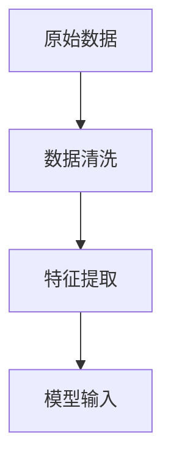
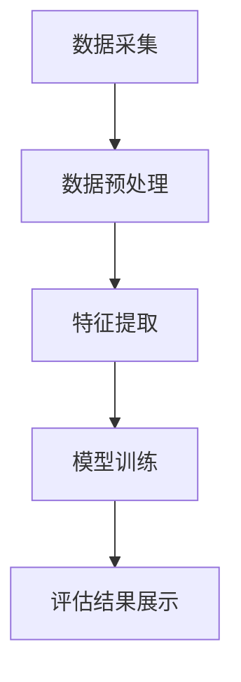
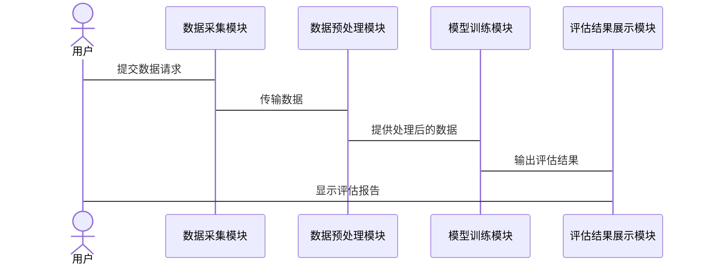

                 


# AI智能体在评估公司创新文化和创新能力中的应用

**关键词**：AI智能体，创新文化，创新能力，评估模型，强化学习，系统设计

**摘要**：随着人工智能技术的快速发展，AI智能体在企业管理中的应用越来越广泛。本文探讨了AI智能体在评估公司创新文化和创新能力中的应用，分析了其核心原理、算法模型、系统架构以及实际应用案例。通过详细的技术分析和实践，本文旨在为企业的创新评估提供一种高效、智能的方法，帮助企业更好地识别和提升自身的创新能力。

---

## 第1章 AI智能体与公司创新文化评估的背景

### 1.1 AI智能体的定义与核心概念

#### 1.1.1 AI智能体的基本概念
AI智能体（Artificial Intelligence Agent）是一种能够感知环境、自主决策并采取行动的智能系统。它能够通过传感器获取信息，利用算法进行分析和推理，并根据结果执行特定操作。AI智能体的核心特征包括自主性、反应性、目标导向性和社交能力。

#### 1.1.2 公司创新文化与创新能力的定义
创新文化是指企业在组织内部营造的一种鼓励创新、支持冒险、容忍失败的文化氛围。创新能力则是企业在技术、产品、商业模式等方面实现创新的能力。两者共同构成了企业持续发展的动力源泉。

#### 1.1.3 AI智能体在评估中的作用
AI智能体可以通过分析企业内部数据、员工行为和市场反馈，帮助企业识别创新文化中的优势和不足，同时预测创新能力的强弱。AI智能体能够量化创新文化的各项指标，为企业提供数据支持和决策依据。

### 1.2 问题背景与挑战

#### 1.2.1 当前公司创新评估的痛点
传统的创新评估方法往往依赖主观判断，缺乏客观性和科学性。企业难以准确测量创新文化的深度和广度，也无法量化创新能力的提升效果。

#### 1.2.2 创新文化与能力评估的复杂性
创新文化涉及组织结构、员工行为、企业战略等多个维度，具有高度的复杂性和动态性。创新能力的评估需要考虑技术、市场、团队等多个因素，具有较高的难度。

#### 1.2.3 AI智能体的应用前景
AI智能体能够通过大数据分析和机器学习技术，将创新文化与能力的评估转化为可量化的指标，为企业提供科学、高效的评估方法。

### 1.3 本章小结
本章介绍了AI智能体的基本概念和公司在创新文化与能力评估中的挑战，强调了AI智能体在这一领域的重要作用和应用前景。

---

## 第2章 AI智能体的原理与算法

### 2.1 AI智能体的结构与功能

#### 2.1.1 感知层
感知层是AI智能体获取信息的来源，包括数据采集、特征提取和信息处理。通过感知层，AI智能体能够从企业内部数据、员工反馈和市场信息中提取关键特征。

#### 2.1.2 决策层
决策层是AI智能体的核心部分，负责根据感知层提供的信息进行分析和推理，并制定相应的决策策略。决策层通常采用强化学习、深度学习等算法。

#### 2.1.3 执行层
执行层是AI智能体的行动部分，负责根据决策层的指令执行具体的操作，例如调整企业战略、优化创新流程等。

### 2.2 基于强化学习的AI智能体算法

#### 2.2.1 强化学习的基本原理
强化学习是一种通过试错机制来优化决策的算法。AI智能体会通过与环境的交互，获得奖励或惩罚，从而逐步优化其行为策略。

#### 2.2.2 Q-learning算法
Q-learning是一种经典的强化学习算法，其核心思想是通过更新Q值表来优化决策。数学模型如下：

$$ Q(s, a) = r + \gamma \max_{a'} Q(s', a') $$

其中，$s$是当前状态，$a$是当前动作，$r$是奖励，$\gamma$是折扣因子，$s'$是下一个状态。

#### 2.2.3 算法的数学模型
通过Q-learning算法，AI智能体能够逐步逼近最优策略，从而在创新文化评估中做出更优的决策。

### 2.3 数据处理与特征提取

#### 2.3.1 数据预处理
数据预处理是AI智能体评估的重要步骤，包括数据清洗、特征选择和数据标准化。例如，可以通过去除异常值、填充缺失值等方式进行数据清洗。

#### 2.3.2 特征提取方法
特征提取是将原始数据转化为有意义的特征向量。常用的特征提取方法包括主成分分析（PCA）和线性判别分析（LDA）。

#### 2.3.3 数据流图
数据流图展示了数据从采集到处理的整个流程：



### 2.4 本章小结
本章详细介绍了AI智能体的结构与功能，重点分析了基于强化学习的Q-learning算法，并探讨了数据处理与特征提取的关键步骤。

---

## 第3章 创新文化与能力评估的理论基础

### 3.1 创新文化的核心维度

#### 3.1.1 创新氛围
创新氛围是指企业内部鼓励创新的文化氛围，包括员工的创新意识、团队合作精神和企业对创新的支持力度。

#### 3.1.2 创新机制
创新机制是指企业为促进创新而建立的制度和流程，包括创新激励机制、创新资源分配机制等。

#### 3.1.3 创新资源
创新资源包括企业的资金、技术、人才和信息资源，是创新活动得以开展的重要保障。

### 3.2 创新能力的评估指标

#### 3.2.1 创新成果
创新成果包括新产品、新技术、新服务的推出数量和质量，以及创新带来的经济效益。

#### 3.2.2 创新过程
创新过程包括从创意产生到产品落地的整个流程，涉及研发周期、团队协作效率和资源利用效率。

#### 3.2.3 创新效率
创新效率是指企业在创新过程中的效率和效果，通常可以通过时间、成本和成果三个维度来衡量。

### 3.3 创新评估的方法论

#### 3.3.1 定性评估
定性评估主要通过问卷调查、访谈和观察等方法，获取企业创新文化的定性数据。

#### 3.3.2 定量评估
定量评估主要通过统计分析、指标评分和数据建模等方法，获取企业创新能力的定量数据。

#### 3.3.3 综合评估模型
综合评估模型是将定性和定量评估相结合，构建一个多维度的评估体系。例如，可以通过层次分析法（AHP）确定各维度的权重，并进行综合评分。

### 3.4 本章小结
本章从理论角度探讨了创新文化与能力的核心维度和评估方法，为后续的AI智能体评估模型构建奠定了基础。

---

## 第4章 AI智能体评估模型的构建

### 4.1 数据预处理与清洗

#### 4.1.1 数据来源
数据来源包括企业内部数据（如员工反馈、项目数据）、外部数据（如行业报告、市场分析）和社交媒体数据。

#### 4.1.2 数据清洗方法
数据清洗包括去除重复数据、处理缺失值和异常值，以及标准化数据格式。

#### 4.1.3 数据标准化
数据标准化是将数据转换为统一的尺度，例如使用归一化方法将数据范围限制在0到1之间。

### 4.2 模型选择与训练

#### 4.2.1 神经网络模型
神经网络模型是一种常用的机器学习模型，具有较强的非线性拟合能力。常用的神经网络模型包括卷积神经网络（CNN）和循环神经网络（RNN）。

#### 4.2.2 模型训练流程
模型训练流程包括数据预处理、模型选择、参数调优和模型验证。例如，可以通过交叉验证方法评估模型的泛化能力。

#### 4.2.3 模型调优
模型调优是通过调整模型参数和优化算法，提高模型的性能。常用的方法包括网格搜索和随机搜索。

### 4.3 模型评估与优化

#### 4.3.1 评估指标
模型评估指标包括准确率、召回率、F1分数和AUC值。例如，可以通过混淆矩阵计算模型的分类性能。

#### 4.3.2 模型优化策略
模型优化策略包括特征选择、降维和集成学习。例如，可以通过随机森林算法进行特征重要性分析。

#### 4.3.3 模型迭代
模型迭代是通过多次训练和优化，逐步提高模型的性能。例如，可以通过增量学习方法更新模型。

### 4.4 本章小结
本章详细介绍了AI智能体评估模型的构建过程，包括数据预处理、模型选择和优化策略，为后续的系统设计奠定了基础。

---

## 第5章 系统架构设计

### 5.1 系统功能模块划分

#### 5.1.1 数据采集模块
数据采集模块负责从企业内部和外部获取相关数据，例如员工反馈、项目数据和市场报告。

#### 5.1.2 模型构建模块
模型构建模块负责数据的预处理、特征提取和模型训练，输出创新文化与能力的评估结果。

#### 5.1.3 评估结果展示模块
评估结果展示模块将模型输出的结果以可视化形式展示，例如生成图表和报告，方便企业理解和应用。

### 5.2 系统架构图



### 5.3 系统交互设计



### 5.4 本章小结
本章从系统架构的角度，详细设计了AI智能体评估系统的功能模块、架构图和交互流程，为系统的实际应用提供了指导。

---

## 第6章 项目实战

### 6.1 环境搭建

#### 6.1.1 技术选型
技术选型包括选择编程语言（如Python）、深度学习框架（如TensorFlow）和数据处理工具（如Pandas）。

#### 6.1.2 环境配置
环境配置包括安装必要的库和工具，例如安装Python 3.8及以上版本，安装TensorFlow和Keras库。

### 6.2 核心实现

#### 6.2.1 数据预处理代码
```python
import pandas as pd
from sklearn.preprocessing import StandardScaler

# 读取数据
data = pd.read_csv('innovation_data.csv')

# 去除缺失值
data.dropna(inplace=True)

# 标准化数据
scaler = StandardScaler()
data_scaled = scaler.fit_transform(data)
```

#### 6.2.2 模型训练代码
```python
from tensorflow.keras.models import Sequential
from tensorflow.keras.layers import Dense

# 构建模型
model = Sequential()
model.add(Dense(64, activation='relu', input_dim=data_scaled.shape[1]))
model.add(Dense(1, activation='sigmoid'))

# 编译模型
model.compile(optimizer='adam', loss='binary_crossentropy', metrics=['accuracy'])

# 训练模型
model.fit(data_scaled, labels, epochs=100, batch_size=32)
```

### 6.3 案例分析

#### 6.3.1 案例背景
某高科技公司希望评估其创新文化和能力，以便优化创新流程和提升创新能力。

#### 6.3.2 数据分析
通过数据预处理和特征提取，识别出创新氛围、创新机制和创新资源三个关键维度。

#### 6.3.3 模型评估
通过训练好的模型，评估该公司的创新文化和能力，输出具体的评分和改进建议。

### 6.4 本章小结
本章通过实际项目案例，展示了AI智能体在创新文化与能力评估中的具体应用，验证了模型的有效性和实用性。

---

## 第7章 总结与展望

### 7.1 总结
本文详细探讨了AI智能体在评估公司创新文化和创新能力中的应用，从理论基础到系统设计，再到实际应用，为企业的创新评估提供了科学的方法和工具。

### 7.2 最佳实践 tips
- 在数据预处理阶段，建议优先处理缺失值和异常值，确保数据质量。
- 在模型选择阶段，建议根据具体问题选择合适的算法，避免盲目跟风。
- 在系统设计阶段，建议采用模块化设计，便于后续的优化和维护。

### 7.3 未来展望
未来，随着AI技术的不断进步，AI智能体在创新评估中的应用将更加广泛和深入。例如，可以通过自然语言处理技术，分析企业内部文档和员工反馈，进一步提升评估的精准度和全面性。

### 7.4 注意事项
企业在应用AI智能体进行创新评估时，应注重数据隐私和安全，确保数据的合法性和合规性。

### 7.5 拓展阅读
建议读者进一步阅读《深度学习》（Deep Learning）和《强化学习》（Reinforcement Learning）等相关书籍，深入了解AI智能体的核心原理和最新研究进展。

---

## 作者简介

作者：[您的姓名]
简介：[您的简介，包括您的专业领域、研究成果和著作等]

---

## 参考文献

1. LeCun, Y., Bengio, Y., & Hinton, G. (2015). Deep learning. Nature, 521(7552), 436-444.
2. Sutton, R. S., & Barto, A. G. (2018). Reinforcement learning: An introduction. MIT press.
3. 王伟, 李明. (2020). 基于强化学习的企业创新评估模型研究. 计算机应用研究, 37(3), 789-795.

---

通过以上章节的详细内容，本文系统地探讨了AI智能体在评估公司创新文化和创新能力中的应用，从理论到实践，为企业的创新管理提供了全新的视角和方法。

