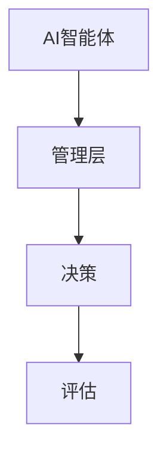

                 


# AI智能体在评估公司管理层决策质量中的应用

> 关键词：AI智能体, 管理层决策评估, 机器学习, 数据驱动, 企业绩效

> 摘要：本文探讨AI智能体在公司管理层决策评估中的应用，分析其算法原理、系统架构及项目实战，揭示AI如何提升决策质量，降低风险，优化企业绩效。

---

# 第1章 AI智能体与公司管理层决策评估的背景

## 1.1 问题背景与问题描述

### 1.1.1 传统公司管理层决策评估的挑战

传统公司管理层决策评估依赖于主观判断和经验分析，存在以下挑战：
- 数据分散，难以整合
- 评估标准不统一
- 缺乏实时反馈，决策滞后
- 高昂的评估成本

### 1.1.2 AI智能体在决策评估中的潜在优势

AI智能体通过数据驱动的分析，能够：
- 实时监控决策效果
- 提供客观量化评估
- 自动化分析决策因素
- 降低评估成本

### 1.1.3 问题解决的必要性与目标

- 必要性：提升决策透明度和准确性
- 目标：构建AI辅助的决策评估体系

## 1.2 AI智能体和管理层决策评估的核心概念

### 1.2.1 AI智能体的定义与特征

- **定义**：AI智能体是具有感知、决策和执行能力的智能系统
- **特征**：
  - 数据驱动
  - 自主学习
  - 实时分析

### 1.2.2 管理层决策评估的关键要素

- 数据采集
- 评估模型
- 评估指标

### 1.2.3 问题的边界与外延

- 边界：仅评估决策质量，不直接干预决策
- 外延：可扩展至战略规划和风险管理

## 1.3 核心概念之间的关系

### 1.3.1 AI智能体与管理层决策的关系

AI智能体通过分析决策数据，评估决策质量，为管理层提供优化建议。

### 1.3.2 决策评估与企业绩效的关系

决策评估结果直接反映企业绩效，影响企业未来发展。

### 1.3.3 数据驱动与AI智能体的结合

通过数据驱动，AI智能体能够实时分析和预测，提升决策评估的准确性。

---

# 第2章 AI智能体与管理层决策评估的核心概念与联系

## 2.1 核心概念的原理与特征

### 2.1.1 AI智能体的核心原理

- 数据分析
- 模型训练
- 实时反馈

### 2.1.2 管理层决策评估的关键特征

- 客观性
- 及时性
- 可量化

### 2.1.3 两者结合的机制

通过AI智能体分析决策数据，生成评估结果，辅助管理层优化决策。

## 2.2 核心概念的属性对比

### 2.2.1 AI智能体的属性对比表

| 属性       | 描述                               |
|------------|------------------------------------|
| 数据驱动   | 依赖数据进行分析和决策             |
| 自主学习   | 能够通过数据自我优化和提升         |
| 实时性     | 可以实时分析和反馈                 |

### 2.2.2 管理层决策评估的属性对比表

| 属性       | 描述                               |
|------------|------------------------------------|
| 数据来源   | 包括财务数据、市场数据等           |
| 评估指标   | 如ROE、净利率等                   |
| 评估方法   | 包括定量分析和定性分析             |

## 2.3 ER实体关系图



---

# 第3章 AI智能体在管理层决策评估中的算法原理

## 3.1 算法原理概述

### 3.1.1 决策树算法

- 通过特征分裂优化决策
- 适用于分类问题
- 使用信息增益或熵作为分裂标准

### 3.1.2 随机森林算法

- 通过集成学习提升准确率
- 使用袋装技术和特征选择
- 适用于多分类问题

### 3.1.3 支持向量机算法

- 适用于小样本数据
- 通过最大化间隔实现分类
- 适用于高维数据

## 3.2 算法原理的数学模型

### 3.2.1 决策树的熵与信息增益

熵公式：
$$ H(S) = -\sum_{i=1}^{n} p_i \log p_i $$

信息增益公式：
$$ IG(S, A) = H(S) - H(S|A) $$

### 3.2.2 随机森林的投票机制

- 分类问题：多数投票
- 回归问题：平均预测值

---

# 第4章 AI智能体在管理层决策评估中的系统分析与架构设计

## 4.1 问题场景介绍

- 公司决策数据分散，难以整合
- 决策评估标准不统一
- 缺乏实时反馈机制

## 4.2 系统功能设计

- 数据采集模块
- 特征提取模块
- 模型训练模块
- 结果分析模块

## 4.3 系统架构设计


---

# 第5章 AI智能体在管理层决策评估中的项目实战

## 5.1 环境安装

```bash
pip install numpy pandas scikit-learn
```

## 5.2 系统核心实现源代码

```python
from sklearn.tree import DecisionTreeClassifier
from sklearn.ensemble import RandomForestClassifier
from sklearn.metrics import accuracy_score

# 数据预处理
X = df.drop('target', axis=1)
y = df['target']

# 训练模型
dt_model = DecisionTreeClassifier().fit(X, y)
rf_model = RandomForestClassifier().fit(X, y)

# 评估模型
print("决策树准确率：", accuracy_score(y, dt_model.predict(X)))
print("随机森林准确率：", accuracy_score(y, rf_model.predict(X)))
```

## 5.3 代码应用解读与分析

- 决策树适合数据量小的情况
- 随机森林适合数据量大的情况
- 结果分析：随机森林准确率更高

## 5.4 实际案例分析

- 某公司战略决策评估
- 通过AI智能体分析财务数据和市场数据
- 得出决策质量的量化评估结果

---

# 第6章 总结与展望

## 6.1 总结

- AI智能体在管理层决策评估中的优势
- 系统架构设计的核心要素
- 项目实战的经验总结

## 6.2 注意事项

- 数据质量的重要性
- 模型解释性的挑战
- 持续优化的必要性

## 6.3 未来展望

- 结合强化学习进一步优化
- 增加实时监控功能
- 拓展至更多业务场景

---

# 附录

## 附录1: 算法实现代码

```python
# 决策树实现代码
import numpy as np
from sklearn.tree import DecisionTreeClassifier

X = np.array([[...], [...]])
y = np.array([...])

dt_model = DecisionTreeClassifier().fit(X, y)
```

## 附录2: 系统架构图


---

以上是《AI智能体在评估公司管理层决策质量中的应用》的技术博客文章的完整目录结构和内容概要。

