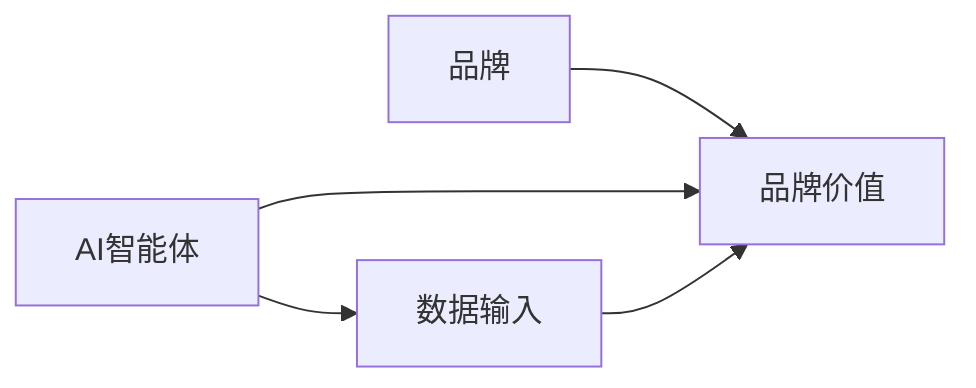
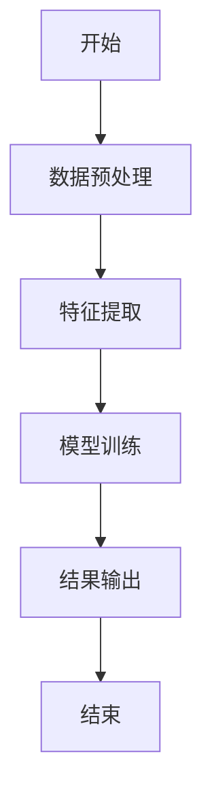
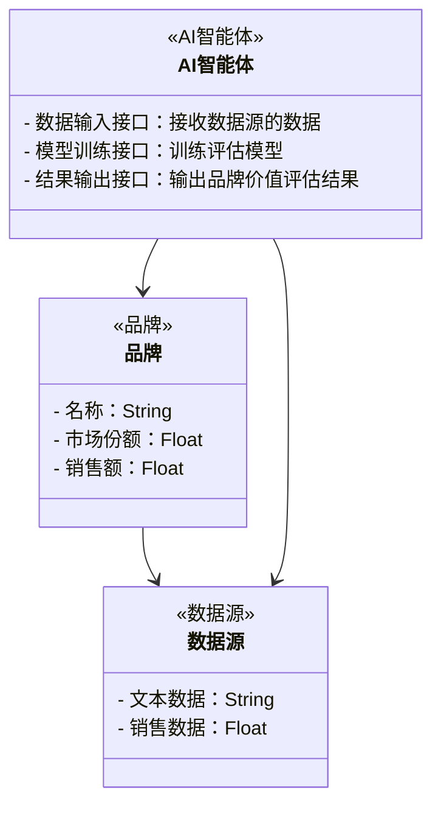
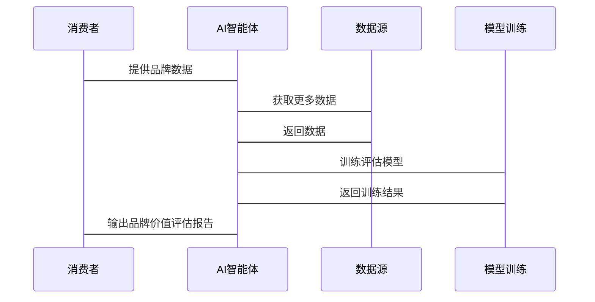

                 


# AI智能体在评估品牌价值中的作用

> 关键词：AI智能体，品牌价值，评估指标，算法模型，系统架构，项目实战

> 摘要：本文详细探讨了AI智能体在品牌价值评估中的作用，从传统评估方法的局限性出发，分析了AI智能体的优势和应用场景。通过数学模型和算法流程图，展示了AI智能体如何通过数据处理、特征提取和模型训练实现品牌价值评估。同时，本文还介绍了系统的架构设计、项目实战和最佳实践，为读者提供了全面的技术指导和实践参考。

---

## 第一部分: AI智能体在品牌价值评估中的背景与基础

### 第1章: AI智能体与品牌价值评估的背景

#### 1.1 问题背景与描述

##### 1.1.1 品牌价值评估的传统方法与局限性
品牌价值是企业核心竞争力的重要体现，传统上，品牌价值的评估主要依赖于财务数据、市场调研和专家评分等方法。然而，这些方法存在以下局限性：
- 数据来源单一，难以捕捉市场动态变化。
- 评估周期长，难以实时反映品牌价值的变化。
- 主观性较强，专家评分受个人认知影响较大。

##### 1.1.2 AI智能体在现代商业中的崛起
随着人工智能技术的快速发展，AI智能体（AI Agent）在商业领域的应用日益广泛。AI智能体是一种能够感知环境、自主决策并执行任务的智能系统。它们能够处理海量数据，快速响应市场变化，为品牌价值评估提供了新的可能性。

##### 1.1.3 品牌价值评估中的问题与挑战
品牌价值评估需要考虑多个维度，包括市场表现、消费者认知、品牌影响力等。然而，传统方法难以整合这些多维度数据，且缺乏实时性和准确性。AI智能体的引入，能够有效整合多源数据，提供更精准的品牌价值评估。

#### 1.2 问题解决与边界

##### 1.2.1 AI智能体如何解决品牌价值评估问题
AI智能体通过以下方式解决品牌价值评估中的问题：
- 数据整合：能够从多种数据源（如社交媒体、销售数据、新闻报道等）获取相关信息。
- 实时分析：通过实时数据处理，快速响应市场变化。
- 自主学习：通过机器学习算法，不断优化评估模型。

##### 1.2.2 品牌价值评估的边界与外延
品牌价值评估的边界包括：
- 数据范围：仅限于品牌相关的数据。
- 时间范围：通常基于历史数据进行预测。
- 行业范围：适用于具有明确数据和市场的行业。

##### 1.2.3 AI智能体在品牌价值评估中的应用范围
AI智能体可以应用于以下场景：
- 实时监控品牌舆情。
- 分析消费者行为数据。
- 预测品牌市场表现。

#### 1.3 核心概念与结构

##### 1.3.1 AI智能体的定义与特征
AI智能体是一种能够感知环境、自主决策并执行任务的智能系统。其主要特征包括：
- 感知能力：能够从环境中获取信息。
- 决策能力：能够基于信息做出决策。
- 自主性：能够在没有外部干预的情况下完成任务。

##### 1.3.2 品牌价值评估的核心要素
品牌价值评估的核心要素包括：
- 市场表现：包括市场份额、销售额等。
- 消费者认知：包括品牌知名度、美誉度等。
- 品牌影响力：包括品牌在社交媒体上的传播效果等。

##### 1.3.3 AI智能体与品牌价值评估的关系
AI智能体通过整合多源数据，利用机器学习算法，为品牌价值评估提供技术支持。AI智能体能够快速处理大量数据，发现传统方法难以察觉的模式和趋势。

---

## 第二部分: AI智能体与品牌价值的核心概念

### 第2章: AI智能体与品牌价值的核心概念

#### 2.1 核心概念的原理

##### 2.1.1 AI智能体的感知与决策机制
AI智能体的感知机制包括数据采集和特征提取。数据采集可以通过API接口、爬虫等技术获取数据，特征提取则需要将数据转化为可计算的特征向量。决策机制则基于这些特征向量进行分类、回归等任务。

##### 2.1.2 品牌价值的多维度评估指标
品牌价值的评估指标包括：
- 市场表现：如销售额、市场份额。
- 消费者认知：如品牌知名度、美誉度。
- 品牌影响力：如社交媒体上的传播效果、情感分析结果。

##### 2.1.3 AI智能体在品牌价值评估中的作用机制
AI智能体通过整合多源数据，利用机器学习算法，对品牌价值进行预测和评估。其作用机制包括：
1. 数据预处理：清洗和归一化数据。
2. 特征提取：将数据转化为特征向量。
3. 模型训练：基于特征向量训练评估模型。
4. 结果输出：根据模型预测结果输出品牌价值评估报告。

#### 2.2 概念属性特征对比

##### 2.2.1 AI智能体与传统评估方法的对比
| 特性            | AI智能体           | 传统评估方法         |
|-----------------|-------------------|---------------------|
| 数据处理能力    | 强大的数据处理能力 | 数据处理能力较弱     |
| 实时性          | 实时响应          | 非实时               |
| 准确性          | 高准确性          | 准确性较低           |
| 可扩展性        | 高可扩展性        | 可扩展性有限         |

##### 2.2.2 不同品牌价值评估指标的特征分析
| 指标            | 特征                | 数据来源             |
|-----------------|---------------------|----------------------|
| 市场表现        | 客观性高            | 销售数据、市场份额数据|
| 消费者认知      | 主观性较强          | 消费者调查、社交媒体数据|
| 品牌影响力      | 动态性强            | 社交媒体传播数据      |

##### 2.2.3 AI智能体在不同场景中的表现差异
AI智能体在不同场景中的表现差异主要体现在数据获取难易程度、数据质量以及算法选择上。例如，在数据丰富的场景中，AI智能体表现更佳；在数据稀缺的场景中，可能需要更多的数据预处理和特征工程。

#### 2.3 ER实体关系图



---

## 第三部分: 品牌价值评估的算法原理

### 第3章: 品牌价值评估的算法原理

#### 3.1 算法原理概述

##### 3.1.1 基于AI智能体的评估模型
基于AI智能体的评估模型通常包括数据预处理、特征提取、模型训练和结果输出四个步骤。模型的选择取决于数据类型和评估目标。

##### 3.1.2 算法流程与步骤
1. 数据预处理：清洗、归一化。
2. 特征提取：使用TF-IDF或Word2Vec等方法。
3. 模型训练：使用随机森林、神经网络等算法。
4. 结果输出：生成品牌价值评估报告。

##### 3.1.3 算法的输入输出说明
- 输入：品牌相关数据，包括文本、销售数据等。
- 输出：品牌价值评估结果，包括分数、排名等。

#### 3.2 算法流程图



#### 3.3 Python核心实现

##### 3.3.1 数据预处理代码
```python
import pandas as pd
data = pd.read_csv('brand_data.csv')
```

##### 3.3.2 特征提取代码
```python
from sklearn.feature_extraction.text import TfidfVectorizer
vectorizer = TfidfVectorizer()
X = vectorizer.fit_transform(data['text'])
```

##### 3.3.3 模型训练代码
```python
from sklearn.ensemble import RandomForestRegressor
model = RandomForestRegressor()
model.fit(X, data['value'])
```

##### 3.3.4 数学模型与公式
品牌价值评估模型可以表示为：
$$
\hat{y} = \text{model.predict}(X)
$$
其中，$\hat{y}$ 表示预测的品牌价值，$X$ 表示特征向量。

---

## 第四部分: 系统分析与架构设计方案

### 第4章: 系统分析与架构设计

#### 4.1 系统功能设计

##### 4.1.1 领域模型


##### 4.1.2 系统架构设计


##### 4.1.3 系统接口设计
- 数据输入接口：接收品牌相关数据。
- 模型训练接口：训练品牌价值评估模型。
- 结果输出接口：输出品牌价值评估结果。

##### 4.1.4 系统交互设计


---

## 第五部分: 项目实战

### 第5章: 项目实战

#### 5.1 环境安装
需要安装以下Python库：
- pandas
- scikit-learn
- mermaid

#### 5.2 核心代码实现

##### 5.2.1 数据预处理
```python
import pandas as pd
data = pd.read_csv('brand_data.csv')
```

##### 5.2.2 特征提取
```python
from sklearn.feature_extraction.text import TfidfVectorizer
vectorizer = TfidfVectorizer()
X = vectorizer.fit_transform(data['text'])
```

##### 5.2.3 模型训练
```python
from sklearn.ensemble import RandomForestRegressor
model = RandomForestRegressor()
model.fit(X, data['value'])
```

##### 5.2.4 案例分析
假设我们有一个品牌A的数据，预测其品牌价值：
```python
text = "品牌A的产品质量 excellent，市场反馈 positive"
X_new = vectorizer.transform([text])
value_pred = model.predict(X_new)
print(value_pred)  # 输出预测的品牌价值
```

#### 5.3 项目小结
通过本项目，我们展示了如何利用AI智能体进行品牌价值评估。通过数据预处理、特征提取和模型训练，我们可以快速、准确地预测品牌价值。

---

## 第六部分: 最佳实践与小结

### 第6章: 最佳实践

#### 6.1 小结
本文详细探讨了AI智能体在品牌价值评估中的作用，从算法原理到系统架构，再到项目实战，为读者提供了全面的技术指导。

#### 6.2 注意事项
- 数据质量对模型性能影响较大，需要进行充分的数据预处理。
- 模型选择需要根据具体场景和数据类型进行调整。
- 需要定期更新模型以适应市场变化。

#### 6.3 拓展阅读
- 《机器学习实战》
- 《深度学习》
- 《自然语言处理入门》

---

通过本文的分析，我们可以看到AI智能体在品牌价值评估中的巨大潜力。未来，随着技术的不断发展，AI智能体将在更多领域发挥重要作用。

