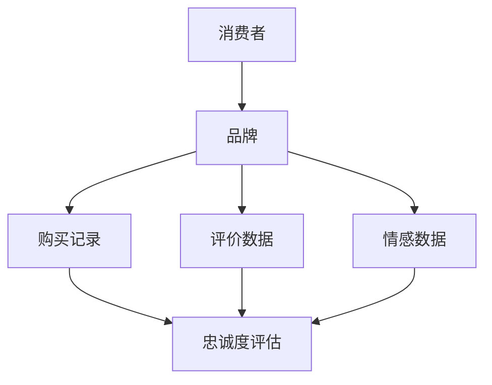
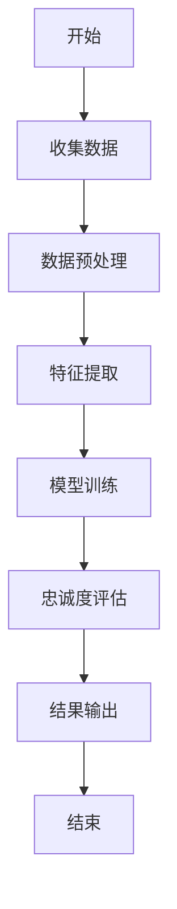

                 


# AI智能体在评估品牌忠诚度中的作用

> 关键词：品牌忠诚度，AI智能体，机器学习，情感分析，数据分析，系统架构

> 摘要：本文深入探讨了AI智能体在品牌忠诚度评估中的作用，从背景、核心概念到算法原理、系统架构，再到项目实战，全面解析了如何利用AI技术提升品牌忠诚度评估的精准性和效率。文章结合实际案例，详细讲解了AI智能体在品牌忠诚度评估中的应用场景、技术实现和最佳实践，为读者提供了从理论到实践的完整指导。

---

## 第一部分: AI智能体与品牌忠诚度评估的背景

### 第1章: 什么是品牌忠诚度

#### 1.1 品牌忠诚度的定义
品牌忠诚度是指消费者对某个品牌的情感依赖和持续购买的倾向。消费者在面对多个品牌选择时，倾向于选择自己熟悉或偏好的品牌。

#### 1.2 品牌忠诚度的衡量标准
品牌忠诚度通常通过以下指标衡量：
1. **重复购买率**：消费者是否持续购买同一品牌产品。
2. **情感忠诚度**：消费者对品牌的情感依赖程度。
3. **品牌推荐度**：消费者是否会向他人推荐该品牌。
4. **价格敏感度**：消费者对价格变化的敏感程度。

#### 1.3 品牌忠诚度的影响因素
品牌忠诚度受多种因素影响，包括产品质量、品牌声誉、服务质量、价格、消费者体验等。

---

### 第2章: AI智能体的基本概念

#### 2.1 AI智能体的定义
AI智能体（Artificial Intelligence Agent）是一种能够感知环境并采取行动以实现目标的智能系统。

#### 2.2 AI智能体的核心特征
1. **自主性**：能够自主决策。
2. **反应性**：能够实时感知环境变化并做出反应。
3. **学习能力**：能够通过数据和经验不断优化自身的决策能力。

#### 2.3 AI智能体与传统算法的区别
AI智能体不仅仅是一个静态的算法，而是一个动态的、能够适应环境变化的智能系统。

---

### 第3章: 品牌忠诚度评估的现状与挑战

#### 3.1 传统品牌忠诚度评估方法
传统的品牌忠诚度评估方法主要包括问卷调查、数据分析和市场研究等。

#### 3.2 传统方法的局限性
1. **数据量小**：传统方法依赖少量样本数据，结果可能存在偏差。
2. **维度单一**：难以全面捕捉消费者行为和情感的多维度特征。
3. **实时性差**：传统方法难以实现实时评估。

#### 3.3 引入AI智能体的必要性
AI智能体可以通过实时数据分析、情感计算和机器学习等技术，实现品牌忠诚度的精准评估和动态优化。

---

## 第二部分: AI智能体在品牌忠诚度评估中的核心概念与联系

### 第4章: 品牌忠诚度评估的核心概念

#### 4.1 品牌忠诚度的属性特征对比
| 属性特征 | 描述 |
|----------|------|
| 重复购买率 | 消费者是否持续购买同一品牌产品 |
| 情感忠诚度 | 消费者对品牌的情感依赖程度 |
| 品牌推荐度 | 消费者是否会向他人推荐该品牌 |
| 价格敏感度 | 消费者对价格变化的敏感程度 |

#### 4.2 AI智能体的实体关系图



---

### 第5章: 品牌忠诚度评估的流程图



---

## 第三部分: AI智能体在品牌忠诚度评估中的算法原理

### 第6章: AI智能体的核心算法原理

#### 6.1 算法原理概述
AI智能体通过机器学习和自然语言处理技术，对消费者行为和情感数据进行分析，从而评估品牌忠诚度。

#### 6.2 算法的数学模型与公式
品牌忠诚度评估模型如下：
$$
L = \alpha \cdot P + \beta \cdot E + \gamma \cdot R
$$
其中：
- \( L \) 表示品牌忠诚度
- \( P \) 表示产品满意度
- \( E \) 表示情感倾向
- \( R \) 表示推荐意愿
- \(\alpha, \beta, \gamma\) 表示各因素的权重

#### 6.3 算法的实现与代码
以下是基于Python的实现代码：

```python
import pandas as pd
from sklearn.model import LinearRegression

# 数据预处理
data = pd.read_csv('brand_data.csv')
X = data[['P', 'E', 'R']]
y = data['L']

# 模型训练
model = LinearRegression()
model.fit(X, y)

# 模型预测
new_data = [[0.8, 0.6, 0.7]]
print(model.predict(new_data))
```

---

## 第四部分: 品牌忠诚度评估的系统分析与架构设计

### 第7章: 系统分析与架构设计

#### 7.1 问题场景介绍
我们希望通过AI智能体实时分析消费者行为和情感数据，评估品牌忠诚度，并为企业提供优化建议。

#### 7.2 系统功能设计
1. **数据采集**：从电商平台、社交媒体等渠道采集消费者数据。
2. **数据处理**：清洗和预处理数据，提取特征。
3. **模型训练**：基于机器学习算法训练忠诚度评估模型。
4. **结果输出**：输出品牌忠诚度评估结果，并生成优化建议。

#### 7.3 系统架构设计


---

## 第五部分: 项目实战与案例分析

### 第8章: 项目实战

#### 8.1 环境安装与配置
安装Python和相关库：
```bash
pip install pandas scikit-learn
```

#### 8.2 核心代码实现
```python
import pandas as pd
from sklearn.model import LinearRegression

# 数据预处理
data = pd.read_csv('brand_data.csv')
X = data[['P', 'E', 'R']]
y = data['L']

# 模型训练
model = LinearRegression()
model.fit(X, y)

# 模型预测
new_data = [[0.8, 0.6, 0.7]]
print(model.predict(new_data))
```

#### 8.3 代码解读与分析
上述代码实现了品牌忠诚度评估模型的训练和预测，基于线性回归算法。

---

## 第六部分: 最佳实践与总结

### 第9章: 最佳实践

#### 9.1 小结
本文深入探讨了AI智能体在品牌忠诚度评估中的作用，从理论到实践，全面解析了如何利用AI技术提升品牌忠诚度评估的效率和精准性。

#### 9.2 注意事项
- 数据质量和完整性对模型性能至关重要。
- 模型需要定期更新以适应市场变化。
- 保护用户隐私和数据安全是必须考虑的重要问题。

#### 9.3 拓展阅读
推荐阅读以下书籍和文章：
1. 《机器学习实战》
2. 《情感计算与智能交互》
3. 《品牌管理与忠诚度分析》

---

# 结语

通过本文的分析和讲解，读者可以深入了解AI智能体在品牌忠诚度评估中的应用，掌握从理论到实践的完整方法。未来，随着AI技术的不断发展，品牌忠诚度评估将更加精准和智能化。

