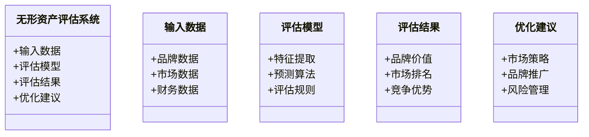

                 


# AI智能体在评估无形资产价值中的作用

> 关键词：AI智能体，无形资产，价值评估，机器学习，深度学习

> 摘要：随着人工智能技术的快速发展，AI智能体在无形资产价值评估中的作用日益重要。本文从无形资产的基本概念出发，详细探讨AI智能体在评估中的核心原理、算法实现、系统设计以及实际应用。通过理论与实践相结合的方式，深入分析AI智能体如何提升无形资产评估的准确性和效率，为相关领域的研究和实践提供有价值的参考。

---

## 第一部分: 无形资产与AI智能体的背景介绍

### 第1章: 无形资产概述

#### 1.1 无形资产的基本概念

无形资产是指企业拥有或控制的，没有实物形态但能够为企业带来长期经济利益的资源。常见的无形资产包括知识产权、品牌价值、客户关系、商誉等。这些资产在企业价值评估中占据重要地位，但由于其难以量化和评估的特点，传统方法往往难以准确捕捉其价值。

#### 1.2 AI智能体的基本概念

AI智能体是指具备感知、决策和执行能力的人工智能系统。它能够通过数据输入，利用机器学习算法进行分析，并输出相应的决策或结果。AI智能体的核心在于其能够模拟人类的思维过程，并通过自动化的方式完成复杂任务。

#### 1.3 无形资产价值评估的背景与需求

传统的无形资产评估方法依赖于财务数据和专家经验，但存在主观性强、效率低、成本高等问题。随着大数据和人工智能技术的发展，利用AI智能体进行无形资产评估成为一种新的趋势。通过AI技术，可以更高效地处理海量数据，发现隐藏的模式和关系，从而提高评估的准确性和效率。

---

## 第二部分: AI智能体在无形资产评估中的核心概念与联系

### 第2章: AI智能体的核心原理

#### 2.1 AI智能体的感知机制

AI智能体的感知机制通过数据采集和特征提取，将无形资产的相关信息转化为可分析的形式。例如，可以通过自然语言处理技术分析企业的新闻报道、社交媒体数据等，提取品牌声誉、市场影响力等关键指标。

#### 2.2 AI智能体的决策机制

决策机制是AI智能体的核心，它基于感知到的数据，利用机器学习算法进行预测和评估。例如，可以使用随机森林算法对企业的知识产权价值进行分类，或者利用深度学习模型对品牌价值进行回归预测。

#### 2.3 AI智能体的执行机制

执行机制将决策结果转化为具体的评估报告或优化建议。例如，AI智能体可以自动生成无形资产的价值评估报告，并根据市场变化动态调整评估结果。

#### 2.4 核心概念对比表

| 概念 | 特征 | 传统方法 | AI智能体 |
|------|------|----------|----------|
| 数据来源 | 多样性 | 单一来源 | 多源数据 |
| 分析效率 | 低效 | 高效 | |
| 精度 | 低 | 高 | |
| 可扩展性 | 有限 | 强大 | |

#### 2.5 ER实体关系图

```mermaid
er
actor: 无形资产评估者
asset: 无形资产
model: AI评估模型
rule: 评估规则

actor --> asset: 提供评估需求
actor --> model: 输入数据
model --> asset: 生成评估结果
model --> rule: 应用评估规则
```

---

## 第三部分: AI智能体评估无形资产的算法原理

### 第3章: 算法原理与实现

#### 3.1 机器学习算法在无形资产评估中的应用

机器学习算法是AI智能体的核心工具之一。例如，可以通过支持向量机（SVM）对知识产权的价值进行分类，或者利用逻辑回归模型对品牌价值进行预测。

#### 3.2 深度学习模型的优势

深度学习模型在处理非结构化数据方面具有显著优势。例如，可以通过卷积神经网络（CNN）分析图像数据，提取品牌标识的关键特征。

#### 3.3 算法实现与代码示例

以下是使用Python实现的简单机器学习模型，用于评估知识产权的价值：

```python
import pandas as pd
from sklearn.model import SVC
from sklearn.metrics import accuracy_score

# 加载数据
data = pd.read_csv('intellectual_property.csv')

# 分割特征与标签
X = data.drop('value', axis=1)
y = data['value']

# 训练模型
model = SVC()
model.fit(X, y)

# 预测与评估
y_pred = model.predict(X)
print("准确率:", accuracy_score(y, y_pred))
```

#### 3.4 数学公式与模型解释

随机森林模型的数学公式可以表示为：

$$
\text{预测价值} = \sum_{i=1}^{n} w_i \cdot x_i
$$

其中，$w_i$ 是特征 $x_i$ 的权重，$n$ 是特征的数量。

---

## 第四部分: 系统分析与架构设计

### 第4章: 系统设计与实现

#### 4.1 问题场景介绍

以评估企业品牌价值为例，构建一个AI智能体系统，实现品牌价值的自动评估和优化建议。

#### 4.2 系统功能设计



#### 4.3 系统架构设计


---

## 第五部分: 项目实战与应用

### 第5章: 项目实战

#### 5.1 环境安装与数据准备

需要安装Python、机器学习库（如Scikit-learn、TensorFlow）以及数据处理工具（如Pandas）。数据来源可以是公开的市场数据、企业财报等。

#### 5.2 核心实现与代码示例

以下是使用随机森林模型评估知识产权价值的代码示例：

```python
import pandas as pd
from sklearn.ensemble import RandomForestRegressor
from sklearn.metrics import mean_squared_error

# 加载数据
data = pd.read_csv('intellectual_property.csv')

# 分割特征与标签
X = data.drop('value', axis=1)
y = data['value']

# 训练模型
model = RandomForestRegressor(n_estimators=100)
model.fit(X, y)

# 预测与评估
y_pred = model.predict(X)
print("均方误差:", mean_squared_error(y, y_pred))
```

#### 5.3 案例分析与结果解读

以某科技公司为例，通过AI智能体评估其品牌价值。首先，提取品牌相关的数据，如市场占有率、品牌知名度等。然后，利用深度学习模型进行预测，生成评估报告，并提出优化建议。

---

## 第六部分: 总结与展望

### 第6章: 总结与展望

#### 6.1 本章小结

本文详细探讨了AI智能体在无形资产评估中的核心原理、算法实现和系统设计。通过理论与实践相结合的方式，展示了AI技术在提升无形资产评估效率和准确性方面的巨大潜力。

#### 6.2 未来展望

随着AI技术的不断发展，AI智能体在无形资产评估中的应用将更加广泛和深入。未来的研究方向可能包括：如何提高模型的可解释性、如何处理多模态数据、如何实现动态实时评估等。

---

## 最佳实践 tips

1. 在进行无形资产评估时，建议结合多种数据源，如财务数据、市场数据和文本数据，以提高评估的准确性。
2. 在选择AI模型时，需要根据具体问题和数据特点进行选择，避免盲目使用复杂模型。
3. 定期更新模型和数据，以适应市场变化和企业需求。

---

通过本文的系统介绍，读者可以全面了解AI智能体在无形资产评估中的作用，并能够将其应用于实际场景中，为企业创造更大的价值。

