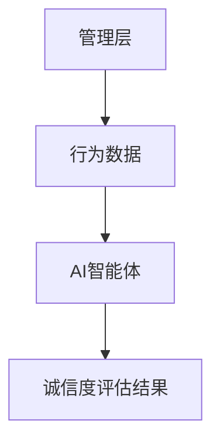
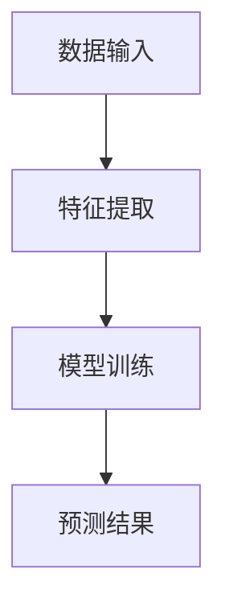
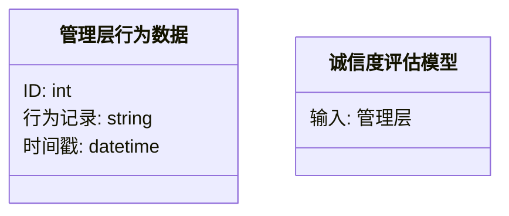

                 


# AI智能体在评估管理层诚信度中的作用

---

## 关键词：AI智能体，诚信度评估，机器学习，企业管理，数据驱动

---

## 摘要：  
本文探讨了AI智能体在评估管理层诚信度中的作用，分析了传统评估方法的局限性，并详细阐述了AI技术在诚信度评估中的优势。通过数据驱动的方法，AI智能体能够高效、准确地评估管理层的诚信度，为企业治理提供有力支持。本文从算法原理、系统架构到实际案例，全面解析了AI智能体在诚信度评估中的应用，为企业管理者和技术开发者提供了重要的参考。

---

## 第1章：AI智能体与管理层诚信度评估的背景

### 1.1 AI智能体的定义与作用  
AI智能体（Artificial Intelligence Agent）是指具备感知环境、决策和执行能力的智能系统。它能够通过数据输入和算法处理，输出具有洞察力的结果。在企业治理中，AI智能体的作用主要体现在数据处理、模式识别和预测分析等方面。  

#### 1.1.1 AI智能体的核心概念  
AI智能体是一种能够自主学习和适应的系统，它能够通过传感器或其他数据源获取信息，并基于这些信息做出决策。在管理层诚信度评估中，AI智能体通过分析管理层的行为数据，识别潜在的诚信问题，帮助企业做出更明智的决策。  

#### 1.1.2 AI智能体在企业治理中的作用  
AI智能体能够实时监控管理层的行为，识别异常模式，并提供预警。例如，通过分析管理层的决策记录、沟通记录和绩效数据，AI智能体可以发现潜在的诚信风险，帮助企业避免重大损失。  

#### 1.1.3 管理层诚信度评估的必要性  
管理层的诚信度是企业健康发展的关键因素。诚信缺失可能导致企业战略失误、财务造假等问题。传统的诚信度评估方法依赖于主观判断，容易受到人为因素的干扰。而AI智能体能够通过数据驱动的方法，提供客观、准确的评估结果。  

---

### 1.2 管理层诚信度评估的背景与挑战  

#### 1.2.1 管理层诚信度的重要性  
管理层的诚信度直接影响企业的声誉、员工士气和客户信任。一个诚信的管理层能够带领企业实现长期发展，而诚信缺失的管理层可能导致企业声誉受损、财务造假等问题。  

#### 1.2.2 传统诚信度评估方法的局限性  
传统的诚信度评估方法主要依赖于主观判断，例如通过面谈、问卷调查等方式收集信息。这种方法不仅耗时，而且容易受到主观因素的干扰，评估结果的准确性难以保证。  

#### 1.2.3 AI技术在诚信度评估中的优势  
AI技术能够通过大数据分析和机器学习算法，从海量数据中提取有价值的信息，帮助企业客观评估管理层的诚信度。例如，通过分析管理层的历史决策、沟通记录和绩效数据，AI智能体可以识别潜在的诚信风险，并提供预警。  

---

## 第2章：AI智能体在诚信度评估中的核心概念与联系  

### 2.1 核心概念原理  

#### 2.1.1 AI智能体的算法原理  
AI智能体在诚信度评估中的算法主要包括数据预处理、特征提取、模型训练和预测分析。例如，可以使用支持向量机（SVM）或随机森林（Random Forest）等机器学习算法，对管理层的行为数据进行分类，识别诚信度高低。  

#### 2.1.2 管理层诚信度评估的指标体系  
诚信度评估的指标体系包括多个维度，例如决策的透明性、沟通的诚信性、绩效的可持续性等。通过多维度的分析，AI智能体能够更全面地评估管理层的诚信度。  

---

### 2.2 核心概念属性对比  

#### 2.2.1 传统评估方法与AI评估方法的对比分析  
| 评估方法 | 传统评估方法 | AI评估方法 |
|----------|--------------|------------|
| 数据来源 | 主观判断、问卷调查 | 结构化数据、非结构化数据 |
| 评估效率 | 低效、耗时 | 高效、实时 |
| 评估准确性 | 易受主观因素干扰 | 客观、准确 |

#### 2.2.2 AI智能体在诚信度评估中的优势  
AI智能体能够通过大数据分析和机器学习算法，从海量数据中提取有价值的信息，帮助企业客观评估管理层的诚信度。例如，通过分析管理层的历史决策、沟通记录和绩效数据，AI智能体可以识别潜在的诚信风险，并提供预警。  

---

### 2.3 实体关系图（ER图）  



---

## 第3章：AI智能体评估管理层诚信度的算法原理  

### 3.1 算法原理概述  

#### 3.1.1 基于机器学习的诚信度评估模型  
AI智能体可以通过机器学习算法，对管理层的行为数据进行分类，识别诚信度高低。例如，使用逻辑回归（Logistic Regression）模型，可以将管理层的诚信度分为高、中、低三个等级。  

#### 3.1.2 深度学习在诚信度评估中的应用  
深度学习算法，例如卷积神经网络（CNN）和循环神经网络（RNN），可以用于分析非结构化数据，例如文本和图像。例如，通过分析管理层的邮件内容和会议记录，AI智能体可以识别潜在的诚信风险。  

---

### 3.2 算法流程图  



---

### 3.3 数学模型与公式  

#### 3.3.1 诚信度评估的数学模型  
$$P(诚信度|行为数据) = \frac{P(行为数据|诚信度)}{P(行为数据)}$$  

#### 3.3.2 模型训练的损失函数  
$$L = -\sum_{i=1}^{n} [y_i \cdot \log(p_i) + (1-y_i) \cdot \log(1-p_i)]$$  

---

## 第4章：系统分析与架构设计方案  

### 4.1 问题场景介绍  

#### 4.1.1 企业诚信管理的痛点  
传统的企业诚信管理方法依赖于主观判断，容易受到人为因素的干扰。此外，企业内部数据分散，难以高效利用。  

#### 4.1.2 AI智能体在诚信管理中的应用场景  
AI智能体可以应用于企业内部监控、风险预警和决策支持等领域。例如，通过实时监控管理层的行为数据，AI智能体可以识别潜在的诚信风险，并提供预警。  

---

### 4.2 系统功能设计  

#### 4.2.1 领域模型  



---

## 第5章：项目实战  

### 5.1 环境安装  
需要安装Python、机器学习库（如Scikit-learn、TensorFlow）和数据分析工具（如Pandas、NumPy）。  

---

### 5.2 核心实现  

```python
import pandas as pd
from sklearn.model import LinearSVC
from sklearn.feature_extraction.text import TfidfVectorizer

# 数据加载
data = pd.read_csv('管理层行为数据.csv')

# 特征提取
vectorizer = TfidfVectorizer()
X = vectorizer.fit_transform(data['行为记录'])

# 模型训练
model = LinearSVC()
model.fit(X, data['诚信度标签'])

# 模型预测
new_data = ['正常决策', '异常行为']
X_new = vectorizer.transform(new_data)
predicted = model.predict(X_new)
print(predicted)
```

---

### 5.3 案例分析  
通过分析某企业的管理层行为数据，AI智能体识别出潜在的诚信风险，并提供了预警。  

---

## 第6章：总结与展望  

### 6.1 本章小结  
本文详细探讨了AI智能体在评估管理层诚信度中的作用，分析了传统方法的局限性，并提出了基于机器学习的解决方案。  

### 6.2 展望  
未来，随着AI技术的不断发展，AI智能体在诚信度评估中的应用将更加广泛。例如，通过结合自然语言处理（NLP）技术，AI智能体可以更准确地分析管理层的沟通记录，进一步提升诚信度评估的准确性。  

---

## 注意事项  
- 本文中的代码示例仅供参考，实际应用中需要根据具体数据进行调整。  
- 本文中的数学公式和算法原理需要根据具体场景进行优化和调整。  

---

## 拓展阅读  
- 《机器学习实战》  
- 《深度学习入门》  
- 《企业治理与诚信管理》  

---

以上是《AI智能体在评估管理层诚信度中的作用》的完整目录和内容概述。

