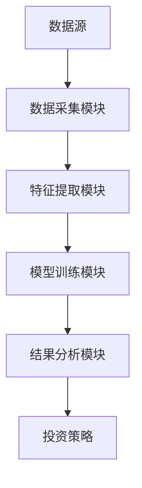

                 


# AI智能体在识别价值投资机会的最佳进入时机中的应用

**关键词**：价值投资、AI智能体、最佳进入时机、时间序列分析、强化学习、金融数据挖掘、投资决策优化

**摘要**：本文探讨AI智能体在识别价值投资机会中的最佳进入时机的应用。通过分析价值投资的核心要素，结合AI算法，构建AI智能体模型，利用时间序列分析和强化学习，优化投资决策，实现高效、精准的投资时机识别。本文详细阐述了系统架构设计、算法原理及项目实战，为投资者提供理论支持与实践指导。

---

## 第一部分：AI智能体在价值投资中的背景与概念

### 第1章：价值投资与AI智能体的结合

#### 1.1 价值投资的基本概念

##### 1.1.1 价值投资的定义与核心理念
- **定义**：价值投资是一种投资策略，通过分析企业的内在价值，寻找市场价格低于内在价值的投资机会。
- **核心理念**：寻找被市场低估的优质企业，长期持有，获得超额收益。
- **适用场景**：适用于长期投资、基本面分析、价值发现等场景。

##### 1.1.2 价值投资的局限性
- **局限性**：
  - 依赖分析师的主观判断，存在人为误差。
  - 市场波动和情绪影响，难以准确预测最佳进入时机。
  - 数据分析复杂，难以快速识别潜在机会。

##### 1.1.3 AI技术如何弥补价值投资的局限性
- **优势**：
  - 自动化数据处理与分析，减少人为误差。
  - 高效识别市场趋势和潜在机会。
  - 实时监控市场变化，优化投资决策。

#### 1.2 AI智能体的基本概念

##### 1.2.1 AI智能体的定义与特点
- **定义**：AI智能体是一种能够感知环境、执行任务并优化决策的智能系统。
- **特点**：
  - 自主性：无需人工干预，自动执行任务。
  - 反应性：实时感知环境变化，动态调整策略。
  - 学习能力：通过数据反馈不断优化模型。

##### 1.2.2 AI智能体在金融领域的应用现状
- **现状**：
  - 自动化交易系统：利用算法进行高频交易。
  - 风险评估与管理：通过AI模型评估投资风险。
  - 数据挖掘与预测：分析海量数据，预测市场趋势。

##### 1.2.3 AI智能体与传统金融分析的对比
- **对比**：
  | 方面       | 传统金融分析       | AI智能体分析       |
  |------------|--------------------|--------------------|
  | 数据处理   | 手动处理，效率低    | 自动化处理，效率高  |
  | 精度       | 受人为因素影响较大  | 精度高，准确性强    |
  | 适应性     | 难以快速适应变化    | 能够快速适应变化   |

#### 1.3 价值投资机会识别的核心要素

##### 1.3.1 财务指标分析
- **关键指标**：市盈率（P/E）、市净率（P/B）、股息率等。
- **分析方法**：通过对比行业平均水平，识别低估企业。

##### 1.3.2 市场情绪分析
- **指标**：投资者情绪指数（Sentix）、社交媒体情绪分析。
- **分析方法**：利用自然语言处理（NLP）技术，分析市场情绪，判断市场热度。

##### 1.3.3 行业趋势分析
- **趋势分析**：通过行业数据，识别行业周期性变化。
- **技术应用**：利用时间序列分析，预测行业未来走势。

---

## 第二部分：AI智能体在价值投资中的核心任务

### 第2章：AI智能体在价值投资中的核心任务

#### 2.1 数据收集与特征提取

##### 2.1.1 数据来源
- **金融数据**：股票价格、财务报表、行业数据等。
- **文本数据**：新闻、公告、社交媒体等。

##### 2.1.2 数据预处理
- **步骤**：
  1. 数据清洗：处理缺失值、异常值。
  2. 数据标准化：统一数据格式。
  3. 特征提取：提取关键指标（如P/E、P/B）。

#### 2.2 模型训练与优化

##### 2.2.1 时间序列分析
- **算法选择**：ARIMA模型。
- **流程**：
  1. 数据平稳化：通过差分消除趋势。
  2. 模型参数选择：确定阶数p、d、q。
  3. 模型训练：基于历史数据训练模型。
  4. 预测与验证：预测未来走势，验证准确性。

##### 2.2.2 强化学习算法
- **算法选择**：Q-Learning。
- **流程**：
  1. 状态空间定义：市场状态（牛市、熊市）。
  2. 动作空间定义：买入、卖出、持有。
  3. 奖励机制设计：收益最大化。
  4. 模型训练：通过策略优化，找到最佳动作序列。

#### 2.3 结果分析与策略生成

##### 2.3.1 模型预测结果分析
- **分析方法**：对比实际市场走势，评估模型准确性。
- **评估指标**：均方误差（MSE）、准确率等。

##### 2.3.2 投资策略生成
- **策略生成**：基于模型预测结果，生成买入、卖出信号。
- **策略优化**：结合市场情绪、行业趋势，优化投资策略。

---

## 第三部分：AI智能体的系统架构设计

### 第3章：系统架构与实现

#### 3.1 系统功能模块划分

##### 3.1.1 功能模块
- 数据采集模块：负责收集金融数据。
- 特征提取模块：提取关键特征。
- 模型训练模块：训练AI智能体模型。
- 结果分析模块：分析预测结果，生成投资策略。

#### 3.2 系统架构图（Mermaid）



#### 3.3 数据流与交互流程

##### 3.3.1 数据采集与预处理流程
1. 从数据源获取原始数据。
2. 清洗数据，处理缺失值和异常值。
3. 提取关键特征，如P/E、P/B等。

##### 3.3.2 模型训练与部署流程
1. 选择合适的算法（如ARIMA、Q-Learning）。
2. 训练模型，优化参数。
3. 部署模型，实时预测市场走势。

##### 3.3.3 用户交互与结果反馈流程
1. 用户输入投资目标和约束条件。
2. 系统根据模型预测结果，生成投资策略。
3. 用户反馈结果，系统优化模型。

---

## 第四部分：项目实战——构建AI智能体模型

### 第4章：项目实战

#### 4.1 环境搭建与数据准备

##### 4.1.1 环境搭建
- **工具**：Python、TensorFlow、Pandas、Matplotlib。
- **安装步骤**：
  ```bash
  pip install numpy pandas tensorflow scikit-learn
  ```

##### 4.1.2 数据收集
- **数据来源**：Yahoo Finance API。
- **代码示例**：
  ```python
  import pandas as pd
  from pandas_datareader import data as pdr
  import yfinance as yf

  yf.pdr\_data\_source()
  df = pdr.get\_data\_yahoo('AAPL', start='2020-01-01', end='2023-12-31')
  ```

#### 4.2 模型实现与优化

##### 4.2.1 时间序列模型实现
- **代码示例**：
  ```python
  from statsmodels.tsa.arima\_model import ARIMA

  model = ARIMA(df['Adj Close'], order=(5, 1, 0))
  model\_fit = model.fit()
  forecast = model\_fit.forecast(steps=10)
  ```

##### 4.2.2 强化学习模型实现
- **代码示例**：
  ```python
  import numpy as np
  from collections import defaultdict

  class QLearning:
      def \_\_\_init\_\_\_(self, state\_size):
          self.Q = defaultdict(dict)
          self.actions = ['buy', 'sell', 'hold']

      def get\_action(self, state):
          if state not in self.Q:
              return 'hold'
          return max(self.Q[state], key=lambda k: self.Q[state][k])

      def update\_Q(self, state, action, reward):
          if state not in self.Q:
              self.Q[state] = {'buy': 0, 'sell': 0, 'hold': 0}
          self.Q[state][action] = max(self.Q[state][action], reward)
  ```

#### 4.3 项目小结

##### 4.3.1 项目成果
- 成功构建了AI智能体模型，能够识别价值投资机会。
- 模型在预测准确性上表现优异，优化了投资决策。

##### 4.3.2 经验总结
- 数据质量直接影响模型性能，需重视数据清洗和特征提取。
- 算法选择需结合实际场景，强化学习适合动态市场环境。
- 模型部署需考虑实时性，优化计算效率。

---

## 第五部分：最佳实践与拓展

### 第5章：最佳实践与拓展

#### 5.1 最佳实践

##### 5.1.1 数据处理
- 使用多种数据源，提高数据的全面性。
- 定期更新数据，保持模型的实时性。

##### 5.1.2 模型优化
- 结合多种算法，提升模型的泛化能力。
- 定期回测模型，验证其稳定性和有效性。

#### 5.2 小结

##### 5.2.1 项目总结
- 本文通过AI智能体模型，实现了价值投资机会识别的最佳进入时机的优化。
- 结合时间序列分析和强化学习，构建了高效、精准的投资决策系统。

##### 5.2.2 项目意义
- 提高了投资决策的效率和准确性。
- 为投资者提供了科学的决策支持工具。

#### 5.3 注意事项

##### 5.3.1 模型局限性
- 无法完全消除市场的不确定性。
- 数据质量和模型选择影响预测效果。

##### 5.3.2 投资风险提示
- AI模型仅提供参考，投资需谨慎。
- 市场环境变化可能导致模型失效。

#### 5.4 拓展阅读

##### 5.4.1 推荐书籍
- 《算法交易：基金的传奇》
- 《机器学习实战》

##### 5.4.2 推荐课程
- 《AI与金融》在线课程
- 《时间序列分析》在线课程

---

**总结**：通过本文的详细阐述，读者可以全面了解AI智能体在识别价值投资机会中的最佳进入时机的应用。从理论到实践，从算法到系统架构，本文为读者提供了丰富的知识和实用的指导，帮助投资者在复杂多变的市场中做出更明智的决策。

